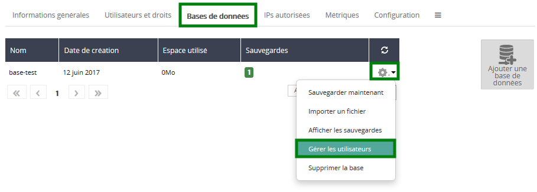

Turite interneto svetainę ar programėlę, kuriai reikia duomenų bazės, bet nenorite jos valdyti? Atraskite CloudDB nedelsiant! OVH viskuo pasirūpins.

## Bendra informacija

### Kodel reiketu naudoti valdoma duomenu baze?
Šiam pasiūlymui galioja **paprasta taisyklė**: net jeigu jūs **žinote** kaip tai daroma, duomenų bazės administravimas nėra jūsų **pirmenybė**. Apsauga, atnaujinimai, stebėjimas, teisių valdymas, našumas... visa tai gali greitai nuvarginti!

**Taigi kodėl nepatikėjus šio darbo OVH ir nesusitelkus ties jūsų pagrindine veikla?**

Tai mūsų tikslas. Esate privatus asmuo ar profesionalas, reikia nedaug resursų ar kuriate didelį klasterį? Mes siekiame pasiūlyti įmanomus sprendimus rinkoje.

### CloudDB privalumai
**Paprasta ir greita:**

- SQL duomenų bazės kūrimas kliento valdymo sąsajoje
- Neribotas duomenų bazių skaičius (priklausomai nuo laisvos vietos diske)
- Iki 200 vienalaikių jungčių
- Naudotojų ir teisių valdymas kliento valdymo sąsajoje
- Prieiga prie metrikos duomenų kliento valdymo sąsajoje
- Prieiga prie sisteminių įrašų

**Našu:**

- Garantuojami RAM resursai
- Išbandyta infrastruktūra

**Saugu:**

- Stebėjimas 24 valandas per parą, 7 dienas per savaitę
- Automatinis atsarginis kopijavimas, kasdien
- Privalomas IP adreso(-ų) autorizavimas

**Plečiama:**

- Suderinamumas su visais OVH produktais (išskyrus svetainių talpinimą) ir bendrai su bet kuriuo produktu, prijungtu prie interneto
- SQL versijos pasirinkimas ir galimybė bet kuriuo metu migruoti į aukštesnio lygio versiją

### Siulomi varikliai
Užsakydami CloudDB, jūs galite rinktis iš įvairių duomenų bazių sistemų:

**SQL**

- MySQL
- PostgreSQL
- MariaDB

Kiekvienai virtualiai mašinai suteikiami nuosavi dedikuoti resursai. Duomenų bazės, įdiegtos virtualioje mašinoje, resursus naudoja **bendrai**.

## Uzsakykite CloudDB

### Prisijungimas prie valdymo sasajos
Siekdami sukurti virtualią mašiną, po to duomenų bazes, jūs turėtumėte prisijungti prie [Web valdymo sąsajos](https://www.ovh.com/manager/web/){.external}.

### Uzsakymas
Prisijungę prie [Web valdymo sąsajos](https://www.ovh.com/manager/web/){.external}, spragtelėkite **Duomenų bazės**, po to `Užsakyti duomenų bazes`{.action}.

{.thumbnail}

Pateikite užsakymą pasirinkę šiuos elementus:

- **CloudDB**
- **Duomenų bazės sistema**
- **RAM**
- **Duomenų centras**
- **Pageidaujama galiojimo trukmė**

{.thumbnail}

Patvirtinkite sutartis ir spauskite `+ Generuoti užsakymą`{.action}.

{.thumbnail}

## Bendra informacija
Valdymo sąsajoje galėsite peržiūrėti savo virtualios mašinos duomenis.

{.thumbnail}

## Duomenu baziu ir naudotoju kurimas

### Duomenu bazes kurimas
Šiame žingsnyje jūsų virtuali mašina sukurta, tačiau ji tuščia.

Spragtelėkite langelį **"Duomenų bazės"**, po to mygtuką `+ Pridėti duomenų bazę`{.action}.

{.thumbnail}

Įveskite duomenų bazės pavadinimą ir spauskite `+ patvirtinti`{.action}.

{.thumbnail}

### Naudotojo kurimas
CloudDB paslaugos naudojimui būtina sukurti naudotojus, kuriems bus suteiktos prieigos prie duomenų bazės teisės.

Spragtelėkite langelį **Naudotojai ir teisės**, po to mygtuką `+ Pridėti naudotoją`{.action}.

{.thumbnail}

Įvedę **naudotojo pavadinimą** ir **slaptažodį**, spragtelėkite `Patvirtinti`{.action}.

{.thumbnail}

### Naudotoju teisiu valdymas
Spragtelėkite langelį **Duomenų bazės**, po to pasirinktos duomenų bazės **krumpiaratį** ir pagaliau mygtuką `+ Valdyti naudotojus`{.action}.

{.thumbnail}

Pasirinkite teises jūsų pasirinktam naudotojui

{.thumbnail}

Galimi šie teisių lygiai:

- **Administratorius:** Leidžiama pateikti **Select / Insert / Update / Delete / Create / Alter / Drop** užklausas
- **Skaitymas bei rašymas:** Leidžiama pateikti **Select / Insert / Update / Delete** užklausas
- **Skaitymas:** Leidžiama pateikti **Select** užklausas
- **Jokių teisių:** Jokių prieigos prie duomenų bazės teisių

## Autorizuokite IP adresus

### Serverio pridejimas
Prieiga prie jūsų CloudDB virtualios mašinos bus veikianti, jei patikslinsite autorizuotą(-us) IP adresą(-us) šiame meniu. Spragtelėkite langelį **Autorizuoti IP**, po to `+ Pridėti IP adresą / potinklio šabloną`{.action}.

{.thumbnail}

Nurodykite serverio ar tinklo IP adresą, pateikite aprašymą (pasirinktinai) ir spauskite `Patvirtinti`{.action}.

{.thumbnail}

## Duomenu bazes naudotojimas
Sukonfigūruota? Puiku!

Atsižvelgiant į jūsų naudojimo atvejį ar pasirinktą variklį, jūsų duomenų bazė gali būti naudojama įvairiais būdais.

Apžvelkime tipinį naudojimo atvejį.

### WordPress idiegimas su DBaaS lab ir MySQL varikliu
- Sukurkite CloudDB MySQL virtualią mašiną
- Sukurkite duomenų bazę ir jai priskirtą naudotoją ir suteikite ADMIN teises.
- Autorizuokite serverio IP adresui kreiptis į CloudDB

Būtina žinoti šiuos duomenis, prieinamus valdymo sąsajoje:

- Mazgo pavadinimas
- SQL prievadas

{.thumbnail}

- Duomenų bazė

{.thumbnail}

- Naudotojas

{.thumbnail}

Atkreipkite dėmesį į URL ir susietą prievadą. WordPress reikalingi šie duomenys įdiegimo metu.

{.thumbnail}

Taigi užpildysime laukus taip:

- **Database Name**: *base-test*
- **User Name**: *user-1*
- **Password**: slaptažodis, kurį pasirinkote naudotojui *user-1*
- **Database Host**: *xxx.dbaas.ovh.net:35102* (įsidėmėkite: **host:port**)
- **Table prefix**: mūsų atveju, nereikalingi jokie keitimai

Kitiems naudojimo atvejams rinkitės oficialius prieigos būdus, rekomenduojamus naudojamiems varikliams. Jei būtina, atsisiųskite oficialius dokumentus.