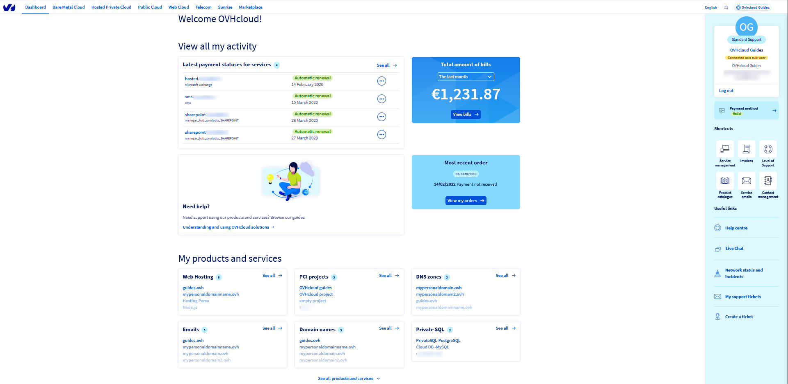

**Dernière mise à jour le xx/xx/xxxx**

## Objective

OVHcloud annonce le regroupement de l’ensemble des serveurs dédiés Kimsufi et So you Start dans une ligne de produits appelée Eco, afin de vous offrir une meilleure vue d’ensemble de nos configurations. En raison de ces changements, vous pourrez désormais gérer tous vos services, quelle que soit leur gamme, depuis l'espace client OVHcloud. Pour vous accompagner durant cette migration, nous avons mis en place un guide vous présentant l’espace client OVHcloud et ses options.

**Ce guide est destiné à vous aidez à vous familiariser avec l'espace client OVHcloud**

> [!warning]
> Veuillez noter que malgré le changement d'interface client, les options disponibles pour votre gamme de serveur resteront les mêmes.
>

### Tableau de bord

 Kimsufi             | So you Start | OVHcloud
:-------------------------:|:-------------------------:|:---------------------:
  |  | 

Le tableau de bord OVHcloud présente un récapitulatif de tous vos services. Cette interface présente plusieurs sections qui vous permettent d'accéder instantanément à un service. 
La colonne de droite vous donne accès à certaines informations personnelles comme votre nom, votre adresse e-mail ainsi que votre identifiant client et votre niveau de support (le cas échéant). Elle propose également un certain nombre de raccourcis et de liens utiles.

### Accéder au serveurs

Kimsufi             | So you Start | OVHcloud
:-------------------------:|:-------------------------:|:---------------------:
  |  | 

Contrairement aux espaces clients Kimsufi et So you Start qui vous permettent de voir votre serveur/liste de serveurs dans le tableau de bord, chez OVHcloud, vous devez d’abord cliquez sur le menu `Bare Metal Cloud`{.action} dans la barre supérieure et ensuite sur `Serveurs dédiés`{.action} dans la colonne de gauche pour afficher vos serveurs. De plus, si vous possédez un grand nombre de serveurs, le bouton `Tous mes serveurs`{.action} vous permet de les lister pour un accès facile.

### Interface Serveur

Une fois dans le menu `Serveurs Dédiés`{.action}, cliquez sur le serveur de votre choix pour accéder à son interface.

Kimsufi             | So you Start | OVHcloud
:-------------------------:|:-------------------------:|:---------------------:
  |  | 

**Informations générales** : Dans cette section, vous avez toutes les informations concernant votre serveur.
- Nom : Cliquez sur les `...`{.action} à côté de cette option pour modifier le nom de votre serveur.
- Boot : Cliquez sur les `...`{.action} à côté de cette option pour changer le netboot de votre serveur en "mode rescue, mode normal ( sur le disque dur) ou mode network"
- Système (OS) : Cliquez sur les `...`{.action} à côté de cette option pour installer/réinstaller votre serveur.

**Etat des services**
-  Statut : Cliquez sur les `...`{.action} à côté de cette option pour redémarrer ou supprimer votre serveur.
- Monitoring : Cliquez sur les `...`{.action} à côté de cette option pour activer/désactiver le monitoring sur votre serveur. Pour savoir comment installer le Real Time Monitoring (RTM) consulter ce [guide](https://docs.ovh.com/fr/dedicated/installer-rtm/).

**Réseau**

- IPV4 : Cliquez sur les `...`{.action} à côté de cette option pour gérer votre IP.
- Reverse : Cliquez sur les `...`{.action} à côté de cette section pour entrer/modifier votre reverse DNS.

**DNS secondaire** : Configurez votre DNS secondaire ici.

**Backup Storage** : Commandez et configurez votre backup storage ici. Pour plus d'informations sur la marche à suivre, veuillez consulter ce [guide](https://docs.ovh.com/fr/dedicated/services-backup-storage/).

**Interventions** : Retrouvez ici les interventions en cours et passées sur votre serveur.

**IPMI** (Disponible uniquement sur les serveurs OVHcloud et certains serveurs So you Start) : Accédez ici à l'IPMI ou le KVM IP de votre serveur.

**Tâches** : Visualisez ici les tâches récentes effectuées sur votre serveur.

Pour plus d'informations sur la gestion de votre serveur dédié via l'espace client OVHcloud, veuillez consulter [ce guide](https://docs.ovh.com/fr/dedicated/premiers-pas-serveur-dedie/).

### Section IP

Pour accéder à la section «IP» de votre espace client OVHcloud, cliquez sur le menu `Bare Metal Cloud`{.action} dans la barre supérieure et ensuite sur `IP`{.action} située en bas de la colonne à gauche de la page.

Kimsufi             | So you Start | OVHcloud
:-------------------------:|:-------------------------:|:---------------------:
  |  |  |

### Onglet Licences

Pour accéder à l'onglet «Licences» dans l'espace client OVHcloud, cliquez sur le menu `Bare Metal Cloud`{.action} dans la barre supérieure et ensuite sur `Licences`{.action} dans colonne à gauche de la page. 

Kimsufi             | So you Start | OVHcloud
:-------------------------:|:-------------------------:|:---------------------:
Licences are not offered for this range.  |  | 

### Support, Facturation, Gestion de compte

Contrairement à l’espace client Kimsufi et So you Start où ces options sont disponibles en haut à droite sous des onglets individuels, dans l’espace client d’OVHcloud, ces options sont regroupées dans un espace commun. Pour y accéder, cliquez sur votre nom en haut à droite et cliquez sur vos initiales pour accéder à la rubrique `Gérer mon compte`.

Kimsufi             | So you Start | OVHcloud
:-------------------------:|:-------------------------:|:---------------------:
  |  | 

* Informations générales : Dans cette section, vous pouvez visualiser les informations de votre compte, votre dernière facture et accéder à différents raccourcis.
* Sécurité : Cette section vous permet de gérer les paramètres de sécurité de votre compte. Pour plus d’informations, nous vous invitons à consulter ce [guide](https://docs.ovh.com/fr/customer/tout-savoir-sur-identifiant-client/).
* Emails reçus : Dans cette section, vous trouverez l'ensemble des emails qu'OVHcloud vous a envoyé, en dehors des demandes d'assistance.
* Mon niveau de support (Uniquement disponible pour les services OVHcloud) : Vous trouverez plus d’informations sur le niveau de support proposé par OVHcloud dans cette section.
* Gestion des utilisateurs : Cette section vous permet de gérer vos utilisateurs. Plus d'informations. veuillez consulter ce [guide](https://docs.ovh.com/fr/customer/gestion-des-contacts/).
* Mes factures : Dans cette section, vous pouvez consulter vos factures, suivre les paiements effectués avec votre moyen de paiement par défaut et consulter vos avoirs.
* Mes services : Cette section vous permet de visualiser l'ensemble de vos services, vos contrats et vos clés SSH.
* Moyens de paiement : Dans cette section, vous avez accès à votre moyen de paiement actuel, votre compte prépayé ainsi que vos vouchers OVHcloud. Vous y trouverez également l'option d'ajouter/supprimer une méthode de paiement. Pour plus d’informations sur la gestion de vos moyens de paiement, nous vous invitons à consulter ce [guide](https://docs.ovh.com/fr/billing/manage-payment-methods/).
* Mes commandes : Depuis cet espace, vous pouvez consulter vos commandes.
* Mes demandes d'assistance : Cette section vous permet d’ouvrir/visualiser l’ensemble de vos demandes d’assistance.

## Aller plus loin

Dans la pratique, voici quelques guides qui vous aideront au démarrage :

[Se connecter à l’espace client OVHcloud](https://docs.ovh.com/fr/customer/se-connecter-espace-client-ovhcloud/). 
[Modifier le mot de passe de votre compte](https://docs.ovh.com/fr/customer/gerer-son-mot-de-passe/). 
[Sécuriser mon compte OVHcloud et gérer mes informations personnelles](https://docs.ovh.com/fr/customer/tout-savoir-sur-identifiant-client/). 
[Gérer les contacts de ses services](https://docs.ovh.com/fr/customer/gestion-des-contacts/). 
[Créer une clé SSH](https://docs.ovh.com/fr/dedicated/creer-cle-ssh-serveur-dediees/). 
[Utilisation de l’IPMI pour les serveurs dédiés](https://docs.ovh.com/fr/dedicated/utilisation-ipmi-serveurs-dedies/). 
[Quelles sont les adresses IP du monitoring OVHcloud ?](https://docs.ovh.com/fr/dedicated/monitoring-ip-ovh/)

Échangez avec notre communauté d’utilisateurs sur <https://community.ovh.com/>.