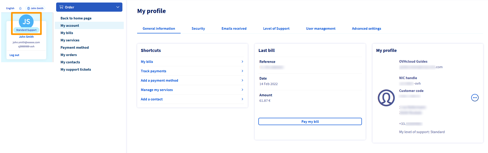
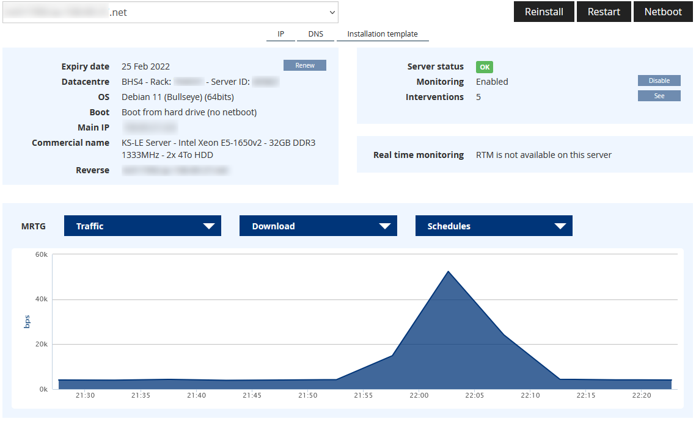
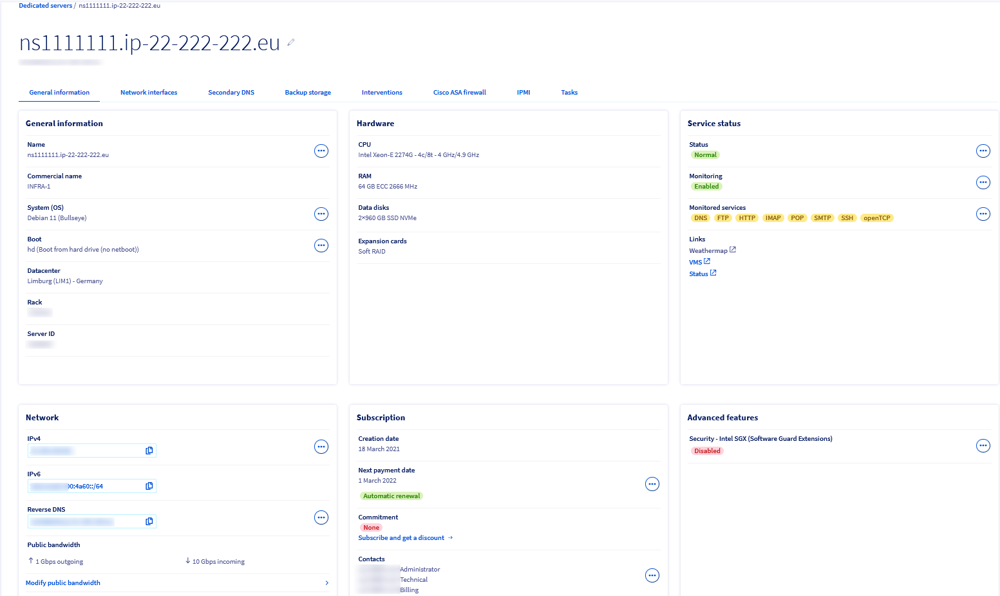
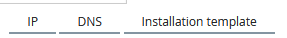
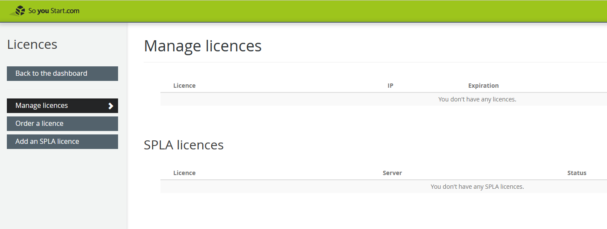

## Objective

OVHcloud annonce le regroupement de l’ensemble des serveurs dédiés Kimsufi et So you Start dans une ligne de produits appelée Eco, afin de vous offrir une meilleure vue d’ensemble de nos configurations. En raison de ces changements, vous pourrez désormais gérer tous vos services, quelle que soit leur gamme, depuis l'espace client OVHcloud. Pour vous accompagner durant cette migration, nous avons mis en place un guide vous présentant l’espace client OVHcloud et ses options.

**Ce guide est destiné à vous aidez à vous familiariser avec l'espace client OVHcloud**

> [!warning]
> Veuillez noter que malgré le changement d'interface client, les options disponibles pour votre gamme de serveur resteront les mêmes.
>

**Tableau de bord**

 Kimsufi             | Soyoustart | OVHcloud
:-------------------------:|:-------------------------:|:---------------------:
  |  | 

Le tableau de bord OVHcloud présente un récapitulatif de tous vos services. Cette interface présente plusieurs sections, qui vous permettent d'accéder instantanément à un service.
La colonne de droite vous donne accès à certaines informations personnelles comme votre nom, votre adresse e-mail ainsi que votre identifiant client et votre niveau de support (le cas échéant). Elle propose également un certain nombre de raccourcis et de liens utiles.

**Support, Facturation, Gestion de compte**

Contrairement à l’espace client Kimsufi et So you Start où ces options sont disponibles en haut à droite sous des onglets individuels, dans l’espace client d’OVHcloud, ces options sont regroupées dans un espace commun. Pour y accéder, cliquez sur votre nom en haut à droite et cliquez sur vos initiales pour accéder à la rubrique `Gérer mon compte`.

Kimsufi             | So you Start | OVHcloud
:-------------------------:|:-------------------------:|:---------------------:
  |  | 

**Accéder au serveurs**

Kimsufi             | So you Start | OVHcloud
:-------------------------:|:-------------------------:|:---------------------:
  |  | 

Contrairement aux espaces clients Kimsufi et So you Start qui vous permettent de voir votre serveur/liste de serveurs dans le tableau de bord, chez OVHcloud, vous devez d’abord cliquez sur le menu `Bare Metal Cloud` dans la barre supérieure et ensuite sur `Serveurs dédiés` dans la colonne de gauche pour afficher vos serveurs. De plus, si vous possédez un grand nombre de serveurs, le bouton `Tous mes serveurs` vous permet de les lister pour un accès facile.

**Interface Serveur**

Une fois dans le menu `Serveurs dédiés`, cliquez sur le serveur de votre choix pour accéder à son interface.

Kimsufi             | So you Start | OVHcloud
:-------------------------:|:-------------------------:|:---------------------:
  |  | 

Pour plus d'informations sur la gestion de votre serveur dédié via l'espace client OVHcloud, veuillez consulter [ce guide](https://docs.ovh.com/fr/dedicated/premiers-pas-serveur-dedie/).

**Menu d'options**

Kimsufi             | So you Start | OVHcloud
:-------------------------:|:-------------------------:|:---------------------:
  |  | 

**Section IP**

Pour accéder à la section «IP» de votre espace client OVHcloud, cliquez sur le menu `Bare Metal Cloud`{.action} dans la barre supérieure et ensuite sur `IP`{.action} située en bas de la colonne à gauche de la page.

Kimsufi             | So you Start | OVHcloud
:-------------------------:|:-------------------------:|:---------------------:
  |  |  |

**Onglet Licences**

Pour accéder à l'onglet «Licences» dans l'espace client OVHcloud, cliquez sur le menu `Bare Metal Cloud`{.action} dans la barre supérieure et ensuite sur `Licences`{.action} dans colonne à gauche de la page.

Kimsufi             | So you Start | OVHcloud
:-------------------------:|:-------------------------:|:---------------------:
Licences are not offered for this range.  |  | 

## Aller plus loin

Dans la pratique, voici quelques guides qui vous aideront au démarrage :

[Se connecter à l’espace client OVHcloud](https://docs.ovh.com/fr/customer/se-connecter-espace-client-ovhcloud/) 
[Modifier le mot de passe de votre compte](https://docs.ovh.com/fr/customer/gerer-son-mot-de-passe/). 
[Sécuriser mon compte OVHcloud et gérer mes informations personnelles](https://docs.ovh.com/fr/customer/tout-savoir-sur-identifiant-client/). 
[Gérer les contacts de ses services](https://docs.ovh.com/fr/customer/gestion-des-contacts/). 
[Utilisation de l’IPMI pour les serveurs dédiés](https://docs.ovh.com/fr/dedicated/utilisation-ipmi-serveurs-dedies/).

Échangez avec notre communauté d’utilisateurs sur <https://community.ovh.com/>.