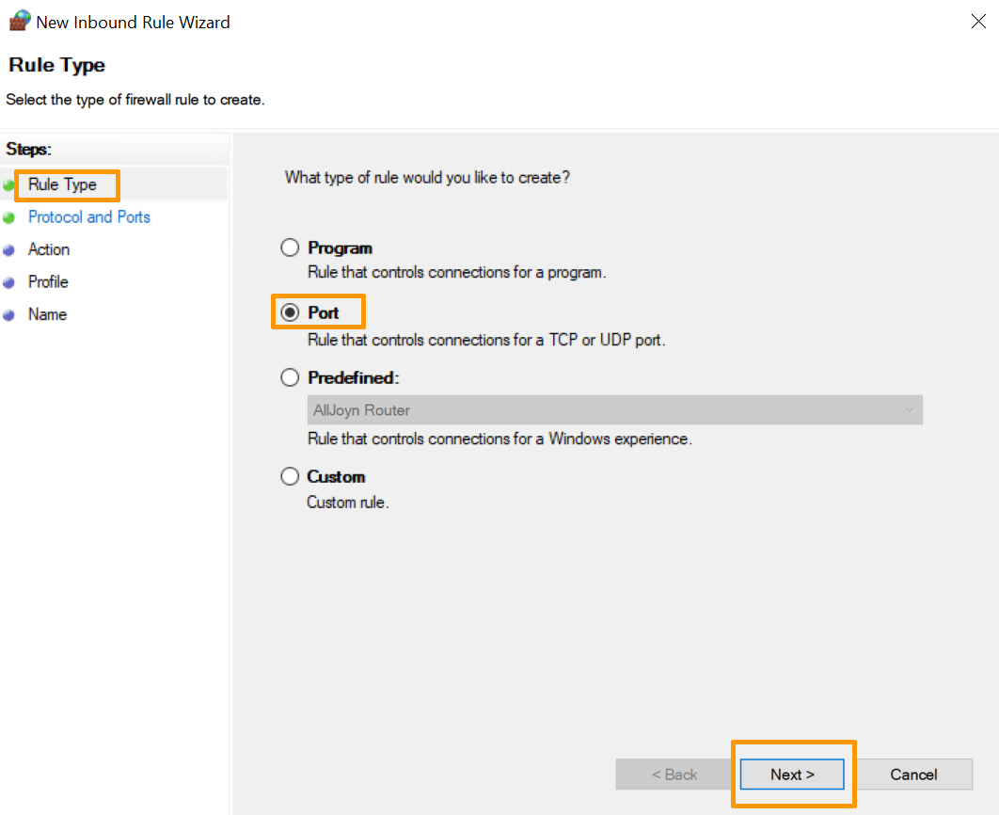
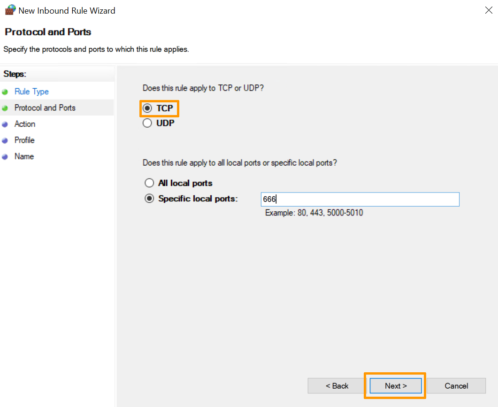
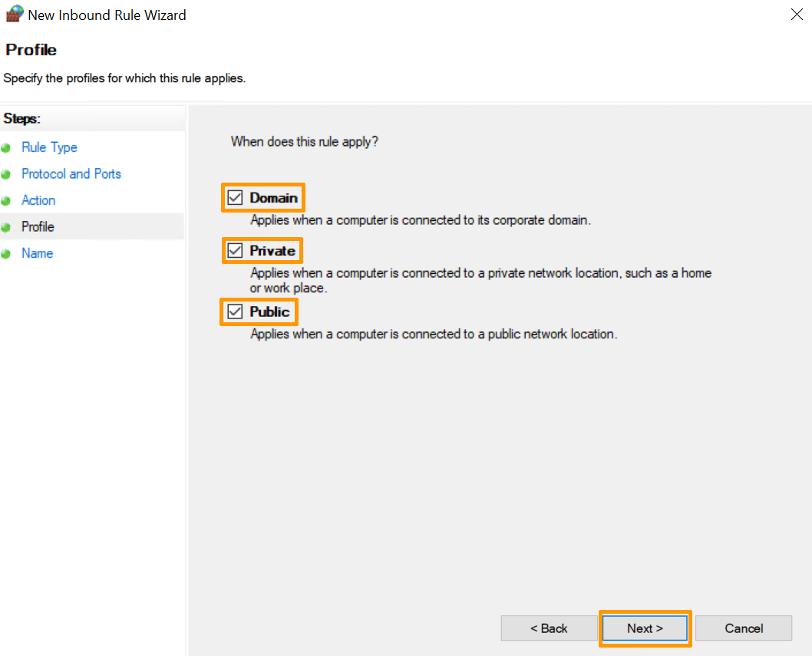

**Last updated 31st January 2022**

## Objective

To best protect your system, your Windows Server dedicated server has its own built-in firewall. By configuring it, you can increase security levels, which guarantees the availability and integrity of all elements hosted on the server, such as roles, services and shared folders.

**This guide will show you how to apply firewall rules on Windows.**

> [!warning]
>OVHcloud is providing you with services for which you are responsible, with regard to their configuration and management. You are therefore responsible for ensuring they function correctly.
>
>This guide is designed to assist you in common tasks as much as possible. Nevertheless, we recommend that you contact a [specialist service provider](https://partner.ovhcloud.com/asia/directory/) and/or discuss the issue with [our community](https://community.ovh.com/en/) if you face difficulties or doubts concerning the administration, usage or implementation of services on a server.
>

## Requirements

- A [dedicated server](https://www.ovhcloud.com/asia/bare-metal/) with Windows installed in your OVHcloud account
- Administrative access via remote desktop to your server

## Instructions

### Step 1: Access Windows Firewall

To access Windows Firewall, you can follow this order:

- Click `Start`{.action}.
- Click `Search`{.action}.
- Search for "Windows Firewall" in the search bar.
- Click `Windows Firewall`{.action} .

Then click `Advanced settings`{.action}.

{.thumbnail}

### Step 2: Enable an inbound rule

In the window that appears, you will see settings such as:

- Inbound and Outbound Rules
- Connection Security Rules
- Server Firewall Monitoring Options

Selecting `Inbound Rules`{.action} displays all preconfigured Windows Server rules associated with network connections and incoming packets. Some of these rules are not enabled by default. If you want to enable them, right-click the rule and select the `Enable rule`{.action} option.

{.thumbnail}

### Step 3: Create a new rule 

To create a new rule, go to the `Action`{.action} menu and select `New Rule`{.action}.
Click the `New Rule`{.action} option in the right-hand pane.

{.thumbnail}

### Step 4: Define the type of rule to activate

The Rule Wizard provides options to define the type of rule to create. Select the `Port`{.action} check box.

{.thumbnail}

### Step 5: Define the port type to activate

In the next step, define the port type to enable:

{.thumbnail}

> [!primary]
>
>- TCP (Transmission Control Protocol)
>It is a connection-orientated protocol, i.e. with TCP, it will be possible to create connections between them in order to send data streams. This protocol ensures that data is delivered to the recipient in the same order and in the same error-free manner.
>
>- UDP (User Datagram Protocol)
>This is a non-connection-orientated protocol. Its development is based on the exchange of datagrams and facilitates the sending of datagrams across the network. You will need to have established a connection to the destination beforehand.
>
>You can also select the `All local ports`{.action} checkbox to enable all TCP or UDP ports on a non-secure server. You can also select the `Specific local ports`{.action} check box to determine which port should be allowed. 
>

### Step 6: Allow or block the connection

To define the action this rule will trigger, the following options are available. Select the one that works for you.

- **Allow the connection**. This option allows full communication through this port.
- **Allow the connection if it is secure**. This option allows data to be transmitted only if the connection is authenticated via IPsec.
- **Block the connection**. This option prevents data from being routed through this port.

Select the `Allow Connection`{.action} option and click `Next`{.action}.

{.thumbnail}

### Step 7: Define the firewall profile and name to apply

Finally, you must choose which profiles the rule should apply to, from public, domain or private profiles.
You can enable them all if you want.

{.thumbnail}

Give the new rule a name and description (optional) to make it easier to use:

{.thumbnail}

Click the `Finish`{.action} button to complete the process and create the new rule.

{.thumbnail}

You can then make changes to the settings of the new rule you have created.

## Go further

Join our community of users on <https://community.ovh.com/en/>.
