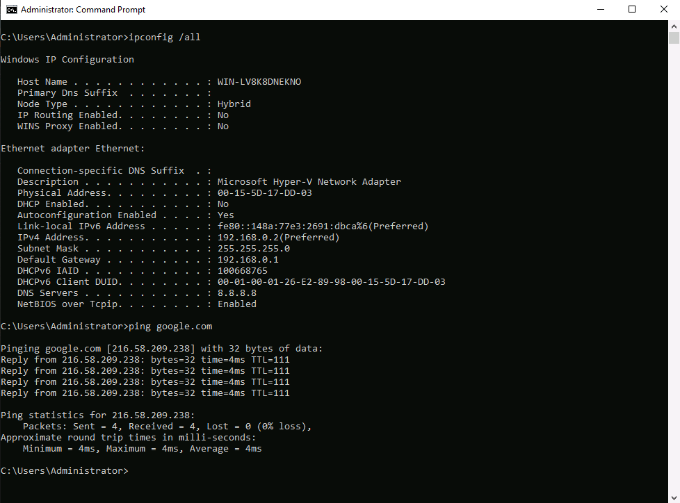

**Last updated 6th January 2022**

## Objective

**This tutorial provides some basic information on creating virtual machines within Hyper-V on a Windows Server licensed with OVHcloud.**

> [!warning]
> This tutorial will show you how to use one or more OVHcloud solutions with external tools, and will describe the actions to be carried out in a specific context. You may need to adapt the instructions according to your situation.
>
> If you encounter any difficulties performing these actions, please contact a [specialist service provider](https://partner.ovhcloud.com/asia/directory/) and/or discuss the issue with our community. You can find more information in the [Go further](#gofurther) section of this tutorial.
>

## Requirements

- A [dedicated server](https://www.ovhcloud.com/asia/bare-metal/){.external} with Windows Server installed.
- The Hyper-V role installed
- A Windows License provided by OVHcloud

## Instructions

This tutorial assumes that you have already installed the Hyper-V role and have access to the Hyper-V Manager. If you have not done this, you can refer to Microsoft's guide to installing the Hyper-V role [here](https://docs.microsoft.com/en-us/windows-server/virtualization/hyper-v/get-started/install-the-hyper-v-role-on-windows-server){.external}


### Creating a NAT Network

First of all, Windows Server will request the activation of the guest OS through NAT (unless you had a SPLA license to be attached with a specific KMS). Open up a PowerShell session as an administrator. We will create it with the following command:

```sh
PS C:\Windows\system32> New-VMSwitch -SwitchName "NAT" -SwitchType Internal
Name SwitchType NetAdapterInterfaceDescription
---- ---------- ------------------------------
NAT Internal
```

After that, confirm the adaptor has been successfully created with:

```sh
PS C:\Windows\system32> Get-VMSwitch

Name SwitchType NetAdapterInterfaceDescription
---- ---------- ------------------------------
Intel(R) Ethernet Controller X550 - Virtual Switch External Intel(R) Ethernet Controller X550
Intel(R) Ethernet Controller X550 #2 - Virtual Switch External Intel(R) Ethernet Controller X550 #2
NAT Internal
```

We see that the "NAT" Virtual Switch has been created successfully. Once it's been created, we will need to confirm the InterfaceIndex
or "interface ID" for the following step like this:

```sh
PS C:\Windows\system32> Get-NetAdapter
Name                     InterfaceDescription                  ifIndex Status
MacAddress             LinkSpeed
----                     --------------------                  ------- ------
----------             ---------
vEthernet(Intel(R) Et... Hyper-V Virtual Ethernet Adapter #2       9      Up 
D0-50-99-D7-2C-89      10 Gbps
Ethernet                 Intel(R) Ethernet Controller X550         7      Up 
D0-50-99-D7-2C-8A      10 Gbps
Ethernet 2               Intel(R) Ethernet Controller X550 #2      5      Up 
D0-50-99-D7-2C-89      10 Gbps
vEthernet (NAT)          Hyper-V Virtual Ethernet Adapter #3      24      Up 
00-15-5D-17-DD-04      10 Gbps
vEthernet(Intel(R) Et... Hyper-V Virtual Ethernet Adapter         12      Up 
D0-50-99-D7-2C-8A      10 Gbps
```

In our case, we see our "NAT" adapter ID is 24.


Next, Let's create a NAT network that will allow our VM to connect to the internet; we will be able to see the information of it once it's been executed:

```sh
PS C:\Windows\system32> New-NetIPAddress -IPAddress 192.168.0.1 -PrefixLength 24 -InterfaceIndex 24
IPAddress : 192.168.0.1
InterfaceIndex : 24
InterfaceAlias : vEthernet (NAT)
AddressFamily : IPv4
Type : Unicast
PrefixLength : 24
PrefixOrigin : Manual
SuffixOrigin : Manual
AddressState : Tentative
ValidLifetime : Infinite ([TimeSpan]::MaxValue)
PreferredLifetime : Infinite ([TimeSpan]::MaxValue)
SkipAsSource : False
PolicyStore : ActiveStore

IPAddress : 192.168.0.1
InterfaceIndex : 24
InterfaceAlias : vEthernet (NAT)
AddressFamily : IPv4
Type : Unicast
PrefixLength : 24
PrefixOrigin : Manual
SuffixOrigin : Manual
AddressState : Invalid
ValidLifetime : Infinite ([TimeSpan]::MaxValue)
PreferredLifetime : Infinite ([TimeSpan]::MaxValue)
SkipAsSource : False
PolicyStore : PersistentStore
```

> [!primary]
> 
> Note: The IPAddress value will be the internal gateway IP for our VM to be configured; it will connect the WinNAT service inside the host to
reach internet. The PrefixLength will be the netmask prefix of the IP given before, and lastly the InterfaceIndex will be the ID of the
virtual switch created on the step before (in our case, its ID is 24).
>

Lastly, let's create the network that will be used by our WinNAT service to reach the internet with the following command:

```sh
PS C:\Windows\system32> New-NetNat -Name MyNATnetwork -InternalIPInterfaceAddressPrefix 192.168.0.0/24
Name : MyNATnetwork
ExternalIPInterfaceAddressPrefix :
InternalIPInterfaceAddressPrefix : 192.168.0.0/24
IcmpQueryTimeout : 30
TcpEstablishedConnectionTimeout : 1800
TcpTransientConnectionTimeout : 120
TcpFilteringBehavior : AddressDependentFiltering
UdpFilteringBehavior : AddressDependentFiltering
UdpIdleSessionTimeout : 120
UdpInboundRefresh : False
Store : Local
Active : True
```

> [!primary]
> 
> The Name parameter will define the name of this network, as well as the InternalIPInterfaceAddressPrefix parameter will connect to the network desired; in our case, the network is the one created before:
>
> - 192.168.0.0 is the network IP
> - 192.168.0.1 is the gateway for your virtual machines
> - 192.168.0.2 - 192.168.0.254 will be used as IPs for your virtual machines
>

### Activating the VM

At this point, the network will be correctly set for this validation. Create a new Windows Server 2019 Standard VM (We have used the evaluation ISO downloadable from the official Microsoft website). Once installed, configure your virtual machine with an IP of the range configured on the virtual switch (for example: 192.168.0.2/24):

{.thumbnail}

Since the .ISO used has enabled the "Evaluation mode", we need to transfer this guest OS to the Standard version. Launch the following
command on your CMD:

```sh
C:\Users\Administrator> DISM.exe /Online /Set-Edition:ServerStandard /ProductKey:N69G4-B89J2-4G8F4-WWYCCJ464C /AcceptEula
```

> [!primary]
> 
> This license (N69G4-B89J2-4G8F4-WWYCC-J464C) belongs to our current KMS validation license repository for Windows Server 2019 Standard. You can grab each of our current license keys from the following guide: [Changing a Windows Server product key](../windows-key)
>

Reboot your VM, then do the following to set the KMS server and activate Windows.

Setting the KMS server

```sh
cscript.exe c:\windows\system32\slmgr.vbs -skms kms.ovh.net 
```

Activating Windows

```sh
cscript.exe c:\windows\system32\slmgr.vbs -ato
```

Your VM should now be activated.

## Go further

Join our community of users on <https://community.ovh.com/en/>.
