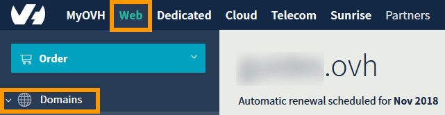
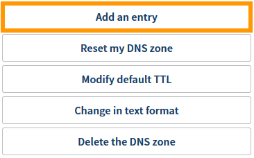
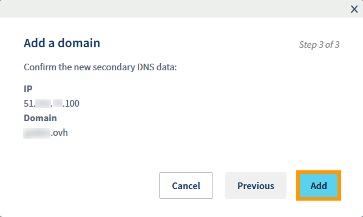

**Last updated 13th June 2018**

## Objective

If you want to use your [Dedicated Server](https://www.ovh.co.uk/dedicated_servers/){.external} as the primary DNS for your domain, you can add the domain as a secondary DNS to your server.

**This guide will show you how to create a secondary DNS, and add it to your Dedicated Server.**

## Requirements

* a [Dedicated Server](https://www.ovh.co.uk/dedicated_servers/){.external} with any OS installed
* a [domain](https://www.ovh.co.uk/domains/){.external} in your [OVH Control Panel](https://www.ovh.com/auth/?action=gotomanager){.external}
* access to the [OVH Control Panel](https://www.ovh.com/auth/?action=gotomanager){.external}

## Instructions

### Obtain a domain verification code

Click the `Dedicated`{.action} menu, then click `Dedicated Servers`{.action} to expand the list of servers in your account:

{.thumbnail}

Next, select the `Secondary DNS`{.action} tab, and click `Add a domain`{.action}:

{.thumbnail}

Enter your domain in the `Domain` field, then click `Next`{.action}:

{.thumbnail}

You will now see a message instructing you to create a TXT record for your domain. Make a note of the sub-domain and target in the instructions, then click `Cancel`{.action}:

{.thumbnail}

### Verify your domain

Log in to your [OVH Control Panel](https://www.ovh.com/auth/?action=gotomanager){.external} and click the `Web`{.action} menu. Then click `Domains`{.action} to expand the list of domains:

{.thumbnail}

After selecting your domain, click the `Add an entry`{.action} button:

{.thumbnail}

Next, select the `TXT`{.action} record type, then click `Next`{.action} to continue:

{.thumbnail}

Now fill in the `Sub-domain` and `Value` fields using the information you noted down earlier. When you have done this, click `Next`{.action}:

{.thumbnail}

Finally, confirm your entry by clicking the `Confirm`{.action} button:

{.thumbnail}

### Add the secondary DNS to your server

Click the `Dedicated`{.action} menu, and then click `Dedicated Servers`{.action} to expand the list of servers in your account:

{.thumbnail}

Next, select the `Secondary DNS`{.action} tab, and click `Add a domain`{.action}:

{.thumbnail}

Enter your domain in the `Domain` field, then click `Next`{.action}:

{.thumbnail}

Since the TXT record for your domain has already been created, just click `Next`{.action} to continue:

{.thumbnail}

Finally, click `Add`{.action} to confirm your entry:

{.thumbnail}

## Go further

Join our community of users on <https://community.ovh.com/en/>.
