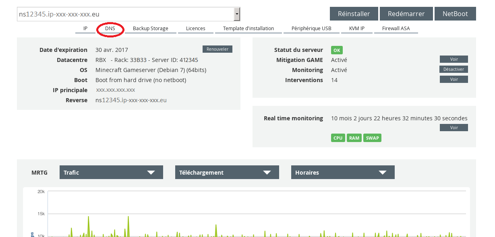
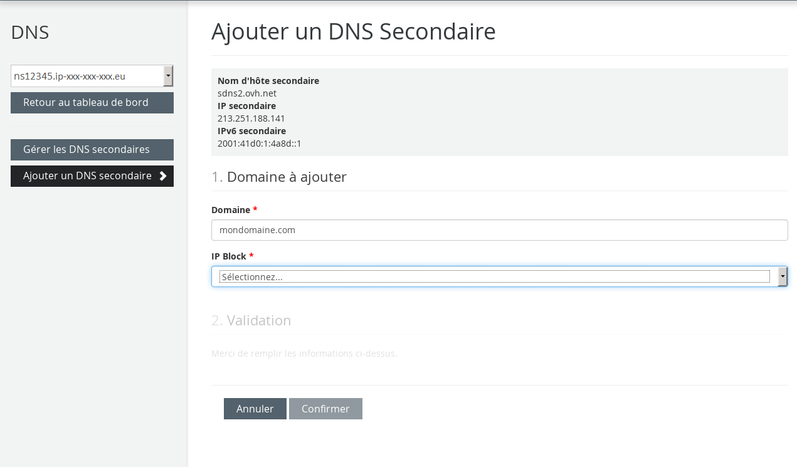
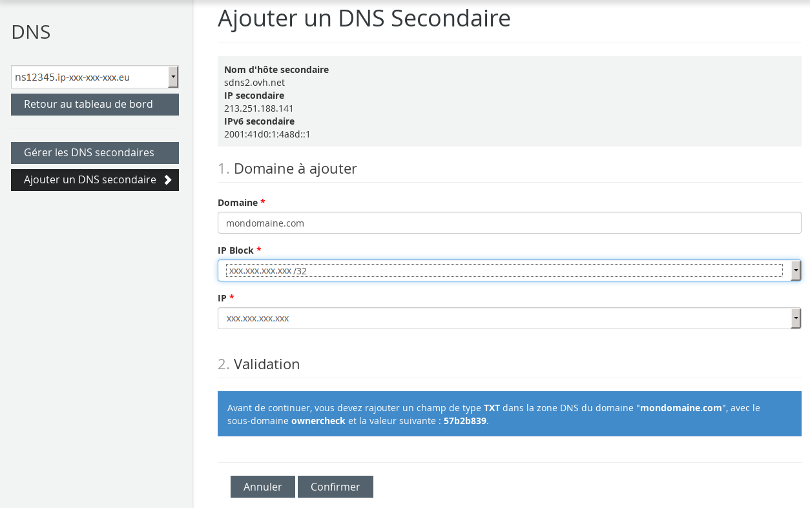
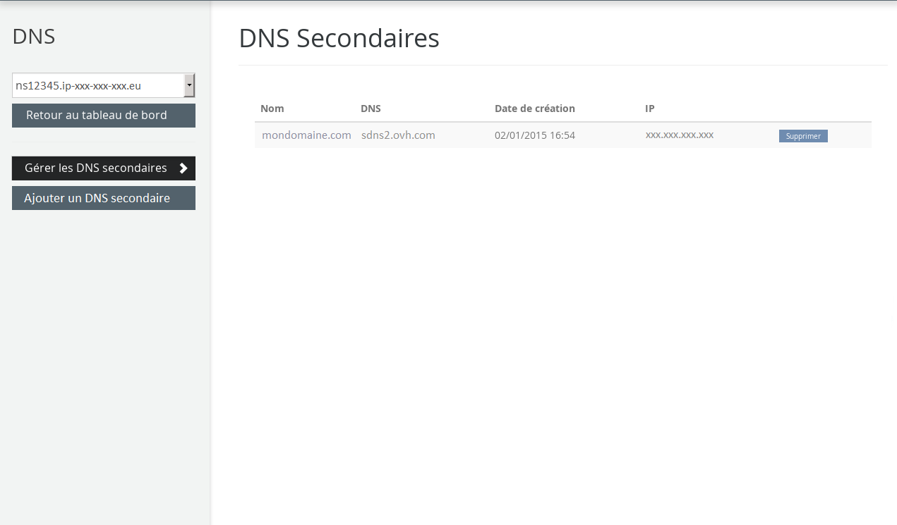

## Pridėti domeną į antrinį DNS
Norint pridėti domeną prie Kimsufi ar So you Start serverio antrinio DNS, reikia:

- Prisijungti prie Kimsufi ar So you Start kliento paskyros.
- Spragtelėti langelį DNS.

{.thumbnail}
Po to spauskite Pridėti antrinį DNS.

{.thumbnail}
Kimsufi serveriams antrinis DNS yra ns.kimsufi.com.
Dabar jums reikia įvesti domeną ir pasirinkti IP adresą, kuriam jis bus priskirtas.

{.thumbnail}
Po to matysite pranešimą, nurodantį, jog reikia pridėti subdomeną ownercheck su tam tikra verte jūsų DNS zonoje.

Po subdomeno pridėjimo, BIND paslaugos paleidimo iš naujo ir DNS zonos paskelbimo (24 - 48 val.), galėsite pridėti savo domeną prie antrinio DNS.

## Domeno pašalinimas iš antrinio DNS
Norint pašalinti domeną iš antrinio DNS, reikia:

- Prisijungti prie Kimsufi ar So you Start kliento paskyros.
- Spragtelėti langelį DNS.
- Spragtelėti langelį Antrinio DNS valdymas.
- Paspausti mygtuką Pašalinti ir patvirtinti.

{.thumbnail}

