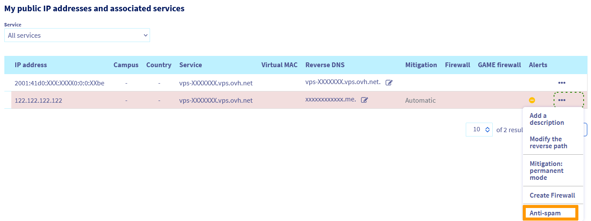

**Last updated 17th October 2022**

## Objective

For every IP available with OVHcloud products and services, as an Internet Service Provider, we will register and reserve it with organisations such as [RIPE](https://www.ripe.net/) or [ARIN](https://www.arin.net/). This means that we appear as the IP abuse contact for litigation in the WHOIS database.

If an IP is reported to organisations such as Spamhaus and SpamCop, which work to combat SPAM, malicious websites and phishing, then the reputation of the entire OVHcloud network is at stake.

It is therefore important that OVHcloud takes care of the reputation, quality and security of the network, which also forms an important part of your service.

### How does the protection system work?

Our system is based on the Vade Secure anti-spam technology.

Once an IP is "blocked for SPAM", an email will be sent to your account containing information like the example below:

> 
> Dear Customer,
>
> Our anti-spam protection layer has detected that your IP 122.122.122.122 is sending spam.
>
> In order to protect our network, we have blocked the port 25 of your server, at the network level.
>
> To help you investigate about this problem and fix it, here is a sample of some advanced details on your emails:
>
> Destination IP: 188.95.235.33 - Message-ID: d24aa492-5f37-457f-9595-23ddc9e0f714@xxxxxxxxxxxxx.xx.local - Spam score: 300 <br>
> Destination IP: 188.95.235.33 - Message-ID: fc090jdhf934iu09bf084bfo92@xxxxxxxxxxxxx.com - Spam score: 300<br>
> Destination IP: 188.95.235.33 - Message-ID: P0hbfo93407684bfoqljrlqvpLatS3RRB9rZw7e8s@xxxxxxxxxxxx.online - Spam score: 300<br>
> Destination IP: 188.95.235.33 - Message-ID: 6ZUnls843bnf0934StxFasYGmhtDJRo@xxxxxxxxxxxx.online - Spam score: 300<br>
> Destination IP: 188.95.235.33 - Message-ID: zcb.3z54da3kdfkl45802n0c0q98rqcc57e3b8aadfac63b2c408e3f5f9a27.1d44jkgnddfef.166489320375@xxxxxx.xxxx.net - Spam score: 300<br>
> Destination IP: 188.95.235.33 - Message-ID: zcb.3z54da33hn98v9bcq-nrf3r67cc57e3b8aadfac63b2c408e3f5f9a27.1d44jd9340252.1655508652095@xxxxxx.xxxx.net - Spam score: 300
> <br>
> <br>

## Instructions

**What to do after receiving the email alert?**

The process is to identify the issue, resolve it, then unblock your IP.

### Identify and resolve the issue 

**Before unblocking an IP:**

- Stop sending emails (e.g. stop all email software such as qmail, Postfix, Sendmail etc.).
- Check the email queue (e.g. qmHandle for qmail, postqueue -p for Postfix) and clear it.
- Analyse your logs using the **Message-ID** found in the block alert.
- If you are indeed sending SPAM or illegitimate emails, we strongly recommend you to resolve the issue **before** unblocking the IP. Please consult the second part of this guide for email [best practices](#bestpractices). 

Once the issue has been resolved, you can unblock your IP by performing the following steps.

> [!alert]
> 
> Do not unblock the IP under any circumstances without having suspended the sending of emails from your server, otherwise you will immediately get blocked for a second time (and a longer duration). 
>

### Unblock your IP

#### Unblocking your IP from the OVHcloud Control Panel

In your [OVHcloud Control Panel](https://www.ovh.com/auth/?action=gotomanager&from=https://www.ovh.co.uk/&ovhSubsidiary=GB), go to the `Bare Metal Cloud`{.action} section and click on `IP`{.action}.

A pop-up message indicates the IP/service that has been blocked for SPAM.

{.thumbnail}

Next, in the section "My public IP addresses and associated services" , click on the `...`{.action} next to the corresponding IP/service and select `Anti-spam`{.action}.

{.thumbnail}

In the new tab, click on `Unblock the anti-spam`{.action} at the bottom and confirm.

{.thumbnail}

The IP is being released, the operation may take several minutes.

Once done, your IP will be unblocked.

#### Unblocking your IP from the OVHcloud API

Log in to the [OVHcloud API interface](https://api.ovh.com/console/) according to the [relevant guide](https://docs.ovh.com/gb/en/api/first-steps-with-ovh-api/) and follow the steps below.

First, retrieve the list of IPs for each OVHcloud service (Dedicated Server/Hosted Private Cloud/VPS/Public Cloud):

> [!api]
>
> @api {GET} /ip
>

**type**: Indicate the type of IP (Dedicated, PCC, VPS, vRack, PCI, etc.)

Here's an example of what you should see:

```bash
"2001:41d0:67:d200::/56",
"2001:41d0:68:a00::/56",
"2001:41d0:68:f000::/56",
"2001:41d0:117:db00::/56",
"122.122.122.121/28",
"145.56.222.96/28",
"188.81.49.30/28",
```

Next, search for IPs in a particular state with the following call. If you already know the IP blocked, you can move on to the [next step](#unblockip):

> [!api]
>
> @api {GET} /ip/{ip}/spam
>

**ip**:	Specify the IP block retrieved in the previous step with the netmask. For example 122.122.122.121/28.<br>
**state**: Specify the state you are looking for.

Here's an example result (in this instance, the 122.122.122.121/28 block was selected):

```bash
"122.122.122.122" 
```

If the IP is blocked, you can get information on the blocking with the following call. Otherwise, move on to the [next step](#unblockip).

> [!api]
>
> @api {GET} /ip/{ip}/spam/{ipSpamming}
>

**ip**: Specify the IP block retrieved in the previous step with the netmask.<br>
**ipSpamming**: Specify the previously retrieved IP in "blockedForSpam" state, for example.

Here's an example result (in this instance block 122.122.122.121/28 and IP 122.122.122.122 were selected):

```bash
time: 3600,
date: "2022-08-29T17:42:50+01:00",
ipSpamming: "122.122.122.122",
state: "blockedForSpam" 
```

So:

```bash
- The IP is blocked for 1 hour (or 3600 seconds).
- It was blocked on 29/08/2022 at 5:42 p.m.
- Its current state is blocked.
```


If you wish to obtain the statistics on what has been detected, use the following api call, otherwise move on to the [next step](#unblockip).

> [!api]
>
> @api {GET} /ip/{ip}/spam/{ipSpamming}/stats
>


**ip**:	Specify the IP block retrieved in the previous step with the netmask.<br>
**ipSpamming**:	Specify the previously retrieved IP in "blockedForSpam" state, for example.<br>
**from and to**: Use the date format used in the previous function (YYYY-MM-DDTHH:MM+01:SS).


Here is an example result:

```bash
{
"messageId": "2PXQSX-3JRAUU-SF@obfuscated.com",
"destinationIp": "188.95.235.33",
"date": 1385640992,
"spamscore": 410
}
```


##### **Unblock the IP** <a name="unblockip"></a>

> [!alert]
> IMPORTANT!
Do not unblock the IP under any circumstances without having suspended the sending of emails from your server, otherwise you will immediately get blocked for a second time (and a longer duration). 
>

To unblock your IP, use the following call:

> [!api]
>
> @api {POST} /ip/{ip}/spam/{ipSpamming}/unblock
>

**ip**: Specify the IP block retrieved in the previous step with the netmask.<br>
**ipSpamming** : Specify the previously retrieved IP in "blockedForSpam" state.


Here is an example result:

```bash
"message": "This IP address is still blocked for 129 seconds"
```


More than 129 seconds later:

```bash
time: 3600,
date: "2022-08-29T17:42:50+01:00",
ipSpamming: "122.122.122.122",
state: "unblocking" 
```

The IP is being released, the operation may take several minutes.

### In case of false positives

In some cases, the antispam alert could be false positive. If you have checked and found that **Message-ID** are from your legitimate email, you should then ensure that your email messages comply with the [RFC](#rfc) and the [Best Practices](#bestpractices) indicated below.

#### RFC <a name="rfc"></a>

RFCs (Request For Comments) are documents intended to describe technical aspects of the Internet. They are produced and published by the IETF (Internet Engineering Task Force), a group which basically produces and defines standards.
For more information, see: [RFC](https://en.wikipedia.org/wiki/Request_for_Comments), [IETF](https://www.ietf.org/) and [Internet Draft](https://en.wikipedia.org/wiki/Internet_Draft).

#### Best Practices <a name="bestpractices"></a>

Best practices are recommended methods which are often based on the RFC documents and are intended to advise you on the best way to proceed. In this instance, this means the basic rules to follow so that your emails are not marked as spam.

**Sending Volume**

If your outgoing email volume is very high, you are advised to:

- reserve an IP block dedicated solely to email usage.
- provide an 'abuse' address on this block in order to receive complaints.
- configure [Reverses](https://docs.ovh.com/gb/en/dedicated/optimise-email-sending/#configure-the-reverse-ip) on all IPs correctly.

This operation will enable you to simultaneously isolate the IP and domain reputation if you send emails from various domains, to receive the complaints, and thus do what is necessary to get unblocked by various organisations. It also enables you to locate a problem more quickly on a form that uses domain X or Y, as the emails are not sent out from the same IP and don't have the same reverse.

**Email Content**

- Avoid using spammer keywords in your emails such as “buy” and “last chance”, and avoid capital letters, impersonal subjects, exclamation marks, and % discounts.
- Do not forget to provide an **unsubscribe link** for people who have not requested to receive your email or who believe it to be illegitimate.
- Pay particular attention to ensuring that your emails contain the sender's address (or an alias), a subject line and a correct ratio of text, images and links in the body of the message.
- The ratio of text to image and text to link should be high. Do not overload the email with hyperlinks and avoid Javascript.

**FBL - Feedback Loop**

This system enables you to follow up on feedback provided by some internet service providers directly, informing you that their users have flagged your message as illicit, and that it has therefore been classified as spam. This will allow you to interact directly with these ISPs regarding your reputation. Some FBLs include:

- [Yahoo & AOL Postmaster](https://senders.yahooinc.com/contact)
- [SpamCop](https://www.spamcop.net/)
- [Outlook & live.com](https://sendersupport.olc.protection.outlook.com/pm/)

**Authentication**

Some authentication services allow you to protect your reputation:

- **Sender-ID**: An email authentication technology developed by Microsoft which validates the authenticity of your domain name by verifying the IP address of the sender. This technology is based on the IETF standard: [RFC4406](https://datatracker.ietf.org/doc/rfc4406/)
- **SPF**: Sender Policy Framework is a standard for verifying the domain of the sender. It is based on [RFC4408](https://datatracker.ietf.org/doc/rfc4408/) and consists of adding an SPF or TXT field to the domain DNS, which contains the list of IPs authorised to send emails from this domain.
- **Reverse DNS**: Reverse enables your IP to be "translated” into your domain. That allows the domain associated with the IP address to be found.
- **DKIM**: This standard is described in [RFC4871](https://datatracker.ietf.org/doc/html/rfc4871). AOL and Google (Gmail) work on this basis. 

For more information on the above services, please consult our guide on [Optimising the sending of emails](https://docs.ovh.com/gb/en/dedicated/optimise-email-sending/).

#### Specific types of email sending

- **To a Microsoft server (Outlook, etc.)**

Microsoft uses a whitelist policy. This means that initially, everything starts off on a blacklist, and a specific procedure is required to validate your email server. For more information, please consult [this section](https://docs.ovh.com/gb/en/dedicated/optimise-email-sending/#to-a-microsoft-server-outlook-etc) of the corresponding guide.

- **To a Gmail server**

If your recipients are with Gmail, adding specific records (e.g. a DMARC record) may ensure that emails reach them. Here is a Google article that can help you with this: [Add a DMARC record](https://support.google.com/a/answer/2466563?hl=en){.external}.

Google also has a [dedicated article](https://support.google.com/mail/answer/81126?hl=en){.external} regarding spam prevention to Gmail users.

### Reporting a false positive

If your emails do comply, you can inform us by sending a sample of your email (including header). Our technical support team will then assist you with the next steps. Simply create a support ticket from your OVHcloud Control Panel and include the following information:

- The IP of the service blocked for SPAM.
- An original copy of the email(s) flagged as SPAM (you should be able to identify that with the **message ID** included in the ANTISPAM email). If no **message ID** is provided, simply send us a copy of the emails sent before receiving the alert. Please only provide the copy of the email flagged as SPAM.
- The .EML file of the email provided, this should include the **header** and **footer** of the email. If you are not familiar with how to extract an .EML file, please consult the following guide: [Retrieving email headers](https://docs.ovh.com/gb/en/emails/shared_mail_guide_to_view_email_headers/).

Once the information is sent, our support team will communicate with Vade Secure for further analysis of the case.

## Go further

Join our user community on <https://community.ovh.com/en/>.
