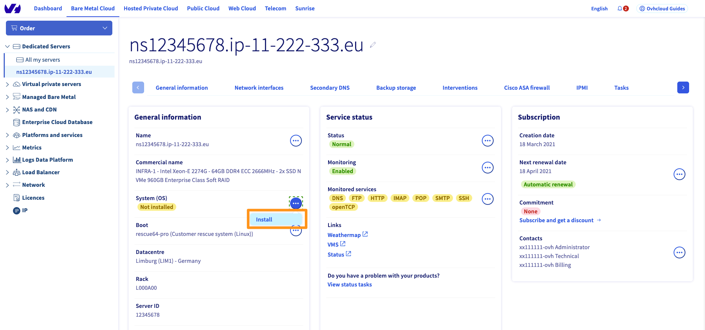

> [!primary]
> Diese Übersetzung wurde durch unseren Partner SYSTRAN automatisch erstellt. In manchen Fällen können ungenaue Formulierungen verwendet worden sein, z.B. bei der Beschriftung von Schaltflächen oder technischen Details. Bitte ziehen Sie beim geringsten Zweifel die englische oder französische Fassung der Anleitung zu Rate. Möchten Sie mithelfen, diese Übersetzung zu verbessern? Dann nutzen Sie dazu bitte den Button «Mitmachen» auf dieser Seite.
>

**Letzte Aktualisierung am 25.11.2022**

## Ziel

Mithilfe der Funktion *Bring Your Own Image* (BYOI) können Sie *cloudready* Images direkt auf Ihren Dedicated Servern einrichten. Somit können Sie Bare Metal Dienste als Ressource für Ihre Deployments verwenden.

**Was bedeutet *cloudready*?**
 *cloudready* bedeutet vor allem, unabhängig von der zugrundeliegenden Infrastruktur zu sein.
Zusätzlich zu den unten genannten Voraussetzungen und Einschränkungen muss sichergestellt werden, dass das (heruntergeladene oder erstellte) Image die technischen Anforderungen eines *cloudready* Image erfüllt. Das Image muss in der Lage sein, unabhängig von der Servertypologie korrekt zu booten. Im Falle der Verwendung eines Config Drive muss es auch den Dienst *cloud-init* beinhalten. Schließlich müssen die Systemkonfigurationen es ermöglichen, das Betriebssystem, insbesondere die Netzwerkkonfigurationen, vollständig einzurichten.

**Diese Anleitung erklärt, wie Sie *Bring Your Own Image* mit einem OVHcloud Server verwenden.**

## Voraussetzungen

- Sie verfügen über einen [Dedicated Server](https://www.ovhcloud.com/de/bare-metal/) in Ihrem Kunden-Account.
- Sie haben Zugriff auf Ihr [OVHcloud Kundencenter](https://www.ovh.com/auth/?action=gotomanager&from=https://www.ovh.de/&ovhSubsidiary=de) (für die Methode über das [Kundencenter](#viacontrolpanel)).
- Sie haben die [Credentials generiert, um die API zu verwenden](https://docs.ovh.com/de/api/first-steps-with-ovh-api/) (für den Abschnitt zum [Deployment über API](#viaapi)).
- Die Image-Datei muss kleiner sein als die RAM-Größe des Servers minus 3 GB.

> [!warning]
>
> Eine neue Installation mittels BYOI wird alle auf dem Server vorhandenen Daten löschen.
>

## In der praktischen Anwendung

**Technische Einschränkungen**

Es gibt noch einige technische Einschränkungen bei der Verwendung physischer Dienste wie Dedicated Server.
Bitte beachten Sie die unten aufgeführten Anforderungen bei der Vorbereitung Ihres Deployments. Diese Liste ist nicht erschöpfend.

- Boot-Modus: **uefi** oder **legacy**
- Partitionstyp: **MBR** oder **GPT**
- Imageformat: **qcow2** oder **raw**

Wenn Ihr Server über **uefi** Boot verfügt, müssen Sie in Ihrem Image unbedingt eine **EFI**-Partition hinzufügen.

**Deployment-Methoden**

- [Über das Kundencenter](#viacontrolpanel): ermöglicht es Ihnen, Ihr Image schnell und einfach über Ihr OVHcloud Kundencenter bereitzustellen.
- [Über die API](#viaapi): Sie können die OVHcloud API verwenden, um sie in Ihre eigenen Skripte zu integrieren, um die Inbetriebnahme zu automatisieren.

### Ihr Image über das OVHcloud Kundencenter deployen 

Loggen Sie sich in Ihr [OVHcloud Kundencenter](https://www.ovh.com/auth/?action=gotomanager&from=https://www.ovh.de/&ovhSubsidiary=de)
ein. Wechseln Sie zum Bereich `Bare Metal Cloud`{.action} und wählen Sie dann Ihren Server unter `Dedicated Server`{.action} aus.

Klicken Sie im Tab `Allgemeine Informationen`{.action} auf `...`{.action} neben "System (OS)". Klicken Sie anschließend auf `Installieren`{.action}.

{.thumbnail}

Wählen Sie nun geöffneten Fenster `Installation auf Basis eines personalisierten Images`{.action} und klicken Sie dann auf `Weiter`{.action}.

{.thumbnail}

Sie werden auf die Konfigurationsseite weitergeleitet. Vergewissern Sie sich, dass die URL Ihres Images im geeigneten Format vorliegt. Vervollständigen Sie die übrigen erforderlichen Felder auf dieser Seite. Wenn Sie bestätigt haben, dass die Informationen korrekt sind, klicken Sie auf `System installieren`{.action}.

Weitere Informationen zu den Optionen finden Sie im Abschnitt "[Deployment-Optionen](#options)" dieser Anleitung.

Weitere Informationen zur Aktivierung von "ConfigDrive" finden Sie auf [dieser Seite](https://cloudinit.readthedocs.io/en/latest/topics/datasources/configdrive.html).

{.thumbnail}

### Image über die API deployen 

Loggen Sie sich auf [https://api.ovh.com/](https://api.ovh.com/) ein und gehen Sie dann in den Bereich `/dedicated/server`{.action}. Mit dem `Filter`-Feld können Sie nach "BringYourOwnImage" suchen.

Die BYOI Funktion nutzt drei API-Aufrufe.

{.thumbnail}

Um Ihr Image zu deployen, verwenden Sie folgenden Aufruf und vervollständigen Sie die erforderlichen Felder:

> [!api]
>
> @api {POST} /dedicated/server/{serviceName}/bringYourOwnImage
>

#### Deployment-Optionen 

| Feld | Beschreibung |
|-|-|
| serviceName | Name Ihres Servers. |
| URL | URL, unter der Ihr Image abgerufen wird. |
| checkSum | Die Prüfsumme Ihres Images. |
| checkSumType | Prüfsummentyp Ihres Images (md5, sha1, sha256, sha512). |
| enable (ConfigDrive) | Die Erstellung der ConfigDrive Partition aktivieren (*cloud-init*). |
| hostname (ConfigDrive) | Hostname Ihres Servers. |
| sshKey (ConfigDrive) | Ihr öffentlicher SSH-Schlüssel. |
| userData (ConfigDrive) | Ihr Post-Installationsskript. |
| userMetadatas (ConfigDrive) | Metadaten, die von *cloud-init* zum Zeitpunkt des Boot verwendet werden. |
| description | Bezeichnung für Ihr Image. |
| diskGroupId | Die Kennung (ID) der zu verwendenden Festplatte. |
| httpHeader | Nur anzugeben, wenn nötig, um das Image herunterzuladen. |
| type | Typ/Format Ihres Images (qcow2, raw, ova). |

"ConfigDrive" ist eine von *cloud-init* beim ersten Boot Ihres Servers verwendete Partition, um die gewünschte Konfiguration festzulegen. Sie können auswählen, ob Sie diese Option aktivieren möchten.

{.thumbnail}

Wenn die Felder ausgefüllt sind, starten Sie die Bereitstellung, indem Sie auf `Execute`{.action} klicken.

### Deployment überprüfen

Sie können die Bereitstellung Ihres Images über den unten stehenden API Aufruf oder über KVM / [IPMI](../verwendung-ipmi-dedicated-server/) verfolgen.

> [!api]
>
> @api {GET} /dedicated/server/{serviceName}/bringYourOwnImage
>

In diesem Beispiel ist das Deployment im Status "starting".

{.thumbnail}

Die Bereitstellung kann etwa zehn Minuten dauern. Sobald die Operation abgeschlossen ist, wird der Status Ihrer Deployments auf "done" umgestellt, und Ihr Server wird von der Festplatte neu gestartet.

#### Ausgabe-Beispiele

Hier einige Beispiele für Meldungen:

| Nachricht | Bedeutung |
|-|-|
| Can't write qcow2 on disk. | Das Image qcow2 kann nicht auf die Festplatte geschrieben werden. |
| Could not download, qcow2 image is too big to download in memory. | Es gibt nicht genug RAM, um das Image zu speichern. |
| Could not download image located: `http://path/of/your/image` | Das Image kann nicht heruntergeladen werden von `http://path/of/your/image` |
| Bad format image, expected: qcow2, raw. | Das Bildformat ist nicht korrekt. |
| Bad checkSumType, expected: sha1, sha256, md5. | Der Prüfsummentyp ist nicht korrekt. |
| bad checkSumType for downloaded file, got: 1234 "While Expecting 5678" | Die Prüfsumme ist nicht korrekt. |
| Can not move backup GPT data structures to the end of disk. | Das Festplattenformat ist nicht korrekt. |
| Could not create configdrive on disk. | Die “ConfigDrive” Partition kann nicht erstellt werden. |

### Deployment löschen

Sie können die Deployment-Option mit folgendem Aufruf löschen:

> [!api]
>
> @api {DELETE} /dedicated/server/{serviceName}/bringYourOwnImage
>

Dadurch wird der Deployment-Status gelöscht und Ihr Server in den Rescue-Modus versetzt.

## Weiterführende Informationen

Für den Austausch mit unserer User Community gehen Sie auf <https://community.ovh.com/en/>.
