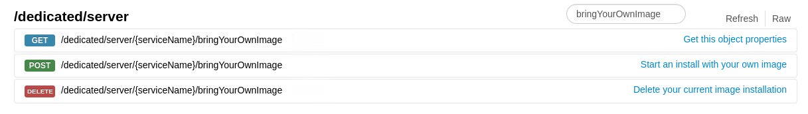
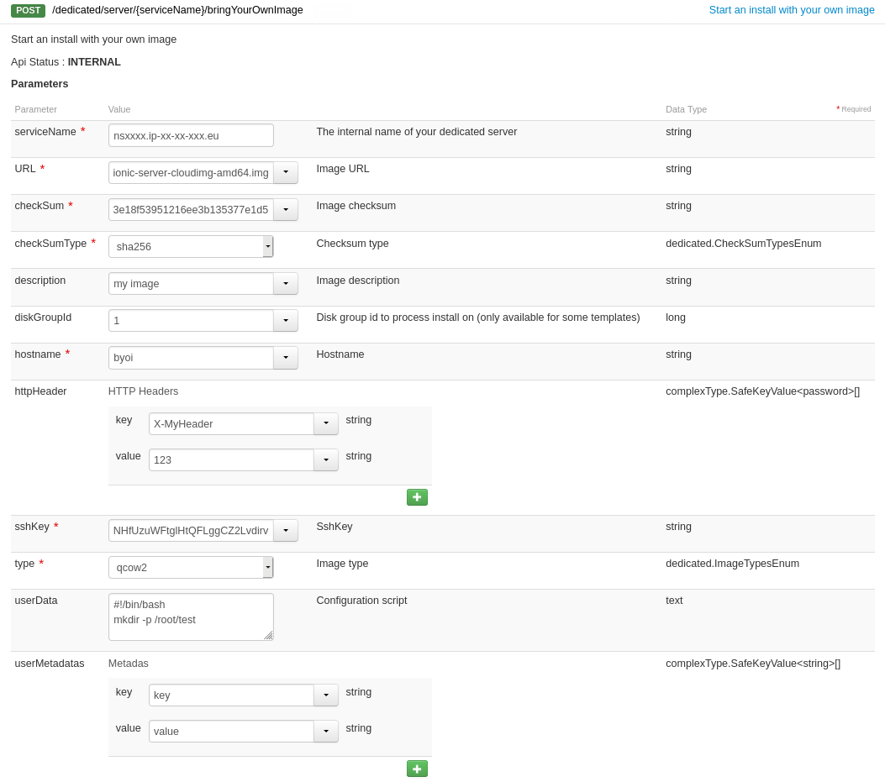

**Last updated 22nd July 2020**

## Objective

Thanks to Bring Your Own Image technology, you can now deploy cloudready images directly on your dedicated server. You can therefore use the bare metal product as a resource for your deployments.

**Discover how to use BringYourOwnImage through the OVHcloud APIv6**

## Requirements

- a [dedicated server](https://www.ovh.co.uk/dedicated_servers/) in your OVHcloud account
- having your [APIv6 credentials credentials](https://docs.ovh.com/gb/en/api/first-steps-with-ovh-api/) ready

> [!warning]
>
> A new installation by BringYourOwnImage will erase all the data on the server.
>

## Instructions

### Technical limitations

There are some technical limitations linked to the use of physical products sush as dedicated servers. Here is a non-exhaustive list, to keep in mind during your deployment preparation.

- Boot type : **uefi** or **legacy**
- Partition type : **MBR** or **GPT**
- Image format : **qcow2** or **raw**

If your server has a **uefi** boot type, be sure to add an **EFI** partition to your image template in order to let your server boot on.

### Deploying your image

Log in to [https://api.ovh.com/](https://api.ovh.com/){.external}  then go to the `/dedicated/server`{.action} section. You can use the `Filter` field to look for  "BringYourOwnImage".

The BringYourOwnImage feature uses 3 API calls.

{.thumbnail}

To deploy your image, use the following API call and complete the required fields:

> [!api]
>
> @api {POST} /dedicated/server/{serviceName}/bringYourOwnImage
>

| Field | Description |
|-|-|
| serviceName | Your server's name. |
| URL | The URL to retrieve your image from. |
| checkSum | Your image's checksum. |
| checkSumType | Your image's checksum type (md5, sha1, sha256, sha512). |
| description | Your image's name. |
| diskGroupId | The disk id on which you want to install your image. |
| hostname | Your server's hostname. |
| httpHeader | Only if necessary to download your image. |
| sshKey | Your public SSH key. |
| type | Your image's type/format (qcow2, raw, ova). |
| userData | Your post-install script. |
| userMetadatas | Meta datas used by Nova when booting. |

{.thumbnail}

After you have completed the fields, start the deployment by clicking `Execute`{.action}.

### Checking deployment

You can track the deployment of your image through the API call below or through the KVM / [IPMI](../use-ipmi-dedicated-servers/).

> [!api]
>
> @api {GET} /dedicated/server/{serviceName}/bringYourOwnImage
>

In this example, the deployment is starting.

{.thumbnail}

Deployment can take up to 10 minutes. When the operation is complete, your deployment status will change to "done" and your server will be restarted to disk.

### Deleting deployment

You can choose to remove your deployment by using the following API call:

> [!api]
>
> @api {DELETE} /dedicated/server/{serviceName}/bringYourOwnImage
>

This will erase the deployment status and put your server in rescue mode.

## Go further

Join our user community on <https://community.ovh.com/en/>.
