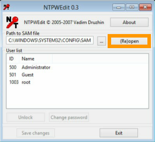

**Last updated 6th June 2018**

## Objective
When you install or reinstall a Windows operating system, you are given an admin access password. We strongly recommend that you change it, as detailed in our guide to [securing a Dedicated Server](https://docs.ovh.com/gb/en/dedicated/securing-a-dedicated-server/). You may also find that you have lost this password, and need to change it.

**This guide will take you through the process of changing your server's admin password.**

## Requirements

* a [Dedicated Server](https://www.ovh.co.uk/dedicated_servers/){.external} with Windows installed
* access to the [OVH Control Panel](https://www.ovh.com/auth/?action=gotomanager){.external}

## Instructions

First, boot your server into [rescue mode](https://docs.ovh.com/gb/en/dedicated/rescue_mode/){.external} using the WinRescue boot environment. Once the server has rebooted, select the `IPMI`{.action} tab on your server's page in your [OVH Control Panel](https://www.ovh.com/auth/?action=gotomanager){.external}.

> [!primary]
>
> For detailed information on how to use the IPMI feauture, please refer to our [IPMI guide](https://docs.ovh.com/gb/en/dedicated/use-ipmi-dedicated-servers/){.external}.
>

Next, activate the IPMI feature using either the Java applet or your browser. After the IPMI session has started, double-click the NTPWdi server tool on the WindRescue desktop.

{.thumbnail}

Next, click the `(Re)open`{.action} button to display a list of available user accounts.

{.thumbnail}

Now select the root user account from the list and click the `Change password`{.action} button.

{.thumbnail}

Finally, enter the new password twice and then click `OK`{.action}.

{.thumbnail}

Your password has now been changed. Exit the tool, close the IPMI session, and reboot your server back into normal mode.

## Go further

[Rescue mode](https://docs.ovh.com/gb/en/dedicated/rescue_mode/){.external}.

[Using the IPMI with dedicated servers](https://docs.ovh.com/gb/en/dedicated/use-ipmi-dedicated-servers/){.external}.

Join our community of users on <https://community.ovh.com/en/>.