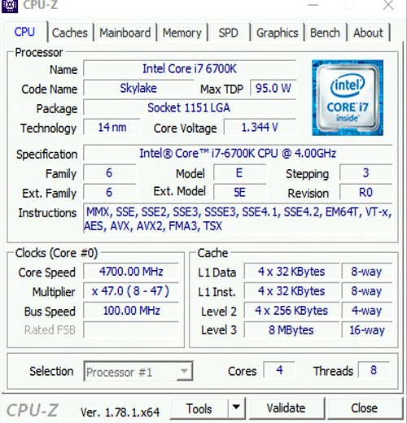
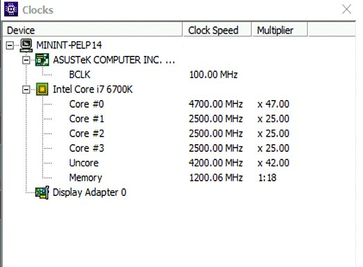
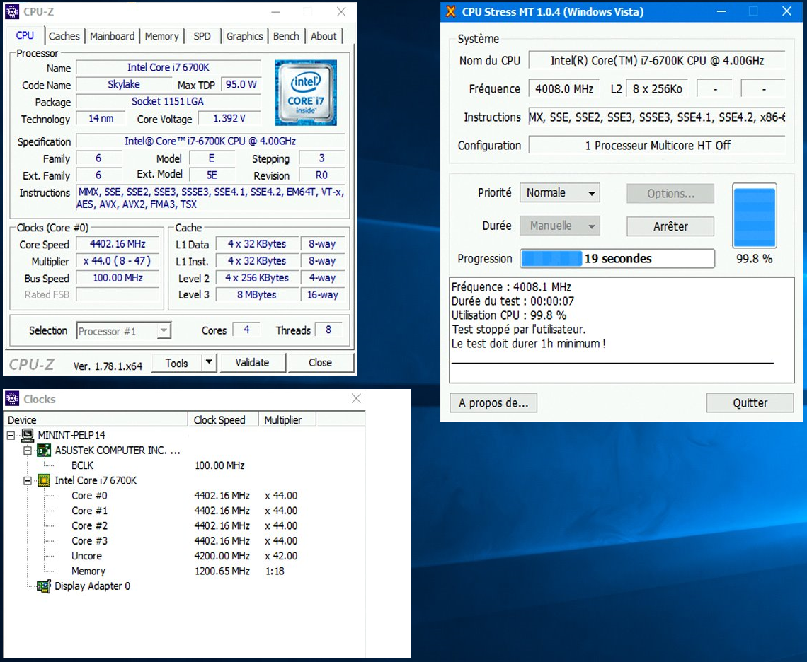

## Requirements
The MC-64 OC range has an i7-6700k processor that has its base frequency at 4Ghz, or 4.2Ghz in turbo.

We have tested this processor in order to increase performance and we have developed an overclock profile of this processor to 4.4Ghz in use on several core, or 4.7Ghz in turbo mode using only one core.

To perform the steps in this guide, you must :

- Have an MC-64 OC server.
- Have SSH access.
- Have Remote Desktop access (For Windows).

## Procedure

### Check the frequency from rescue mode
You can connect to your server in SSH with the rescue password you received by email.

In rescue mode, we can see the frequency in real time with this command :

  <pre class="highlight command-prompt"> root@rescue:~# watch -n 0 "lscpu | grep MHz" Every 0.1s: lscpu | grep MHz                                                  Sat Jan  7 20:36:21 2017 &nbsp; CPU MHz:               800.312 CPU max MHz:           4700.0000 CPU min MHz:           800.0000 </pre>

At rest, the processor reduces the frequency itself to reduce power consumption.

When we issue a `burnP6`{.action} on a single thread, it uses only one core and therefore we have the maximum CPU frequency.

  <pre class="highlight command-prompt"> root@rescue:~# burnP6 root@rescue:~# lscpu | grep MHz CPU MHz:               4671.562 CPU max MHz:           4700.0000 CPU min MHz:           800.0000 </pre>

The more we use thread, the more the frequency is degressive to the maximum of 4.4Ghz.

  <pre class="highlight command-prompt"> root@rescue:~# burnP6 & burnP6 & burnP6 & burnP6 [1] 19146 [2] 19147 [3] 19148 &nbsp; root@rescue:~# lscpu | grep MHz CPU MHz:               4400.625 CPU max MHz:           4700.0000 CPU min MHz:           800.0000 </pre>

### Check the frequency with a linux OS
Sometimes the distribution is too old and the lscpu command is not available.

In this case we have an alternative that is `i7z`{.action}.

You can install and run it as follows (This also works in rescue mode).

  <pre class="highlight command-prompt"> root@ns3054631:~# wget ftp://ftp.ovh.net/made-in-ovh/dedie/bench/i7z_64bit converted 'ftp://ftp.ovh.net/made-in-ovh/dedie/bench/i7z_64bit' (ANSI_X3.4-1968) -> 'ftp://ftp.ovh.net/made-in-ovh/dedie/bench/i7z_64bit' (UTF-8) --2017-01-14 12:20:09--  ftp://ftp.ovh.net/made-in-ovh/dedie/bench/i7z_64bit        => 'i7z_64bit' Resolving ftp.ovh.net (ftp.ovh.net)... 213.186.33.9 Connecting to ftp.ovh.net (ftp.ovh.net)|213.186.33.9|:21... connected. Logging in as anonymous ... Logged in! ==> SYST ... done.    ==> PWD ... done. ==> TYPE I ... done.  ==> CWD (1) /made-in-ovh/dedie/bench ... done. ==> SIZE i7z_64bit ... 1053813 ==> PASV ... done.    ==> RETR i7z_64bit ... done. Length: 1053813 (1.0M) (unauthoritative) &nbsp; i7z_64bit                 100%[=====================================>]   1.00M  --.-KB/s   in 0.08s &nbsp; 2017-01-14 12:20:09 (12.0 MB/s) - 'i7z_64bit' saved [1053813] &nbsp; root@ns3054631:~# chmod +x i7z_64bit root@ns3054631:~# ./i7z_64bit </pre>

You will then have a display of this type.

  <pre class="highlight command-prompt"> Cpu speed from cpuinfo 4007.00Mhz cpuinfo might be wrong if cpufreq is enabled. To guess correctly try estimating via tsc Linux's inbuilt cpu_khz code emulated now True Frequency (without accounting Turbo) 4007 MHz CPU Multiplier 40x || Bus clock frequency (BCLK) 100.18 MHz &nbsp; Socket [0] - [physical cores=4, logical cores=8, max online cores ever=4] TURBO ENABLED on 4 Cores, Hyper Threading ON True Frequency 4107.18 MHz (100.18 x [41]) Max TURBO Multiplier (if Enabled) with 1/2/3/4 Cores is  47x/46x/45x/44x Current Frequency 800.65 MHz [100.18 x 7.99] (Max of below)        Core [core-id]  :Actual Freq (Mult.)      C0%   Halt(C1)%  C3 %   C6 %  Temp        Core 1 [0]:       799.57 (7.98x)           1     100       0       0    22        Core 2 [1]:       799.74 (7.98x)           1      99       0       1    23        Core 3 [2]:       799.83 (7.98x)           1     100       0       0    24        Core 4 [3]:       800.65 (7.99x)           1     100       0       0    21 &nbsp; &nbsp; &nbsp; C0 = Processor running without halting C1 = Processor running with halts (States >C0 are power saver) C3 = Cores running with PLL turned off and core cache turned off C6 = Everything in C3 + core state saved to last level cache   Above values in table are in percentage over the last 1 sec [core-id] refers to core-id number in /proc/cpuinfo 'Garbage Values' message printed when garbage values are read   Ctrl+C to exit </pre>

It should be noted, however, that the frequencies shown on the **CPU speed from cpuinfo** line and the **True Frequency** line are not the actual frequencies of the processor. The only values that count are those shown on **Core**.

### Check the frequency with Windows OS and WinPE mode
You can also check the frequency of the server in WinPE mode.

To do this, you must install a tier software because Windows can not read the actual native processor speeds.

Go to the [official CPU-Z website](http://www.cpuid.com/softwares/cpu-z.html){.external} to download this software, and install it.

We will then have a window showing the real frequencies of the processor :

> [!primary]
>
> To display the clocks window, go to Tools **, then click **clocks.
> 

{.thumbnail}

{.thumbnail}

You will notice that the speed limits to 4.7Ghz when using a single core.

For the rest of the test in Windows, we used the [CPU stress MT](http://www.octeam.fr/remository/utilitaires-cpu/cpu-stress-mt.html){.external}.

Once installed, to launch a bench, just click on the button `Start`{.action} without modifying the configurations.

If we run a bench of the processor, we will then have the speed of 4.4Ghz.

{.thumbnail}