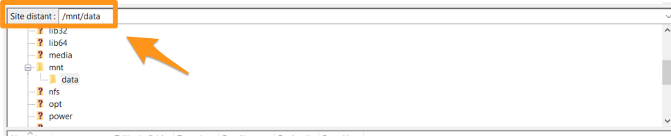

## Introduction

As part of a migration process, you may find that you need to retrieve data stored on a dedicated server, and move it onto another server. There are different ways of doing this, but SFTP (Secure File Transfer Protocol) is best for transferring files quickly and simply via a secure SSH connection.

**This tutorial will show you how to move and retrieve data on a dedicated server via SFTP.**

> [!warning]
>
This tutorial will show you how to use one or more OVH solutions with external tools, and the changes you need to make in specific contexts. You may need to adapt the instructions according to your situation. If you experience any difficulties carrying out these operations, please get in touch with a specialist service provider, and/or discuss your issues with our community on <https://community.ovh.com/en/>. OVH cannot assist you in this regard.
>

## Requirements

### What you need to know

*     knowledge of Linux administration
*     SSH access
*     a distribution installed (this tutorial is based on Debian 9.4)

### What you need to have

*     at least one OVH dedicated server
*     a software program that supports SFTP (this tutorial uses [FileZilla](https://filezilla-project.org/))

## Instructions

### Step 1: Retrieve your data.

By default, a server installed on a Linux system will have SSH access via port 22.

SFTP can be used to transfer files via a secure SSH connection. We will look at how to use this protocol in two situations: when you have access to your server, and when your server is in rescue mode.

#### When you have access to your server

In FileZilla, enter your IP address into the ‘Host’ field. Then enter your root user ID and password. For the port, enter ‘22’, or whichever port your SSH service is using if you have modified it.

The connection has now been established, and your tree-view will be visible in the ‘Remote Site’ section.

You can drag and drop the data you want to retrieve from the right-hand window (`Remote Site`) to the left-hand one (`Local Site`) to save it on your personal computer. In our situation, the data is stored in the file ‘/home/data’, which is visible in the window on the right-hand side (`Remote Server`).

The progress of the transfer is then displayed at the bottom of the FileZilla window:

#### When your server is in rescue mode 

In rescue mode, you first need to mount your partition. To do this, you can follow the instructions set out in [this guide](../ovh-rescue/).

Once you have mounted your partition, log in to your software again (FileZilla, in this case) on port 22.

> [!primary]
>
> The credentials you need to use are sent to you via email when you put your server into rescue mode.
>

If you have correctly created the mount point, the data will be visible in the ‘/mnt’ directory (i.e. ‘/mnt/data’ in our example).

 

### Step 2: Move your data onto the server.

Here, the login method is identical — you need to use an SFTP connection via port 22 with your root user ID, following the instructions detailed above.

Once you have connected to the server you want to move your data onto, you can drag and drop it again. However, this time you drag and drop from the left-hand window (`Local Site`) to the right-hand one (`Remote Site`), to transfer the data from your personal computer to your server.

## Conclusion

Now you know how to move and retrieve data on a dedicated server via SFTP.

To go further, you can join our community of users on <https://community.ovh.com/en/>.