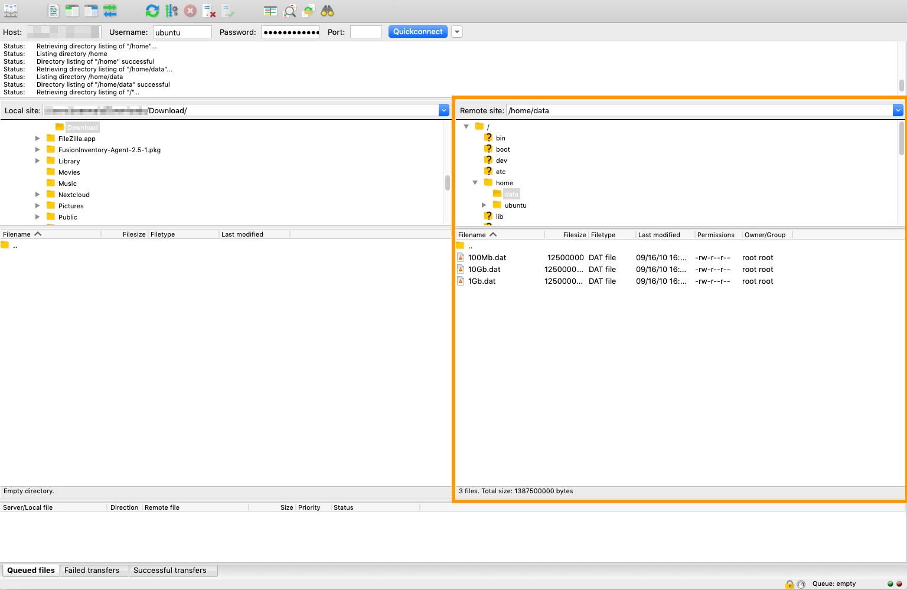

**Last updated 18th May 2021**

## Objective

As part of a migration process, you may find that you need to retrieve data stored on a dedicated server, and move it onto another server. There are different ways of doing this, but SFTP (Secure File Transfer Protocol) is best for transferring files quickly and simply via a secure SSH connection.

**This tutorial will show you how to move and retrieve data on a dedicated server via SFTP.**

> [!warning]
>This guide will show you how to use one or more OVHcloud solutions with external tools, and will describe the actions to be carried out in a specific context. Please remember to adapt these actions to fit your situation.
>
>If you encounter any difficulties performing these actions, please contact a [specialist service provider](https://partner.ovhcloud.com/en/directory/) and/or discuss the issue with our community on https://community.ovh.com/en/. OVHcloud cannot provide you with technical support in this regard.
>

## Requirements

- A [dedicated server](https://www.ovhcloud.com/en/bare-metal/) with a GNU/Linux distribution installed
- An FTP client that supports SFTP connections (this tutorial uses [FileZilla](https://filezilla-project.org/))
- Administrative access via SSH to your server

## Instructions

### Using FileZilla to retrieve and upload your data

SFTP can be used to transfer files via a secure connection (SSH). There are two possibilities for this scenario: either you have normal access to your server or you connect to it in [rescue mode](../rescue-mode/).

By default, a server using a GNU/Linux-based operating system will have SSH access via port 22. However, you might have previously changed this port (for example by following [our guide](../securing-a-dedicated-server/)).

#### **If you have access to your server**

In the FileZilla GUI, enter your server's IP address into the `Host` field and your username and password into their respective fields. As for the `Port` field, enter "22" or whichever port your SSH service is listening on if you have modified it.

As soon as the connection is established, you will see a tree-view of your files in the `Remote Site` section.

{.thumbnail}

In our example, the data to be retrieved is located in the folder "/home/data". You can drag and drop the files you want to download from the right-hand pane (`Remote Site`) to the left-hand one (`Local Site`) to save it on your local device.

To upload files to the server, drag and drop your files from your local folder to the remote destination folder in the right-hand pane.

The progress of the data transfer will then be displayed at the bottom of the FileZilla window.

{.thumbnail}

#### **If your server is in rescue mode**

In rescue mode, you first need to mount your partition. To do this, you can follow the instructions set out in [this guide](../rescue-mode/).

Once you have mounted your partition, use the FileZilla client in the same way as described above, using port 22 for the connection to your server.

> [!primary]
>
> The login credentials you need to use are sent to you via email when you put your server into rescue mode.
>

If you have created the mount point according to the guide, the data will be located in the "/mnt" directory (i.e. "/mnt/home/data" in this example).

{.thumbnail}

## Go further

[Activating and using rescue mode](../rescue-mode/)

[Securing a dedicated server](../securing-a-dedicated-server/)

Join our community of users on <https://community.ovh.com/en/>.