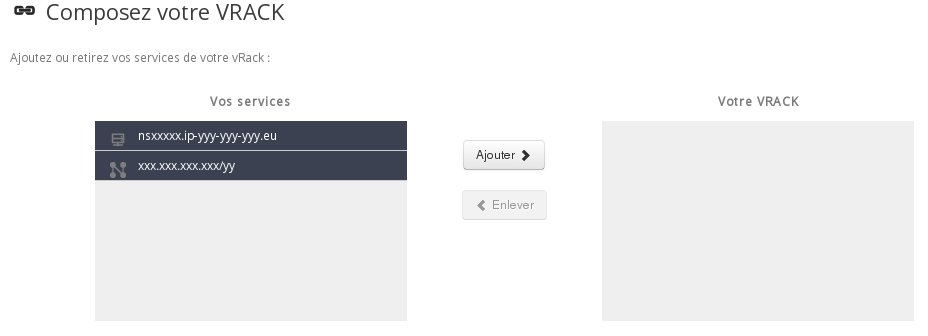
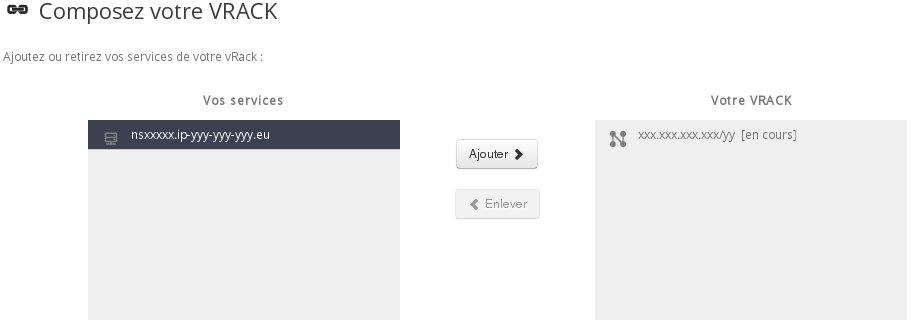
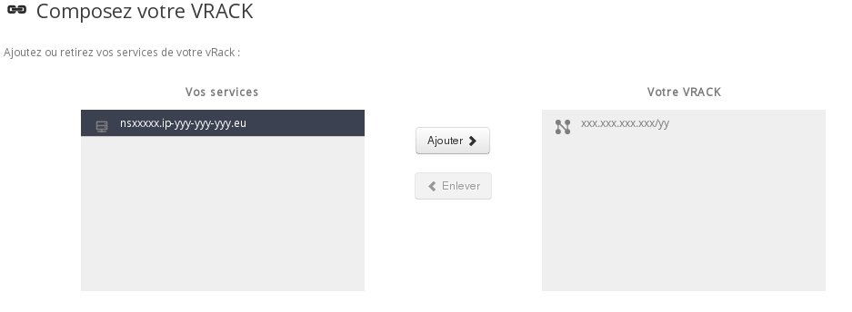

## Ajouter un bloc IP au vRack

Pour ajouter un bloc IP dans un vRack via le manager, il faut :

-  se rendre dans l'espace client : <https://www.ovh.com/manager/dedicated/login/> ;
-  cliquer sur la section **Réseaux** dans le menu de gauche ;
-  cliquer sur le vRack créé (pn-XXX ou le nom que vous avez donné) : 

{.thumbnail}

-  sélectionner le bloc IP dans l'encadré de gauche puis cliquer sur `Ajouter`{.action} :

{.thumbnail}

-  cliquer sur le triangle jaune pour définir la zone du bloc ;
-  sélectionner la zone où sera annoncé le bloc IP.

## Enlever un bloc IP du vRack

Pour enlever un bloc IP d'un vRack via le manager, il faut :

- se rendre dans [l'espace client OVH](https://www.ovh.com/auth/?action=gotomanager) ;
- cliquer sur la section `Réseaux`{.action} dans le menu de gauche ;
- cliquer sur le vRack créé (pn-XXX ou le nom que vous avez donné) :

{.thumbnail}

- sélectionner le bloc IP dans l'encadré de droite puis cliquer sur `Enlever`{.action} :

{.thumbnail}
