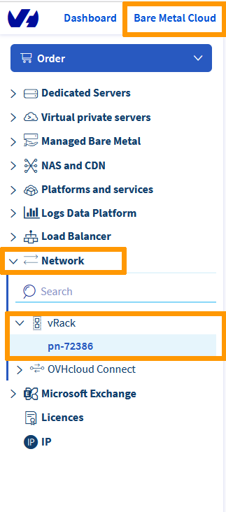

**Last updated 15/10/2021**

## Objective

The [vRack](https://www.ovh.com/ca/en/solutions/vrack/){.external} allows you to configure private network addressing between two or more OVHcloud [Dedicated Servers](https://www.ovhcloud.com/en-ca/bare-metal/){.external}. But it also allows you to add [Public Cloud instances](https://www.ovh.com/ca/en/public-cloud/instances/){.external} to your private network so that you can create an infrastructure of both physical and virtual resources.

**This guide will show you how to configure private networking between a [Public Cloud instance](https://www.ovh.com/ca/en/public-cloud/instances/){.external} and a [Dedicated Server](https://www.ovhcloud.com/en-ca/bare-metal/){.external}.**

## Requirements

* an [OVHcloud Public Cloud instance](https://docs.ovh.com/ca/en/public-cloud/public-cloud-first-steps/)
* a [vRack](https://www.ovh.com/ca/en/solutions/vrack/){.external} service activated in your account
* a vRack-compatible [Dedicated Server](https://www.ovhcloud.com/en-ca/bare-metal/){.external}
* access to your [OVHcloud Control Panel](https://ca.ovh.com/auth/?action=gotomanager&from=https://www.ovh.com/ca/en/&ovhSubsidiary=ca){.external}
* your chosen private IP address range

## Instructions

### Add a Public Cloud project to the vRack

Once your [Public Cloud project](https://docs.ovh.com/ca/en/public-cloud/create_a_public_cloud_project) is set up, you will need to add it to the vrack. This can be done in two ways:

1. By ordering a vRack service if you do not have one yet. This service is free of charge. 

Go to `Bare Metal Cloud`{.action} menu and click the `Order`{.action} button. Under the Order menu, click on the `vRack`{.action} button.

{.thumbnail}

You will be redirected to an order page, validate the order and wait for the vRack to be setup in your account. This will take a few minutes.

Once done, the new vRack service will be visible by going to `Bare Metal Cloud`{.action} > `Network`{.action} > `vRack`{.action}.

{.thumbnail}

2. By [creating or adding an existing vRack service](https://docs.ovh.com/ca/en/public-cloud/public-cloud-vrack/#instructions_1) in the `Public Cloud`{.action} section.

### Add an Instance to the vRack 

Two situations may arise:

- The instance does not exist yet.
- The instance already exists and you must add it to the vRack.

#### In case of a new instance

If you need assistance, follow this guide first: [Creating your first Public Cloud instance](../public-cloud-first-steps/#step-3-creating-an-instance). When creating an instance, you can specify, in Step 4, a private network to integrate your instance into. Choose your previously created vRack from the drop-down menu.

#### In case of an existing instance

You can attach an existing instance to a private network. Please refer to [this section](https://docs.ovh.com/ca/en/public-cloud/public-cloud-vrack/#cases-of-an-already-existing-instance_2) of the corresponding guide.

### Create a VLAN ID

For both services to communicate with each other, they should be tagged with the same **VLAN ID**. 

#### Using the default VLAN ID

By default, the VLAN ID for dedicated servers is **0**. If you wish to use this VLAN ID, it will be necessary to tag the private network linked to your instance with the same VLAN ID **0**. To do this, do not check the `Set VLAN` box when adding a private network to your instance.

See the following guide for more information: [Create a vlan in the vrack](https://docs.ovh.com/ca/en/public-cloud/public-cloud-vrack/#step-2-create-a-vlan-in-the-vrack_1)

> [!primary]
> For Public Cloud, only one private network can be tagged with the VLAN ID 0.
>

#### Using a different VLAN ID

If you decide to use a different VLAN ID:

- In the network configuration file on the dedicated server, the private network interface should be tagged with this ID.
- The private network linked to the Public Cloud instance should be tagged with this ID.

> [!primary]
> 
> Unlike dedicated servers, there is no need to tag a VLAN directly on a Public Cloud instance.
>

An example: If your instance private network is tagged with VLAN ID 2, the private network interface on your dedicated server should be tagged with this same ID. For more information see the following guide: [Create multiple VLANs in the vRack](https://docs.ovh.com/ca/en/dedicated/multiple-vlans/).

### Configure your network interfaces

Next, configure the the network interfaces on your new [Public Cloud instance](https://www.ovh.com/ca/en/public-cloud/instances/){.external} and [Dedicated Server](https://www.ovhcloud.com/en-ca/bare-metal/){.external} using this guide: [Configuring the vRack on your Dedicated Servers](../configuring-vrack-on-dedicated-servers/){.external}. Taking into account the VLAN ID.

## Go further

Join our community of users on <https://community.ovh.com/en/>.