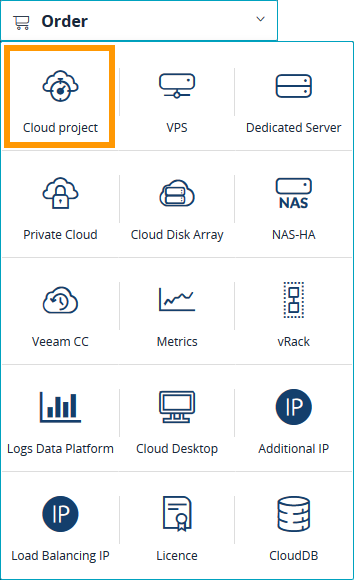
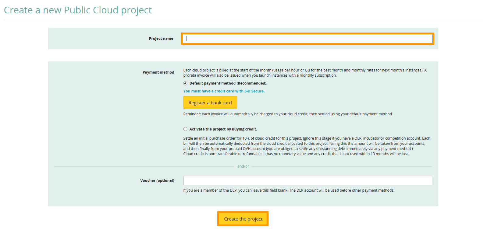

**Last updated 18th June 2018**

## Objective

The [vRack](https://www.ovh.co.uk/solutions/vrack/){.external} allows you to configure private network addressing between two or more OVH [Dedicated Servers](https://www.ovh.co.uk/dedicated_servers/){.external}. But it also allows you to add [Public Cloud instances](https://www.ovh.co.uk/public-cloud/instances/){.external} to your private network so that you can create an infrastructure of both physical and virtual resources.

**This guide will show you how to configure private networking between a [Public Cloud instance](https://www.ovh.co.uk/public-cloud/instances/){.external} and a [Dedicated Server](https://www.ovh.co.uk/dedicated_servers/){.external}.**

## Requirements

* a [vRack](https://www.ovh.co.uk/solutions/vrack/){.external} service activated in your account
* a vRack-compatible [Dedicated Server](https://www.ovh.co.uk/dedicated_servers/){.external}
* access to your [OVH Control Panel](https://www.ovh.com/auth/?action=gotomanager){.external}
* your chosen private IP address range

## Instructions

### Create a Public Cloud project

Log in to your [OVH Control Panel](https://www.ovh.com/auth/?action=gotomanager){.external}.

Click on the `Cloud`{.action} menu and then click the `Order`{.action} button.

{.thumbnail}

Under the **Order** menu, click on the `Cloud project`{.action} button.

{.thumbnail}

Give your project a name, choose a payment method, and then click the `Create the project`{.action} button.

{.thumbnail}

Once your project is set up, you need to enable private networks. Click the `Enable private networks`{.action} button on the project page.

{.thumbnail}

Next, select the `Existing`{.action} option and then choose your existing vRack from the dropdown list.

{.thumbnail}

### Create a Public Cloud instance

On your project page, click the `Actions`{.action} button.

{.thumbnail}

From the dropdown list, click the `Add a server`{.action} option.

{.thumbnail}

Click the `Advanced options`{.action} button.

{.thumbnail}

Next, click the dropdown list under **Link to the private network:** and select your vRack. Then click `Continue`{.action} to return to the previous screen.

{.thumbnail}

Finally, choose your installation options and then click the `Launch now`{.action} button. For detailed information on the various options, please refer to this guide: [Create an instance in your OVH customer account](https://docs.ovh.com/gb/en/public-cloud/create_an_instance_in_your_ovh_customer_account/){.external}.

{.thumbnail}

### Configure your network interfaces

Next, configure the the network interfaces on your new [Public Cloud instance](https://www.ovh.co.uk/public-cloud/instances/){.external} and [Dedicated Server](https://www.ovh.co.uk/dedicated_servers/){.external} using this guide: [Configuring the vRack on your Dedicated Servers](https://docs.ovh.com/gb/en/dedicated/configuring-vrack-on-dedicated-servers/){.external}.

## Go further

Join our community of users on <https://community.ovh.com/en/>.