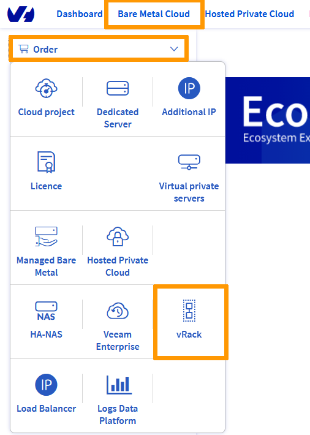

**Dernière mise à jour le 21/10/2021**

## Objectif

Le [vRack](https://www.ovh.com/ca/fr/solutions/vrack/) OVHcloud est un réseau privé qui vous permet de configurer l'adressage entre deux ou plusieurs [Serveurs dédiés](https://www.ovh.com/ca/fr/serveurs_dedies/) OVHcloud. Mais il vous permet également d'ajouter des [instances Public Cloud](https://www.ovh.com/ca/fr/public-cloud/instances/) à votre réseau privé afin de créer une infrastructure de ressources physiques et virtuelles.

**Ce guide vous montre comment configurer le réseau privé entre une [instance Public Cloud](https://docs.ovh.com/ca/fr/public-cloud/premiers-pas-instance-public-cloud/#etape-3-creer-une-instance) et un [Serveur dédié](https://www.ovh.com/ca/fr/serveurs_dedies/).**

## Prérequis

* Avoir créé une [instance Public Cloud OVHcloud](https://docs.ovh.com/ca/fr/public-cloud/premiers-pas-instance-public-cloud/)
* Avoir activé un service [vRack](https://www.ovh.com/ca/fr/solutions/vrack)
* Posséder un [serveur dédié](https://www.ovh.com/ca/fr/serveurs_dedies/) compatible avec le vRack
* Être connecté à l'[espace client OVHcloud](https://ca.ovh.com/auth/?action=gotomanager&from=https://www.ovh.com/ca/fr/&ovhSubsidiary=qc)
* Une plage d'adresses IP privées de votre choix

> [!warning]
> Cette fonctionnalité peut être indisponible ou limitée sur les [serveurs dédiés **Eco**](https://eco.ovhcloud.com/fr-ca/about/).
>
> Consultez notre [comparatif](https://eco.ovhcloud.com/fr-ca/compare/) pour plus d’informations.

## En pratique

### Ajouter un projet Public Cloud au vRack

Une fois votre [projet Public Cloud](https://docs.ovh.com/ca/fr/public-cloud/creer-un-projet-public-cloud/) configuré, il est nécessaire de l’ajouter au vRack. Cela peut se faire de deux manières :

1. En commandant un service vRack si vous n’en avez pas un, ce produit est gratuit et la mise à disposition ne prend que quelques minutes.

Allez dans le menu `Bare Metal Cloud`{.action} et cliquez sur le bouton `Commander`{.action}. Sous ce menu, cliquez sur l'option `vRack`{.action}.

{.thumbnail}

Vous serez redirigé vers une autre page pour valider la commande, l'opération prendra quelques minutes.

Une fois le service vRack livré sur votre compte, vous pouvez à présent y ajouter votre projet.

Cliquez sur le menu `Bare Metal Cloud`{.action}, puis sur `Network`{.action}, et ensuite sur `vRack`{.action}. Sélectionnez votre vRack dans la liste.

Dans la liste des services éligibles, sélectionnez le projet que vous souhaitez ajouter au vRack, puis cliquez sur le bouton `Ajouter`{.action}.

{.thumbnail}

<ol start="2">
  <li>En <a href="https://docs.ovh.com/ca/fr/public-cloud/public-cloud-vrack/#etape-1-activer-et-gerer-un-vrack">créant ou en ajoutant un service vRack existant</a> dans la section Public Cloud.</li>
</ol>

### Intégrer une instance dans le vRack

Deux situations peuvent se présenter à vous :

- L'instance n'existe pas encore.
- L’instance existe déjà et vous devez l’ajouter au vRack.

#### Cas d’une nouvelle instance

Si vous avez besoin d’aide, consultez le guide [Créer une instance Public Cloud](https://docs.ovh.com/ca/fr/public-cloud/premiers-pas-instance-public-cloud/#etape-3-creer-une-instance){.external}. Lors de la création d’une instance, vous pourrez spécifier, durant l’étape 4, un réseau privé dans lequel intégrer votre instance. Choisissez alors, dans le menu déroulant présenté, votre vRack précédemment créé.

#### Cas d’une instance déjà existante

Vous pouvez associer une instance existante à un réseau privé. Pour plus d'informations, vous pouvez consulter [cette section du guide correspondant](https://docs.ovh.com/ca/fr/public-cloud/public-cloud-vrack/#cas-dune-instance-deja-existante_2).

### Créer un VLAN ID

Pour que les deux services puissent communiquer entre eux, ils doivent être « taggués » avec le même **VLAN ID**. 

#### Utilisation du VLAN ID par défaut

Sur les serveurs dédiés, par défaut, vous êtes sur le VLAN **0**. Si vous souhaitez utiliser cet ID, il sera nécessaire de « tagguer » le réseau privé lié à votre instance avec le VLAN **0**. Pour cela, ne cochez pas la case `Définir un ID de VLAN` lors de l'ajout d'un réseau privé à votre instance.

Pour plus d’informations, consultez [cette section du guide correspondant](https://docs.ovh.com/ca/fr/public-cloud/public-cloud-vrack/#etape-2-creer-un-vlan-dans-le-vrack_1).

> [!primary]
> Sur le Public Cloud, vous définissez un VLAN ID unique par réseau privé.
>
> Vous ne pouvez pas définir le même VLAN ID sur deux réseaux privés différents.

#### Utilisation d'un VLAN ID différent

Si vous décidez d'utiliser un VLAN ID différent :

- Le réseau privé associé à l'instance Public Cloud doit être « taggué » avec cet ID.
- Dans le fichier de configuration réseau du serveur dédié, l'interface réseau privée doit être « tagguée » avec cet ID.

> [!primary]
> 
> Contrairement aux serveurs dédiés, il n’est pas nécessaire de « tagguer » le VLAN directement sur une instance Public Cloud.
>

Par exemple : si vous avez défini le réseau privé lié à votre instance avec VLAN 2, l'interface réseau privée de votre serveur dédié doit être « tagguée » avec VLAN 2. Pour plus d'informations consultez le guide suivant : [Créer plusieurs VLAN dans le vRack](https://docs.ovh.com/ca/fr/dedicated/creer-vlan-vrack/).

### Configurer vos interfaces réseau

Configurez ensuite les interfaces réseau sur votre nouvelle instance Public Cloud et votre serveur dédié à l'aide de ce guide : [Configurer plusieurs serveurs dédiés dans le vRack](../configurer-plusieurs-serveurs-dedies-dans-le-vrack/){.external}.

## Aller plus loin

Échangez avec notre communauté d'utilisateurs sur <https://community.ovh.com/>.