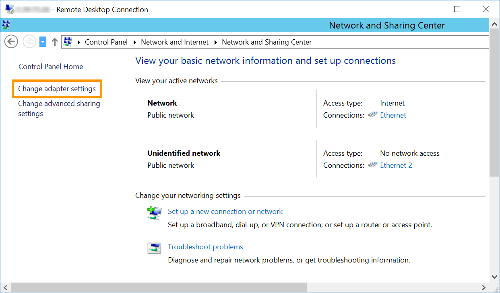
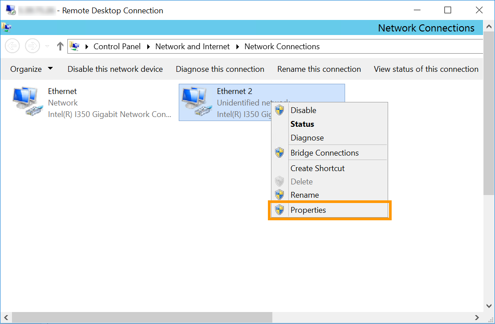

**Última actualización: 25/10/2018**

## Objetivo

La [configuración estándar del vRack](https://docs.ovh.com/es/dedicated/configurar-vrack-en-servidor-dedicado/){.external} solo le permite crear una VLAN. Esto significa que solo es posible utilizar cada IP una única vez. Sin embargo, la versión 2.0 del vRack permite crear hasta 4000 redes locales virtuales en un mismo vRack, de forma que cada IP puede utilizarse hasta 4000 veces.

**Esta guía explica cómo crear varias VLAN en el vRack.**


## Requisitos

- Tener uno o más [servidores dedicados](https://www.ovh.es/servidores_dedicados/){.external} compatibles con el vRack.
- Haber activado el servicio [vRack](https://www.ovh.es/soluciones/vrack/){.external}.
- Tener acceso al rango de direcciones IP privadas elegido.
- Estar conectado por SSH con el usuario root (Linux).
- Estar conectado con la cuenta de administrador (Windows).
- Haber terminado de [configurar el vRack](https://docs.ovh.com/es/dedicated/configurar-vrack-en-servidor-dedicado/){.external}.


## Procedimiento

### En Linux

> [!primary]
>
> En este ejemplo utilizaremos **eth1** como interfaz de red, **10** como etiqueta VLAN y **192.168.0.0/16** como rango de direcciones IP. 
>
> No olvide adaptar todos los comandos en función de la distribución que utilice. En caso de duda, consulte la documentación oficial de su distribución.
>

En primer lugar, instale el paquete **vlan** en el servidor. Para ello, ejecute el siguiente comando:

```sh
sudo apt-get install vlan
```

Le recomendamos que cree una etiqueta VLAN, que le permitirá diferenciar las distintas VLAN.

```sh
vconfig add eth1 10

Added VLAN with VID == 10 to IF -:eth1:-
```

A continuación, es necesario declarar el rango de direcciones IP en el vRack y etiquetarlo con su identificador. Para ello, ejecute el siguiente comando:

```sh
ip addr add 192.168.0.0/16 dev eth1.10
```

Por último, modifique la configuración de la interfaz de red para que reconozca la etiqueta de la VLAN. Para ello, abra el archivo de configuración de la interfaz de red y edítelo añadiendo lo que se indica a continuación:

```sh
sudo nano /etc/network/interfaces

auto eth1.10
iface eth1 inet static
address 192.168.0.50
netmask 255.255.0.0
broadcast 192.168.255.255
```

### En Windows

Conéctese al servidor mediante el escritorio remoto y abra la aplicación **Administrador del servidor**. Haga clic en `Servidor local`{.action} del menú izquierdo. En el panel **Propiedades**, haga clic en el enlace `Deshabilitado`{.action} situado junto a **Formación de equipos de NIC**.

{.thumbnail}

Para crear un nuevo equipo, seleccione una interfaz de red e introduzca el nombre del equipo en el campo **Nombre del equipo**. Haga clic en `Aceptar`{.action} para terminar.

{.thumbnail}

A continuación, es recomendable indicar la etiqueta de la VLAN. Para ello, en el panel **Adaptadores e interfaces** de la pantalla **Formación de equipos de NIC**, haga clic derecho en la interfaz que acaba de añadir al nuevo equipo y seleccione `Propiedades`{.action}. Después marque la opción `VLAN específica`{.action} e introduzca la etiqueta.

{.thumbnail}

Ahora hay que configurar la dirección IP de la VLAN. Para ello, abra la pantalla de inicio y haga clic en `Panel de control`{.action}.

{.thumbnail}

Haga clic en `Redes e Internet`{.action}.

{.thumbnail}

Haga clic en `Centro de redes y recursos compartidos`{.action}.

{.thumbnail}

Haga clic en `Cambiar configuración del adaptador`{.action}.

{.thumbnail}

A continuación, haga clic derecho en la interfaz VLAN y seleccione `Propiedades`{.action}.

{.thumbnail}

Haga doble clic en `Protocolo de Internet versión 4 (TCP/IPv4)`{.action}.

{.thumbnail}

Marque la opción `Usar la siguiente dirección IP`{.action}. En **Dirección IP**, introduzca una dirección IP de su rango interno. En **Máscara de subred** introduzca **255.255.0.0**.

{.thumbnail}

Por último, haga clic en `Aceptar`{.action} para guardar los cambios y reinicie el servidor.

## Más información

[Configurar varios servidores dedicados en el vRack](https://docs.ovh.com/es/dedicated/configurar-vrack-en-servidor-dedicado/){.external}

Interactúe con nuestra comunidad de usuarios en [ovh.es/community](https://www.ovh.es/community/){.external}.