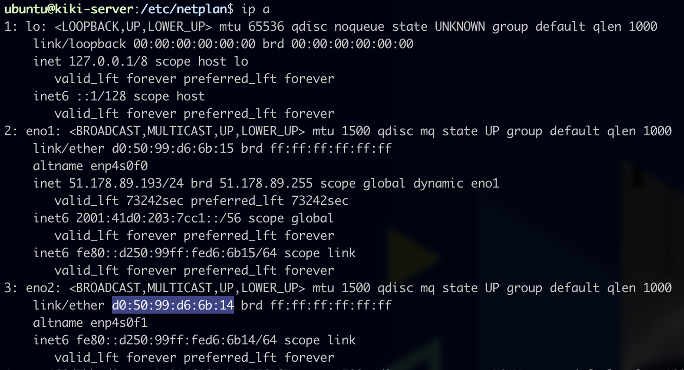
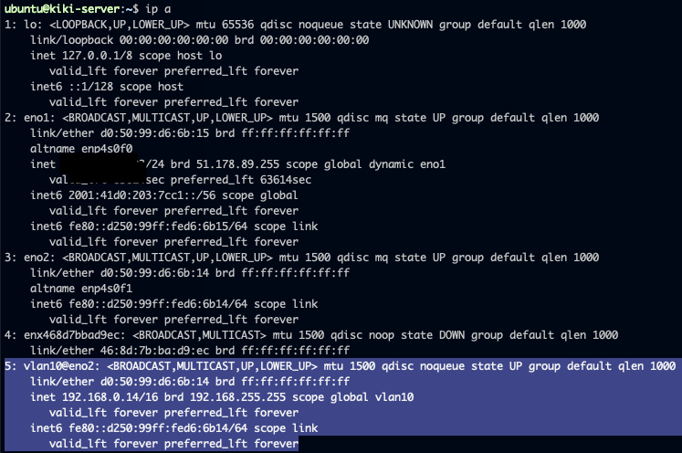

**Dernière mise à jour le 24/02/2022**

## Objectif

La [configuration standard du vRack](../configurer-plusieurs-serveurs-dedies-dans-le-vrack/){.external} vous permet de créer un seul VLAN. Cela signifie que vous ne pouvez utiliser chaque adresse IP qu'une seule fois. Cependant, avec la version 2.0 de la configuration du vRack, vous pouvez créer jusqu'à 4 000 réseaux locaux virtuels au sein d'un seul vRack. Cela signifie que vous pouvez utiliser chaque adresse IP jusqu'à 4 000 fois.

**Ce guide vous explique comment créer plusieurs VLAN dans le vRack.**

## Prérequis

- Posséder un ou plusieurs [serveurs dédiés](https://www.ovh.com/ca/fr/serveurs_dedies/){.external} compatibles avec le vRack.
- Avoir activé un service [vRack](https://www.ovh.com/ca/fr/solutions/vrack){.external}.
- Avoir accès à votre plage d'adresses IP privées choisie.
- Être connecté en SSH avec l'identifiant root (Linux).
- Être connecté avec le compte administrateur (Windows).
- Avoir finalisé la [configuration du vRack](../configurer-plusieurs-serveurs-dedies-dans-le-vrack/){.external}.

> [!warning]
> Cette fonctionnalité peut être indisponible ou limitée sur les [serveurs dédiés **Eco**](https://eco.ovhcloud.com/fr-ca/about/).
>
> Consultez notre [comparatif](https://eco.ovhcloud.com/fr-ca/compare/) pour plus d’informations.

## En pratique

### Sous Linux

> [!primary]
>
> À titre d'exemple, nous utiliserons `eth1` comme interface réseau, **10** comme étiquette VLAN, et **192.168.0.0/16** comme plage d'adresses IP. 
>
> Toutes les commandes sont à adapter en fonction de la distribution utilisée. N'hésitez pas à vous reporter à la documentation officielle de votre distribution en cas de doute.
>

#### Ubuntu 20 & 21 

Cet exemple est basé sur Ubuntu 21.10 (Impish Indri).

Installez le paquet « VLAN » sur votre serveur. Pour cela, utilisez la commande suivante :

```sh
sudo apt-get install vlan
```

Chargez le kernel module 8021q :

```sh
sudo su -c 'echo "8021q" >> /etc/modules'
```

Désactivez la configuration automatique du réseau pour eviter de perdre la configuration après le redémarrage du serveur.

Editez ou créez le fichier suivant :

```sh
sudo nano /etc/cloud/cloud.cfg.d/99-disable-network-config.cfg
```

Ajoutez la ligne suivante :
```sh
network: {config: disabled}
```

Récupérez l'adresse MAC de l'interface à configurer :

```sh
ip a
```

Ici l'interface qui nous intéresse est `eno2` avec l'adresse MAC `d0:50:99:d6:6b:14` :



Ajoutez la configuration réseau avec le tag du VLAN dans le fichier suivant :

```sh
sudo nano /etc/netplan/50-cloud-init.yaml
```

```yaml
network:
    version: 2
    ethernets:
        eno2:
            match:
                macaddress: d0:50:99:d6:6b:14
        eno1:
            ...
            ...
    vlans:
        vlan10:
            id: 10                      # VLAN ID    
            link: eno2                  # Interface name
            addresses:
            - 192.168.0.14/16
```

Enregistrez et fermez le fichier, puis exécutez les commandes suivantes :

```sh
sudo netplan try
sudo netplan apply
```

Validez la configuration avec la commande suivante :

```sh
ip a
```



#### Debian

Avant tout, il faut installer le paquet « VLAN » sur votre serveur. Pour cela, utilisez la commande suivante :

```sh
sudo apt-get install vlan
```

Il convient ensuite de créer un tag VLAN, le tag étant un identifiant qui vous permet de différencier plusieurs VLAN :

```sh
vconfig add eth1 10

Added vlan with VID == 10 to IF -:eth1:-
```

Après cela, il faut déclarer la plage d'adresses IP dans le vRack et l'étiqueter avec votre identifiant. Vous pouvez le faire avec la commande suivante :

```sh
ip addr add 192.168.0.0/16 dev eth1.10
```

Il est possible que l'interface soit coupée :

```sh
# ip  addr show dev eth1
7: eno2: <BROADCAST,MULTICAST,UP,LOWER_UP> mtu 1500 qdisc mq state DOWN group default qlen 1000
[...]
```

Pour l'allumer :

```sh
ip link set dev eth1 up
```

Pour finir, il reste à modifier la configuration de l'interface réseau afin qu'elle prenne en compte le tag du VLAN. Pour cette étape, ouvrez le fichier de configuration de l'interface réseau pour l'éditer et le modifier comme indiqué ci-dessous :

```sh
sudo /etc/network/interfaces

auto eth1.10
iface eth1.10 inet static
address 192.168.0.50
netmask 255.255.0.0
broadcast 192.168.255.255
```

### Sous Windows

Connectez-vous à votre serveur via le bureau à distance et ouvrez l'application « Server Manager ». Sélectionnez ensuite `Local Server`{.action}, puis cliquez sur le lien `Disabled`{.action} à côté de **NIC Teaming** :

{.thumbnail}

Après cela, créez une nouvelle équipe en sélectionnant une interface réseau et en tapant un nom d'équipe dans le champ **Team name**. Lorsque vous avez terminé, validez avec `OK`{.action} :

{.thumbnail}

Il convient ensuite de préciser le tag du VLAN. Dans le panneau « **Adapters and Interfaces** » de l’écran « **NIC Teaming** », faites un clic droit sur l’interface que vous venez d’ajouter à la nouvelle équipe, puis cliquez sur `Properties`{.action}. Cliquez maintenant sur `Specific VLAN`{.action}, et précisez le tag :

{.thumbnail}

Il faut maintenant configurer l’adresse IP du VLAN. Cliquez sur le bouton `Start`{.action} du menu de démarrage, puis sur `Control Panel`{.action} :

{.thumbnail}

Cliquez sur `Network and Internet`{.action} :

{.thumbnail}

Cliquez ensuite sur `Network and Sharing Center`{.action} :

{.thumbnail}

Cliquez alors sur `Modifier les paramètres de l’adaptateur`{.action} :

{.thumbnail}

Ensuite, faites un clic droit sur l’interface VLAN, puis cliquez sur `Properties`{.action} :

{.thumbnail}

Effectuez un double clic sur `Internet Protocol Version 4 (TCP/IP/IPv4)`{.action} :

{.thumbnail}

Dans l'étape suivante, cliquez sur `Use the following IP address`{.action}. Pour « **IP Address** », tapez une adresse IP de votre plage interne. Pour « **Subnet mask** », tapez « 255.255.0.0 ».

{.thumbnail}

Pour finir, cliquez sur le bouton `OK`{.action} pour sauvegarder les modifications et enfin redémarrez le serveur.

## Aller plus loin

[Configurer plusieurs serveurs dédiés dans le vRack](../configurer-plusieurs-serveurs-dedies-dans-le-vrack/){.external}

Échangez avec notre communauté d'utilisateurs sur <https://community.ovh.com/>.
