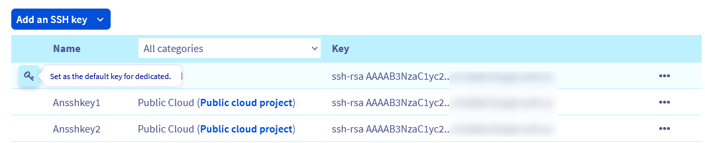

> [!primary]
> Esta traducción ha sido generada de forma automática por nuestro partner SYSTRAN. En algunos casos puede contener términos imprecisos, como en las etiquetas de los botones o los detalles técnicos. En caso de duda, le recomendamos que consulte la versión inglesa o francesa de la guía. Si quiere ayudarnos a mejorar esta traducción, por favor, utilice el botón «Contribuir» de esta página.
> 

## Objetivo

El uso del protocolo SSH abre un canal seguro en una red no segura en una arquitectura cliente-servidor, conectando un cliente SSH a un servidor SSH. La creación de un conjunto de claves SSH le permite obtener una clave pública y una clave privada. Puede colocar la clave pública en un servidor y conectarse a él con un cliente que tenga la clave privada correspondiente. Si las llaves SSH pública y privada coinciden, se conectará sin necesidad de una contraseña.

Este suele ser el método de conexión más seguro y práctico.

**Esta guía explica cómo configurar llaves SSH en su dispositivo local para proteger las conexiones a servidores remotos.**

## Requisitos

- Estar conectado a su [área de cliente de OVHcloud](https://www.ovh.com/auth/?action=gotomanager&from=https://www.ovh.com/es/&ovhSubsidiary=es)
- Tener un [servidor dedicado](https://www.ovhcloud.com/es-es/bare-metal/) o un [VPS](https://www.ovhcloud.com/es/vps/) en su cuenta de OVHcloud
- Instalar previamente una aplicación cliente SSH (línea de comandos o GUI)
- Tener acceso de administrador (root) por SSH

> [!primary]
> Esta guía no se aplica a las instalaciones estándar de Windows Server**, ya que se basan en el Protocolo de escritorio remoto (RDP) para las conexiones. Sin embargo, las conexiones SSH se utilizan para el modo de rescate de OVHcloud. Para más información, consulte la sección [Más información](#gofurther) de esta guía.
>

## Procedimiento

No olvide consultar nuestras guías Primeros pasos: <a name="getstarted"></a>

- para un [servidor dedicado](/pages/cloud/dedicated/getting-started-with-dedicated-server);
- para un [servidor dedicado de la gama Eco](/pages/cloud/dedicated/getting-started-with-dedicated-server-eco);
- para un [VPS](/pages/cloud/vps/starting_with_a_vps).

Para más información, consulte la guía de presentación del [protocolo SSH] (/pages/cloud/dedicated/ssh_introduction).

Las siguientes instrucciones cubren dos métodos de uso de llaves SSH:

- [Creación de un par de claves Open SSH y conexión a un servidor desde el cliente SSH en línea de comandos](#openssh)
- [Creación de un par de claves `PuTTY` y conexión a un servidor desde el cliente SSH `PuTTY`](#useputty)

Puede utilizar ambos métodos simultáneamente, pero tenga en cuenta que `PuTTY` conserva los archivos de clave en un formato específico, lo que los hace incompatibles con los archivos de clave SSH creados con el cliente Open SSH.

Esto significa que una clave privada creada con el cliente SSH en línea de comandos deberá ser [convertida al formato `PuTTY` y viceversa](https://www.chiark.greenend.org.uk/~sgtatham/putty/faq.html#faq-ssh2-keyfmt){.external}.

### Creación de un par de claves SSH en línea de comandos <a name="openssh"></a>

Abra la aplicación en línea de comandos (`Terminal`) desde un ordenador Mac o un dispositivo con un sistema operativo Linux.

Asegúrese de que tiene una carpeta denominada `.ssh` en el directorio `$HOME`. Si la carpeta no existe, créela:

```bash
mkdir ~/.ssh
```

En un sistema operativo Windows actual, abra el símbolo del sistema escribiendo 'cmd' en la barra de búsqueda (o abra `PowerShell` desde el menú).

Acceda al directorio `.ssh` de su usuario Windows activo (por defecto: `C:\Users\WindowsUsername.ssh`):

```powershell
cd .ssh
```

<a name="createnewkey"></a>
A continuación, utilice el siguiente comando para crear una clave RSA de 4096 bits:

```bash
ssh-keygen -b 4096
```

El uso de la opción `-t` con este comando permite especificar otro método de cifrado, por ejemplo:

```bash
ssh-keygen -t ed25519 -a 256
```

La línea de comandos le solicita que guarde la clave recién creada en el archivo estándar:

```console
Generating public/private rsa key pair.
Enter file in which to save the key (/home/user/.ssh/id_rsa):
```

Confirme con la tecla `Intro` para aceptar el nombre de archivo propuesto o escriba un nombre individual. Esto es pertinente si se colocan varios pares de claves en el directorio `.ssh`. Para más información, consulte la sección «[Gestión de varias llaves SSH en su dispositivo local](#multiplekeys)» de esta guía.<br>
En este ejemplo se utilizan los nombres de archivo estándar `id_rsa` y `id_rsa.pub`.

Puede proteger su llave SSH con una frase de contraseña (*passphrase*) en la siguiente operación. Se trata de un paso recomendado para una mayor seguridad.

> [!warning]
>
> El acceso remoto al servidor debe ser tan seguro como el dispositivo cliente que almacena la clave privada. La protección de su dispositivo y de sus archivos contra el acceso no autorizado es, por lo tanto, fundamental al utilizar llaves SSH.
> 
> Por comodidad y seguridad, no olvide utilizar un gestor de contraseñas en su dispositivo, como la solución open source `KeePass`.
> 

Todas las claves SSH deben almacenarse en el directorio `.ssh`. La extensión `.pub` se agregará a los nombres de los archivos de clave pública.

```console
Your identification has been saved in /home/user/.ssh/id_rsa.
Your public key has been saved in /home/user/.ssh/id_rsa.pub.
The key fingerprint is:
SHA256:MRk+Y0zCOoOkferhkTvMpcMsYspj212lK7sEauNap user@hostname
The key's randomart image is:
+---[RSA 4096]----+
|     .. o        |
|    . .= o       |
|   o o  X        |
|. . . .          |
|. .=.o .S.       |
| =o.o.  .   .    |
|o +   .  . o ..  |
|.. .  .   oEoo . |
|o.        .o+oo  |
+----[SHA256]-----+
```

<a name="publickey"></a>

Para ver y exportar su clave pública, utilice el comando `cat` en su archivo de claves `.pub`. Copie la cadena de clave completa en el Portapapeles para [añadirla al servidor](#addserverkey).


```bash
cat ~/.ssh/id_rsa.pub
ssh-rsa AAAAB3NzaC1yc2EAAAADAQABAAABAQC8teh2NJ42qYZV98gTNhumO1b6rMYIkAfRVazl
k6dSS3xf2MXJ4YHsDacdjtJ+evXCFBy/IWgdkFtcvsGAMZ2N1RdvhDyQYcy6NDaJCBYw1K6Gv5fJ
SHCiFXvMF0MRRUSMneYlidxUJg9eDvdygny4xOdC6c1JrPrSgOc2nQuKeMpOoOWLINIswg1IIFVk
kFMPrFivP8Z6tidzVpAtbr1sXmJGZazYWrU3FoK2a1sF1zEWrmlMOzX81zEWrmlMOzX8CpZW8Rae
i4ANmLy7NULWK36yU0Rp9bFJ4o0/4PTkZiDCsK0QyHhAJXdLN7ZHpfJtHIPCnexmwIMLfIhCWhO5
 user@hostname
```


> [!primary]
>
> En un terminal MacOS, puede utilizar los comandos `pbcopy` y `pbpaste` para gestionar las cadenas de teclas más rápidamente. Por ejemplo, utilice este comando para copiar la clave del archivo `id_rsa.pub` en el Portapapeles:
>
> `pbcopy < ~/.ssh/id_rsa.pub`
>

En un sistema operativo Windows, abra el archivo con la aplicación `Bloc de notas` desde el Explorador de archivos (haga clic derecho en el archivo y seleccione `Abrir con`) o utilice uno de los siguientes comandos (en `\Users\WindowsUsername\.ssh`):

```powershell
more id_rsa.pub
```

- `powershell`

```powershell
cat id_rsa.pub
```

Copie la cadena de clave completa en el Portapapeles para [añadirla al servidor](#addserverkey).

> [!primary]
>
> Uso del Portapapeles
>
> Cuando trabaje en línea de comandos en Windows, haga clic derecho para pegar el contenido del Portapapeles en la ventana de la línea de comandos. Para copiar* una cadena de la ventana de la línea de comandos, resáltela con el ratón y pulse la tecla « Intro ». También puede encontrar estas funciones haciendo clic derecho en la barra de menú.
>

### Crear un par de claves SSH con PuTTY <a name="useputty"></a>

[PuTTY](https://putty.org/){.external} es un cliente SSH de código abierto con interfaz gráfica de usuario, disponible para Windows y otros sistemas operativos. Proporciona un programa complementario para crear llaves SSH: `PuTTY Key Generator` (`PuTTYgen`).

> [!primary]
>
> El objetivo principal de `PuTTY` es gestionar las conexiones SSH de un periférico cliente Windows hacia un servidor GNU/Linux. `PuTTY` almacena los archivos de claves en un formato específico, lo que los hace incompatibles con los archivos de claves SSH creados con el cliente Open SSH incluidos de forma nativa en la mayoría de los sistemas operativos modernos.
>
> Si es necesario y como se ha explicado anteriormente en esta guía, las claves generadas en *línea de comandos* pueden ser [convertidas al formato `PPK`](https://www.chiark.greenend.org.uk/~sgtatham/putty/faq.html#faq-ssh2-keyfmt) para utilizarlas con el cliente `PuTTY`. Para un uso más práctico de las llaves SSH, elija una opción y acéptela (llaves privadas Open SSH o llaves privadas `PuTTY`).
>

Si aún no está instalado (consulte su lista de aplicaciones o utilice la función de búsqueda), descargue `PuTTY` desde [el sitio oficial](https://www.chiark.greenend.org.uk/~sgtatham/putty/latest.html){.external}. El paquete de instalación estándar recomendado ya contiene `PuTTYgen`, pero también está disponible como un archivo independiente en el sitio Web.

Abra `PuTTYgen` y seleccione uno de los algoritmos de cifrado admitidos. En este ejemplo se utiliza RSA. Introduzca 4096 como número de bits en la esquina inferior derecha y haga clic en el botón `Generate`{.action}.

{.thumbnail}

Mueva el cursor del ratón libremente por el área situada debajo de la barra de progreso:

{.thumbnail}

La clave está lista cuando la barra de progreso está llena.

{.thumbnail}

Copie la cadena de clave completa en el Portapapeles para [añadirla al servidor](#addserverkey) y, opcionalmente, para [importarla al área de cliente](#importkey). Guarde ambas claves como archivos haciendo clic en los botones correspondientes y, a continuación, escriba una frase de contraseña (*passphrase*) para protegerlas.

> [!warning]
>
> El acceso remoto al servidor debe ser tan seguro como el dispositivo cliente que almacena la clave privada. La protección de su dispositivo y de sus archivos contra el acceso no autorizado es, por lo tanto, fundamental al utilizar llaves SSH.
> 
> Por comodidad y seguridad, no olvide utilizar un gestor de contraseñas en su dispositivo, como la solución open source `KeePass`.
>

Una de las ventajas de utilizar `PuTTY` es la posibilidad de guardar diferentes conexiones en forma de "sesiones". Para más información, consulte la sección «[Gestión de varias llaves SSH en su dispositivo local](#puttykeys)».

Para más información sobre las conexiones SSH, consulte las guías de [primeros pasos](#getstarted) y nuestra introducción al [protocolo SSH](/pages/cloud/dedicated/ssh_introduction).

### Añadir llaves SSH a su servidor <a name="addserverkey"></a>

[Conéctese](/pages/cloud/dedicated/ssh_introduction) a su servidor y asegúrese de que se encuentra en el directorio `$HOME` de su usuario. Si aún no existe, cree la carpeta `.ssh`:

```bash
mkdir ~/.ssh
```

Para almacenar la clave para el usuario actual, abra (o cree) el archivo `authorized_keys` con su editor de texto preferido (`nano` se utiliza en este ejemplo):

```bash
nano ~/.ssh/authorized_keys
```

Pegue su [clave pública](#publickey) en este archivo. Guarde el archivo y salga del editor. Reinicie el servidor o reinicie únicamente el servicio OpenSSH con uno de los siguientes comandos (el comando adecuado puede variar en función del sistema operativo):

```bash
sudo systemctl restart ssh
```

```bash
sudo systemctl restart sshd
```

Para comprobar que la clave se ha configurado correctamente, conéctese al servidor con el siguiente comando. Sustituya «user» por el nombre de usuario para el que se crearon las claves y «IP_ADDRESS» por la dirección IP (o el nombre de host) del servidor al que desea acceder:

```bash
ssh user@IP_ADDRESS
```

Por ejemplo:
    
```bash
ssh ubuntu@169.254.10.250
```

#### Añadir claves públicas adicionales al servidor

Para añadir llaves SSH a otros usuarios que accedan al servidor, repita los pasos de creación de llaves, pero utilice la carpeta `$HOME` correspondiente o el directorio de Windows `Users` del usuario en cuestión para crear y almacenar las llaves SSH (o ejecutar los comandos en el dispositivo dedicado de esa persona). A continuación, añada la nueva clave pública al servidor en `authorized_keys`, como se ha descrito anteriormente.

#### Eliminación de las claves públicas del servidor

Abra el archivo `authorized_keys` (como [descrito anteriormente](#addserverkey)) y elimine la cadena de clave correspondiente al usuario al que se va a revocar el acceso.

Guarde el archivo y salga del editor.

### Gestión de varias llaves SSH en su dispositivo local <a name="multiplekeys"></a>

Puede utilizar varios pares de claves SSH para conectarse a diferentes hosts remotos. Si utiliza `PuTTY`, vaya a [la sección correspondiente](#puttykeys) a continuación.

Como todas las claves deben colocarse en la carpeta `.ssh` del dispositivo local, los nombres de archivo deben ser diferentes. Cuando [cree un nuevo par de claves](#createnewkey) y se le pida un nombre de archivo, escriba el nombre que desee. Por ejemplo, asígnele el nombre de su servidor.

```console
Generating public/private rsa key pair.
Enter file in which to save the key (/home/user/.ssh/id_rsa): KeyFileName_rsa

Your identification has been saved in /home/user/.ssh/KeyFileName_rsa.
Your public key has been saved in /home/user/.ssh/KeyFileName_rsa.pub.
```

Al conectarse al servidor correspondiente, especifique el nombre del archivo de clave, además de los detalles de usuario y servidor:

```bash
ssh -i ~/.ssh/KeyFileName user@IP_ADDRESS
```

Por ejemplo:

```bash
ssh -i ~/.ssh/myVPS_rsa ubuntu@169.254.10.250
```

Como se ha explicado en secciones anteriores, las mismas instrucciones funcionarán en un cliente Windows. Sustituya únicamente `~/` por la ruta de acceso de la carpeta de usuario Windows, por defecto `C:\Users\WindowsUsername\`. Por ejemplo: `ssh -i C:\Users\Username\.ssh/myVPS_rsa ubuntu@169.254.10.250`.

#### Uso del archivo config

La alternativa a añadir la opción `-i` cada vez consiste en modificar un archivo denominado `config` en la carpeta `~/.ssh` (`\Users\Username\.ssh` para Windows). Permite configurar los detalles de las distintas conexiones (nombre de usuario, puerto, archivo de clave, parámetros opcionales, etc.)

Si este archivo existe en `.ssh`, es probable que ya contenga información. En función de su entorno de trabajo, considere crear una copia de seguridad del original.

Ejemplo de contenido de carpeta `.ssh`:

```bash
ls ~/.ssh/
config    id_rsa    id_rsa.pub    known_hosts     known_hosts.old
```

El fichero de `config` permite almacenar varias conexiones SSH y sus parámetros individuales, además de los valores estándar. El aprovechamiento de todo el potencial de este archivo puede llegar a ser complejo, ya que resulta especialmente útil para usuarios experimentados que gestionan varios servidores de forma regular.

A continuación ofrecemos un ejemplo sencillo de cómo configurar una conexión SSH a un VPS.<br>
Abra el archivo y agregue las siguientes líneas en la parte superior:

```console
Host vps
    HostName 169.254.10.250
    IdentityFile ~/.ssh/myVPS_rsa
```

A continuación, podrá conectarse al VPS con el nombre de alias que haya definido como `Host`:

```bash
ssh ubuntu@vps
```

En el ejemplo anterior sólo se especificaron la IP del servidor y el archivo de clave, pero se pueden agregar más detalles. Para configurar una conexión SSH a un segundo servidor con el nombre de usuario «rocky», el [puerto SSH modificado](/pages/cloud/vps/secure_your_vps#changesshport) «49160» y la clave privada en el archivo «myserver_rsa», extienda el contenido del archivo como se muestra en este ejemplo:

```console
Host vps
    HostName 169.254.10.250
    IdentityFile ~/.ssh/myVPS_rsa

Host dedicated_server
    HostName 169.254.10.251
    User rocky
    Port 49160
    IdentityFile ~/.ssh/myserver_rsa
```

A continuación, puede conectarse al servidor introduciendo:


```bash
ssh dedicated_server
```

Para obtener más información, consulte [la página correspondiente de `man`](https://manpages.org/ssh_config/5){.external}.

#### Uso de PuTTY <a name="puttykeys"></a>

Si ha seguido las instrucciones de las secciones «[Creación de un par de claves SSH con `PuTTY`](#useputty)» y «[Adición de claves SSH a su servidor](#addserverkey)», dispondrá de un par de claves que le permitirá conectarse a su servidor. 

`PuTTY` puede guardar las credenciales y los parámetros de una conexión SSH como `Session`. También le permite conectarse a diferentes servidores mediante claves individuales.

Abra `PuTTY` y despliegue la subsección `SSH` en el menú de la izquierda y haga clic en `Auth` y `Credentials`.

{.thumbnail}

Haga clic en el botón `Browse`{.action} y seleccione el archivo de clave privada `PuTTY` (`keyfile.ppk`) en la carpeta donde lo guardó.

El archivo de clave se asocia ahora a la sesión SSH actual. Cambie a `Session` en el menú de la izquierda e introduzca sus claves de [conexión al servidor](#getstarted) (`username@IPv4_address`).

Escriba un nombre para esta conexión en `Saved Sessions` y haga clic en `Save`{.action} para agregarlo a la lista.

{.thumbnail}

Ya puede hacer clic en este elemento de `Session` y abrir una conexión a su servidor. Para probarlo, haga clic en `Open`{.action}. Si ha protegido el archivo de clave con una frase de contraseña, escríbala en este punto.

Para configurar otra conexión con el servidor, repita los siguientes pasos:

- [Cree el par de claves](#useputty).
- [Añada la clave pública a su servidor](#addserverkey).
- [Introduzca los detalles del servidor y añada el archivo de clave en `PuTTY`](#puttykeys).


### Importar su llave SSH en el área de cliente <a name="importkey"></a>

El área de cliente de OVHcloud permite almacenar claves públicas si se han creado con uno de los tipos de cifrado admitidos. Esta funcionalidad puede ahorrarle tiempo al configurar o reinstalar un nuevo servidor, ya que no necesita [añadir manualmente la clave pública a su servidor](#addserverkey). 

Abra la barra de navegación lateral haciendo clic en su nombre en la esquina superior derecha y utilice el acceso directo `Productos y servicios`{.action}.

{.thumbnail}

En `Mis servicios`, abra la pestaña `Llaves SSH`{.action} y haga clic en `Añadir una llave SSH`{.action}.

{.thumbnail}

Seleccione `Dedicado` en el menú desplegable.

En la nueva ventana, introduzca un identificador (un nombre de su elección) para la llave. Pegue la cadena de clave (copiada de [su archivo `.pub`](#publickey) o [la ventana `PuTTYgen`](#useputty) en el campo `Key`).

{.thumbnail}

Si ha copiado el resultado completo, el identificador después de la clave ya debe añadirse. Tenga en cuenta que para almacenar su clave, deberá especificar su identificador local después de la clave *pegada*. (Consulte el ejemplo de formato anterior). Es un requisito del área de cliente de OVHcloud. Haga clic en `Confirmar`{.action} para almacenar su clave pública.

> [!primary]
>
> Todas las claves registradas en la sección Dedicado están disponibles para preinstalación en un servidor dedicado o un VPS. Para más información sobre las claves SSH para los servicios Public Cloud, consulte [esta guía](/pages/platform/public-cloud/public-cloud-first-steps).
>

### Establecer una llave SSH predeterminada (solo para la sección «Dedicado») <a name="cpsshkey"></a>

Si ha añadido varias llaves SSH en el área de cliente de OVHcloud, es posible definir una llave que deberá utilizar como llave por defecto en la cuenta. 

> [!warning]
> Tenga en cuenta que, una vez configurada la llave por defecto, también se utilizará como medio de conexión al reiniciar un servidor en modo de rescate. Para recibir una contraseña en su lugar, la clave por defecto debe ser [desactivada](#disablesshkey) antes de reiniciar el servidor en modo de rescate. Para más información, consulte la sección [Más información](#gofurther) de esta guía.
> 

Abra la barra de navegación lateral haciendo clic en el nombre de su cuenta en la esquina superior derecha y utilice el acceso directo `Productos y servicios`{.action} para acceder a la sección `Llaves SSH`{.action}.

{.thumbnail}

En la lista de claves, haga clic en el icono « `Clave`» situado junto a la llave SSH que desee para definirla como llave por defecto.

{.thumbnail}

Una vez hecho esto, aparecerá un mensaje confirmando que la llave se ha definido por defecto y el icono `Clave` se resaltará.

{.thumbnail}

### Desactivar la llave SSH predeterminada <a name="disablesshkey"></a>

Para desactivar la llave SSH por default actual, acceda a la sección `Llaves SSH`{.action} como se ha descrito anteriormente. Haga clic en el icono `Llave` azul situado junto a la llave SSH correspondiente para desactivar la opción por defecto.

## Más información <a name="gofurther"></a>

[Introducción al protocolo SSH](/pages/cloud/dedicated/ssh_introduction)

[Modo de rescate en servidor dedicado](/pages/cloud/dedicated/rescue_mode)

[Modo de rescate en VPS](/pages/cloud/vps/rescue)

Si necesita formación o asistencia técnica para implantar nuestras soluciones, póngase en contacto con su representante de ventas o haga clic en [este enlace](https://www.ovhcloud.com/es-es/professional-services/) para obtener un presupuesto y solicitar un análisis personalizado de su proyecto a nuestros expertos del equipo de Servicios Profesionales.

Interactúe con nuestra comunidad de usuarios en <https://community.ovh.com/en/>.