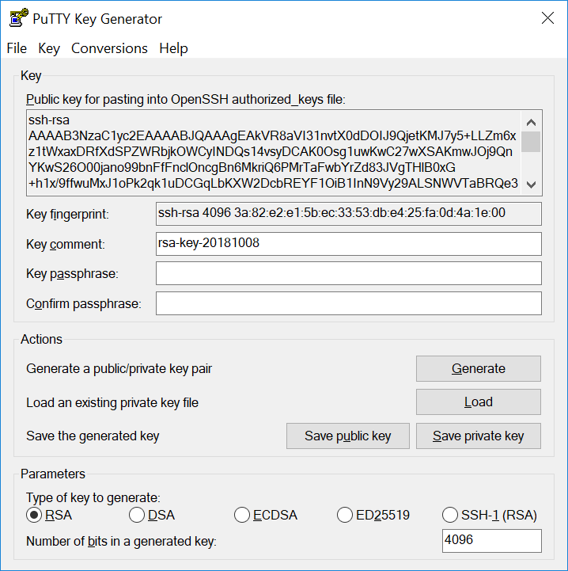
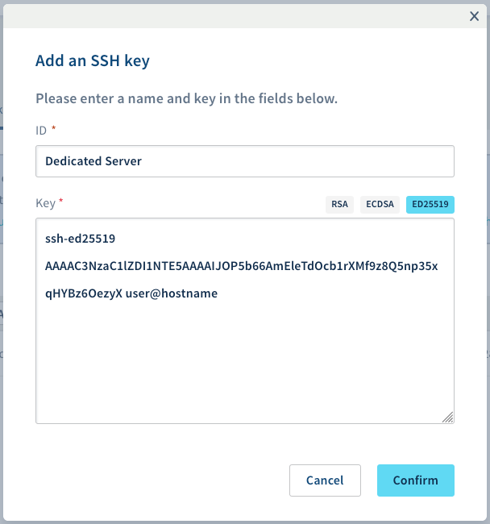

**Última atualização: 15 de abril de 2020**

## Sumário

A utilização do protocolo SSH aciona um canal seguro dentro de uma rede insegura numa arquitetura cliente-servidor, ligando um cliente SSH a um servidor SSH. A criação de uma chave SSH fornece-lhe uma chave pública e outra privada. Pode colocar a chave pública em qualquer servidor e depois desbloqueá-la, ligando-a a um cliente que já possua a sua chave privada armazenada no mesmo. Se a chave SSH coincidir com a configuração existente, poderá iniciar sessão sem necessitar de introduzir a palavra-passe.

**Este guia explica-lhe como criar chaves SSH e depois utilizá-las para aceder com segurança ao seu servidor.**

> [!primary]
>
Note que as chaves SSH não são utilizadas para a autenticação nos servidores com sistema operativo Windows. Para os servidores Windows, terá ainda de utilizar um nome de utilizador e uma palavra-passe.
>

## Requisitos

- acesso à [Área de Cliente OVHcloud](https://www.ovh.com/auth/?action=gotomanager)
- um [servidor dedicado](https://www.ovh.pt/servidores_dedicados/) na sua conta OVHcloud
- acesso administrativo (root) via SSH

## Instruções

### Como criar uma chave SSH no Linux e no Mac

Numa máquina com sistema operativo Mac ou Linux, abra a aplicação Terminal (linha de comando).

Confirme que tem uma pasta ".ssh" no seu diretório $HOME. Se esta pasta não existir, crie uma:

```sh
# mkdir ~/.ssh
```

Utilize o seguinte comando para criar uma chave RSA de 4096 bits:

```sh
# ssh-keygen -b 4096
```
A utilização da opção “-t” com este comando permite-lhe especificar um método de encriptação diferente, por exemplo:

```sh
# ssh-keygen -t ed25519 -a 256
```

O comando irá solicitar-lhe que guarde a chave recém-criada:

```sh
Generating public/private rsa key pair.
Enter file in which to save the key (/home/user/.ssh/id_rsa):
```

Confirme e terá a opção de introduzir uma frase de acesso para proteger a sua chave SSH. Esta ação é recomendada para uma maior segurança.

As suas chaves SSH devem ser guardadas no diretório ".ssh".

```ssh
Your identification has been saved in /home/user/.ssh/id_rsa.
Your public key has been saved in /home/user/.ssh/id_rsa.pub.
The key fingerprint is:
SHA256:MRk+Y0zCOoOkferhkTvMpcMsYspj212lK7sEauNap user@hostname
The key's randomart image is:
+---[RSA 4096]----+
|     .. o        |
|    . .= o       |
|   o o  X        |
|. . . .          |
|. .=.o .S.       |
| =o.o.  .   .    |
|o +   .  . o ..  |
|.. .  .   oEoo . |
|o.        .o+oo  |
+----[SHA256]-----+
```

> [!warning]
>
> A chave privada deve ser sempre mantida em segurança e o acesso à mesma deve ser limitado a pessoas autorizadas.
> 

Para ler e exportar a sua chave pública, utilize o comando “cat” no respetivo ficheiro e copie o seguinte resultado:

```ssh
# cat ~/.ssh/id_rsa.pub
ssh-rsa AAAAB3NzaC1yc2EAAAADAQABAAABAQC8teh2NJ42qYZV98gTNhumO1b6rMYIkAfRVazl
k6dSS3xf2MXJ4YHsDacdjtJ+evXCFBy/IWgdkFtcvsGAMZ2N1RdvhDyQYcy6NDaJCBYw1K6Gv5fJ
SHCiFXvMF0MRRUSMneYlidxUJg9eDvdygny4xOdC6c1JrPrSgOc2nQuKeMpOoOWLINIswg1IIFVk
kFMPrFivP8Z6tidzVpAtbr1sXmJGZazYWrU3FoK2a1sF1zEWrmlMOzX81zEWrmlMOzX8CpZW8Rae
i4ANmLy7NULWK36yU0Rp9bFJ4o0/4PTkZiDCsK0QyHhAJXdLN7ZHpfJtHIPCnexmwIMLfIhCWhO5
 user@hostname
```

### Criar uma chave SSH utilizando PuTTY (para Windows)

[PuTTY](https://www.chiark.greenend.org.uk/~sgtatham/putty/) é um cliente SSH muito utilizado no Windows. Pode utilizá-lo para se ligar remotamente a um servidor Linux. O seu software associado, [PuTTYgen](https://the.earth.li/~sgtatham/putty/latest/w64/puttygen.exe), pode ser utilizado para criar chaves SSH.

Primeiro, descarregue o software [PuTTYgen](https://the.earth.li/~sgtatham/putty/latest/w64/puttygen.exe), que será utilizado para gerar a chave.

Em seguida, execute o software e selecione o tipo de chave. No nosso exemplo, escolhemos uma chave RSA de 4096 bits. Clique no botão `Gerar`{.action} para iniciar o processo de criação.

{.thumbnail}

Mova o rato de forma aleatória na zona vazia situada por baixo da barra de progresso, como se mostra abaixo.

{.thumbnail}

Continue a mover o rato até que a barra de progresso esteja completa. A sua chave está criada e pronta a ser utilizada.

{.thumbnail}


### Adicionar chaves SSH ao seu servidor

Navegue até ao diretório $HOME e crie a pasta ".ssh" (se esta não existir):

```ssh
$ mkdir ~/.ssh
```

Para guardar a chave para o utilizador atual, abra um ficheiro denominado "authorized_keys" com o seu editor de texto preferido:

```ssh
$ nano ~/.ssh/authorized_keys
```

Copie e cole a sua **chave pública** neste novo ficheiro. Guarde-o e saia do editor. Reinicie o seu servidor ou apenas o OpenSSH daemon (o comando adequado pode variar em função do seu sistema operativo):

```ssh
$ systemctl restart sshd
```

Para verificar se a sua chave foi devidamente configurada, tente aceder ao seu servidor via SSH utilizando o seguinte comando. Substitua "IP_ADDRESSorHOSTNAME" pelo endereço IP ou pelo nome de anfitrião do servidor a que está a tentar aceder:

```ssh
$ ssh user@IP_ADDRESSorHOSTNAME
```

#### Adicionar mais chaves ao seu servidor

Para adicionar mais chaves SSH para outros utilizadores, repita os passos anteriores, utilizando o diretório $HOME adequado para criar a chave exclusiva do utilizador.

#### Remover chaves autorizadas do seu servidor

Apague do seu ficheiro "authorized_keys" a chave que corresponde ao utilizador que teve o seu acesso rejeitado. Após remover a chave, guarde o ficheiro e saia do editor de texto.

### Importar a sua chave SSH para a Área de Cliente OVHcloud

A Área de Cliente OVHcloud permite-lhe guardar chaves públicas criadas utilizando um dos seguintes tipos de encriptação suportados atualmente (RSA, ECDSA, ED25519). 

Abra a barra de navegação lateral clicando no seu nome no canto superior direito e utilize o atalho `Produtos e serviços`{.action}.

{.thumbnail}

Em “Os meus serviços” passe para o separador `Chaves SSH`{.action} e clique em `Adicionar uma chave SSH`{.action}.

{.thumbnail}

Selecione "Dedicadas" no menu suspenso.

Na nova janela, introduza um ID (nome à sua escolha) para a chave. Cole a cadeia da chave (copiada do seu ficheiro ".pub") no campo “Chave”.

{.thumbnail}

Se tiver copiado o resultado na sua totalidade, o identificador após a chave já deverá estar incluído. Tenha em atenção que, para guardar a sua chave, terá sempre de especificar o seu identificador após a chave colada. Este é um requisito da Área de Cliente OVHcloud. (Veja um exemplo de formato acima). Clique em `Confirmar`{.action} para guardar a sua chave pública.

> [!primary]
>
> Quaisquer chaves guardadas na seção “Dedicadas” serão igualmente utilizáveis para os seus serviços VPS. No que respeita às chaves SSH para os serviços Public Cloud, consulte [este guia](https://docs.ovh.com/pt/public-cloud/criacao-de-chaves-ssh/).
>


## Saiba mais

Junte-se à nossa comunidade de utilizadores em <https://community.ovh.com/en/>.