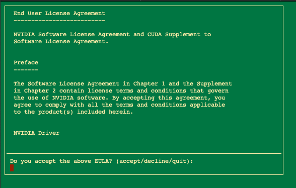
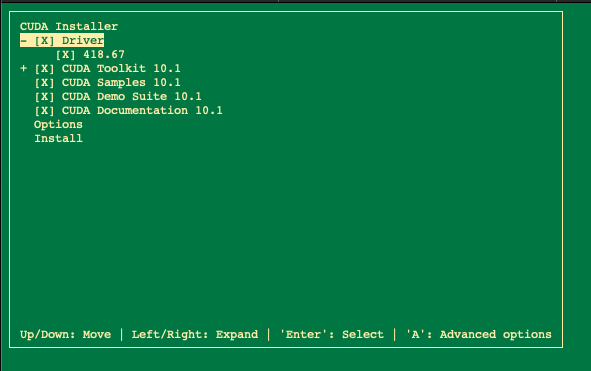

**Last updated 14th December 2017**

## Objective

You can install Compute Unified Device Architecture (CUDA) on a GPU server, but it requires a series of actions which we will explain to you in this guide.

## Requirements

- You must own a [GPU server](https://www.ovh.co.uk/dedicated_servers/gpu/).
- You must be logged into your server via SSH

## Instructions

Once you have reinstalled the distribution/operating system, follow the instructions below.

### Ubuntu

#### Update the kernel

```sh
wget http://kernel.ubuntu.com/~kernel-ppa/mainline/v4.10.17/linux-headers-4.10.17-041017_4.10.17-041017.201705201051_all.deb
```

```sh
wget http://kernel.ubuntu.com/~kernel-ppa/mainline/v4.10.17/linux-headers-4.10.17-041017-generic_4.10.17-041017.201705201051_amd64.deb
```

```sh
wget http://kernel.ubuntu.com/~kernel-ppa/mainline/v4.10.17/linux-headers-4.10.17-041017-generic_4.10.17-041017.201705201051_amd64.deb
```

```sh
sudo dpkg -i ./linux-*
```

### Modify the grub.cfg file

Edit the following file, and comment out the OVH kernel part:
```sh
/boot/grub/grub.cfg
```

```sh
##BEGIN /etc/grub.d/06_OVHkernel###
#menuentry "GNU/Linux with OVH Kernel, OVH kernel 4.9.58-xxxx-std-ipv6-64" {

#insmod part_gpt

#insmod part_gpt

#insmod diskfilter

# insmod mdraid09

#insmod ext2

#set root='mduuid/cabadcc1a60ca488a4d2adc226fd5302'

#if [ x$feature_platform_search_hint = xy ]; then

#search --no-floppy --fs-uuid --set=root --hint='mduuid/cabadcc1a60ca488a4d2adc226fd5302' b43e4008-da62-482e-a5c8-8384c40b69db

#else

#search --no-floppy --fs-uuid --set=root b43e4008-da62-482e-a5c8-8384c40b69db

#fi

#linux /boot/bzImage-4.9.58-xxxx-std-ipv6-64 root=/dev/md2 ro rootdelay=10 noquiet nosplash net.ifnames=0 biosdevname=0
###END /etc/grub.d/06_OVHkernel###
```

At this point, you will need to reboot the server. It should reboot on a new kernel. 

To check this, you can type the following commands:

```sh
uname -a
Linux ns3065593 4.10.17-041017-generic #201705201051 SMP Sat May 20 14:53:33 UTC 2017 x86_64 x86_64 x86_64 GNU/Linux
```

Then install a library and stop `lightdm`:

```sh
/etc/init.d/lightdm stop
```

```sh
apt-get install ncurses-base
```

```sh
apt-get install nvidia-384-dev
```

```sh
ln -sf /usr/lib/x86_64-linux-gnu/libGL.so.1 /usr/lib/libGL.so.1
```
 
### Install CUDA
 
Now, you just need to install CUDA by following the procedure below:

```sh
cd /root
mkdir cuda
cd cuda
```

```sh
wget https://developer.nvidia.com/compute/cuda/9.0/Prod/local_installers/cuda-repo-ubuntu1604-9-0-local_9.0.176-1_amd64-deb
```

```sh
mv cuda-repo-ubuntu1604-9-0-local_9.0.176-1_amd64-deb cuda-repo-ubuntu1604-9-0-local_9.0.176-1_amd64.deb
```

```sh
dpkg -i cuda-repo-ubuntu1604-9-0-local_9.0.176-1_amd64.deb
```

```sh
apt-key add /var/cuda-repo-9-0-local/7fa2af80.pub
apt-get update
apt-get install cuda
```

```sh
nano /etc/environment
#Once nano is open edit the PATH variable to include /usr/local/cuda-8.0/bin folder. After editing the file, the screen would look like this.
```

```sh
source /etc/environment
```

```sh
export PATH=/usr/local/cuda-9.0/bin${PATH:+:${PATH}}
```

```sh
nvcc --version
```
 
The `nvidia-smi` should now function properly:

```sh
nvidia-smi
```
```sh
Wed Nov 1 09:14:38 2017
+-----------------------------------------------------------------+
| NVIDIA-SMI 384.90 Driver Version: 384.90 |
+---------------------+---------------------+---------------------+
| GPU Name Persistence-M| Bus-Id Disp.A | Volatile Uncorr. ECC |
| Fan Temp Perf Pwr:Usage/Cap| Memory-Usage | GPU-Util Compute M. |
|=================+=======================+=======================|
| 0 GeForce GTX 106... Off | 00000000:02:00.0 Off | N/A |
| 0% 27C P0 27W / 120W | 0MiB / 6072MiB | 0% Default |
+---------------------+---------------------+---------------------+
| 1 GeForce GTX 106... Off | 00000000:03:00.0 Off | N/A |
| 0% 29C P0 24W / 120W | 0MiB / 6072MiB | 2% Default |
+---------------------+---------------------+---------------------+
+-----------------------------------------------------------------+
| Processes: GPU Memory |
| GPU PID Type Process name Usage |
|=================+=======================+=======================|
| No running processes found |
+----------------------------------------------------------------+
```

### CentOS 7

#### Update the OS

After the CUDA installation we must to perform an OS upgrade
```sh
# sudo yum -y update
```

Then we need to prepare the OS installing the following components:
```sh
# sudo yum groupinstall "Development Tools"
```
```sh
# sudo yum install kernel-devel epel-release
```
```sh
# sudo yum install dkms
```
Now we need to disable __nouveau__ driver by changing the configuration __/etc/default/grub__ file. Add the __nouveau.modeset=0__ and __rd.driver.blacklist=nouveau__ into line starting with GRUB_CMDLINE_LINUX.

Below you can find example of grub configuration file reflecting the previously suggested change: 
```sh
sudo nano /etc/default/grub
```
```
GRUB_TIMEOUT=5
GRUB_DISTRIBUTOR="$(sed 's, release .*$,,g' /etc/system-release)"
GRUB_DEFAULT=saved
GRUB_DISABLE_SUBMENU=true
GRUB_TERMINAL_OUTPUT="console"
GRUB_CMDLINE_LINUX="crashkernel=auto rhgb quiet rd.driver.blacklist=nouveau nouveau.modeset=0"
GRUB_DISABLE_RECOVERY="true"
```
Then we update the __Grub__ information
```sh
# sudo grub2-mkconfig -o /boot/grub2/grub.cfg
```

Now we include the __blacklist noveau__ concept in the following path
```sh
# sudo /etc/modprobe.d/blacklist.conf
```
```
blacklist nouveau
```
Finally we need to reboot the server
```sh
# sudo reboot
```

#### Install CUDA 

Now we must to find the CUDA Toolkit RUN file for our specific OS version in the __Nvidia__ official page -> [Nvidia](https://developer.nvidia.com/cuda-downloads)

```sh
# wget https://developer.nvidia.com/compute/cuda/10.1/Prod/local_installers/cuda_10.1.168_418.67_linux.run
```

Then we can execute the package installation
```sh
# sudo sh cuda_*.run
```
Accepts the process

{.thumbnail}

And then select all the components to install

{.thumbnail}


When the installation will be finished we can export system path to Nvidia CUDA binary executables. Open the __~/.bashrc__ using your preferred text editor: 
```sh
# sudo nano ~/.bashrc
```
And add the following two lines:
```
export PATH=/usr/local/cuda/bin:$PATH
export LD_LIBRARY_PATH=/usr/local/cuda/lib64:$LD_LIBRARY_PATH
```

Then we do the Re-login the updated __~/.bashrc__ file
```sh
source ~/.bashrc
```

And finally we can check the driver version and d the service statuas with the following commands
```sh
# nvcc --version
nvcc: NVIDIA (R) Cuda compiler driver
Copyright (c) 2005-2019 NVIDIA Corporation
Built on Wed_Apr_24_19:10:27_PDT_2019
Cuda compilation tools, release 10.1, V10.1.168
```
```sh
# nvidia-smi
Fri May 17 15:37:53 2019       
+-----------------------------------------------------------------------------+
| NVIDIA-SMI 418.67       Driver Version: 418.67       CUDA Version: 10.1     |
|-------------------------------+----------------------+----------------------+
| GPU  Name        Persistence-M| Bus-Id        Disp.A | Volatile Uncorr. ECC |
| Fan  Temp  Perf  Pwr:Usage/Cap|         Memory-Usage | GPU-Util  Compute M. |
|===============================+======================+======================|
|   0  GeForce GTX 1070    Off  | 00000000:00:06.0 Off |                  N/A |
| 26%   28C    P0    32W / 151W |      0MiB /  8119MiB |      0%      Default |
+-------------------------------+----------------------+----------------------+
                                                                               
+-----------------------------------------------------------------------------+
| Processes:                                                       GPU Memory |
|  GPU       PID   Type   Process name                             Usage      |
|=============================================================================|
|  No running processes found                                                 |
+-----------------------------------------------------------------------------+
```


## Go further

Join our community of users on <https://community.ovh.com/en/>.
