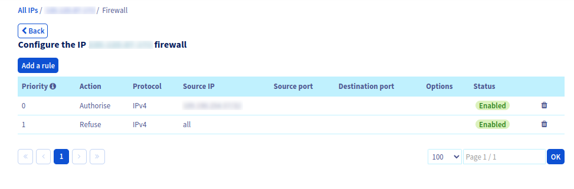

**Last updated 7th March 2023**

## Objective

The purpose of this guide is to help you optimise security for your ESXi system.

In particular, this guide explains how to:

- Restrict access to your ESXi server to a specific IP address or network range.
- Disable services that increase your server's attack surface.

We will do this using the on-board features offered by VMware, as well as those offered by OVHcloud.

> [!warning]
> 
> Recently, ESXi systems fell victim to a security flaw that malicious groups exploited very quickly across public networks.
>
> You can find more information on this attack in [an additional FAQ](/pages/cloud/dedicated/faq-esxi).
>

### Security best practices reminder

- Update your ESXi systems regularly.
- Restrict access to trusted IP addresses only.
- Disable unused ports and services.
- Ensure access to your servers or network equipment is limited, controlled and protected with strong passwords.
- Back up your critical data to protected, isolated external disks and backup servers.

**Optional**:

- Set up the necessary logging solutions to monitor events on your critical servers and network equipment.
- Set up security packs for malicious action detection, intrusion detection (IPS/NIDS) and network traffic bandwidth control.

## Requirements

- Access to the [OVHcloud Control Panel](https://ca.ovh.com/auth/?action=gotomanager&from=https://www.ovh.com/asia/&ovhSubsidiary=asia){.external}
- A dedicated server with the ESXi solution deployed
- An offer compatible with our [Network Firewall](/pages/cloud/dedicated/firewall_network) feature, if you would like to use it for filtering

## Instructions

### Native intrusion protection

Reminder of its definition and operating principle:

> [!primary]
> 
> The ESXi system includes a security mechanism linked to the administrator account.
> This is because, in the event of several incorrect access attempts, the administrator account is temporarily locked.
> This mechanism helps protect your system from malicious connection attempts.

> [!warning]
> 
> If this system triggers and you want to log into your ESXi immediately, you will need to manually unlock the administrator account.
>
> To do this, you will need to [reboot](/pages/cloud/dedicated/getting-started-with-dedicated-server#restarting-your-dedicated-server) your ESXi server via the OVHcloud Control Panel.
> 

You can view the access log history in the following files via SSH:

- `/var/run/log/vobd.log` contains the logs that can be used for monitoring and troubleshooting:

```
2023-02-13T16:22:22.897Z: [UserLevelCorrelator] 410535559us: [vob.user.account.locked] Remote access for ESXi local user account 'root' has been locked for 900 seconds after 6 failed login attempts.
2023-02-13T16:22:22.897Z: [GenericCorrelator] 410535559us: [vob.user.account.locked] Remote access for ESXi local user account 'root' has been locked for 900 seconds after 6 failed login attempts.
2023-02-13T16:22:22.897Z: [UserLevelCorrelator] 410535867us: [esx.audit.account.locked] Remote access for ESXi local user account 'root' has been locked for 900 seconds after 6 failed login attempts.
```

- `/var/run/log/hostd.log` contains ESXi host logs (tasks, access to the web interface, etc.):

```
2023-02-21T08:44:19.711Z error hostd[2101004] [Originator@6876 sub=Default opID=esxui-d48c-26a4] [module:pam_lsass]pam_do_authenticate: error [login:root][error code:2]
2023-02-21T08:44:19.711Z error hostd[2101004] [Originator@6876 sub=Default opID=esxui-d48c-26a4] [module:pam_lsass]pam_sm_authenticate: failed [error code:2]
2023-02-21T08:44:19.712Z warning hostd[2101004] [Originator@6876 sub=Default opID=esxui-d48c-26a4] Rejected password for user root from xxx.xxx.xxx.xxx
2023-02-21T08:44:19.712Z info hostd[2101004] [Originator@6876 sub=Vimsvc.ha-eventmgr opID=esxui-d48c-26a4] Event 175 : Cannot login root@xxx.xxx.xxx.xxx
```

All this information is also available through the web administration interface. Click the `Host`{.action} menu and navigate to the `Monitor`{.action} section, and then click `Logs`{.action}.

{.thumbnail}

### The Network Firewall solution

> [!primary]
>
> As a reminder, the Network Firewall is not taken into account within the OVHcloud network. As a result, the configured rules do not affect connections from this internal network.
>

You can enable and use our [Network Firewall](/pages/cloud/dedicated/firewall_network) filtering solution.
This solution will allow you to easily manage legitimate access, in addition to the access you have set up through your ESXi system.

It will also prevent you from unexpectedly locking your administrator account in the event of an attack.

It is recommended that you filter legitimate access in this way:

- Rule 1 (Priority 0) allows trusted external networks to access your ESXi system.
- Rule 2 (Priority 1) blocks everything else.

{.thumbnail}

### Filtering in ESXi

> [!primary]
>
> You can also filter access to your ESXi system with the built-in firewall.
> You can also disable unnecessary services, depending on your usage.
>

> [!warning]
> 
> We strongly advise disabling **SSH** and **SLP** services.
> If you still use the SSH service, restrict its use and access as much as possible.
> This also applies to **shell** access.
> Prioritise only what is strictly necessary for each of your needs.

#### Manipulation via the graphical interface

**Services**

Click the `Host`{.action} menu and navigate to the `Manage`{.action} section, then click `Services`{.action}.

In the list, find the `TSM-SSH` service and right-click on the associated line.

Stop the service by clicking `Stop`{.action}:

{.thumbnail}

Select the `Policy`, then edit it as shown in the example.

Choose the `Start and stop manually`{.action} option to prevent the service from being active when the server starts.

{.thumbnail} 

Apply the same settings for the `slpd` service:

{.thumbnail}

**Firewall rules**

Click the `Networking`{.action} menu, then `Firewall rules`{.action}, and choose `Edit settings`{.action} for each service you want to protect:

{.thumbnail}

Edit the rule to add only IP addresses or networks that need access to your ESXi system.

Example that only allows connections from IP 192.168.1.10:

{.thumbnail}

#### Shell manipulation

**Services**

Disable unnecessary services:

- SLP Service

```bash
/etc/init.d/slpd stop
esxcli network firewall ruleset set -r CIMSLP -e 0
chkconfig slpd off
```

- SSH Service

```bash
/etc/init.d/SSH stop
esxcli network firewall ruleset set -r sshServer -e 0
chkconfig SSH off
```

Check all active services at startup:

```bash
chkconfig --list | grep on
```
<br/>
<br/>

**Firewall rules**

View existing firewall rules:

```bash
esxcli network firewall ruleset list
esxcli system account list
```

> Explanations for changing/adapting access rules:
> 
> - The `vSphereClient` service: This service corresponds to the web administration interface on port 443 (HTTPS).
> - The `sshServer` service: This service corresponds to SSH access on port 22.

Example with the vSphereClient service:

```bash
esxcli network firewall ruleset list --ruleset-id vSphereClient
```

Ensure that the firewall rule is active:

```bash
esxcli network firewall ruleset set --ruleset-id vSphereClient --enabled true
```

Display the list of authorised IPs for this rule:

```bash
esxcli network firewall ruleset allowedip list --ruleset-id vSphereClient
```

Result:

```
Ruleset        Allowed IP Addresses
-------------  --------------------
vSphereClient  All
```

Change the status of the tag by disabling it:

```bash
esxcli network firewall ruleset set --ruleset-id vSphereClient --allowed-all false
```

Authorise only the legitimate IP address 192.168.1.10:

```bash
esxcli network firewall ruleset allowedip add --ruleset-id vSphereClient --ip-address 192.168.1.10
```

Check the access list for the address:

```bash
esxcli network firewall ruleset allowedip list --ruleset-id vSphereClient
```

Result:

```
Ruleset        Allowed IP Addresses
-------------  --------------------
vSphereClient  192.168.1.10
```
<br/>
<br/>

If you still want to use the SSH service, we will explain here how to set up SSH key access.

Generate the keys on the machine that needs to connect to the ESXi server. The 521-bit **ECDSA** algorithm should be used for maximum security:  

> [!warning]
> Authentication works with a key pair: one public and one private.
> Do not share your **private** key, it must remain on the machine where it was generated.

Run the following command:

```bash
ssh-keygen -t ecdsa -b 521 -C "key-ecdsa-esxi-host" -f /path-to-my-key/key-ecdsa
```

```
Generating public/private ecdsa key pair.
Enter file in which to save the key (/path-to-my-key/key-ecdsa_rsa):
```

Enter a strong password:

```
Enter passphrase (empty for no passphrase):
Enter same passphrase again:
```

Only the public key (key-ecdsa.pub) must be sent or stored on the machines you want to connect to.

```
Your identification has been saved in /path-to-my-key/key-ecdsa.
Your public key has been saved in /path-to-my-key/key-ecdsa.pub.
The key fingerprint is:
SHA256:******************************************* key-ecdsa-esxi-host
```

Transfer the public key to your ESXi host so that it can be declared as trusted:

```bash
cat /path-to-my-key/key-ecdsa.pub | ssh root@esxi-host-ip 'cat >> /etc/ssh/keys-root/authorized_keys'
```

## Go further

You can find even more details on security best practices in [this VMware suggested guide](https://core.vmware.com/security-configuration-guide).

Join our community of users on <https://community.ovh.com/en/>.