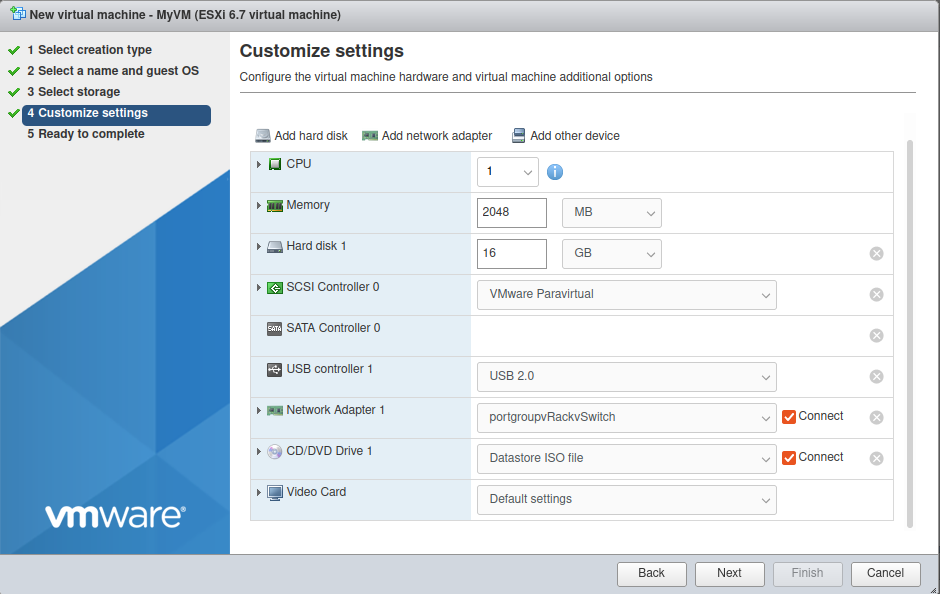

**Last updated 9th May 2022**

## Objective

On the High Grade & SCALE ranges, it is not possible to manage Additional IPs in *bridged* mode (via virtual MACs). It is therefore necessary to configure Additional IPs in routed mode or via the vRack.

> [!primary]
>
> To date, the documentation only covers the solution via the vRack.
>

**This guide explains how to configure the network on VMware ESXi.**

## Requirements

- A public block of IP addresses in your account, with a minimum of four addresses. The block must be pointed to the vRack.
- Your chosen private IP address range.
- A [vRack compatible dedicated server](https://www.ovhcloud.com/en/bare-metal/){.external}.
- A [vRack](https://www.ovh.com/world/solutions/vrack/){.external} service activated in your account.
- Access to the [OVHcloud Control Panel](https://ca.ovh.com/auth/?action=gotomanager&from=https://www.ovh.com/world/&ovhSubsidiary=we).

## Instructions

> [!warning]
>
> On these server ranges, there are 4 network cards. To get all the bandwidth, aggregates must be created. Our documentation is based on these card aggregates.
>
> **However, ESXi does not support LACP natively.**
> Therefore, no redundancy will be available. You will also be unable to use all of your server’s network cards’ bandwidth.
>

> [!warning]
>
> There's currently a known issue with the ESXi graphical user interface and performing these steps in the interface will result in a non-working configuration. It is absolutely necessary to apply this configuration using the command line interface in SSH.
>

### Additional IP via vRack

First, add your public block of IP addresses to the vRack. To do so, go to the `Bare Metal Cloud`{.action} section of your [OVHcloud Control Panel](https://ca.ovh.com/auth/?action=gotomanager&from=https://www.ovh.com/world/&ovhSubsidiary=we) and open the `vRack`{.action} menu.

Select your vRack from the list to display the list of eligible services. Click on the IP block you want to add to the vRack and then click the `Add`{.action} button.

#### Original configuration

{.thumbnail}

In this example:

- the public interfaces are `vmnic2` and `vmnic3`;
- the private interfaces are on `vmnic0` and `vmnic1`.

A first vSwitch exists but only has a `vmnic2` interface.

> [!primary]
>
> Check that your configuration is similar. You can access information on MACs and public or private interfaces in your [OVHcloud Control Panel](https://ca.ovh.com/auth/?action=gotomanager&from=https://www.ovh.com/world/&ovhSubsidiary=we)
 or via the OVHcloud API.
>

#### Explanations

You need to:

- create the aggregate on the public vSwitch
- create the vSwitch for the vRack
- create a port group
- create VMs using the new port group as the network interface.

#### Configure ESXi

> [!primary]
>
> You will need to follow the next steps in command mode (shell) instead of the ESXi GUI.
>

##### **Creating the aggregate in LACP mode on the vSwitch that carries the public interfaces**

```bash
[root@localhost:~] esxcli network vswitch standard uplink add --uplink-name=vmnic3 --vswitch-name=vSwitch0
[root@localhost:~] esxcli network vswitch standard policy failover set -l iphash -v vSwitch0
```

Output:

{.thumbnail}

##### **Creating vSwitch and vRack aggregation on private interfaces**

```bash
[root@localhost:~] esxcli network vswitch standard add --vswitch-name=vRackvSwitch
[root@localhost:~] esxcli network vswitch standard uplink add --uplink-name=vmnic0 --vswitch-name=vRackvSwitch
[root@localhost:~] esxcli network vswitch standard uplink add --uplink-name=vmnic1 --vswitch-name=vRackvSwitch
[root@localhost:~] esxcli network vswitch standard policy failover set -l iphash -v vRackvSwitch
[root@localhost:~] 
```

Output:

{.thumbnail}

##### **VM configuration**

The VMs must have the new `portgroupvRackvSwitch` port group in the network interface.

{.thumbnail}

##### **Creating a port group for the new “vRackvSwitch” vSwitch**

```bash
[root@localhost:~] esxcli network vswitch standard portgroup add --portgroup-name=portgroupvRackvSwitch --vswitch-name=vRackvSwitch
```

#### Configure a usable IP address

In the case of vRack, the first address and the last two addresses in a given IP block are always reserved for the network address, its gateway and its *broadcast* address respectively. This means that the first usable address is the second address in the block, as shown below:

```sh
46.105.135.96 # Reserved: network address
46.105.135.97 # First usable IP
46.105.135.98
46.105.135.99
46.105.135.100
46.105.135.101
46.105.135.102
46.105.135.103
46.105.135.104
46.105.135.105
46.105.135.106
46.105.135.107
46.105.135.108
46.105.135.109 # Last usable IP
46.105.135.110 # Reserved: network gateway
46.105.135.111 # Reserved: network broadcast
```

To configure the first usable IP address, you must edit the network configuration file as shown below. In this example, we use a subnet mask of **255.255.255.240**.

> [!primary]
>
> The subnet mask used in this example is appropriate for our IP block. Your subnet mask may differ depending on the size of your block. When you purchase your IP block, you will receive an email notifying you of the subnet mask to use.
>

#### Configuration example of a client VM on Debian

Content of the file `/etc/network/interfaces`:

```bash
auto lo ens18
iface lo inet loopback
iface ens18 inet static
    address 46.105.135.97
    netmask 255.255.255.240
    gateway 46.105.135.110
```

## Go further

Join our community of users on <https://community.ovh.com/en/>.
