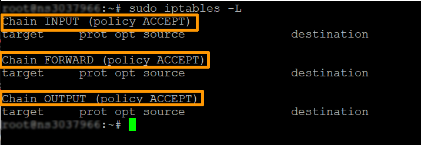
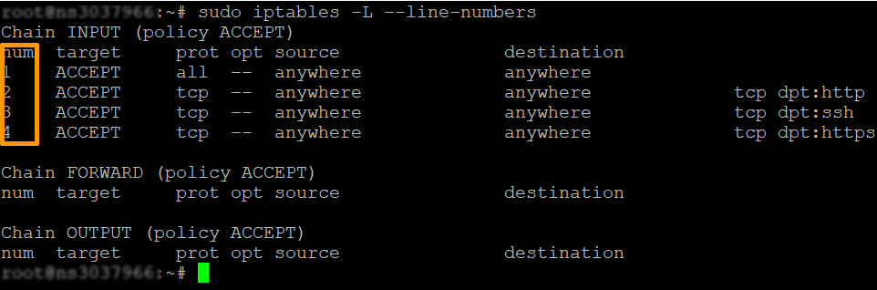

**Last updated 31st January 2022**

## Objective

Your dedicated server is equipped with a firewall. Firewalls create a barrier between a trusted network and an untrusted network.
Firewalls work by defining rules that govern both authorised and blocked traffic. The firewall utility developed for Linux systems is *iptables*.

**Find out how to secure a dedicated server with _iptables_.**

> [!warning]
>OVHcloud is providing you with services for which you are responsible, with regard to their configuration and management. You are therefore responsible for ensuring they function correctly.
>
>This guide is designed to assist you in common tasks as much as possible. Nevertheless, we recommend that you contact a [specialist service provider](https://partner.ovhcloud.com/en-ie/directory/) and/or discuss the issue with [our community](https://community.ovh.com/en/) if you face difficulties or doubts concerning the administration, usage or implementation of services on a server.
>

## Requirements

- A [dedicated server](https://www.ovhcloud.com/en-ie/bare-metal/) in your OVHcloud account
- Administrative access (root/sudo) to your server via SSH

## Instructions

> [!primary]
>
> This guide lists the commands for an Ubuntu Server distribution.
>
> This guide is for general use. You may need to adapt some commands depending on the distribution and/or operating system you are using. Some tips may suggest using third-party tools. If you have any questions about their use, please refer to their official documentation.
>

### Step 1: Update your system

Distribution and operating system developers offer frequent software package updates, very often for security reasons. **Keeping your distribution or operating system up-to-date is essential for securing your server.**

Please refer to our guide on [securing a dedicated server](https://docs.ovh.com/ie/en/dedicated/securing-a-dedicated-server/) for more information.

### Step 2: Install the iptables firewall in Ubuntu

> [!primary]
>
> There are two different versions of *iptables*, for IPv4 and IPv6. The rules we cover in this Linux *iptables* tutorial concern IPv4.
> To configure *iptables* for IPv6, you must use the *iptables* utility. These two different protocols do not work together and must be configured independently.
>

*iptables* is installed by default on most Linux systems. To confirm that *iptables* is installed, use the following command:

```bash
sudo apt-get install iptables
```

The example output in Ubuntu confirms that the latest version of *iptables* is already present:

{.thumbnail}

Typically, an *iptables* command is as follows:

```bash
sudo iptables [option] CHAIN_rule [-j target]
```

Here is a list of some common *iptables* options:

- -A --append: Adds a rule to a string (at the end).
- -C --check: Finds a rule that matches the requirements of the string.
- -D --delete: Removes the specified rules from a string.
- -F --flush: Deletes all rules.
- -I --insert: Adds a rule to a string at a given position.
- -L --list: Displays all rules in a string.
- -N -new chain: Creates a new string.
- -v --verbose: Displays more information when using a list option.
- -X --delete-chain: Deletes the supplied string.

### Step 3: Check the current status of iptables

To display all of the current rules on your server, enter the following command in the terminal window:

```bash
sudo iptables -L
```

The system displays the status of your channels.<br>
The output will list three strings:

{.thumbnail}

### Step 4: Allow traffic on localhost

To allow traffic from your own system (the *localhost*), add the input string by entering the following:

```bash
sudo iptables -A INPUT -i lo -j ACCEPT
```

This command configures the firewall to accept traffic for the localhost (lo) interface (-i). From now on, everything that comes from your system will pass through your firewall.
You must set this rule to allow applications to communicate with the localhost interface.

### Step 5: Allow traffic on specific ports <a name="step5"></a>

These rules allow traffic on the different ports that you specify using the commands listed below.
A port is a communication endpoint specified for a specific type of data.

To allow HTTP Web traffic, enter the following command:

```bash
sudo iptables -A INPUT -p tcp --dport 80 -j ACCEPT
```

To allow only inbound SSH (Secure Shell) traffic, enter the following:

```bash
sudo iptables -A INPUT -p tcp --dport 22 -j ACCEPT
```

To allow HTTPS Internet traffic, enter the following command:

```bash
sudo iptables -A INPUT -p tcp --dport 443 -j ACCEPT
```

The options work this way:

- -p: Checks the specified protocol (tcp).
- --dport: Specifies the destination port.
- -j jump: Performs the action. 

> [!warning]
> If you lose access to your server, you can always use the KVM/IPMI tool to access it again and modify your configuration or delete your rules.
>
> For more information on accessing this tool, please refer to [this guide](https://docs.ovh.com/ie/en/dedicated/use-ipmi-dedicated-servers/).  
> 

### Step 6: Control traffic by IP address

Use the following command to accept traffic from a specific IP address.

```bash
sudo iptables -A INPUT -s your_IP_address_to_authorise -j ACCEPT
```

Replace the IP address in the command with the IP address you want to authorise.

You can also block traffic from an IP address:

```bash
sudo iptables -A INPUT -s your_IP_address_to_block -j DROP
```

Replace the IP address in the command with the IP address you want to block.

You can reject traffic from an IP address range with the following command:

```bash
sudo iptables -A INPUT -m iprange --src-range your_start_IP_address-your_end_IP_address -j REJECT
```

The *iptables* options we used in the examples work as follows:

- -m: Matches the specified option.
- -iprange: Instructs the system to wait for a range of IP addresses instead of one.
- --src-range: Identifies the IP address range.

### Step 7: Delete unwanted traffic

If you are defining *iptables* firewall rules, you must prevent unauthorised access by removing all traffic from other ports:

```bash
sudo iptables -A INPUT -j DROP
```

The -A option adds a new rule to the string. If a connection goes through ports other than those you have defined, it will be discontinued.

> [!warning]
> 
> If you type this command before performing [step 5](#step5), you will block all access including the current one, SSH access. This is particularly problematic on a machine you access remotely. 
>

### Step 8: Delete a rule

A more precise method is to delete the line number of a rule.

```bash
sudo iptables -P INPUT DROP 
```

First, list all rules by entering the following:

```bash
sudo iptables -L --line-numbers
```

{.thumbnail}

Locate the line for the firewall rule you want to remove and run this command:

```bash
sudo iptables -D INPUT <Number>
```

Replace `Number` with the rule line number you want to delete.

### Step 9: Save your changes

When the system is restarted, *iptables* does not keep the rules you created.
Whenever you configure *iptables* on Linux, any changes you make apply only until the next reboot.

To save rules to Ubuntu-based systems, type:

```bash
sudo -s iptables-save -c
```

The next time your system boots, *iptables* will automatically reload the firewall rules.

You can now configure basic *iptables* firewall rules for your Linux server.
Feel free to experiment because you can always delete the rules you don't need, or empty all the rules and start over.

## Go further

Join our community of users on <https://community.ovh.com/en/>.
