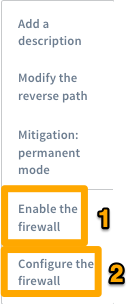
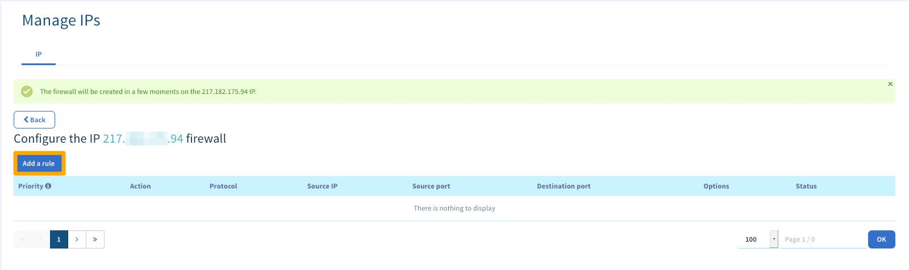
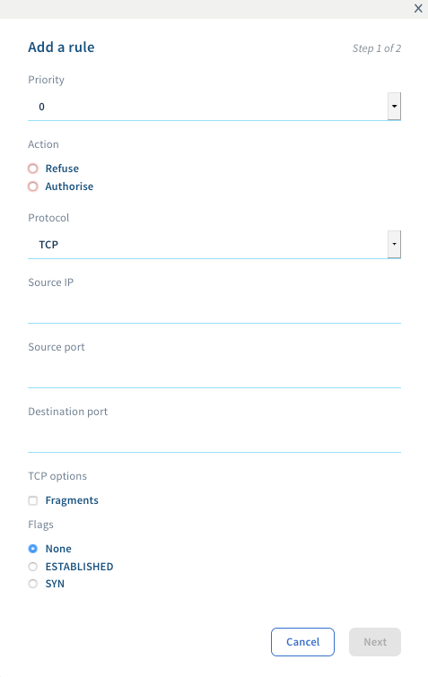

**Last updated 16/11/2018**

## Objective

To protect its global infrastructure and its customers’ servers, OVHcloud offers a firewall that can be configured and integrated into the **Anti-DDoS** (VAC) solution: the Firewall Network. This is an option that will enable you to limit how much your service is exposed to attacks from the public network.

**This guide will take you through the steps for its configuration**.

> [!primary]
>
> VAC: More information on VAC, our protection system against DDoS attacks, here: <https://www.ovh.com/asia/anti-ddos/>.
> 

{.thumbnail}

## Requirements

- You must have an OVHcloud service with a Firewall Network ([Dedicated Server](https://www.ovh.com/asia/dedicated-servers/){.external}, [VPS](https://www.ovh.com/asia/vps/){.external}, [Public Cloud instance](https://www.ovh.com/asia/public-cloud/instances/){.external}, [Private Cloud](https://www.ovh.com/asia/private-cloud/){.external},  [Failover IP](https://www.ovh.com/asia/dedicated-servers/ip_failover.xml){.external}, etc.)
- You must have access to your [OVHcloud Control Panel](https://ca.ovh.com/auth/?action=gotomanager){.external}.
- You must have basic network skills

## Instructions

### Enable the Firewall Network

> [!primary]
>
> The Firewall Network protects the IPs that are associated with a machine. You must therefore configure each IP separately; it is not possible to configure the server as a whole.
> 

You can enable and configure it manually from the Control Panel in the `IP`{.action} section, by clicking on the gear icon to the right of the relevant IPv4.

{.thumbnail}

- You will then be asked for confirmation:

{.thumbnail}

- You can then `Enable the firewall`{.action} and `Configure the Firewall`{.action} by clicking once more on the gear icon next to the IPv4:

{.thumbnail}

You can set up to **20 rules per IP**.

> [!warning]
>
> The firewall is enabled automatically upon each DDoS attack, and cannot be disabled before the attack ends. This is why it is important to keep the firewall rules up to date.
> As a default setting you do not have any configured rules, so all connections can be set up.
> If you do have any, remember to check your firewall rules regularly, even if you disable it.
> 

> [!primary]
>
> - The UDP fragmentation is blocked (DROP) as a default setting. When you enable the Firewall Network, if you use a VPN, remember to correctly configure your maximum transmission unit (MTU). For example, on OpenVPN, you can tick `MTU test`{.action}.
> - The Firewall Network is not taken into account within the OVH network, so the rules set up do not affect the connections in this internal network.
>

### Configuring the Firewall Network

To add a rule, right-click on `Add a rule`{.action}:

{.thumbnail}

For each rule you must choose:

- a priority (from 0 to 19, 0 being the first rule to be applied, followed by the others);
- an action (`Authorise`{.action} or `Refuse`{.action});
- the protocol;
- an IP (optional);
- the source port (TCP only)
- the destination port (TCP only)
- the TCP options (TCP only)

{.thumbnail}

> [!primary]
>
> - Priority 0: we advise that you authorise the TCP protocol on all the IPs with an `established`{.action} option. The `established`{.action} option enables you to verify that the packet is part of a session that has previously been opened (already started). If you do not authorise it, the server will not receive the TCP protocol feedback from the SYN/ACK requests.
> - Priority 19: refuses all of the IPv4 protocol if any rules before 19th (the last possible) are not filled in.
> 

### Configuration example

To make sure that only the SSH (22), HTTP (80), HTTPS (443), and UDP (on port 10000) ports are left open when authorising the ICMP, you need to follow the rules below:

{.thumbnail}

The rules are sorted chronologically from 0 (the first rule read) to 19 (the last). The chain stops being scanned as soon as a rule is applied to the packet.

For example, a packet for TCP port 80 will be captured by rule 2 and the rules that come after will not be tested. A packet for TCP port 25 will only be captured at the last rule (19) which will block it, because OVH does not authorise communication on port 25 in the previous rules.

> [!warning]
>
> If anti-DDoS mitigation is enabled, your Firewall Network rules will be applied, even if you have disabled them. If you wish to disable it, remember to delete your rules.
> 

## Go further

Join our community of users on <https://community.ovh.com/en/>.
