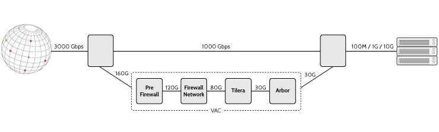
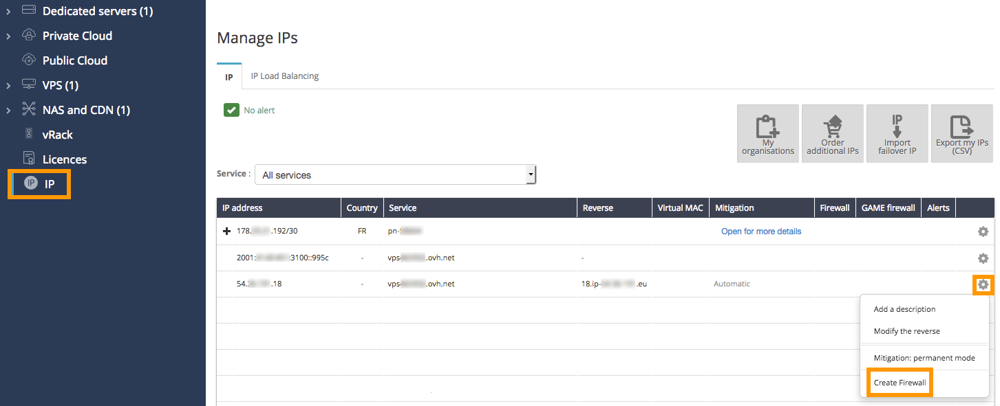
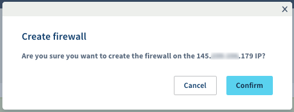
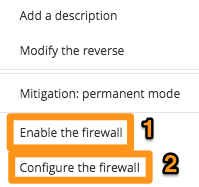
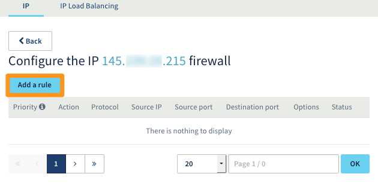
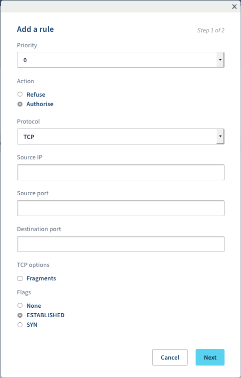
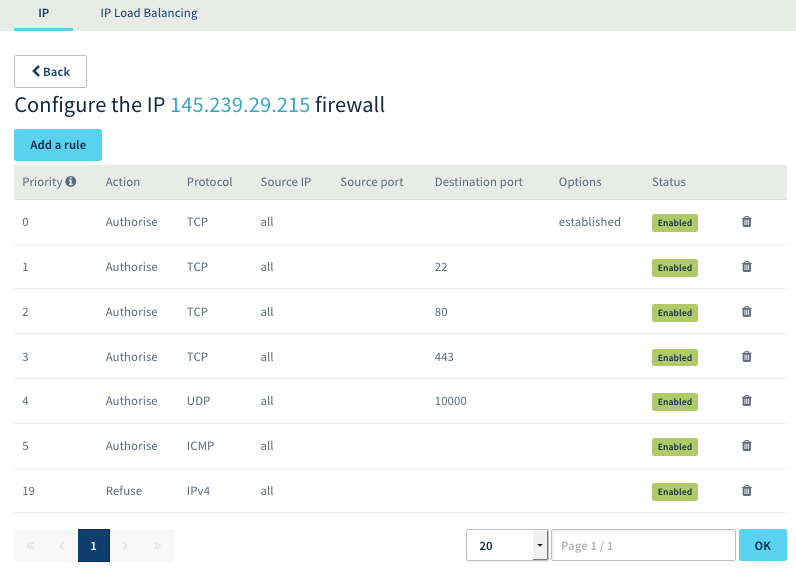

**Last updated 2nd April 2019**

## Objective

To protect its global infrastructure and its customers’ servers, OVH offers a firewall that can be configured and integrated into the **Anti-DDoS** solution: the Network Firewall. This is an option you can use to limit your service's exposure to attacks from the public network.

**This guide will show you how to configure your Network Firewall.**

> [!primary]
>
> You can read more information on our Anti-DDoS solution here: <https://www.ovh.co.uk/anti-ddos/>.
> 

{.thumbnail}

## Requirements

- an OVH service with a Network Firewall ([Dedicated Server](https://www.ovh.co.uk/dedicated_servers){.external}, [VPS](https://www.ovh.co.uk/vps/){.external}, [Public Cloud instance](https://www.ovh.co.uk/public-cloud/instances/){.external}, [Private Cloud](https://www.ovh.co.uk/private-cloud/){.external},  [Failover IP](https://www.ovh.co.uk/dedicated_servers/ip_failover.xml){.external}, etc.)
- access to the [OVH Control Panel](https://www.ovh.com/auth/?action=gotomanager){.external}

## Instructions

### Enable the Network Firewall.

> [!primary]
>
> The Network Firewall protects the IPs that are associated with a server. As a result, you need to configure each IP separately. You cannot configure the server as a whole.
> 

Log in to the [OVH Control Panel](https://www.ovh.com/auth/?action=gotomanager){.external}, go to the `IP`{.action} section, and click on `...`{.action} to activate the firewall on an IPv4.

{.thumbnail}

You will then be asked to confirm.

{.thumbnail}

Then click `Enable the firewall`{.action} (1), and click `Configure the firewall`{.action} (2) to start configuring it.

{.thumbnail}

You can set up to **20 rules per IP**.

> [!warning]
>
> The firewall is enabled automatically whenever a DDoS attack is launched, and cannot be disabled before the attack ends. This is why it is important to keep your firewall rules up-to-date.
> By default, you do not have any configured rules to start with, so all connections can be set up.
> If you have any, we recommend checking them regularly, even if the firewall is disabled.
> 

> [!primary]
>
> - The UDP fragmentation is blocked (DROP) by default. When you enable the Network Firewall, if you use a VPN, remember to configure your maximum transmission unit (MTU) correctly. For example, on OpenVPN, you can tick `MTU test`{.action}.
> - The Network Firewall is not taken into account within the OVH network, so the rules set up do not affect the connections in this internal network.
>

### Configure the Network Firewall.

Add a rule by clicking `Add a rule`{.action}.

{.thumbnail}

For each rule you must choose:
- a priority (from 0 to 19, 0 being the first rule to be applied, followed by the others)
- an action (`Authorise`{.action} or `Refuse`{.action})
- the protocol
- an IP (optional)
- the source port (TCP only)
- the destination port (TCP only)
- the TCP options (TCP only)

{.thumbnail}

> [!primary]
>
> - Priority 0: we advise authorising TCP protocol on all the IPs with an `established`{.action} option. With the established option, you can verify that the packet is part of a session that has previously been opened (already started). If you do not authorise it, the server will not receive the TCP protocol feedback from the SYN/ACK requests.
> - Priority 19: we advise to refuse all IPv4 protocol traffic that has not been accepted by any earlier rule.
> 

### Configuration example

To make sure that only the SSH (22), HTTP (80), HTTPS (443) and UDP (10,000) ports are left open when authorising the ICMP, follow the rules below:

{.thumbnail}

The rules are sorted from 0 (the first rule read) to 19 (the last). The chain stops being scanned as soon as a rule is applied to the packet.

For example, a packet for TCP port 80 will be captured by rule 2, and the rules that come after will not be applied. A packet for TCP port 25 will only be captured at the last rule (19) which will block it, because the Firewall does not authorise communication on port 25 in the previous rules.

> [!warning]
>
> If our anti-DDoS solution is mitigating an attack, your Network Firewall will be enabled, even if you have disabled it by default. If you wish to disable it, remember to delete your rules.
> 

## Go further

Join our community of users on <https://community.ovh.com/en/>.
