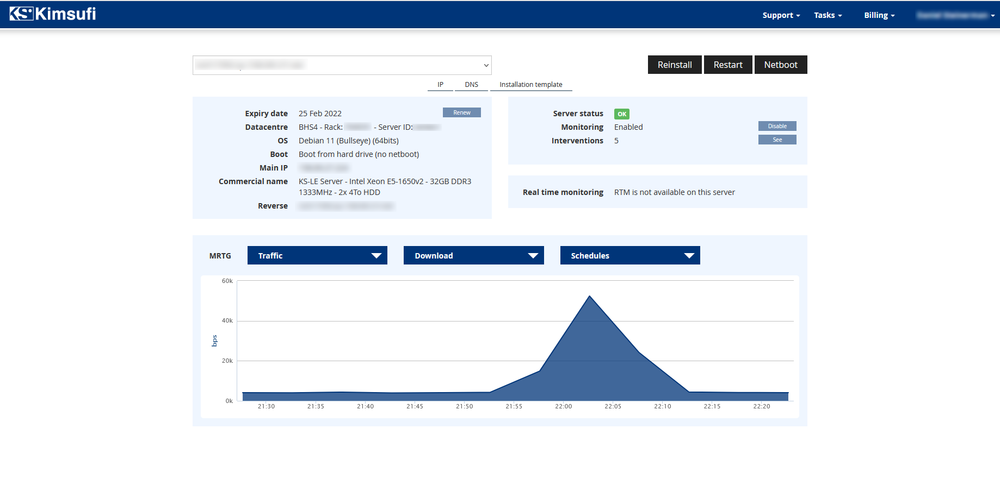
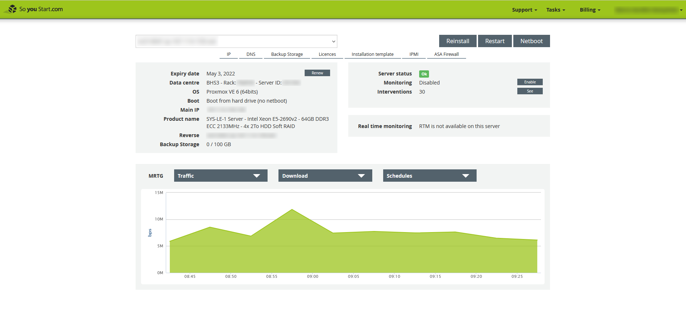
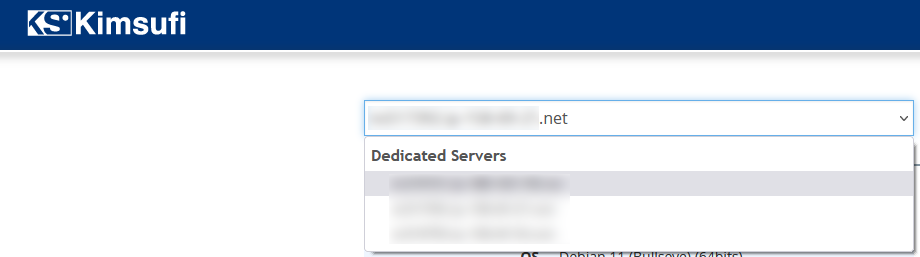
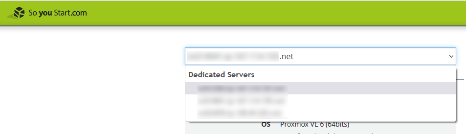
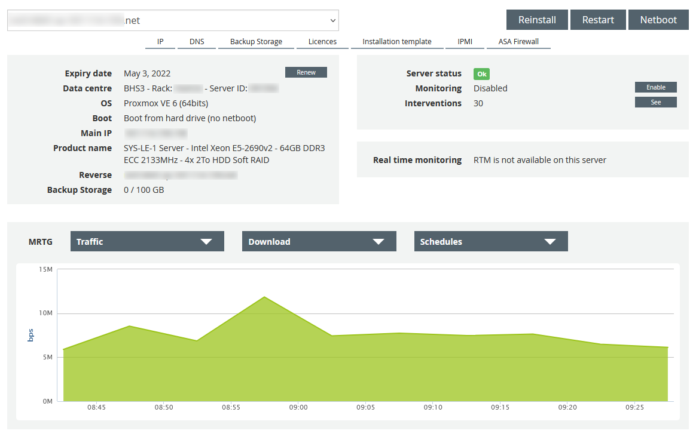
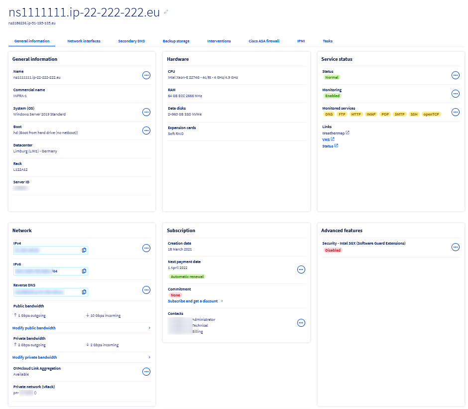
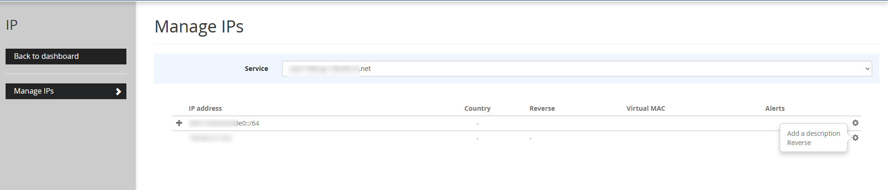
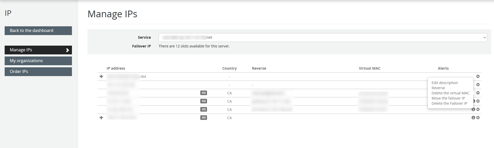
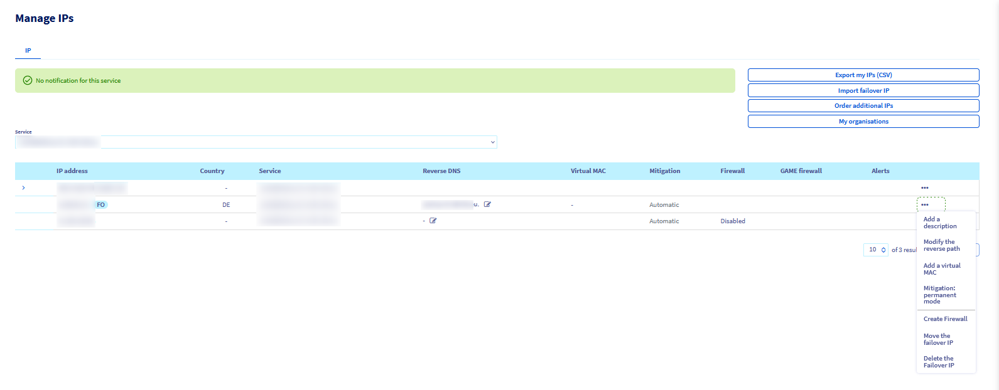

**Last updated 22/02/2022**

## Objective

OVHcloud has combined all Kimsufi and So you Start dedicated servers in a product line called Eco, to give you a better overview of our configurations. Due to these changes, you can now manage all of your services, across all ranges, from the OVHcloud Control Panel. To support you in this change if your have opted for a purchase on the Eco range, we have set up a guide explaining the OVHcloud Control Panel and its options.

**This guide is designed to help you familiarise yourself with the OVHcloud Control Panel**

> [!warning]
> Please note that despite the interface change, the options available for your server range will remain the same. Some options will only be available for servers in the OVHcloud range.
>

## Instructions

### Dashboard

 Kimsufi             | So you Start | OVHcloud
:-------------------------:|:-------------------------:|:---------------------:
  |  | 

The OVHcloud dashboard provides a summary of all your services. This interface has several sections that allow you to access a service instantly. 
The right-hand column gives you access to your personal information, NIC handle and support level (if applicable). It also provides a set of shortcuts and useful links.

### Accessing a server

Kimsufi             | So you Start | OVHcloud
:-------------------------:|:-------------------------:|:---------------------:
  |  | 

In the Kimsufi and So you Start interfaces, the dashboard allows you to see your server/list of servers. 
In the OVHcloud Control Panel, click on the `Bare Metal Cloud`{.action} menu, then on `Dedicated Servers`{.action} in the left-hand column to display your servers. 
If you have several servers, the `All my servers`{.action} button allows you to list them for easy access.

### Server interface

Once you are in the `Dedicated Servers`{.action} menu, click on the server of your choice to access its interface.

Kimsufi             | So you Start | OVHcloud
:-------------------------:|:-------------------------:|:---------------------:
  |  | 

**General information** : In this section, you will find all the information concerning your server.

- Name: Click on the `...`{.action} next to this option to change the name of your server.
- Boot: Click on the `...`{.action} next to this option to change the netboot of your server to *rescue mode*, *normal mode* (hard disk) or *network mode*.
- System (OS): Click on the `...`{.action} next to this option to install/reinstall your server.

**Service status**

- Status: Click on the `...`{.action} next to this option to reboot or delete your server.
- Monitoring: Click on the `...`{.action} next to this option to enable/disable monitoring on your server. To find out how to install Real Time Monitoring (RTM), please refer to this [guide](https://docs.ovh.com/gb/en/dedicated/install-rtm/).

**Network**

- IPV4: Click on the `...`{.action} next to this option to manage your IP.
- Reverse: Click on the `...`{.action} next to this section to enter/modify your reverse DNS.

**Secondary DNS**: Configure your secondary DNS here. For more information, consult the following [guide](https://docs.ovh.com/gb/en/dedicated/secondary-dns/)

**Interventions**: Find here the current and past interventions made on your server.

**IPMI** (Only available on OVHcloud servers and some So you Start servers): Access your server's IPMI or KVM IP here.

**Tasks**: Here you can view recent tasks performed on your server.

For more information on managing your dedicated server via the OVHcloud Control Panel, please refer to [this guide]https://docs.ovh.com/gb/en/dedicated/getting-started-dedicated-server/).

### Section IP

To access the IP section of the OVHcloud Control Panel, click on the `Bare Metal Cloud`{.action} menu, then click on `IP`{.action} in the bottom left-hand column.

Kimsufi             | So you Start | OVHcloud
:-------------------------:|:-------------------------:|:---------------------:
  |  |  |

### Licences tab

To access the Licences tab in the OVHcloud Control Panel, click on the `Bare Metal Cloud`{.action} menu, then click on `Licences`{.action} in the column on the left of the page. 

Kimsufi             | So you Start | OVHcloud
:-------------------------:|:-------------------------:|:---------------------:
Licences are not offered for this range.  |  | 

### Support, Billing and Account Management

In the Kimsufi or So you Start Control Panel, these options are available in the top right-hand corner, under individual tabs. 
In the OVHcloud Control Panel, these options are grouped into a common space. Click on your name in the top right-hand corner and click on your initials to go to the `Manage my account` section.

Kimsufi             | So you Start | OVHcloud
:-------------------------:|:-------------------------:|:---------------------:
  |  | 

- **General information**: in this section, you can view your account information, your latest bill, and access different shortcuts.
- **Security**: this section allows you to manage the security settings of your account. For more information, please consult this [guide](https://docs.ovh.com/gb/en/customer/all-about-your-username/).
- **Emails received**: in this section, you can find all of the emails which OVHcloud has sent you, apart from requests for assistance.
- **Level of support** (only available for OVHcloud services): You can find more information on the level of support offered by OVHcloud in this section.
- **User management**: this section allows you to manage your users. For more information, please consult this [guide](https://docs.ovh.com/gb/en/customer/managing-users/).
- **My bills**: in this section, you can view your invoices, track payments made with your default payment method, and view your credit notes. For more information, please consult this [guide](https://docs.ovh.com/gb/en/billing/manage-ovh-bills/).
- **My services**: in this section, you can view all of your services, contracts and SSH keys.
- **Payment method**: in this section, you can access your current payment method, your prepaid account and OVHcloud vouchers. You will also find the option to add/delete a payment method. For further information on managing your payment methods, please refer to this [guide](https://docs.ovh.com/gb/en/billing/manage-payment-methods/).
- **My orders**: view your orders from this page. More information is available in this [guide](https://docs.ovh.com/gb/en/billing/managing-ovh-orders/).
- **My support requests**: in this section, you can open/view all of your support tickets.

## Go further

In practice, here are some guides to help you get started:

[Logging in to the OVHcloud Control Panel](https://docs.ovh.com/gb/en/customer/log-in-to-ovhcloud-control-panel/). 
[Setting and managing an account password](https://docs.ovh.com/gb/en/customer/manage-password/). 
[Securing my OVHcloud account and managing my personal information](https://docs.ovh.com/gb/en/customer/all-about-your-username/). 
[Managing contacts for your services](https://docs.ovh.com/gb/en/customer/managing-contacts/). 
[Creating SSH keys](https://docs.ovh.com/gb/en/dedicated/creating-ssh-keys-dedicated/). 
[Using the IPMI with Dedicated Servers](https://docs.ovh.com/gb/en/dedicated/use-ipmi-dedicated-servers/). 
[What are the IP addresses of the OVHcloud monitoring?](https://docs.ovh.com/gb/en/dedicated/monitoring-ip-ovh/).

Join our community of users on <https://community.ovh.com/en/>.
