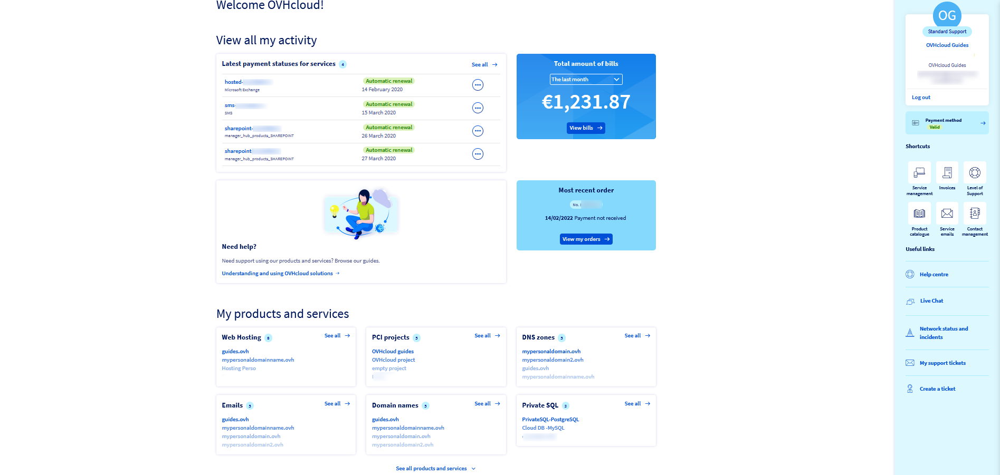
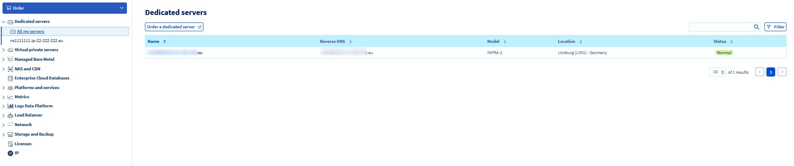
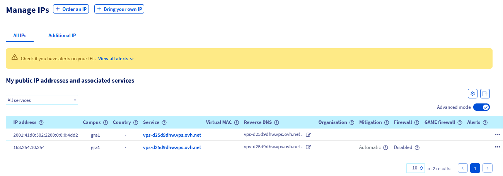

**Last updated 5th January 2023**

## Objective

OVHcloud has combined all of its Kimsufi, So you Start and Rise dedicated servers into a new product line called Eco, to give you a better overview of our configurations. Due to these changes, you can now manage all of your services, across all ranges, from the OVHcloud Control Panel. To support you in this change, if you have opted to purchase products from the Eco line, we have set up a guide that will introduce you to the OVHcloud Control Panel and its options.

**This guide is designed to help you familiarise yourself with the OVHcloud Control Panel.**

> [!warning]
> Please note that despite the interface change, the options available for your server range will remain the same. Some options may not be available for Kimsufi and So you Start servers.
>

## Instructions

### Dashboard

{.thumbnail}

If you have pruchased servers from the Eco product line, your dashboard will now be the one in the OVHcloud Control Panel. The OVHcloud dashboard provides a summary of all your services. This interface has several sections that allow you to access a service instantly. 
The right-hand column gives you access to your personal information, NIC handle and support level (if applicable). It also provides a set of shortcuts and useful links.

### Accessing a server

{.thumbnail}

In the Kimsufi and So you Start interfaces, the dashboard allows you to see your server/list of servers. 
In the OVHcloud Control Panel, click on the `Bare Metal Cloud`{.action} menu, then on `Dedicated Servers`{.action} to display your servers. 
If you have several servers, the `All my servers`{.action} button allows you to list them for easy access.

### Server interface

Once you are in the `Dedicated Servers`{.action} menu, click on the server of your choice to access its interface.

{.thumbnail}

{.thumbnail}

**General information** : In this section, you will find all the information concerning your server.

- Name: Click on the `...`{.action} next to this option to change the name of your server.
- Boot: Click on the `...`{.action} next to this option to change the netboot of your server to *rescue mode*, *normal mode* (hard disk) or *network mode*.
- Last operating system (OS) installed by OVHcloud: Click on the `...`{.action} next to this option to install/reinstall your server.

**Service status**

- Status: Click on the `...`{.action} next to this option to reboot or delete your server.
- Monitoring: Click on `Configure`{.action} to change the [monitoring settings of your server](https://docs.ovh.com/ie/en/dedicated/getting-started-dedicated-server#monitoring-server).

**Network**

- IPV4: Click on the `...`{.action} next to this option to manage your IP.
- Reverse: Click on the `...`{.action} next to this section to enter/modify your reverse DNS.

**Secondary DNS**: Configure your secondary DNS here. For more information, consult the following [guide](https://docs.ovh.com/ie/en/dedicated/secondary-dns/)

**Backup Storage** (Only available on OVHcloud servers and So you Start servers including those in the Eco line): Order and configure your backup storage here. For more information, consult [this guide](https://docs.ovh.com/ie/en/dedicated/services-backup-storage/).

**Interventions**: Find here the current and past interventions made on your server.

**IPMI** (Only available on OVHcloud servers and some So you Start servers including those in the Eco line): Access your server's IPMI or KVM IP here. For more information about using this tool, see [this guide](https://docs.ovh.com/ie/en/dedicated/use-ipmi-dedicated-servers/).

**Tasks**: Here you can view recent tasks performed on your server.

For more information on managing your dedicated server via the OVHcloud Control Panel, please refer to [this guide](https://docs.ovh.com/ie/en/dedicated/getting-started-dedicated-server/).

### Section IP

To access the IP section of the OVHcloud Control Panel, click on the `Bare Metal Cloud`{.action} menu, then open `IP`{.action}.

{.thumbnail}

### Licences tab (not offered on Kimsufi)

To access the Licences tab in the OVHcloud Control Panel, click on the `Bare Metal Cloud`{.action} menu, then open `Licences`{.action}. 

{.thumbnail}

### Support, Billing and Account Management

In the Kimsufi or So you Start Control Panel, these options are available in the top right-hand corner, under individual tabs. 
In the OVHcloud Control Panel, these options are grouped into a common space. Click on your name in the top right-hand corner and click on your initials to go to the `Manage my account` section.

{.thumbnail}

- **General information**: in this section, you can view your account information, your latest bill, and access different shortcuts.
- **Security**: this section allows you to manage the security settings of your account. For more information, please consult [this guide](https://docs.ovh.com/ie/en/customer/all-about-your-username/).
- **Emails received**: in this section, you can find all of the emails which OVHcloud has sent you, apart from requests for assistance.
- **Level of support** (only available for OVHcloud services): you can find more information on the level of support offered by OVHcloud in this section.
- **User management**: this section allows you to manage your users. For more information, please consult [this guide](https://docs.ovh.com/ie/en/customer/managing-users/).
- **My bills**: in this section, you can view your invoices, track payments made with your default payment method, and view your credit notes. For more information, please consult [this guide](https://docs.ovh.com/ie/en/billing/manage-ovh-bills/).
- **My services**: in this section, you can view all of your services, contracts and SSH keys.
- **Payment method**: in this section, you can access your current payment method, your prepaid account and OVHcloud vouchers. You will also find the option to add/delete a payment method. For further information on managing your payment methods, please refer to [this guide](https://docs.ovh.com/ie/en/billing/manage-payment-methods/).
- **My orders**: view your orders from this page. More information is available in [this guide](https://docs.ovh.com/ie/en/billing/managing-ovh-orders/).
- **My contacts**: in this section, you can view and manage the contacts associated with your services. In the **My requests** tab, you will find contact change requests sent from your customer account, as well as service management requests received. For more information on managing your service contacts, please refer to [this guide](https://docs.ovh.com/ie/en/customer/managing-contacts/).
- **My support requests**: in this section, you can open/view all of your support tickets.

## Go further

In practice, here are some guides to help you get started:

[Logging in to the OVHcloud Control Panel](https://docs.ovh.com/ie/en/customer/log-in-to-ovhcloud-control-panel/). 
[Setting and managing an account password](https://docs.ovh.com/ie/en/customer/manage-password/). 
[Securing my OVHcloud account and managing my personal information](https://docs.ovh.com/ie/en/customer/all-about-your-username/). 
[Managing contacts for your services](https://docs.ovh.com/ie/en/customer/managing-contacts/). 
[Creating SSH keys](https://docs.ovh.com/ie/en/dedicated/creating-ssh-keys-dedicated/). 
[What are the IP addresses of the OVHcloud monitoring?](https://docs.ovh.com/ie/en/dedicated/monitoring-ip-ovh/).

Join our community of users on <https://community.ovh.com/en/>.