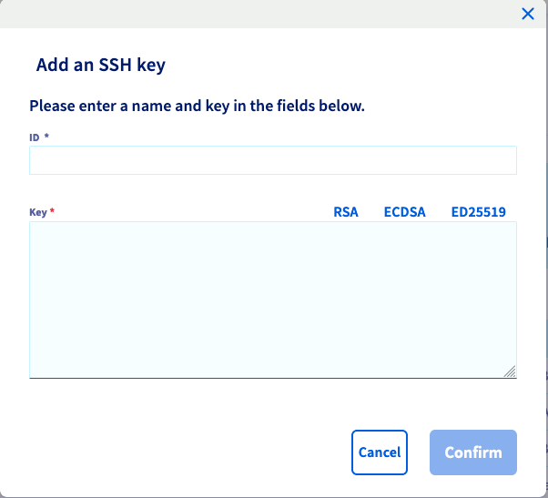
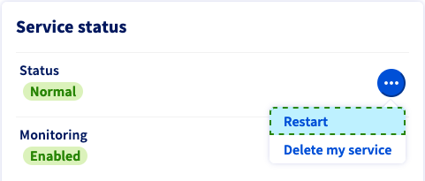

**Last updated 14th March 2022**

## Objective

A dedicated server is a physical server located in one of our data centres. Unlike Web Hosting plans (also referred to as "shared hosting"), which are technically managed by OVHcloud, you are fully responsible for the administration of your dedicated server.

**This guide will help you with the first steps of managing your Kimsufi, So You Start or Rise dedicated server.**

## Requirements

- Access to the [OVHcloud Control Panel](https://ca.ovh.com/auth/?action=gotomanager&from=https://www.ovh.com/sg/&ovhSubsidiary=sg)
- A [dedicated server](https://www.ovhcloud.com/en-sg/bare-metal/) of the ranges Kimsufi, So You Start or Rise in your OVHcloud account
- Administrative access (root) via SSH or remote desktop (Windows) to your server


## Instructions

When your dedicated server is first set up during the order process, you can select which operating system will be installed.

### Installing or reinstalling your dedicated server

You can easily reinstall your server and choose a different OS image in your [OVHcloud Control Panel](https://ca.ovh.com/auth/?action=gotomanager&from=https://www.ovh.com/sg/&ovhSubsidiary=sg). From the `General information`{.action} tab, click on `...`{.action} next to the operating system and then click `Install`{.action}.

{.thumbnail}

In the popup window, select one of the installation options:

- `Install from an OVHcloud template`{.action}: You can select the OS and customise the server configuration.
- `Install one of your templates`{.action}: In order to apply a customised template, you need to have saved at least one server configuration. To do this, check the option `Save this installation` in step 4 of the installation process.
- `Install from custom image`{.action}: This allows you to install an external image on the server. Please refer to the [BYOI guide](../bringyourownimage/) to learn about the settings of this functionality.

> [!primary]
>
> Some proprietary operating systems or platforms such as Plesk or Windows require licences which generate additional fees. You can buy licences [via OVHcloud](https://www.ovhcloud.com/en-sg/bare-metal/os/) or from an external reseller. You will then need to apply your licence, in the operating system itself or by using your [OVHcloud Control Panel](https://ca.ovh.com/auth/?action=gotomanager&from=https://www.ovh.com/sg/&ovhSubsidiary=sg).
>
You can manage all your licences in the `Bare Metal Cloud`{.action} section under `Licences`{.action}. In this section, you can also order licences or add existing ones via the `Actions`{.action} button.
>

Click `Next`{.action} to continue.

{.thumbnail}

After choosing `Install from an OVHcloud template`{.action} you can select the operating system from the drop-down menus.

{.thumbnail}

If you need to modify the partioning scheme of your operating system, check the box "Customise the partition configuration" before clicking on `Next`{.action}.

{.thumbnail}

After you have finished your adjustments, click `Next`{.action} to arrive at the summary page.

#### Adding an SSH key (optional)

If you are installing a GNU/Linux-based operating system, you can add your SSH key in the last step of the installation process.

{.thumbnail}

If you already have an SSH key registered, it will be listed in the drop-down menu under "SSH keys" at the bottom. Otherwise, you will need to add one in the "My services" section first.

To achieve this, open the sidebar navigation by clicking on your name in the top right corner and use the shortcut `Service management`{.action}.

{.thumbnail}

In "My services", switch to the `SSH keys`{.action} tab and click on `Add an SSH key`{.action}.

{.thumbnail}

As we are installing a dedicated server, make sure to select "Dedicated" from the drop-down menu (viable for a VPS as well).

In the new window, enter an ID (a name of your choice) and the key itself (of type RSA, ECDSA or Ed25519) into the respective fields.

{.thumbnail}

For a detailed explanation on how to generate SSH keys, please refer to [this guide](../creating-ssh-keys-dedicated/).

> [!warning]
>OVHcloud is providing you with services for which you are responsible, with regard to their configuration and management. You are therefore responsible for ensuring they function correctly.
>
>This guide is designed to assist you in common tasks as much as possible. Nevertheless, we recommend that you contact a [specialist service provider](https://partner.ovhcloud.com/en-sg/directory/) if you have difficulties or doubts concerning the administration, usage or implementation of services on a server.
>

### Logging on to your server

#### Linux

Once the installation is completed, you will receive an email containing instructions for administrative access. You can connect to your server through a command terminal or with a third-party client by using SSH which is a secure communication protocol.

Use the following examples to log on to your server, replacing the credentials with your actual information (IP address and server reference name are interchangeable).

**Example with root:**

```bash
ssh root@IPv4_of_your_server
```

**Example with a pre-configured user:**

```bash
ssh ubuntu@reference_name_of_your_server
```

You can learn more about SSH in [this guide](../ssh-introduction/).

#### Windows

Once the installation is completed, you will receive an email containing your password for administrative (root) access. You will need to use these credentials to connect to the server via RDP (**R**emote **D**esktop **P**rotocol). After logging in, Windows will guide you through an intial setup.

Please also refer to our guide on [Configuring a new Windows Server installation](https://docs.ovh.com/gb/en/dedicated/windows-first-config-dedicated/).

### Restarting your dedicated server <a name="reboot"></a>

A reboot might become necessary in order to apply updated configurations or to fix an issue. Whenever feasible, perform a "soft reboot" via the command line:

```bash
reboot
```

However, you can carry out a "hard reboot" at any time in your [OVHcloud Control Panel](https://ca.ovh.com/auth/?action=gotomanager&from=https://www.ovh.com/sg/&ovhSubsidiary=sg). From the `General information`{.action} tab, click on `...`{.action} next to "Status" in the **Service status** box, then click `Restart`{.action} and `Confirm`{.action} the action in the popup window.

{.thumbnail}

### Securing your dedicated server

As explained in the “Objective” section of this guide, you are the administrator of your dedicated server. As such, you are responsible for your data and its security. You can learn more about securing your server in [this guide](../securing-a-dedicated-server/).

### OVHcloud Monitoring 

You can set the monitoring status for a dedicated server from the `General information`{.action} tab in your [OVHcloud Control Panel](https://ca.ovh.com/auth/?action=gotomanager&from=https://www.ovh.com/sg/&ovhSubsidiary=sg) (section **Service status**).

{.thumbnail}

If **Monitoring** is set to `Enabled`, you will notified via email every time the server is behaving in an unexpected way. You can disable these messages via the `...`{.action} button.

You can find more information about OVHcloud Monitoring in [this guide](../monitoring-ip-ovh/).

### Network configuration

> [!primary]
>
> Please note that [additional IP addresses](https://www.ovhcloud.com/en-sg/bare-metal/ip/) are not compatible with the **Kimsufi** range.
>

#### Network bridging

Network bridging is the action taken by network equipment to create an aggregate network from either two or more communication networks, or two or more network segments. Bridging is distinct from routing, which allows the networks to communicate independently while remaining separate.

The Network Bridge configuration is most commonly used in the context of virtualisation, to allow each Virtual Machine to have its own public IP address.

For more information on network bridging, please refer to our guide: [Network Bridging](../network-bridging/).

#### IP aliasing

IP aliasing is the process of associating two or more IP addresses to the same network interface. This allows your server to establish multiple connections to a network, each serving a different purpose.

For detailed instructions on how to configure IP aliasing, please refer to [this guide](../network-ipaliasing/).

#### IPv6 configuration

> [!primary]
>
> Please note that servers of the **Kimsufi** range only have one IPv4 address and one IPv6 address. Both will be configured automatically when installing the OS.
>

OVHcloud dedicated servers are delivered with a /64 IPv6 block. To use the addresses in this block, you will need to make some network configuration changes. Please refer to our guide: [IPv6 Configuration](../network-ipv6/).

### Rescue mode

For any kind of issue the first general troubleshooting step to take is rebooting your server into rescue mode from your [OVHcloud Control Panel](https://ca.ovh.com/auth/?action=gotomanager&from=https://www.ovh.com/sg/&ovhSubsidiary=sg). It is important to identify server issues in this mode to exclude software-related problems before contacting our support teams.

Please refer to the [rescue mode guide](../ovh-rescue/).

### Access using IPMI

> [!primary]
>
> Please note that this option is not available for the **Kimsufi** range.
>

OVHcloud deploys dedicated servers with an IPMI (Intelligent Platform Management Interface) console which runs in your browser or from a Java applet, and enables you to connect directly to your server even if it has no network connection. This makes it a useful tool for troubleshooting issues that may have taken your server offline.

For more information, please refer to our guide: [Using the IPMI with dedicated servers](../use-ipmi-dedicated-servers/).

### Backup storage

> [!primary]
>
> Please note that this option is not available for the **Kimsufi** range.
>

OVHcloud dedicated servers have an access-controlled storage space as a gratuitous service option. It is best used as a complementary backup option in case the server itself suffers data loss.

To activate and use the backup storage, please refer to [this guide](../using-backup-storage/).

## Go further

Join our community of users on <https://community.ovh.com/en/>.