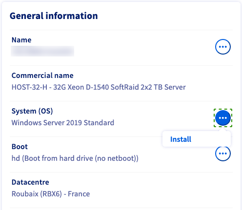
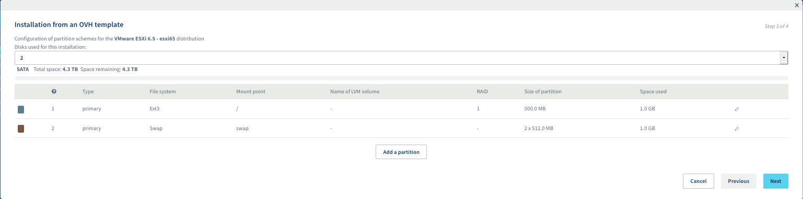
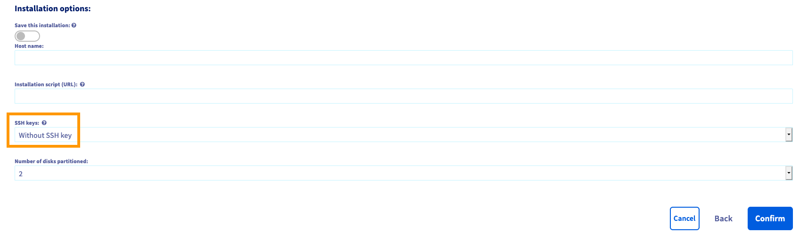
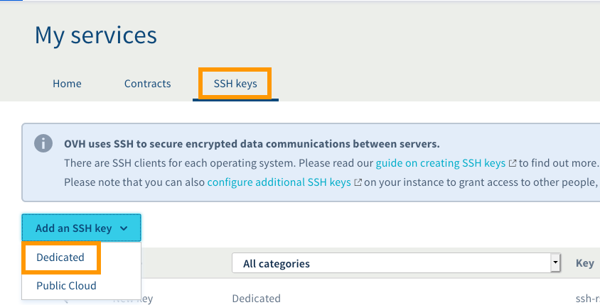
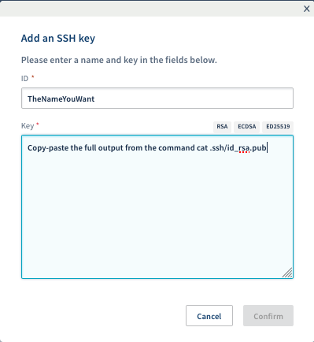
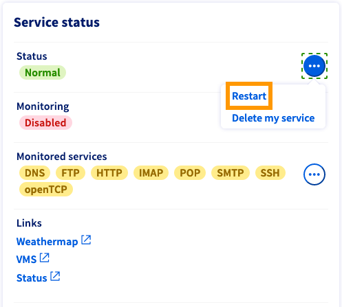
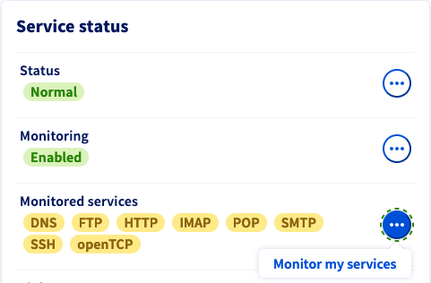

> [!primary]
> Diese Übersetzung wurde durch unseren Partner SYSTRAN automatisch erstellt. In manchen Fällen können ungenaue Formulierungen verwendet worden sein, z.B. bei der Beschriftung von Schaltflächen oder technischen Details. Bitte ziehen Sie beim geringsten Zweifel die englische oder französische Fassung der Anleitung zu Rate. Möchten Sie mithelfen, diese Übersetzung zu verbessern? Dann nutzen Sie dazu bitte den Button «Mitmachen» auf dieser Seite.
>


**Letzte Aktualisierung am 11.03.2022**

## Ziel

Ein dedizierter Server ist ein physischer Server in einem unserer Rechenzentren. Im Gegensatz zum Webhosting (auch "Shared Hosting" genannt), bei dem die technische Verwaltung von OVHcloud geleistet wird, sind Sie allein für die Verwaltung Ihres Servers verantwortlich.

**Diese Anleitung erläutert einige Grundlagen zur Erstverwendung eines OVHcloud Dedicated Server.**

<iframe width="560" height="315" src="https://www.youtube.com/embed/I2G6TkKg0gQ" frameborder="0" allow="accelerometer; autoplay; encrypted-media; gyroscope; picture-in-picture" allowfullscreen></iframe>

## Voraussetzungen

- Sie verfügen über einen [Dedicated Server](https://www.ovhcloud.com/de/bare-metal/){.external} in Ihrem Kunden-Account.
- Sie haben administrativen Zugriff (Root) auf Ihren Server über SSH oder RDP (optional). 
- Sie haben Zugriff auf Ihr [OVHcloud Kundencenter](https://www.ovh.com/auth/?action=gotomanager&from=https://www.ovh.de/&ovhSubsidiary=de).

> [!primary]
>
> Wenn Ihr Server zur Produktlinie **Eco** gehört, folgen Sie stattdesen [dieser Anleitung](../getting-started-dedicated-server-eco/).

## In der praktischen Anwendung

Wenn Ihr Dedicated Server während des Bestellprozesses zum ersten Mal konfiguriert wird, können Sie das zu installierende Betriebssystem auswählen.

### Ihren Dedicated Server installieren oder reinstallieren

Sie können Ihren Server in wenigen Schritten in Ihrem [OVHcloud Kundencenter](https://www.ovh.com/auth/?action=gotomanager&from=https://www.ovh.de/&ovhSubsidiary=de) reinstallieren und ein anderes Betriebssystem auswählen. Klicken Sie im Tab `Allgemeine Informationen`{.action} auf `...`{.action} neben `System (OS)` und danach auf `Installieren`{.action}.

{.thumbnail}

Wählen Sie im folgenden Fenster `Installation mit einem OVHcloud Template`{.action} oder `Installation mit einem Ihrer Templates`{.action} Vorlagen zur Installation eines Installations-Template.

Um ein individualisiertes Image auf dem Server installieren zu können, wählen Sie die dritte Option `Installation auf Basis eines personalisierten Images`{.action}. Weitere Informationen zu den Parametern finden Sie in der Anleitung ["Bring Your Own Image verwenden"](../bringyourownimage/).

> [!primary]
>
> Einige proprietäre Betriebssysteme und Plattformen wie Plesk oder Windows benötigen Lizenzen, die zusätzliche Kosten verursachen. Sie können Lizenzen [bei OVHcloud](https://www.ovhcloud.com/de/bare-metal/os/) oder einem externen Reseller beziehen. Danach müssen Sie Ihre Lizenz im Betriebssystem selbst oder über Ihr [OVHcloud Kundencenter](https://www.ovh.com/auth/?action=gotomanager&from=https://www.ovh.de/&ovhSubsidiary=de) hinzufügen.
>
> Sie können alle Ihre Lizenzen im Bereich `Bare Metal Cloud`{.action} unter `Lizenzen`{.action} verwalten. In diesem Abschnitt können Sie auch über den Button `Aktionen`{.action} Lizenzen bestellen oder bestehende Lizenzen hinzufügen.
>

Klicken Sie auf `Weiter`{.action}, um fortzufahren.

{.thumbnail}

Nachdem Sie `Installation mit einem OVH Template`{.action} ausgewählt haben, können Sie das gewünschte Betriebssystem in den Menüs auswählen.

{.thumbnail}

Wenn Sie das Partitionsschema Ihres Betriebssystems ändern müssen, setzen Sie einen Haken in dem Feld "Konfiguration der Partitionen anpassen", bevor Sie auf `Weiter`{.action} klicken.

{.thumbnail}

Klicken Sie nach Abschluss der Anpassungen auf `Weiter`{.action}, um zur Zusammenfassung zu gelangen.

#### Installation des Real Time Monitoring (optional) <a name="installrtm"></a>

Wenn Sie ein kompatibles GNU/Linux-Betriebssystem ausgewählt haben, erscheint die Option zur Aktivierung der Echtzeit-Überwachung (Real Time Monitoring) des Servers.

{.thumbnail}

Stellen Sie den Slider auf `Aktivieren`{.action}, um RTM auf dem Server zu installieren. Mehr Informationen zur RTM-Funktion finden Sie in unserer Anleitung [zur manuellen Installation](../rtm-installieren/).

#### Hinzufügen eines SSH-Schlüssels (optional)

Wenn Sie ein GNU/Linux-Betriebssystem installieren, können Sie Ihren SSH-Schlüssel im letzten Schritt des Installationsprozesses hinzufügen.

{.thumbnail}

Wenn ein SSH-Schlüssel bereits hinterlegt ist, erscheint er unten im Drop-down-Menü unter "SSH-Schlüssel". Falls nicht, fügen Sie zuerst einen im Bereich "Meine Dienstleistungen" hinzu.

Öffnen Sie hierzu die Seitenleiste, indem Sie oben rechts auf Ihren Namen klicken und nutzen Sie dann den Shortcut `Dienstverwaltung`{.action}.

{.thumbnail}

Gehen Sie in "Meine Dienste" auf den Tab `SSH-Schlüssel`{.action} und klicken Sie auf `SSH-Schlüssel hinzufügen`{.action}.

{.thumbnail}

Da es sich um die Einrichtung eines Dedicated Servers handelt, wählen Sie im Drop-down-Menü "Dedicated" aus (ebenso gültig für einen VPS).

Geben Sie im neuen Fenster eine ID (Name Ihrer Wahl) und den Schlüssel selbst (vom Typ RSA, ECDSA oder Ed25519) in die entsprechenden Felder ein.

{.thumbnail}

Weitere Informationen zur Erstellung von SSH-Schlüsseln finden Sie in unserer [Anleitung](../ssh-schluessel-erzeugen/).

> [!warning]
>OVHcloud stellt Ihnen Dienste zur Verfügung, für deren Konfiguration und Verwaltung Sie verantwortlich sind. Sie sind also verantwortlich für das ordnungsgemäße Funktionieren dieser Systeme.
>
>Diese Anleitung hilft Ihnen bei der Bewältigung allgemeiner Aufgaben. Dennoch empfehlen wir Ihnen, einen spezialisierten Dienstleister zu kontaktieren, falls Sie Schwierigkeiten oder Zweifel hinsichtlich der Administration, Nutzung oder Implementierung der Dienste auf einem Server haben.
>

### Verbindung zu Ihrem Server

#### Linux

Sobald die Installation abgeschlossen ist, erhalten Sie eine E-Mail mit Anweisungen zum administrativen Zugriff. Sie können sich über ein Kommandozeileninterface oder mit Hilfe von Drittanbietersoftware mit Ihrem Server über das sichere Kommunikationsprotokoll SSH verbinden.

Verwenden Sie die folgenden Beispiele, um sich mit Ihrem Server zu verbinden, und ersetzen Sie die Login-Daten mit Ihren eigenen Werten (IP-Adresse und Serverreferenzname sind austauschbar).

**Beispiel mit Root:**

```bash
ssh root@IPv4_Ihres_Servers
```

**Beispiel mit einem vorkonfigurierten Benutzer:**

```bash
ssh root@Referenzname_Ihres_Servers
```

Weitere Informationen zu SSH finden Sie in unserer [Anleitung](../ssh-einfuehrung/).

#### Windows

Sobald die Installation abgeschlossen ist, erhalten Sie eine E-Mail mit Ihrem Passwort für den Administrator-Zugang (Root). Verwenden Sie diese Login-Daten, um sich via RDP (**R**emote **D**esktop **P**rotocol) mit dem Server zu verbinden. Wenn Sie eingeloggt sind, wird Windows Sie durch die Erstinstallation führen.

Beachten Sie auch unsere Anleitung zum [Konfigurieren einer neuen Windows Server Installation](https://docs.ovh.com/de/dedicated/windows-first-config/).

### Neustart Ihres Dedicated Servers <a name="reboot"></a>

Ein Neustart kann notwendig sein, um aktualisierte Konfigurationen anzuwenden oder Fehler zu beheben. Wenn möglich, führen Sie über die Befehlszeile einen "Soft Reboot" des Servers durch:

```bash
reboot
```

Sie können jedoch jederzeit einen "Hard Reboot" in Ihrem [OVHcloud Kundencenter](https://www.ovh.com/auth/?action=gotomanager&from=https://www.ovh.de/&ovhSubsidiary=de) ausführen. Klicken Sie im Tab `Allgemeine Informationen`{.action} auf `...`{.action} neben "Status" im Bereich **Dienststatus** und klicken Sie dann im Kontextmenü auf `Neu starten`{.action} und `Bestätigen`{.action}.

{.thumbnail}

### Absicherung Ihres Dedicated Servers

Wie oben erläutert, sind Sie der Administrator Ihres dedizierten Servers. Als solcher sind Sie für Ihre Daten und deren Sicherheit verantwortlich. Mehr Informationen zur Sicherung Ihres Servers finden Sie in unserer Anleitung zur [Absicherung eines Servers](../dedizierten-server-sichern/).

### OVHcloud Monitoring 

Sie können den Monitoring-Status eines Servers im [OVHcloud Kundencenter](https://www.ovh.com/auth/?action=gotomanager&from=https://www.ovh.de/&ovhSubsidiary=de) vom Tab `Allgemeine Informationen`{.action} aus kontrollieren (Abschnitt **Dienststatus**).

{.thumbnail}

Wenn **Monitoring** auf `Aktiviert` gestellt ist, werden Sie per E-Mail benachrichtigt sobald der Server sich unerwartet verhält. Sie können diese Benachrichtungen über den `...`{.action} Button deaktivieren.

Weitere Informationen zum OVHcloud Monitoring finden Sie in [unserer Anleitung](https://docs.ovh.com/de/dedicated/monitoring-ip-ovh/).

### Netzwerkkonfiguration

#### IP-Bridge-Modus

Network Bridging bezeichnet die Aktion, die Netzwerkgeräte ausführen, um ein aggregiertes Netzwerk aus zwei oder mehr Kommunikationsnetzwerken oder zwei oder mehr Netzwerksegmenten zu erstellen. Bridging unterscheidet sich vom Routing insofern als die Netzwerke unabhängig kommunizieren können, während sie voneinander getrennt bleiben.

Diese Konfiguration wird vor allem in der Virtualisierung verwendet, damit jede virtuelle Maschine über eine eigene öffentliche IP-Adresse verfügt.

Weitere Informationen zum Bridge-Modus finden Sie in unserer Anleitung zum [IP-Bridge-Modus](../network-bridging/).

#### IP-Alias

Beim IP-Aliasing werden zwei oder mehr IP-Adressen mit demselben Netzwerkinterface verknüpft. So kann Ihr Server mehrere Verbindungen zu einem Netzwerk herstellen, die jeweils einen anderen Zweck erfüllen.

Detaillierte Anweisungen zur Konfiguration des IP-Alias finden Sie in der Anleitung zu [IP-Aliasing](../network-ipaliasing).

#### IPv6 Konfiguration

Alle OVHcloud Dedicated Server werden mit einem /64 IPv6 Block geliefert. Um die Adressen dieses Blocks zu verwenden müssen Sie die Konfiguration des Netzwerks anpassen. Lesen Sie dazu unsere Anleitung "[IPv6 auf einem Dedicated Server konfigurieren](../netzwerk-ipv6/)".

### Rescue-Modus

Der erste Schritt zur Fehlerbehebung besteht stets darin, Ihren Server in Ihrem [OVHcloud Kundencenter](https://www.ovh.com/auth/?action=gotomanager&from=https://www.ovh.de/&ovhSubsidiary=de) im Rescue-Modus neu zu starten. Es ist wichtig, Serverfehler in diesem Modus zu identifizieren, um Probleme mit Software auszuschließen, bevor Sie unsere Support-Teams kontaktieren.

Folgen Sie unserer Anleitung zum [Rescue-Modus](../ovh-rescue/).

### Zugang mit IPMI

OVHcloud stattet alle Dedicated Server mit einer IPMI-Konsole (Intelligent Platform Management Interface) aus, die in Ihrem Browser oder über ein Java-Applet ausgeführt wird. Sie können sich direkt mit Ihrem Server verbinden, auch wenn dieser über keine Netzwerkverbindung verfügt. Sie ist deshalb ein nützliches Werkzeug, um Fehler zu beheben, die Ihren Server unerreichbar machen.

Weitere Informationen finden Sie in unserer Anleitung zur [Verwendung der IPMI-Konsole](../verwendung-ipmi-dedicated-server/).

### Backup Storage

OVHcloud Dedicated Server verfügen über einen zugriffskontrollierten Speicherplatz als kostenlose Serviceoption. Er eignet sich am besten als ergänzende Backup-Option für den Fall, dass der Server selbst einen Datenverlust erleidet.

Zur Aktivierung und Nutzung des Backup Storage folgen Sie der [zugehörigen Anleitung](../dienste-storage-backup/).

## Weiterführende Informationen

[Einen Dedicated Server absichern](../dedizierten-server-sichern/)

[Rescue-Modus aktivieren und verwenden](../ovh-rescue/)

Für den Austausch mit unserer User Community gehen Sie auf <https://community.ovh.com/en/>.
