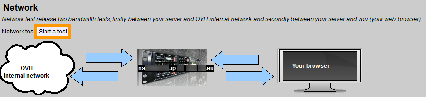
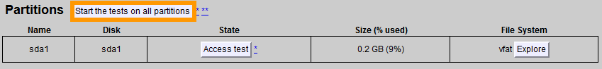

**Last updated 07th June 2018**

## Objective

At some point during the life of your server, you may encounter a fault due to a hardware issue. For these issues, your server is equipped with some diagnostic tools to help identify faulty hardware components.

**This guide will show you how to diagnose hardware issues on your server.**

## Requirements

* a [dedicated server](https://www.ovh.co.uk/dedicated_servers/){.external}
* [rescue mode activated](https://docs.ovh.com/gb/en/dedicated/rescue_mode/){.external}

## Instructions

### Use the web interface

Once your server has rebooted, you'll receive an email with your rescue mode access credentials. This email will contain a link to the rescue mode web interface. The link usually looks like this: *https://your_servers_ip_address:444*.

After clicking the link, you be taken to the web interface, as shown below.

{.thumbnail}

### Run all hardware tests

From the top of the web interface, you can click the `Start all tests`{.action} button, which will run all available hardware tests simultaneously.

{.thumbnail}

### Run separate hardware tests

The web interface allows you to run separate tests for:

* Processors
* Network connection
* Memory
* Disk partitions

You will also be able to view your server's SMART logs, which give you detailed hard disk information.

 
#### Processors

The processor test checks the working order of your server's processor, and needs about 30 minutes to run successfully. If the server crashes during this test, then it means that the processor is faulty.

To start the test, click the button as shown below.

{.thumbnail}

#### Network Connection
The network connection test checks your internal and external bandwidth. To start the test, click the button as shown below.

{.thumbnail}

#### Memory

The memory test checks the integrity of your server's RAM modules. If the server crashes during this test, then it means that the one or more of your RAM modules is faulty.

To start the test, click the button as shown below.

{.thumbnail}

#### Disk Partitions

> [!warning]
>
> Running a file system check on a damaged hard drive can result in data loss.
>

The partitions test is comprised of a disk access test and a file system check. The disk access test checks if the system can communicate with your server's hard drives. The file system check uses the `fsck -fy` command to check the entire file system.

{.thumbnail}

## Go further

Join our community of users on <https://community.ovh.com/en/>.