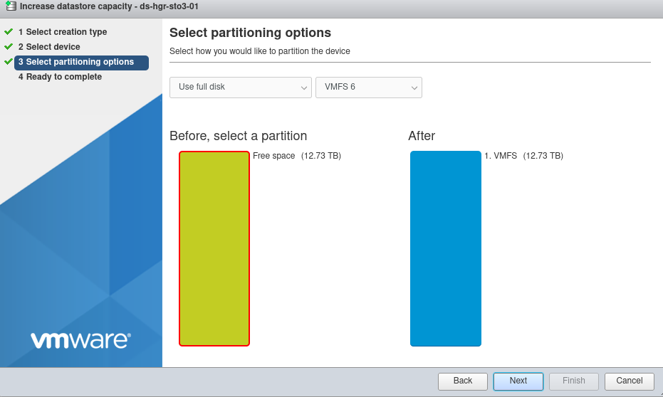
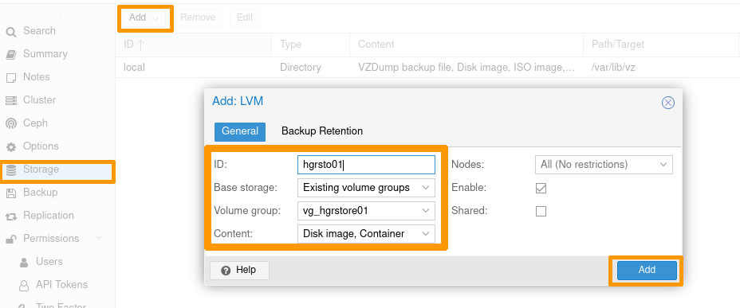
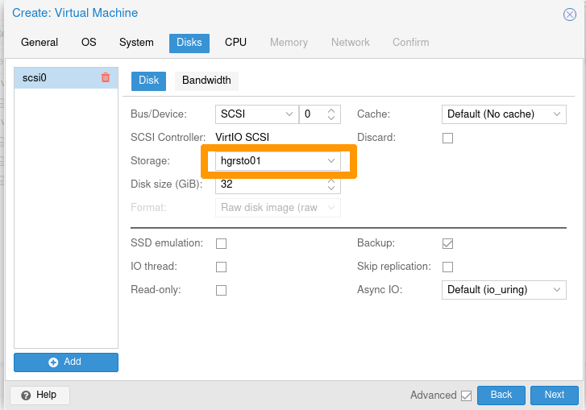
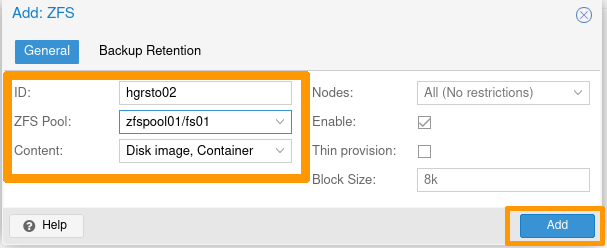

**Last updated 23rd August 2022**

## Objective

Your HGR-STOR-3 server presents the same disks under different logical devices of the operating system. 

Depending on the systems, without any specific post-configuration, this architecture can cause confusion (where is my data?) or even collisions (unintentional access to the same physical disk for different uses), which could cause the loss of your data.

Depending on your system, you may need to do a post-configuration to set up multipath features.

The Multipath allows you to aggregate different access possibilities to the same disk (path) as a single logical device.

This documentation details:

- compatible OVHcloud templates (tested by our teams)
- the OS post-configuration procedure

> [!primary]
>
> - This guide documents a configuration with 102 disks, but the information is also valid for other configurations.
> - You will only find the latest versions of the systems.
> - All tested Debian versions detect only 2 paths and not 4, which would lead to LVM collisions.

## Requirements

- An HGR-STOR-3 server

## Instructions

In addition to its internal disks, the server supports up to 102 disks of 14TB type SAS.

{.thumbnail}

Storage disks have:

- Internet access
- 2 access via SAS controller.

There are 4 ways to access a disk:

- SAS Controller 1 - Path 1-> Disk
- SAS Controller 1 - Path 2-> Disk
- SAS Controller 2 - Path 1-> Disk
- SAS Controller 2 - Path 2-> Disk

Here is a logical view:

{.thumbnail}

### List of OVHcloud templates

| Template | Procedure | Remarks | 
|----------|-----------|---------| 
|ESXi 7| [Procedure for ESXI-7](#esxi7) | 
|AlmaLinux 8|[Procedure for AlmaLinux 8, Rocky Linux 8, Fedora 34 Server](#redhatlike)|| 
|Rocky Linux 8|[Procedure for AlmaLinux 8, Rocky Linux 8, Fedora 34 Server](#redhatlike) || 
|Fedora 34 Server|[Procedure for AlmaLinux 8, Rocky Linux 8, Fedora 34 Server](#redhatlike) ||
|Proxmox VE 7|[Procedure for Proxmox VE 7](#proxmoxve7)|| 
|Ubuntu Server 22.04 LTS|[Procedure for Ubuntu Server 22.04 LTS](#ubuntu22)|| 
|Debian all versions| __Not supported__ | Detects only half of the paths | 
|Windows Server 2019|[Procedure for Windows](#windows)||


#### Linux LVM Warning

> [!warning] Create your PVs **only** on multipath devices of type `/dev/mapper/mpathXX`.

For example:

- Creation of PVs:

```bash
[root@nsxxxxxx ~]# pvcreate /dev/mapper/mpathb /dev/mapper/mpathc
Physical volume "/dev/mapper/mpathb" successfully created.
Physical volume "/dev/mapper/mpathc" successfully created.
```

- Creation of a VG

```bash
[root@nsxxxxxx ~]# vgcreate vg_test01 /dev/mapper/mpathb /dev/mapper/mpathc
  Volume group "vg_test01" successfully created
[root@nsxxxxxx ~]# vgs
  VG        #PV #LV #SN Attr   VSize   VFree 
  vg_test01   2   0   0 wz--n- <25.47t <25.47t
```

- Creation of a LV

```bash
[root@nsxxxxxx ~]# lvcreate --name lv_test01 --size 1To vg_test01
  Logical volume "lv_test01" created.
[root@nsxxxxxx ~]# lvs
  LV        VG        Attr       LSize Pool Origin Data%  Meta%  Move Log Cpy%Sync Convert
  lv_test01 vg_test01 -wi-a----- 1.00t
```

#### ZFS warning on Linux

> [!warning] Create your zfspool **only** on multipath devices of type `/dev/mapper/mpathXX`.

For example:

```bash
[root@nsxxxxxx ~]# zpool create -f zfspool /dev/mapper/mpathe /dev/mapper/mpathf /dev/mapper/mpathg
[root@nsxxxxxx ~]# zpool status
  pool: zfspool
 state: ONLINE
config:
 
    NAME        STATE     READ WRITE CKSUM
    zfspool     ONLINE       0     0     0
      mpathe    ONLINE       0     0     0
      mpathf    ONLINE       0     0     0
      mpathg    ONLINE       0     0     0
 
errors: No known data errors
[root@nsxxxxxx ~]# df -h
Filesystem                       Size  Used Avail Use% Mounted on
devtmpfs                         189G     0  189G   0% /dev
tmpfs                            189G     0  189G   0% /dev/shm
tmpfs                            189G   21M  189G   1% /run
tmpfs                            189G     0  189G   0% /sys/fs/cgroup
/dev/md3                         445G  2.0G  443G   1% /
/dev/md2                        1017M  350M  668M  35% /boot
/dev/sdb1                        511M  5.8M  505M   2% /boot/efi
tmpfs                             38G     0   38G   0% /run/user/1000
zfspool                           39T  128K   39T   1% /zfspool
```

### ESXi-7  <a name="esxi7"></a>

ESXi does not need to install any additional components, the multipath is automatically managed.

If necessary, you can perform the checks described below.

#### Checks

Connect via SSH in shell on your ESXi.

##### **Adapter List**

Verify that ESXi has detected both SAS controllers of the following types:

```bash
[root@nsxxxxxx:~] esxcli storage san sas list
   Device Name: vmhba2
   SAS Address: 50:06:05:b0:10:62:88:e0
   Physical ID: 0
   Minimum Link Rate: 3000 Mbps
   Maximum Link Rate: 12000 Mbps
   Negotiated Link Rate: 12000 Mbps
   Model Description: HBA 9400-16e - 1000:ac:1000:3020
   Hardware Version: 0x01
   OptionROM Version:
   Firmware Version: 20.00.00.00 - Firmware Package Version: 20.00.00.00
   Driver Name: lsi_msgpt35
   Driver Version: 19.00.02.00
 
   Device Name: vmhba3
   SAS Address: 50:06:05:b0:10:62:83:b0
   Physical ID: 0
   Minimum Link Rate: 3000 Mbps
   Maximum Link Rate: 12000 Mbps
   Negotiated Link Rate: 12000 Mbps
   Model Description: HBA 9400-16e - 1000:ac:1000:3020
   Hardware Version: 0x01
   OptionROM Version:
   Firmware Version: 20.00.00.00 - Firmware Package Version: 20.00.00.00
   Driver Name: lsi_msgpt35
   Driver Version: 19.00.02.00
```

##### **Disk list**

```bash
root@nsxxxxxx:~] esxcli storage core device list | grep 'Display Name: Local WDC Disk'
   Display Name: Local WDC Disk (naa.5000cca259203a00)
   Display Name: Local WDC Disk (naa.5000cca297221818)
   Display Name: Local WDC Disk (naa.5000cca29bcce944)
   Display Name: Local WDC Disk (naa.5000cca29bdb892c)
   Display Name: Local WDC Disk (naa.5000cca29bdb7f8c)
   Display Name: Local WDC Disk (naa.5000cca259200190)
   Display Name: Local WDC Disk (naa.5000cca29bce8054)
   Display Name: Local WDC Disk (naa.5000cca297220004)
   Display Name: Local WDC Disk (naa.5000cca29bdb3440)
   Display Name: Local WDC Disk (naa.5000cca29bdbb458)
...
   Display Name: Local WDC Disk (naa.5000cca29bdb1114)
   Display Name: Local WDC Disk (naa.5000cca29bcddf94)
   Display Name: Local WDC Disk (naa.5000cca29bce7dd4)
   Display Name: Local WDC Disk (naa.5000cca259201b40)
   Display Name: Local WDC Disk (naa.5000cca264811f88)
   Display Name: Local WDC Disk (naa.5000cca29bccc5ec)
```

You should see 102 or 50 disks.

```bash
[root@nsxxxxxx:~] esxcli storage core device list | grep 'Display Name: Local WDC Disk' | wc -l
102
```

##### **Multipath details**

To avoid overloading this documentation, we only display one of the returned items.

```bash
root@nsxxxxxx:~] esxcli storage hpp path list
...
 
naa.5000cca259203a00
   Device Display Name: Local WDC Disk (naa.5000cca259203a00)
   Path Selection Scheme: FIXED
   Path Selection Scheme Config: {preferred=none;}
   Current Path: vmhba3:C0:T72:L0
   Working Path Set: vmhba3:C0:T72:L0, vmhba3:C0:T175:L0, vmhba2:C0:T72:L0, vmhba2:C0:T175:L0
   Is SSD: false
   Is Local: true
   Paths: vmhba3:C0:T72:L0, vmhba3:C0:T175:L0, vmhba2:C0:T72:L0, vmhba2:C0:T175:L0
   Use ANO: false
 
...
```
 
We note that for each device, there are indeed 4 paths.

- System Viewed Disk: `Local WDC Disk (naa.5000cca259203a00)`
- Two controllers: `vmhba2` and `vmhba3`
- Two terminal disks: `T72` and `T175`

##### **View via the web interface**

Select `Storage`{.action}, then select the `Devices`{.action} tab.

Filter the results with the keyword `WDC`.

{.thumbnail}

At the bottom of the list, you must have a count of 102 disks (or 50, depending on the configuration used).

{.thumbnail}

#### Add a datastore

Select `Storage`{.action}, then select the `Datastores`{.action} tab.

{.thumbnail}

Click the `New datastore`{.action} icon.

{.thumbnail}

Name your Datastore at your convenience (`ds-hgr-sto3-01` in the example below).

Select one of the disks shown.

> [!primary] The disks presented by the HGR-STOR-3 are named `Local WDC Disk (naa.xxxxxxxxxxxx)`.

{.thumbnail}

**Partitioning options:**

By default, the entire disk is allocated (no partitioning).

{.thumbnail}

**Final confirmation:**

At this point, you can modify your choices or cancel the creation of the Datastore if necessary.<br>
Otherwise, click `Finish`{.action}.

{.thumbnail}

An information message reminds you that the selected disk will be completely erased.

{.thumbnail}

Your datastore is now available.

{.thumbnail}

#### Datastore extension

Select the datastore to extend.

Click the `Increase capacity`{.action} icon.
{.thumbnail}

Select `Add an extent to existing VMFS datastore`{.action}.

{.thumbnail}

Select one of the devices shown.

{.thumbnail}

By default, the entire disk will be used.

{.thumbnail}

An information message reminds you that the selected disk will be completely erased.

{.thumbnail}

Your Datastore is now extended.

The example below documents an increase from 12.73 TB to 25.47 TB.

{.thumbnail}

### AlmaLinux 8, Rocky Linux 8, Fedora 34 Server <a name="redhatlike"></a>

#### Post-configuration

The necessary packages are already installed.

Example for AlmaLinux:

```bash
[root@nsxxxxxx ~]# yum install device-mapper-multipath sg3_utils
AlmaLinux 8 - BaseOS                                                                                                                                            8.4 kB/s | 4.3 kB     00:00   
AlmaLinux 8 - AppStream                                                                                                                                          11 kB/s | 4.7 kB     00:00   
AlmaLinux 8 - AppStream                                                                                                                                          19 MB/s | 9.8 MB     00:00   
AlmaLinux 8 - Extras                                                                                                                                             10 kB/s | 3.9 kB     00:00   
Package device-mapper-multipath-0.8.4-17.el8.x86_64 is already installed.
Package sg3_utils-1.44-5.el8.x86_64 is already installed.
Dependencies resolved.
Nothing to do.
Complete!
```

However, the multipath configuration still needs to be done, as the file `/etc/multipath.conf` is not present.

```bash
[root@nsxxxxxx ~]# systemctl start multipathd
[root@nsxxxxxx ~]# systemctl status multipathd
● multipathd.service - Device-Mapper Multipath Device Controller
   Loaded: loaded (/usr/lib/systemd/system/multipathd.service; enabled; vendor preset: enabled)
   Active: inactive (dead)
Condition: start condition failed at Thu 2022-04-14 09:38:41 UTC; 3s ago
           └─ ConditionPathExists=/etc/multipath.conf was not met
[root@nsxxxxxx ~]# multipath -ll
Apr 14 09:38:09 | /etc/multipath.conf does not exist, blacklisting all devices.
Apr 14 09:38:09 | You can run "/sbin/mpathconf --enable" to create
Apr 14 09:38:09 | /etc/multipath.conf. See man mpathconf(8) for more details
Apr 14 09:38:09 | DM multipath kernel driver not loaded
```

#### Configuring the multipath service

Activate the service:

```bash
[root@nsxxxxxx ~]# mpathconf --enable --with_multipathd y
``` 
Enable the `user_friendly_names` and `find_multipaths` options.

```bash
[root@nsxxxxxx ~]# mpathconf --enable  --user_friendly_names  y  --find_multipaths  y
```

Restart the `multipathd` service:

```bash
[root@nsxxxxxx ~]# systemctl restart multipathd
```

Check the status of the `multipathd` service:

```bash

[root@nsxxxxxx ~]$ systemctl status multipathd
● multipathd.service - Device-Mapper Multipath Device Controller
   Loaded: loaded (/usr/lib/systemd/system/multipathd.service; enabled; vendor preset: enabled)
   Active: active (running) since Thu 2022-04-14 12:24:55 UTC; 45min ago
  Process: 15531 ExecStartPre=/sbin/multipath -A (code=exited, status=0/SUCCESS)
  Process: 15524 ExecStartPre=/sbin/modprobe -a scsi_dh_alua scsi_dh_emc scsi_dh_rdac dm-multipath (code=exited, status=0/SUCCESS)
 Main PID: 15533 (multipathd)
   Status: "up"
    Tasks: 7
   Memory: 74.7M
   CGroup: /system.slice/multipathd.service
           └─15533 /sbin/multipathd -d -s
```

List the multipath devices:

```bash
[root@nsxxxxxx ~]# multipath -l
mpathcu (35000cca29bcbba74) dm-100 WDC,WUH721414AL5201
size=13T features='0' hwhandler='0' wp=rw
|-+- policy='service-time 0' prio=0 status=active
| `- 4:0:58:0   sdbh    67:176  active undef running
|-+- policy='service-time 0' prio=0 status=enabled
| `- 4:0:161:0  sdff    130:16  active undef running
|-+- policy='service-time 0' prio=0 status=enabled
| `- 15:0:58:0  sdjd    8:368   active undef running
`-+- policy='service-time 0' prio=0 status=enabled
  `- 15:0:161:0 sdnb    70:464  active undef running
mpathbp (35000cca297222ed8) dm-68 WDC,WUH721414AL5201
size=13T features='0' hwhandler='0' wp=rw
|-+- policy='service-time 0' prio=0 status=active
| `- 4:0:75:0   sdby    68:192  active undef running
|-+- policy='service-time 0' prio=0 status=enabled
| `- 4:0:178:0  sdfw    131:32  active undef running
|-+- policy='service-time 0' prio=0 status=enabled
| `- 15:0:75:0  sdju    65:384  active undef running
`-+- policy='service-time 0' prio=0 status=enabled
  `- 15:0:178:0 sdns    71:480  active undef running
... snip ...
 
mpathax (35000cca29721389c) dm-49 WDC,WUH721414AL5201
size=13T features='0' hwhandler='0' wp=rw
|-+- policy='service-time 0' prio=0 status=active
| `- 4:0:9:0    sdk     8:160   active undef running
|-+- policy='service-time 0' prio=0 status=enabled
| `- 4:0:112:0  sddi    71:0    active undef running
|-+- policy='service-time 0' prio=0 status=enabled
| `- 15:0:9:0   sdhg    133:96  active undef running
`-+- policy='service-time 0' prio=0 status=enabled
  `- 15:0:112:0 sdle    67:448  active undef running
```

We can see that we have 4 paths for each mpathXX device listed.

### Ubuntu Server 22.04 LTS <a name="ubuntu22"></a>

#### Post-configuration

There are no additional packages to install.

The configuration is done automatically.

```bash
ubuntu@nsxxxxxx:~$ sudo systemctl status multipathd
● multipathd.service - Device-Mapper Multipath Device Controller
     Loaded: loaded (/lib/systemd/system/multipathd.service; enabled; vendor preset: enabled)
     Active: active (running) since Thu 2022-04-14 14:01:13 UTC; 16min ago
TriggeredBy: ● multipathd.socket
    Process: 8010 ExecStartPre=/sbin/modprobe -a scsi_dh_alua scsi_dh_emc scsi_dh_rdac dm-multipath (code=exited, status=0/SUCCESS)
   Main PID: 8020 (multipathd)
     Status: "up"
      Tasks: 7
     Memory: 152.4M
        CPU: 11.100s
     CGroup: /system.slice/multipathd.service
             └─8020 /sbin/multipathd -d -s
 
Apr 14 14:01:12 packer-output-aa7a287c-0b44-48b2-8087-614118424744 multipathd[8020]: mpathcp: addmap [0 27344764928 multipath 0 0 4 1 service-time 0 1 1 70:64 1 service-time 0 1 1 132:160 1 >
...
qApr 14 14:01:13 packer-output-aa7a287c-0b44-48b2-8087-614118424744 systemd[1]: Started Device-Mapper Multipath Device Controller.
```

### Proxmox VE 7 <a name="proxmoxve7"></a>

#### Post-configuration

Install the `multipath-tools` package:

```bash
root@nsxxxxxxx:~# apt-get install multipath-tools
Reading package lists... Done
Building dependency tree... Done
Reading state information... Done
The following additional packages will be installed:
kpartx libsgutils2-2 sg3-utils sg3-utils-udev
Suggested packages:
multipath-tools-boot
...snip...
Running hook script 'zz-proxmox-boot'..
Re-executing '/etc/kernel/postinst.d/zz-proxmox-boot' in new private mount namespace..
No /etc/kernel/proxmox-boot-uuids found, skipping ESP sync.
```

Generate the initial configuration:

```bash
root@nsxxxxxxx:~# multipath -T > /etc/multipath.conf
```

Edit the `/etc/multipath.conf` file

- Change the `find_multipaths` option to `on`.

{.thumbnail}

- Change the `use_friendly_names` option to `yes`.
  
{.thumbnail}

Save the `/etc/multipath.conf` file, then restart the `multipathd` service.

```bash
root@nsxxxxxxx:~# systemctl restart multipathd
```

Check the status of the `multipathd` service:

```bash
root@nsxxxxxxx:~# systemctl status multipathd
● multipathd.service - Device-Mapper Multipath Device Controller
Loaded: loaded (/lib/systemd/system/multipathd.service; enabled; vendor preset: enabled)
Active: active (running) since Tue 2022-04-19 08:44:47 UTC; 5min ago
TriggeredBy: ● multipathd.socket
Process: 23679 ExecStartPre=/sbin/modprobe -a scsi_dh_alua scsi_dh_emc scsi_dh_rdac dm-multipath (code=exited, status=0/SUC>
Main PID: 23680 (multipathd)
Status: "up"
Tasks: 7
Memory: 112.1M
CPU: 3.958s
CGroup: /system.slice/multipathd.service
└─23680 /sbin/multipathd -d -s
```

#### Add an LVM storage node to Proxmox

It is necessary to create the Volume Groups (VG) manually so that Proxmox can use them.

Example: creating a VG on 3 PV multipath.

```bash
root@nsxxxxxxx:~# pvcreate /dev/mapper/mpathb
Physical volume "/dev/mapper/mpathb" successfully created.
root@nsxxxxxxx:~# pvcreate /dev/mapper/mpathc
Physical volume "/dev/mapper/mpathc" successfully created.
root@nsxxxxxxx:~# pvcreate /dev/mapper/mpathd
Physical volume "/dev/mapper/mpathd" successfully created.
root@nsxxxxxxx:~# vgcreate vg_hgrstore01 /dev/mapper/mpathb /dev/mapper/mpathc /dev/mapper/mpathd
  Volume group "vg_hgrstore01" successfully created
 
root@nsxxxxxxx:~# vgs
  WARNING: PV /dev/md5 in VG vg is using an old PV header, modify the VG to update.
  VG            #PV #LV #SN Attr   VSize   VFree
  vg              1   1   0 wz--n- 424.50g     0
  vg_hgrstore01   3   0   0 wz--n-  38.20t 38.20t
```

**Add the storage node:**

In the Proxmox interface, select your node, then LVM.

Click the `Reload`{.action} button.

{.thumbnail}

The new VG is now listed.

{.thumbnail}

- Select `Datacenter`{.action} -> `Storage`{.action};
- then click on the `Add`{.action} button -> `LVM`{.action};
- enter the ID with your storage name, and the target VG you have just created.

Once you have set your configuration, click the `Add`{.action} button.

{.thumbnail}

The storage is now available.

{.thumbnail}

You can use it for deploying VMs or other devices.

{.thumbnail}

#### Add a ZFS storage node to Proxmox

It is necessary to create the ZFS pools manually so Proxmox can use them.

Example: creating a pool on 2 multipath disks.

```bash
root@nsxxxxxxx:~# zpool status
pool: zfspool01
state: ONLINE
config:
 
NAME STATE READ WRITE CKSUM
zfspool01 ONLINE 0 0 0
mpathe ONLINE 0 0 0
mpathf ONLINE 0 0 0
 
errors: No known data errors
root@nsxxxxxxx:~# zfs create zfspool01/fs01
root@nsxxxxxxx:~# zfs create zfspool01/fs02
```

In the Proxmox interface:

- Select `Datacenter`{.action} -> `Storage`{.action}.
- then click the `Add`{.action} button -> `ZFS`{.action}.

{.thumbnail}

Enter the ID with your storage name, and select one of the ZFS Target Pools you have just created.

{.thumbnail}

Your Proxmox storage is now usable.

{.thumbnail}


### Windows Server 2019 <a name="windows"></a>

#### Post-configuration

##### **Step 1 - Installing the `MPIO` feature**

- **Via Powershell**

```Powershell
Install-WindowsFeature -Name Multipath-IO
```

- **Via Server Manager**

{.thumbnail}

Whichever method you use, restart the server to finalize the component installation.

##### **Step 2 - Add storage in MPIO**

- **Via Powershell**

Retrieve the `VendorId` and `HardwareId` storage information:

```Powershell
PS C:\Windows\system32> Get-MPIOAvailableHW
 
VendorId ProductId        IsMultipathed   IsSPC3Supported BusType
-------- ---------        -------------   --------------- -------
WDC      WUH721414AL5201  False           False           SAS
```

Add the device using the previously retrieved `VendorId` and `HardwareId` information:

```Powershell
PS C:\Windows\system32> New-MSDSMSupportedHw -VendorId WDC -ProductId WUH721414AL5201
 
VendorId ProductId
-------- ---------
WDC      WUH721414AL5201
```

Check that the device is now properly registered:

```Powershell
PS C:\Windows\system32> Get-MSDSMSupportedHw
 
VendorId ProductId
-------- ---------
Vendor 8 Product       16
WDC      WUH721414AL5201
```

> [!primary] 
> The default storage `Vendor 8 Product 16` is not used. You can leave it or remove it (in the latter case, use the `Remove-MSDSMSupportedHw` command).
>

- **Via Server Manager**

Launch the MPIO control panel. To do this, go to the `Start`{.action} menu and search for `MPIO`.


In the `Discover Multi-Paths`{.action} tab, select the device listed in the `Others` window and then add it by clicking the `Add`{.action} button:


{.thumbnail}

Whichever method you use, restart the server to apply the configuration change.

##### **Step 3 - Configuring the Default Balancing Policy for MPIO**

- **Via Powershell**

This is the recommended method because using Server Manager will require you to set policy for each disk.

```Powershell
PS C:\Windows\system32> Set-MSDSMGlobalDefaultLoadBalancePolicy -Policy RR
 
PS C:\Windows\system32> Get-MSDSMGlobalDefaultLoadBalancePolicy
RR
```

Possible policies are:

| Policy | Description |
|--------|-------------| 
|None|Default workload balancing policy.| 
|FDO|Fail Over Only: A policy that does not perform load balancing. This policy uses only one active path, other paths are fallback paths.| 
|RR|Round Robin: Load balancing policy that allows all available paths for MPIO to be used in a balanced way.| |LQD|Least Queue Depth: Load balancing policy that sends I/O to the path with the least I/O requests currently outstanding.| 
|LB|Least Blocks Load balancing policy that sends I/O to the path with the least data blocks currently being processed.|

- **Via Server Manager**

This method is not recommended because it requires setting the policy for each disk.

Since the `MPIO` is already installed, the MPIO tab is accessible in the disk properties.

{.thumbnail}

Once you have completed these three steps, you can list the disks:

```powershell
PS C:\Windows\system32> get-disk| Sort-Object -Property number |Where-Object -Property FriendlyName -Match WDC

Number Friendly Name            Serial Number            HealthStatus         OperationalStatus      Total Size   Partition 
                                                                                                                  Style
------ -------------            -------------            ------------         -----------------      ----------   ----------
6      WDC WUH721414AL5201      QGKN3K0T                 Healthy              Offline                  12.73 TB   RAW
7      WDC WUH721414AL5201      QGKN5Y0T                 Healthy              Offline                  12.73 TB   RAW
8      WDC WUH721414AL5201      QGKN9HTT                 Healthy              Offline                  12.73 TB   RAW
9      WDC WUH721414AL5201      9KGKM0EL                 Healthy              Offline                  12.73 TB   RAW
10     WDC WUH721414AL5201      QGKMHM8T                 Healthy              Offline                  12.73 TB   RAW
11     WDC WUH721414AL5201      QGKN3GYT                 Healthy              Offline                  12.73 TB   RAW
12     WDC WUH721414AL5201      QGKM1ART                 Healthy              Offline                  12.73 TB   RAW
13     WDC WUH721414AL5201      QGKN9BZT                 Healthy              Offline                  12.73 TB   RAW
14     WDC WUH721414AL5201    
...  
102    WDC WUH721414AL5201      X0GLPWBC                 Healthy              Offline                  12.73 TB   RAW
103    WDC WUH721414AL5201      QGKWST0T                 Healthy              Offline                  12.73 TB   RAW
104    WDC WUH721414AL5201      9RJ2T4RC                 Healthy              Offline                  12.73 TB   RAW
105    WDC WUH721414AL5201      QGKM32VT                 Healthy              Offline                  12.73 TB   RAW
106    WDC WUH721414AL5201      QGKM304T                 Healthy              Offline                  12.73 TB   RAW
107    WDC WUH721414AL5201      QGKM9E0T                 Healthy              Offline                  12.73 TB   RAW
```  

## Go further

Join our community of users on <https://community.ovh.com/en/>.
