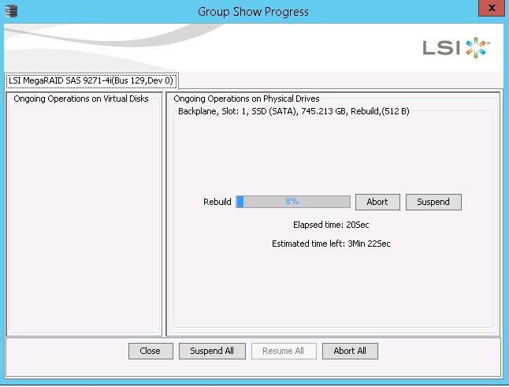

## Requirements
Hot swapping is only possible on the server ranges mHG, HG, and bHG.

To carry out the various steps of this guide, you must:

- Have a server mHG, HG, or bHG.
- Have a hardware RAID server (with a MegaRAID card).
- Have access to SSH (Linux and VmWare ESXi).
- Have access to RDP (Windows).
- The MegaCLI and / or StorCLI utilities must be installed (normally by default).

## In Linux

### Step 1&#58; Identify the disk to be replaced
In order to replace a disk, you will have to provide the technician with the Enclosure ID, the slot ID, and the Serial Number of the disk to be replaced.

Or otherwise (disk not detected for ex), the same information but for disks that are **NOT** to replace and specify it to the technician.

We will start by listing the disks on the server. While being able to retrieve the information cited above.

#### List of disks
To list the disks, you can use the following command: MegaCli -PdList -aALL | Egrep "Slot | Device ID | Device Id"

For example :

  <pre class="highlight command-prompt"> MegaCli -PdList -aALL | egrep "Slot|Device ID|Device Id"
Enclosure Device ID: 252
Slot Number: 0
Device Id: 6
Enclosure Device ID: 252
Slot Number: 1
Device Id: 5
Enclosure Device ID: 252
Slot Number: 2
Device Id: 4
Enclosure Device ID: 252
Slot Number: 3
Device Id: 7 </pre>

The MegaCli -PdList -aALL command, without *GREP*, can display all information on a disk.

> [!primary]
>
> Equivalent via the storcli command :
> 
  <pre class="highlight command-prompt"> storcli /call show all
&nbsp;
PD LIST :
=======
&nbsp;
----------------------------------------------------------------------------
EID:Slt DID State DG       Size Intf Med SED PI SeSz Model               Sp
----------------------------------------------------------------------------
252:0     6 Onln   0 744.687 GB SATA SSD N   N  512B INTEL SSDSC2BB800H4 U
252:1     5 Onln   0 744.687 GB SATA SSD N   N  512B INTEL SSDSC2BB800H4 U
252:2     4 Onln   0 744.687 GB SATA SSD N   N  512B INTEL SSDSC2BB800H4 U
252:3     7 Onln   0 744.687 GB SATA SSD N   N  512B INTEL SSDSC2BB800H4 U
---------------------------------------------------------------------------- </pre>

> This is an excerpt from the return of the storcli command. Other information is visible, like the listing of the disks according to the raids etc ...
> 

With MegaCLI, you can also list disks according to the raids with this command: MegaCli -CfgDsply -a0.

#### Test and identify a disk &#58;
To test a disk / identify its serial number, you must perform the smartctl command as follows :

  <pre class="highlight command-prompt"> smartctl -a -d megaraid,6 /dev/sda | grep Serial
Serial Number:    BTWH509602CV800CGN </pre>

The number **6** in this command corresponds to the Device ID of the disk (*Device ID* under MegaCLI, and *DID* under storCLI).

This information is found in the disc listing, performed in the previous step.

We now know the Enclosure ID, the Slot ID, and the Serial Number of the drive to be replaced.

### Step 2&#58; Turn on a disc
To allow the technician to replace your drive with heater, the HS drive must be switched on (flashing).

In our example, we have Enclosure ID **252**, Slot ID **0**, and Serial Number **BTWH509602CV800CGN** to be replaced.

The command to flash the disk is as follows: MegaCli -PdLocate -start -physdrv [EncID: SlotID] -a0.

  <pre class="highlight command-prompt"> MegaCli -PdLocate -start -physdrv[252:0] -a0
&nbsp;
Adapter: 0: Device at EnclId-252 SlotId-0  -- PD Locate Start Command was successfully sent to Firmware
&nbsp;
Exit Code: 0x00 </pre>

> [!primary]
>
> Equivalent via the storcli command :
> 
  <pre class="highlight command-prompt"> rescue:~# storcli /call /e252 /s0 start locate
Controller = 0
Status = Success
Description = Start Drive Locate Succeeded. </pre>

To turn the disc off after the operation, simply replace the "start" with "stop" in the above commands.

At this point, the procedure is ready to be performed. You can then provide the previously collected information to the support team and indicate that the disc is turned on.

### Step 3&#58; Check the rebuilding
Once the intervention scheduled in the Datacenter is completed, you can re-test the RAID and disks, and see that the replaced disk is in **Rebuild**.

  <pre class="highlight command-prompt"> MegaCli -PdList -aALL | egrep "Slot|Device ID|state"
Enclosure Device ID: 252
Slot Number: 0
Firmware state: Rebuild
Enclosure Device ID: 252
Slot Number: 1
Firmware state: Online, Spun Up
... </pre>

  <pre class="highlight command-prompt"> storcli /call show all
PD LIST :
=======
&nbsp;
----------------------------------------------------------------------------
EID:Slt DID State DG       Size Intf Med SED PI SeSz Model               Sp
----------------------------------------------------------------------------
252:0     6 Rbld   0 744.687 GB SATA SSD N   N  512B INTEL SSDSC2BB800H4 U
252:1     5 Onln   0 744.687 GB SATA SSD N   N  512B INTEL SSDSC2BB800H4 U
252:2     4 Onln   0 744.687 GB SATA SSD N   N  512B INTEL SSDSC2BB800H4 U
252:3     7 Onln   0 744.687 GB SATA SSD N   N  512B INTEL SSDSC2BB800H4 U </pre>

The RAID is in state **Degraded** the time of reconstruction, this is normal.

  <pre class="highlight command-prompt"> MegaCli -LDInfo -Lall -aALL
&nbsp;
&nbsp;
Adapter 0 -- Virtual Drive Information:
 Drive: 0 (Target Id: 0)
Name                :
RAID Level          : Primary-1, Secondary-0, RAID Level Qualifier-0
Size                : 1.454 TB
Sector Size         : 512
Is VD emulated      : Yes
Mirror Data         : 1.454 TB
State               : Degraded
Strip Size          : 256 KB
Number Of Drives per span:2
Span Depth          : 2
Default Cache Policy: WriteThrough, ReadAhead, Direct, No Write Cache if Bad BBU
Current Cache Policy: WriteThrough, ReadAhead, Direct, No Write Cache if Bad BBU
Default Access Policy: Read/Write
Current Access Policy: Read/Write
Disk Cache Policy   : Enabled
Encryption Type     : None
Bad Blocks Exist: No
PI type: No PI
&nbsp;
Is VD Cached: No
&nbsp;
Exit Code: 0x00 </pre>

Finally, you can also check the progress of the rebuild with the following command MegaCli -PDRbld -ShowProg -PhysDrv [EncID: SlotID] -a0

  <pre class="highlight command-prompt"> MegaCli -PDRbld -ShowProg -PhysDrv [252:0] -a0
&nbsp;
Rebuild Progress on Device at Enclosure 252, Slot 0 Completed 93% in 0 Minutes.
&nbsp;
Exit Code: 0x00 </pre>

> [!primary]
>
> Equivalent via the storcli command :
> 
  <pre class="highlight command-prompt"> storcli /call /e252 /s0 show rebuild </pre>

## In Windows
This guide is based on a Windows Server 2012 R2 Standard system. The MegaRaid Storage Manager tool is installed by default.

### Step 1 &#58; Verify that the server has a MegaRaid card
So we go to the menu Device management, and we see the presence of the MegaRaid card (9271-4i)

{.thumbnail}

### Step 2 &#58; Identify the disk to be replaced
At first, we will open MegaRAID Storage Manager.

{.thumbnail}

Then click Login, and fill in your login/password. (The manipulations in our case are carried out by being Administrator).

Then we arrive on the Management screen of the MegaRaid card.

{.thumbnail}

We will now check the **Serial Number** of our HS drive and its position in the server (**Enclosure ID** and **Slot ID**).

We go to the Logical tab, and we get to this.

{.thumbnail}

On this screen, a lot of information is present.

We see, on the left, the logical view of our RAID. Here we have a RAID 10 (id0) in optimal state. It consists of two clusters of 2 discs.

We can see that our **Slot Number 1** drive is in the 1st cluster. On the right side of the screen, we retrieve the information we need (**Enclosure / Slot / Serial**).

So our disk has for **Enclosure ID 252**, **Slot Number 1**, and **Serial Number BTWH509504BN800CGN**.

From now on, we will be able to light (physically flash) the disk to be replaced for replacement by a Datacenter technician.

### Step 3 &#58; Turn on a disc
With the MegaRAID Storage Manager it will be very easy to turn on the LED of the dicus to be replaced.

> [!primary]
>
> First of all, it is better to stop the Locator on each disk in order to avoid any error in Datacentre. Indeed, if during a previous intervention the LED has not been turned off, there will be two disks of lights on the server.
> 

To do this, right click on each disk, and click on **stop locating drive**.

{.thumbnail}

Now we can turn on the disk we are interested in.

Right click on our disk, **Slot ID 1**, and **Serial Number BTWH509504BN800CGN**.

{.thumbnail}

Then click on **start locating drive**

At this point, the procedure is ready to be performed. You can then provide the information previously gathered (**Enclosure ID, Slot ID, and Serial Number**), and indicate that the drive is turned on.

### Step 4 &#58; Check the rebuilding
Once you have completed the Datacenter, you can go back to the MegaRAID Storage Manager in the Background operations and check that the disk is *Rebuild*.

{.thumbnail}

The detail will return you this type of result :

{.thumbnail}

Also, on the **Logical** tab, we always have the details of RAID and disks.

{.thumbnail}

The **Slot ID 1** is in doing of *Rebuild*.

> [!primary]
>
> The RAID is in degraded state during Rebuild, which is normal.
> 

Finally, it is preferable to repeat the operation of the stop locate seen previously for the disk that has just been replaced.

## In VmWare ESXi
In this guide, we assume you have received an alert for the failed **Slot Number 1**, **Serial Number BTWA547608CE800HGN** and you want to replace it hot.

For this we will need the **Enclosure ID**, the **Slot Number**, and **Serial Number** of the disc to be replaced to communicate them to the Datacentre.

> [!primary]
>
> The MegaCLI tool must be installed on the server.
> 

### Step 1 &#58; Verify that the server has a MegaRaid card
Before continuing, we will verify that the server has a MegaRAID card.

  <pre class="highlight command-prompt"> lspci | grep -i mega
0000:81:00.0 Mass storage controller: Avago (LSI / Symbios Logic) MegaRAID SAS Fusion Controller [vmhba2] </pre>

Via the Vsphere client, you can also find this information in Manage, then Hardware Tab.

{.thumbnail}

We have an LSI MegaRAID card.

### Step 2 &#58; Identify the disk to be replaced
For a disk replacement, the **Enclosure ID**, **Slot Number**, and **Serial Number** must be supplied to the Data Center of the drive to be replaced.

If the disk is no longer detected, for example, it will be necessary to provide the same information from all other disks to **DO NOT** replace.

At first, we will list the disks present on the server while being able to recover the information listed above.

#### List of disks

  <pre class="highlight command-prompt"> [root@ns3043198:/opt/lsi/MegaCLI] ./MegaCli -PdList -aALL | egrep "Slot|Device ID|Device Id"
Enclosure Device ID: 252
Slot Number: 0
Device Id: 4
Enclosure Device ID: 252
Slot Number: 1
Device Id: 7
Enclosure Device ID: 252
Slot Number: 2
Device Id: 5
Enclosure Device ID: 252
Slot Number: 3
Device Id: 6 </pre>

We have therefore recovered the ID of our HS **Slot Number 1** which is **Device ID 7**, and its **Enclosure ID 252**.

### Step 3 &#58; Turn on a disc
To perform the replacement operation, the HS drive must be switched on (flashing).

> [!primary]
>
> Before turning on the LED of the disk that interests us here, we will first go through each disk to turn off the LEDs (in case a LED is always on after a previous intervention).
> 

In this case, we have 4 discs that have as **Enclosure ID** 252, and as **Slot Number** 1, 2, 3, and 4.

We will use the following command: ./MegaCli -PdLocate -stop -physdrv [EncID: SlotID] -a0

  <pre class="highlight command-prompt"> [root@ns3043198:/opt/lsi/MegaCLI] ./MegaCli -PdLocate -stop -physdrv[252:0] -a0
&nbsp;
Adapter: 0: Device at EnclId-252 SlotId-0  -- PD Locate Stop Command was successfully sent to Firmware
&nbsp;
Exit Code: 0x00
[root@ns3043198:/opt/lsi/MegaCLI] ./MegaCli -PdLocate -stop -physdrv[252:1] -a0
&nbsp;
Adapter: 0: Device at EnclId-252 SlotId-1  -- PD Locate Stop Command was successfully sent to Firmware
&nbsp;
Exit Code: 0x00
[root@ns3043198:/opt/lsi/MegaCLI] ./MegaCli -PdLocate -stop -physdrv[252:2] -a0
&nbsp;
Adapter: 0: Device at EnclId-252 SlotId-2  -- PD Locate Stop Command was successfully sent to Firmware
&nbsp;
Exit Code: 0x00
[root@ns3043198:/opt/lsi/MegaCLI] ./MegaCli -PdLocate -stop -physdrv[252:3] -a0
&nbsp;
Adapter: 0: Device at EnclId-252 SlotId-3  -- PD Locate Stop Command was successfully sent to Firmware
&nbsp;
Exit Code: 0x00 </pre>

We now switch to the disk we want to replace to turn on the LED.

To do this, we use the following command: ./MegaCli -PdLocate -start -physdrv[EncID:SlotID] -a0

  <pre class="highlight command-prompt"> [root@ns3043198:/opt/lsi/MegaCLI] ./MegaCli -PdLocate -start -physdrv[252:1] -a0
&nbsp;
Adapter: 0: Device at EnclId-252 SlotId-1  -- PD Locate Start Command was successfully sent to Firmware
&nbsp;
Exit Code: 0x00 </pre>

At this point, the procedure is ready to be performed. You can then provide the information previously gathered (**Enclosure ID, Slot Number or Slot ID, Serial Number**), and indicate that the disc is turned on.

### Step 4 &#58; Check the rebuilding
Once you have completed the Datacenter, you can re-test RAID and disks to verify that the replaced disk is in *Rebuild*.

  <pre class="highlight command-prompt"> [root@ns3043198:/opt/lsi/MegaCLI] ./MegaCli -PdList -aALL | egrep "Slot|Device ID|state"
Enclosure Device ID: 252
Slot Number: 0
Firmware state: Online, Spun Up
Enclosure Device ID: 252
Slot Number: 1
Firmware state: Rebuild
Enclosure Device ID: 252
Slot Number: 2
Firmware state: Online, Spun Up
Enclosure Device ID: 252
Slot Number: 3
Firmware state: Online, Spun Up </pre>

> [!primary]
>
> The RAID is in degraded state during rebuild, which is normal.
> 

You can also check the progress of the rebuild with the following command :

  <pre class="highlight command-prompt"> [root@ns3043198:/opt/lsi/MegaCLI] ./MegaCli -PDRbld -ShowProg -PhysDrv [252:1] -a0
&nbsp;
Rebuild Progress on Device at Enclosure 252, Slot 1 Completed 93% in 0 Minutes.
&nbsp;
Exit Code: 0x00 </pre>

