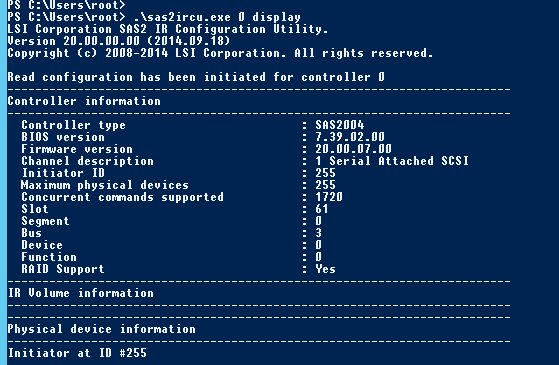

## Requirements
Hot swapping is only possible on the server ranges mHG, HG, and bHG.

To carry out the various steps of this guide, you must:

- Have a server that is mHG, HG, or bHG.
- Have a server using software RAID (with a LSI card).
- Have access to SSH (Linux) or RDP (Windows).
- Have the sas2ircu utility installed beforehand. (Available via the search engine [broadcom](https://www.broadcom.com/support/download-search/?dk=sas2ircu){.external})

In this guide, we will assume that you have received an alert for the disk /dev/sdb, Serial Number **K4GW439B**, which is defective and you want to hotswap it.

For this we will need the **Enclosure ID**, the **Slot ID**, and the **Serial Number** of the disk that needs to be replaced.

## In Linux

### Step 1&#58; Identify the disk
We have been notified that our SDB disk is defective, so we will test it and check its **Serial Number**.

  <pre class="highlight command-prompt"> root@ns3054662:/home# smartctl -a /dev/sdb
smartctl 6.4 2014-10-07 r4002 [x86_64-linux-3.14.32-xxxx-grs-ipv6-64] (local build)
Copyright (C) 2002-14, Bruce Allen, Christian Franke, www.smartmontools.org
&nbsp;
=== START OF INFORMATION SECTION ===
Vendor:               HGST
Product:              HUS726040ALS210
Revision:             A907
Compliance:           SPC-4
User Capacity:        4,000,787,030,016 bytes [4.00 TB]
Logical block size:   512 bytes
LB provisioning type: unreported, LBPME=0, LBPRZ=0
Rotation Rate:        7200 rpm
Form Factor:          3.5 inches
Logical Unit id:      0x5000cca25d3155bc
Serial number:        K4GW439B
Device type:          disk
Transport protocol:   SAS (SPL-3)
Local Time is:        Mon Nov 21 14:23:43 2016 CET
SMART support is:     Available - device has SMART capability.
SMART support is:     Enabled
Temperature Warning:  Enabled
&nbsp;
=== START OF READ SMART DATA SECTION ===
SMART Health Status: OK
&nbsp;
Current Drive Temperature:     34 C
Drive Trip Temperature:        85 C
&nbsp;
Manufactured in week 44 of year 2016
Specified cycle count over device lifetime:  50000
Accumulated start-stop cycles:  9
Specified load-unload count over device lifetime:  600000
Accumulated load-unload cycles:  14
Elements in grown defect list: 0
&nbsp;
Vendor (Seagate) cache information
Blocks sent to initiator = 2305525022720
&nbsp;
Error counter log:
       Errors Corrected by           Total   Correction     Gigabytes    Total
           ECC          rereads/    errors   algorithm      processed    uncorrected
       fast | delayed   rewrites  corrected  invocations   [10^9 bytes]  errors
read:          0        572         0       22548         77          4.725         5580
write:         0        0         0         19548       196         17.344          2569
&nbsp;
Non-medium error count:        0
&nbsp;
SMART Self-test log
Num  Test              Status                 segment  LifeTime  LBA_first_err [SK ASC ASQ]
 Description                              number   (hours)
# 1  Background short  Completed                   -       6                 - [-   -    -]
# 2  Background short  Completed                   -       4                 - [-   -    -]
# 3  Background short  Completed                   -       4                 - [-   -    -]
# 4  Background short  Completed                   -       4                 - [-   -    -]
# 5  Background short  Completed                   -       1                 - [-   -    -]
&nbsp;
Long (extended) Self Test duration: 34237 seconds [570.6 minutes] </pre>

Or more simply :

  <pre class="highlight command-prompt"> root@ns3054662:/home# smartctl -a /dev/sdb | grep Serial
Serial number:        K4GW439B </pre>

We find that our SDB is actually defective (uncorrected errors in our case), and that its serial number corresponds to the alert received (via Datacentre or any other monitoring tool).

So we can move on to the next step of retrieving the **Enclosure ID** and **Slot ID** information from the disk to be replaced.

### Step 2&#58; Locate the position of the disk
In order to retrieve the **Slot ID** and **Enclosure ID** from our defective SDB disk, we will need the sas2ircu software to be installed on the server.

First, we will check that the disk is connected via a LSI card.

  <pre class="highlight command-prompt"> root@ns3054662:/home# lspci | grep -i LSI
81:00.0 Serial Attached SCSI controller: LSI Logic / Symbios Logic SAS2004 PCI-Express Fusion-MPT SAS-2 [Spitfire] (rev 03)
&nbsp;
We can see that we have a LSI card.
&nbsp;
We must now determine the ID of this LSI card. </pre>

  <pre class="highlight command-prompt"> root@ns3054662:/home# ./sas2ircu list
LSI Corporation SAS2 IR Configuration Utility.
Version 5.00.00.00 (2010.02.09)
Copyright (c) 2009 LSI Corporation. All rights reserved.
&nbsp;
&nbsp;
         Adapter      Vendor  Device                       SubSys  SubSys
 Index    Type          ID      ID    Pci Address          Ven ID  Dev ID
 -----  ------------  ------  ------  -----------------    ------  ------
     0     SAS2004     1000h    70h   00h:81h:00h:00h      1000h   3010h
SAS2IRCU: Utility Completed Successfully. </pre>

The index corresponds to the ID, so our map has the index / ID 0.

With this information, we can now retrieve the **Slot ID** and **Enclosure ID** for our SDB disk, **Serial Number** K4GW439B.

  <pre class="highlight command-prompt"> root@ns3054662:/home# ./sas2ircu 0 display | grep -B 7 -A 2 K4GW439B
Device is a Hard disk
  Enclosure #                             : 1
  Slot #                                  : 3
  State                                   : Available (AVL)
  Manufacturer                            : HGST
  Model Number                            : HUS726040ALS210
  Firmware Revision                       : A907
  Serial No                               : K4GW439B
  Protocol                                : SAS
  Drive Type                              : SAS_HDD </pre>

With this command we directly retrieve the information for our SDB disk.

Of course, **K4GW439B** will be replaced by the Serial Number of the drive to be replaced, and **0** by the ID of the RAID card concerned.

From our example above, the disk has the **Enclosure ID** of 1, and the **Slot ID** of 3.

### Step 3&#58; Turn on the disk indicator
With the information retrieved in the previous steps, we can turn on the LED of the defective disk for replacement with the command : ./sas2ircu 0 locate EncID:SlotID on

  <pre class="highlight command-prompt"> root@ns3054662:/home# ./sas2ircu 0 locate 1:3 on
LSI Corporation SAS2 IR Configuration Utility.
Version 5.00.00.00 (2010.02.09)
Copyright (c) 2009 LSI Corporation. All rights reserved.
&nbsp;
SAS2IRCU: LOCATE command completed successfully.
SAS2IRCU: Command LOCATE Completed Successfully.
SAS2IRCU: Utility Completed Successfully. </pre>

In this example, we have used the information gathered from the previous steps where 0 is the Index of the RAID card, 1 is the Enclosure ID, and 3 is the Slot ID.

You can turn off the blinking LED of the disk by replacing "on" with "off" in the command.

Now we have to move on to the last step of removing the defective disk from the software RAID before the datacentre intervention begins.

### Step 4&#58; Remove the disk from the RAID
Before removing the defective disk from the RAID, we must set it to ``Faulty`` if this is not already the case (We are using the SDB disk in our example).

We will first look at the state of the RAID.

  <pre class="highlight command-prompt"> root@ns3054662:/home# cat /proc/mdstat
Personalities : [linear] [raid0] [raid1] [raid10] [raid6] [raid5] [raid4] [multipath] [faulty]
md2 : active raid1 sda2[0] sdb2[1]
      3885385728 blocks super 1.2 [2/2] [UU]
      bitmap: 0/29 pages [0KB], 65536KB chunk
&nbsp;
md1 : active raid1 sdb1[1] sda1[0]
      20971456 blocks [2/2] [UU]
&nbsp;
unused devices: <none> </pre>

We see that our defective SDB disk is part of md1 and md2 (sdb1 and sdb2).

We will now set the disk to ``Faulty`` (sdb1 in md1, and sdb2 in md2 respectively).

  <pre class="highlight command-prompt"> root@ns3054662:/home# mdadm --manage /dev/md1 --set-faulty /dev/sdb1
mdadm: set /dev/sdb1 faulty in /dev/md1 </pre>

  <pre class="highlight command-prompt"> root@ns3054662:/home# mdadm --manage /dev/md2 --set-faulty /dev/sdb2
mdadm: set /dev/sdb2 faulty in /dev/md2 </pre>

The RAID status is checked again.

  <pre class="highlight command-prompt"> root@ns3054662:/home# cat /proc/mdstat
Personalities : [linear] [raid0] [raid1] [raid10] [raid6] [raid5] [raid4] [multipath] [faulty]
md2 : active raid1 sda2[0] sdb2[1](F)
      3885385728 blocks super 1.2 [2/1] [U_]
      bitmap: 0/29 pages [0KB], 65536KB chunk
&nbsp;
md1 : active raid1 sdb1[2](F) sda1[0]
      20971456 blocks [2/1] [U_]
&nbsp;
unused devices: <none> </pre>

sdb1 and sdb2 are now showing as faulty (F).

Now we can remove the disks from the software RAID.

  <pre class="highlight command-prompt"> root@ns3054662:/home# mdadm --manage /dev/md1 --remove /dev/sdb1
mdadm: hot removed /dev/sdb1 from /dev/md1 </pre>

  <pre class="highlight command-prompt"> root@ns3054662:/home# mdadm --manage /dev/md2 --remove /dev/sdb2
mdadm: hot removed /dev/sdb2 from /dev/md2 </pre>

Then we check one last time that the disk is no longer present.

  <pre class="highlight command-prompt"> root@ns3054662:/home# cat /proc/mdstat
Personalities : [linear] [raid0] [raid1] [raid10] [raid6] [raid5] [raid4] [multipath] [faulty]
md2 : active raid1 sda2[0]
      3885385728 blocks super 1.2 [2/1] [U_]
      bitmap: 0/29 pages [0KB], 65536KB chunk
&nbsp;
md1 : active raid1 sda1[0]
      20971456 blocks [2/1] [U_]
&nbsp;
unused devices: <none> </pre>

We are now ready to have the defective disk replaced by a datacentre technician.

As we have prepared the server for the intervention, the new disk will take the SDB name, and all that is left to do is to rebuild the software RAID.

## In Windows
The Windows-based guide will be similar to the replacement guide for Linux. We will use the same utility: sas2ircu, and the commands in Windows are the same as it is in Linux.

> [!primary]
>
> It is important to run the powershell terminal as an administrator to avoid errors.
> 

In this guide, we will assume that you have received an alert for the disk /dev/sdb, Serial Number **K4G187WB**, which is defective and you want to hotswap it.

For this we will need the **Enclosure ID**, the **Slot ID**, and the **Serial Number** of the disk that needs to be replaced.

### Step 1&#58; Identify the disk
We have been notified that our SDB disk is defective, so we will test it and check its **Serial Number**.

{.thumbnail}

> [!warning]
>
> The disk used for our guide is not actually defective, but for demonstration purposes, we will perform the following procedure as if it is.
> 

The Serial Number of the disk corresponds to the alert received (via the Datacentre or any other monitoring tool).

So we can move on to the next step of retrieving the **Enclosure ID** and **Slot ID** information from the disk to be replaced.

### Step 2&#58; Locate the position of the disk
We will now retrieve the **Slot ID** and **Enclosure ID** from our defective SDB disk. To do this, we will need the sas2ircu software installed on the server.

First, determine the ID of the LSI RAID card present in the server.

{.thumbnail}

So we have our LSI card which has index / ID "0".

With this information, we can now find the **Slot ID** and **Enclosure ID** of our SDB disk, **Serial Number** K4G187WB.

> [!primary]
>
> The example Serial Number K4G187WB will of course be replaced by yours.
> 

{.thumbnail}

You can also search for information by listing the disks in a more general way.

{.thumbnail}

{.thumbnail}

We can see that our **Serial Number** K4G187WB has the **Enclosure ID** of 1, and the **Slot ID** of 1 (2nd disk of the list in this case).

### Step 3&#58; Turn on the disk indicator
With the information retrieved in the previous steps, we can turn on the LED of the defective disk for replacement with the following command : .\sas2ircu.exe ID locate EncID:SlotID on

{.thumbnail}

> [!primary]
>
> You can turn off the blinking LED of the disk after it has been replaced by using "off" instead of "on" in the previous command.
> 

Now we have to move on to the last step of removing the defective disk from the software RAID before the datacentre intervention begins.

### Step 4&#58; Remove the disk from the RAID
Soon...