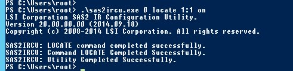

**Last updated 21st November 2016**

## Objective

If one of the disks on your server is failing, you can hot-swap it if you have a compatible top-range model.

**Find out the main steps for hot-swapping a disk on a server with a software RAID configuration.**

## Requirements

- an mHG, HG or BHG server
- a software RAID (with an LSI card)
- SSH (Linux) or RDP (Windows) access
- the "sas2ircu" utility (use the [Broadcom](https://www.broadcom.com/support/download-search/?dk=sas2ircu){.external} search engine to find it).

## Instructions

### On Linux

#### Step 1: Identify the disk concerned.

To illustrate the purpose of this guide, we assume that we have received an alert for the`/dev/sdb` disk. The disk is defective, and we want to hot-swap it. **Please adapt the details of this guide according to your specific situation.**

To begin, test and check the **Serial Number** of the disk concerned.

```sh
root@ns3054662:/home# smartctl -a /dev/sdb
>>> smartctl 6.4 2014-10-07 r4002 [x86_64-linux-3.14.32-xxxx-grs-ipv6-64] (local build)
>>> Copyright (C) 2002-14, Bruce Allen, Christian Franke, www.smartmontools.org

>>> === START OF INFORMATION SECTION ===
>>> Vendor:               HGST
>>> Product:              HUS726040ALS210
>>> Revision:             A907
>>> Compliance:           SPC-4
>>> User Capacity:        4,000,787,030,016 bytes [4.00 TB]
>>> Logical block size:   512 bytes
>>> LB provisioning type: unreported, LBPME=0, LBPRZ=0
>>> Rotation Rate:        7200 rpm
>>> Form Factor:          3.5 inches
>>> Logical Unit id:      0x5000cca25d3155bc
>>> Serial number:        K4GW439B
>>> Device type:          disk
>>> Transport protocol:   SAS (SPL-3)
>>> Local Time is:        Mon Nov 21 14:23:43 2016 CET
>>> SMART support is:     Available - device has SMART capability.
>>> SMART support is:     Enabled
>>> Temperature Warning:  Enabled

>>> === START OF READ SMART DATA SECTION ===
>>> SMART Health Status: OK

>>> Current Drive Temperature:     34 C
>>> Drive Trip Temperature:        85 C

>>> Manufactured in week 44 of year 2016
>>> Specified cycle count over device lifetime:  50000
>>> Accumulated start-stop cycles:  9
>>> Specified load-unload count over device lifetime:  600000
>>> Accumulated load-unload cycles:  14
>>> Elements in grown defect list: 0

>>> Vendor (Seagate) cache information
>>> Blocks sent to initiator = 2305525022720

>>> Error counter log:
>>>        Errors Corrected by           Total   Correction     Gigabytes    Total
>>>            ECC          rereads/    errors   algorithm      processed    uncorrected
>>>        fast | delayed   rewrites  corrected  invocations   [10^9 bytes]  errors
>>> read:          0        572         0       22548         77          4.725         5580
>>> write:         0        0         0         19548       196         17.344          2569

>>> Non-medium error count:        0

>>> SMART Self-test log
>>> Num  Test              Status                 segment  LifeTime  LBA_first_err [SK ASC ASQ]
>>>  Description                              number   (hours)
>>> # 1  Background short  Completed                   -       6                 - [-   -    -]
>>> # 2  Background short  Completed                   -       4                 - [-   -    -]
>>> # 3  Background short  Completed                   -       4                 - [-   -    -]
>>> # 4  Background short  Completed                   -       4                 - [-   -    -]
>>> # 5  Background short  Completed                   -       1                 - [-   -    -]

>>> Long (extended) Self Test duration: 34237 seconds [570.6 minutes]
```

Here, you will note that: 

- the "**SDB**" disk has failed due to uncorrected errors
- its **Serial Number** corresponds to the alert received (via the datacentre or any other monitoring tool)

To get only the **Serial Number**:

```sh
root@ns3054662:/home# smartctl -a /dev/sdb | grep Serial
>>> Serial number:        K4GW439B
```

#### Step 2: Retrieve the disk’s position.

You must now find the **Slot ID** and the **Enclosure ID** of the disk concerned. To do this, use the «sas2ircu» tool already installed on the server.

Then start by checking that the disks are properly connected via an LSI card.

```sh
root@ns3054662:/home# lspci | grep -i LSI
>>> 81:00.0 Serial Attached SCSI controller: LSI Logic / Symbios Logic SAS2004 PCI-Express Fusion-MPT SAS-2 [Spitfire] (rev 03)
```

If this is the case, determine the ID of this LSI card.

```sh
root@ns3054662:/home# ./sas2ircu list
>>> LSI Corporation SAS2 IR Configuration Utility.
>>> Version 5.00.00.00 (2010.02.09)
>>> Copyright (c) 2009 LSI Corporation. All rights reserved.


>>>          Adapter      Vendor  Device                       SubSys  SubSys
>>>  Index    Type          ID      ID    Pci Address          Ven ID  Dev ID
>>>  -----  ------------  ------  ------  -----------------    ------  ------
>>>      0     SAS2004     1000h    70h   00h:81h:00h:00h      1000h   3010h
>>> SAS2IRCU: Utility Completed Successfully.
```

The index corresponds to the ID. Here, the card has the index/ID 0.

With this information, now retrieve for the disk concerned (via its **Serial Number**): the **Slot ID** and the **Enclosure ID**.

```sh
root@ns3054662:/home# ./sas2ircu 0 display | grep -B 7 -A 2 K4GW439B
>>> Device is a Hard disk
>>>   Enclosure                               : 1
>>>   Slot                                    : 3
>>>   State                                   : Available (AVL)
>>>   Manufacturer                            : HGST
>>>   Model Number                            : HUS726040ALS210
>>>   Firmware Revision                       : A907
>>>   Serial No                               : K4GW439B
>>>   Protocol                                : SAS
>>>   Drive Type                              : SAS_HDD
```

This command is used to obtain the disk information, including the **Serial Number**, which is the K4GW439B here.

In our example, we retrieved the **Enclosure ID** (corresponding to 1) and the **Slot ID** (corresponding to 3).

#### Stage 3: Switch on the disk.

Using the information retrieved during the previous steps, turn on the LED of the faulty disk, and replace it with the command `./sas2ircu 0 locate EncID:SlotID on`. Customise it to suit your situation, as per the example below:

```sh
root@ns3054662:/home# ./sas2ircu 0 locate 1:3 on
>>> LSI Corporation SAS2 IR Configuration Utility.
>>> Version 5.00.00.00 (2010.02.09)
>>> Copyright (c) 2009 LSI Corporation. All rights reserved.

>>> SAS2IRCU: LOCATE Command completed successfully.
>>> SAS2IRCU: Command LOCATE Completed Successfully.
>>> SAS2IRCU: Utility Completed Successfully.
```

You can disable the disk flashing, by replacing "on" with "off" in the command.

#### Step 4: Remove the defective disk from the RAID.

If you have not already done so, switch the defective disk to **Faulty**. Then look at the RAID status.

```sh
root@ns3054662:/home# cat /proc/mdstat
>>> Personalities : [linear] [raid0] [raid1] [raid10] [raid6] [raid5] [raid4] [multipath] [faulty]
>>> md2 : active raid1 sda2[0] sdb2[1]
>>>       3885385728 blocks super 1.2 [2/2] [UU]
>>>       bitmap: 0/29 pages [0KB], 65536KB chunk

>>> md1 : active raid1 sdb1[1] sda1[0]
>>>       20971456 blocks [2/2] [UU]

>>> unused devices: <none>
```

In this example, the defective disk is part of md1 and md2 (sdb1 and sdb2). We will therefore change this one to **Faulty**, respectively sdb1 in md1 and sdb2 in md2.

```sh
root@ns3054662:/home# mdadm --manage /dev/md1 --set-faulty /dev/sdb1
>>> mdadm: set /dev/sdb1 faulty in /dev/md1
```

```sh
root@ns3054662:/home# mdadm --manage /dev/md2 --set-faulty /dev/sdb2
>>> mdadm: set /dev/sdb2 faulty in /dev/md2
```

once you have made these changes, check the RAID status again.

```sh
root@ns3054662:/home# cat /proc/mdstat
>>> Personalities : [linear] [raid0] [raid1] [raid10] [raid6] [raid5] [raid4] [multipath] [faulty]
>>> md2 : active raid1 sda2[0] sdb2[1](F)
>>>       3885385728 blocks super 1.2 [2/1] [U_]
>>>       bitmap: 0/29 pages [0KB], 65536KB chunk

>>> md1 : active raid1 sdb1[2](F) sda1[0]
>>>       20971456 blocks [2/1] [U_]

>>> unused devices: <none>
```

The sdb1 and sdb2 have been switched to faulty **(F)**. You can now remove the disk from the RAID.

```sh
root@ns3054662:/home# mdadm --manage /dev/md1 --remove /dev/sdb1
>>> mdadm: hot removed /dev/sdb1 from /dev/md1
```

```sh
root@ns3054662:/home# mdadm --manage /dev/md2 --remove /dev/sdb2
>>> mdadm: hot removed /dev/sdb2 from /dev/md2
```

Finally, check that the disk is no longer present.

```sh
root@ns3054662:/home# cat /proc/mdstat
>>> Personalities : [linear] [raid0] [raid1] [raid10] [raid6] [raid5] [raid4] [multipath] [faulty]
>>> md2 : active raid1 sda2[0]
>>>       3885385728 blocks super 1.2 [2/1] [U_]
>>>       bitmap: 0/29 pages [0KB], 65536KB chunk

>>> md1 : active raid1 sda1[0]
>>>       20971456 blocks [2/1] [U_]

>>> unused devices: <none>
```

The defective disk is now ready to be replaced by a datacentre technician. Once the operation is complete, you just have to resync the RAID. To do this, you can use the following guide: [Configuring software RAID](../raid-soft/){.external}

### On Windows

#### Step 1: Identify the disk.

To illustrate the purpose of this guide, we assume that we have received an alert for the`/dev/sdb` disk. The disk is defective, and we want to hot-swap it. **Please adapt the details of this guide according to your specific situation.**

> [!primary]
>
> It is important to launch the command terminal as an administrator, so that you do not receive any errors.
> 

To begin, test and check the **Serial Number** of the disk concerned. In the screenshot below, the storage is not really defective, but we will act as if it were. 

{.thumbnail}

Here, you will note that: 

- the "**SDB**" disk has failed due to uncorrected errors
- its **Serial Number** corresponds to the alert received (via the datacentre or any other monitoring tool)

#### Step 2: Retrieve the disk’s position.

You will now need to find the **Slot ID** and the **Enclosure ID** of the disk concerned. To do this, use the «sas2ircu» tool already installed on the server.

Start by determining the ID of this LSI card.

{.thumbnail}

Our LSI card has the index/ID “0”.

With this information, now retrieve for the disk concerned (via its **Serial Number**): the **Slot ID** and the **Enclosure ID**.

{.thumbnail}

You can use this command to retrieve the disk information, including the **Serial Number**, which is K4G187WB here.

In our example, we have retrieved the **Enclosure ID** (corresponding to 1) and the **Slot ID** (corresponding to 1).

#### Stage 3: Switch on the disk.

Using the information retrieved during the previous steps, turn on the LED of the faulty disk, and replace it with the command `.\sas2ircu 0 locate EncID:SlotID on`. Customise it to suit your situation, as per the example below:

{.thumbnail}

You can disable the disk flashing, by replacing "on" with "off" in the command.

#### Step 4: Remove the defective disk from the RAID.

You can do this from the **Disk Management** interface of your Windows server.

The defective disk is now ready to be replaced by a datacentre technician. Once the operation is complete, you just have to resync the RAID. To do this, you can use the following guide: [Configuring software RAID](../raid-soft/){.external}

## Go further

Join our community of users on <https://community.ovh.com/en/>.