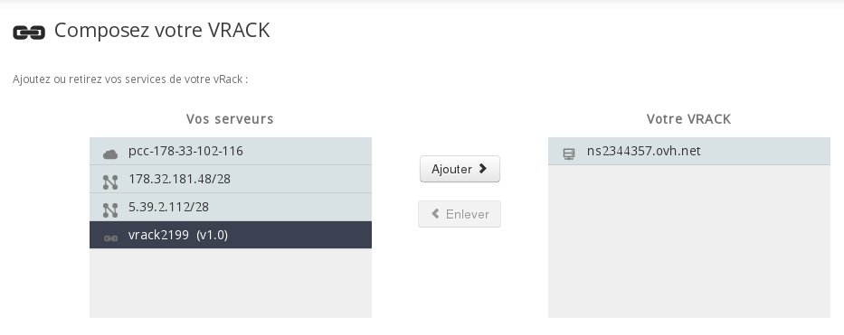
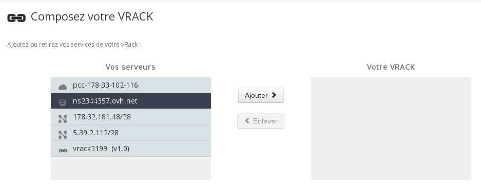

## 
Vamos precisar neste guia como efetuar a migração de um vRack 1.0 para um vRack 2.0


## 
Para efetuar esta operação necessita:

- De servidores com duas placas de rede que estão atualmente no vRack 1.0 (servidores da gama profissional com exceção dos servidores Superplan).
- Um vRack 1.0


## 
Para efetuar a migração dos seus servidores presentes no vRack 1.0 para um vRack 2.0, é necessário efetuar as seguintes etapas:

- Determinar a segunda interface de cada servidor
- Criar o vRack 2.0
- Configuração temporária de um endereço IP na interface do vRack 2.0
- Desativação da interface vRack 1.0 e Reconfiguração da interface vRack 2.0


## Determinar a interface do vRack 2.0

## Para colocar um servidor num vRack 2.0 deverá dispor de um servidor com duas interfaces de rede.
Vamos então determinar a interface vRack 2.0 do seu servidor:

Para conhecer a interface a configurar em Linux ou em modo de Rescue Pro:

liste as interfaces:


```
ifconfig -a | grep eth | awk '{print $1}'
```


exemplo:


```
#ifconfig -a | grep eth | awk '{print $1}'
eth0
eth1
```


A interface eth0 é já a nossa interface principal, podendo consultar o IP com um ifconfig

efetue depois:


```
#ifconfig eth1 up
#ethtool eth1 | grep "Link detected"
Link detected: yes
```


se receber "no" como retorno para o "Link detected" então essa placa não é a correta. Faça:


```
#ifconfig eth1 down
```


e faça o mesmo com as outras.

No nosso exemplo vamos guardar eth1.


## Criação de um vRack 2.0
Para criar um vRack 2.0 convidamo-lo a seguir o guia que trata desse assunto.


## Adicionar um vRack 1.0 no vRack 2.0
Para migrar o vRack 1.0 para vRack 2.0 convidamo-lo a colocar o vRack 1.0 no vRack 2.0.

Para tal, aceda ao seu Espaço Cliente através do seguinte link:

https://www.ovh.com/manager/

E selecione o vRack 2.0 no menu à esquerda.

Verá o seguinte:

{.thumbnail}
Selecione um vRack 1.0 na coluna dos serviços disponíveis (coluna da esquerda)

E depois clique em "Adicionar"


## Adicionar os seus servidores ao vRack 2.0
A fim de migrar o vRack 1.0 para o vRack 1.5, convidamo-lo a colocar os seus servidores no vRack 1.5.
Para tal, ligue-se ao seu Espaço Cliente através do URL: https://www.ovh.com/manager/dedicated

E selecione o vRack 2.0 no menu à esquerda.

Poderá consultar o seguinte:

{.thumbnail}
Selecione um servidor na coluna de serviços disponíveis (coluna da esquerda)

E depois clique em "Adicionar"


## Configuração temporária de um IP na interface do vRack 2.0

## Numa primeira fase é necessário efetuar uma configuração temporária para ser possível validar o funcionamento do vRack 2.0.
Adicione um IP privado na interface vRack para cada um dos seus servidores:

Exemplo:
(num servidor sob debian com eth1 para a interface vRack 2.0 e o bloco 10.0.0.0/24)

No ficheiro de configuração: /etc/network/interfaces

adicione:

```
auto eth1
iface eth1 inet static
address 10.0.0.1
netmask 255.255.255.0
broadcast 10.0.0.255
```


E depois reinicie a sua interface de rede:


```
service networking restart
```


Para outra distribuição consulte o guia: VrackInfrastructureServer na secção "ip privado" relacionado com a sua distribuição.

## Importante:
Verifique de seguida se consegue efetuar um ping de cada um dos seus servidores via os endereços IPs Privados que acaba de configurar
Se todos os servidores respondem a um simples ping vamos passar então à etapa seguinte.

Caso não respondam efetue o seguinte comando:


```
arping -I INTERFACE_VRACK_2.0 1.1.1.1
```


INTERFACE_VRACK_2.0: a substituir pela interface vRack 2.0 no nosso exemplo eth1.


## Desativação do vRack 1.0 e reconfiguração do vRack 2.0

## Importante:
Esta etapa vai levar a um pequeno corte, o tempo suficiente para migrar o IP que utiliza na interface 1.0 para a interface 2.0
Remova a configuração temporária da sua interface vRck 2.0 e da sua interface vRack 1.0

Depois, reinicie as suas interfaces.

Basta adicionar depois o seu IP do seu vRack 1.0 na sua interface 2.0.

Deixamos um exemplo para Debian:

Extrato da configuração antes da alteração:


```
auto eth0.XXXX
iface eth0.XXXX inet static
address 172.16.0.1
netmask 255.240.0.0
post-up ip r a 172.16.0.0/12 via 172.31.255.254 dev eth0.XXXX ;

auto eth1
iface eth1 inet static
address 10.0.0.1
netmask 255.255.255.0
broadcast 10.0.0.255
```


Extrato da configturação após a alteração:

```
auto eth1
iface eth1 inet static
address 172.16.0.1
netmask 255.240.0.0
broadcast 255.240.0.0
```


deve de seguida reiniciar as interfaces de rede.

Para outras distribuições pode consultar o guia VrackInfrastructureServer na secção que diz respeito à sua distribuição.

Os seus servidores devem poder comunicar imediatamente.


## Caso de um bloco IP público

## Importante:
Não tenha em atenção esta parte se o bloco público é o de uma ACE ou Firewall ASSA.

## Se dispõe de um IP Público e todos os seus servidores são compatíveis com o vRack 1.5, pode adicionar o seu bloco IP público no vRack 1.5. Assim, já não utilizará mais o vRack 1.0.
Ligue-se ao seu Espaço Cliente através do seguinte URL:

https://www.ovh.com/manager/dedicated

E selecione o bloco IP público no menu da esquerda.

Poderá consultar o seguinte:

{.thumbnail}

## Selecione um servidor na coluna de serviços disponíveis (coluna da esquerda)
E depois clique em "Adicionar"

## Importante:
Esta operação levará a um corte que durará cerca de 1 minuto.


## Paragem do vRack 1.0

## Importante:
Atenção, não tenha atenção a esta secção se dispuser de um servidor que não funcione no vRack 1.0:

Antigos servidores superplan compatíveis com o vRack 1.0
Se dispuser de uma ACE.
Se dispuser de uma Firewall ASA no seu vRack.

Se dispuser de um destes equipamentos terá de permanecer com o vRack 1.0 e não poderá, para já, efetuar uma migração.
Após os seus servidores estarem a comunicar no vRack 1.5, pode remover os servidores do vRack 1.0.

Ligue-se ao seu Espaço Cliente através do seguinte URL:

https://www.ovh.com/manager/dedicated

E na página adicione:

Selecione o seu vRack 1.0
E depois clique em "Retirar um servidor do Rack Virtual".
Depois, remova-os do Vrack ao selecioná-los na parte "Composição atual da sua infraestrutura" e clique em ">>".

Assim que os seus servidores estiverem a funcionar no vRack 2.0 e depois de ter removido todos os seus servidores do vRack 1.0, contacte o nosso suporte para pedir a eliminação definitiva do seu vRack 1.0.

