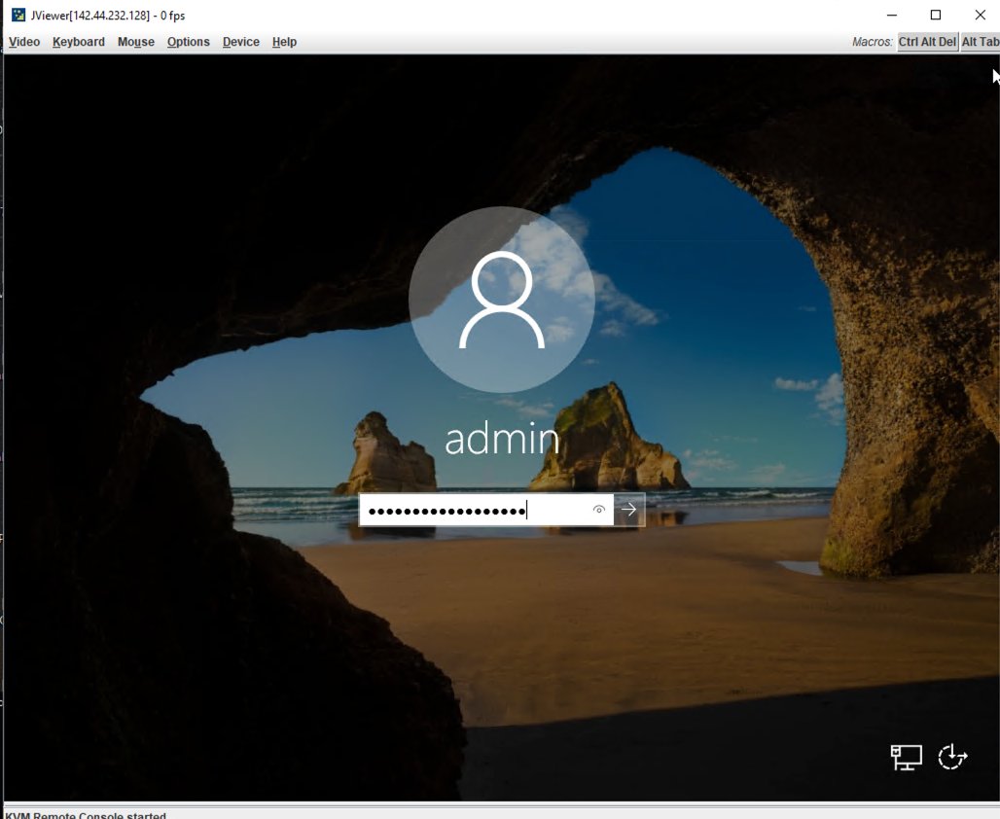
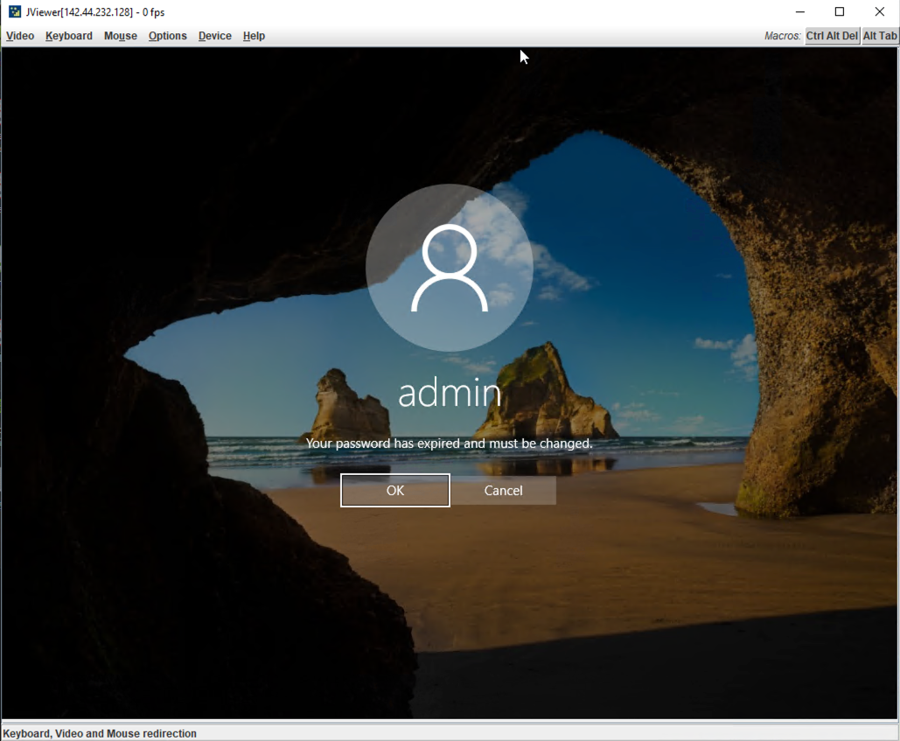
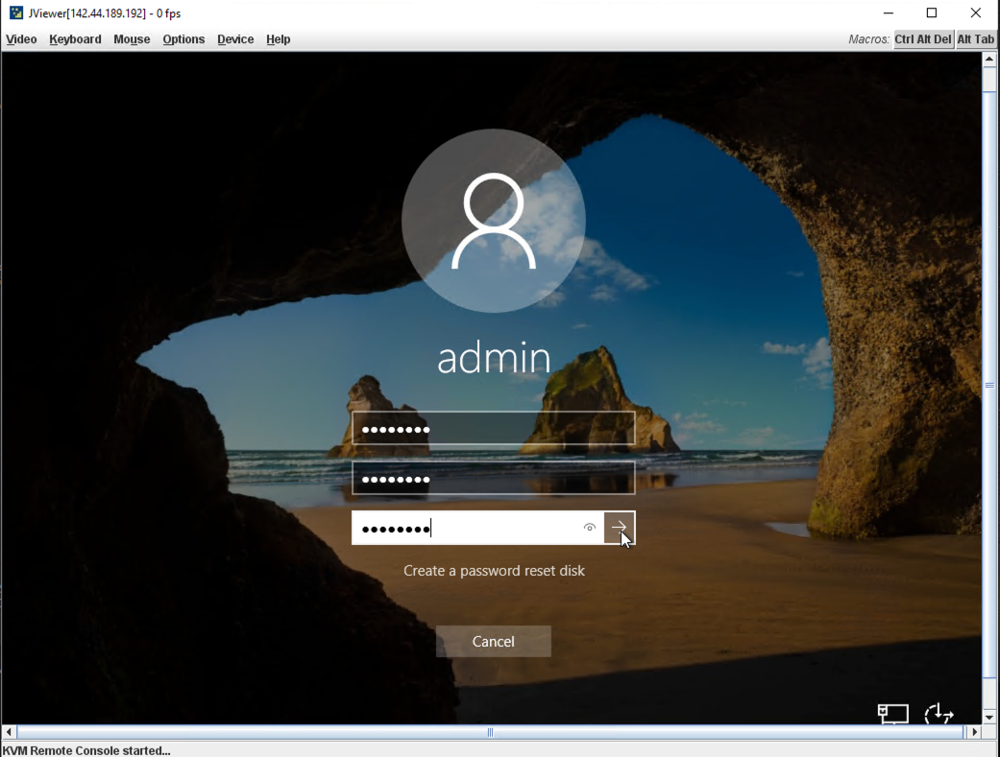
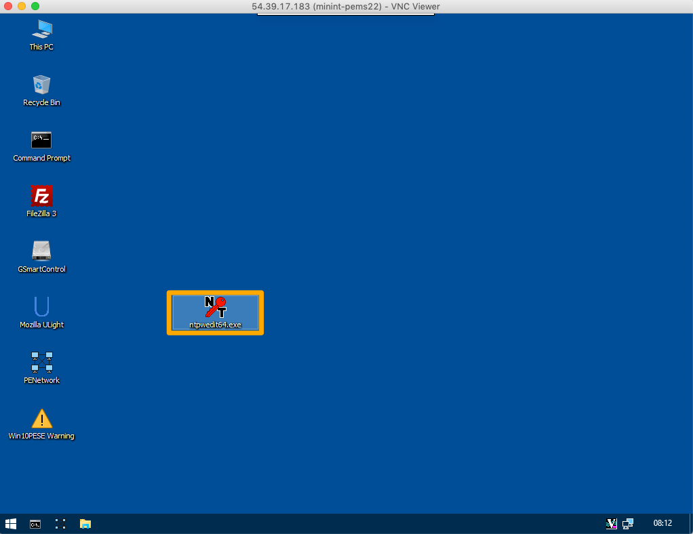
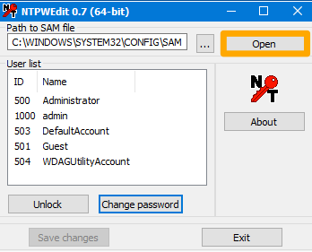
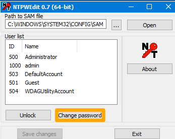
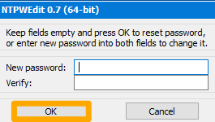
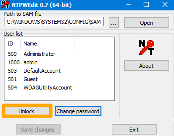

**Last updated 22nd June 2020**

## Objective

When you install or reinstall a Windows operating system, all account have a default expiration date of 42 days. When a password is expired, RDP access to that account is disabled. You will need to change the password to regain accesss.

**This guide will take you through the process of resetting the password.**

## Requirements

- A [dedicated server](https://www.ovh.com/world/dedicated-servers/){.external} with Windows installed.
- Access to the [OVHcloud Control Panel](https://ca.ovh.com/auth/?action=gotomanager){.external}

## Instructions

### Using the IPMI

First, log into your server's page in your [OVHcloud Control Panel](https://ca.ovh.com/auth/?action=gotomanager){.external}. Once there, select the `IPMI`{.action} tab.

> [!primary]
>
> For detailed information on how to use the IPMI feauture, please refer to our [IPMI guide](../use-ipmi-dedicated-servers/){.external}.
>

Next, activate the IPMI feature using either the Java applet or your browser. After the IPMI session has started, login to your admin account with your current credentials.

{.thumbnail}

You should now receive a message stating that "Your password has expired and must be changed. Click on `OK`{.action}.

{.thumbnail}

Now enter a new password and confirm it with the provided fields.

{.thumbnail}

Your password has now been changed. You can now once again access the server using RDP.

### Using Rescue Mode

First, boot your server into [rescue mode](../ovh-rescue/){.external} using the WinRescue boot environment. Once the server has rebooted, log in using a VNC viewer or select the `IPMI`{.action} tab on your server's page in your [OVHcloud Control Panel](https://ca.ovh.com/auth/?action=gotomanager){.external}. 

Next, open the NTPWdi tool. If it does not appear there, you can download a copy [here](http://cdslow.org.ru/files/ntpwedit/ntpwed07.zip){.external}

{.thumbnail}

Next, click the `Open`{.action} button to display a list of available user accounts.

{.thumbnail}

Now select the admin account from the list and click the `Change Password`{.action} button.

{.thumbnail}

Enter the new password twice and click `OK`{.action}.

{.thumbnail}

Finally, click the `Unlock`{.action} button.

{.thumbnail}

Your password has now been changed. Exit the tool, close the session, and reboot your server back into normal mode.

## Go further

[Rescue mode](../ovh-rescue/){.external}.

[Using the IPMI with dedicated servers](../use-ipmi-dedicated-servers/){.external}.

Join our community of users on <https://community.ovh.com/en/>.
