> [!primary]
> Esta traducción ha sido generada de forma automática por nuestro partner SYSTRAN. En algunos casos puede contener términos imprecisos, como en las etiquetas de los botones o los detalles técnicos. En caso de duda, le recomendamos que consulte la versión inglesa o francesa de la guía. Si quiere ayudarnos a mejorar esta traducción, por favor, utilice el botón «Contribuir» de esta página.
>

**Última actualización: 15/11/2021**

## Objetivo

En las gamas High Grade & SCALE, no es posible el funcionamiento de las Additional IP en modo *bridged* (a través de MAC Virtuales). Por lo tanto, es necesario configurar las Additional IP en modo enrutado o a través del vRack.

**Esta guía explica cómo configurar la red en Windows Server con Hyper-V.**

## Requisitos

* Tener un [servidor dedicado de OVHcloud.](https://www.ovhcloud.com/es-es/bare-metal/)
* Disponer de una dirección [Additional IP.](https://www.ovhcloud.com/es-es/bare-metal/ip/)
* Haber iniciado sesión en el [área de cliente de OVHcloud](https://www.ovh.com/auth/?action=gotomanager&from=https://www.ovh.es/&ovhSubsidiary=es).

> [!warning]
>
> No debe aplicarse ninguna MAC virtual a las Additional IP en el área de cliente de OVHcloud.
>

## Procedimiento

> [!primary]
>
> En estas gamas de servidores, hay 4 tarjetas de red. Las dos primeras para el público, las dos últimas para el privado. Para disfrutar del conjunto del ancho de banda, es necesario crear agregados.
>

### Additional IP en modo enrutado en las interfaces de red públicas

#### Explicaciones

Debe:

- configurar NIC Teaming;
- instalar los roles Hyper-V y RRAS;
- configurar RRAS para actuar como router.

#### Identificación de las interfaces y configuración de NIC Teaming

Abra Windows Powershell y ejecute el comando `Get-NetAdapter`:

```powershell
PS C:\Windows\system32> Get-NetAdapter

Name                      InterfaceDescription                    ifIndex Status       MacAddress             LinkSpeed
----                      --------------------                    ------- ------       ----------             ---------
Ethernet                  Mellanox ConnectX-5 Adapter                   9 Up           04-3F-72-D5-C3-38        25 Gbps
Ethernet 4                Mellanox ConnectX-5 Adapter #4                7 Up           0C-42-A1-DD-37-B3        25 Gbps
Ethernet 2                Mellanox ConnectX-5 Adapter #2                6 Up           04-3F-72-D5-C3-39        25 Gbps
Ethernet 3                Mellanox ConnectX-5 Adapter #3                4 Up           0C-42-A1-DD-37-B2        25 Gbps
```

En este ejemplo:

- las interfaces públicas son `Ethernet 3` y `Ethernet 4`;
- las interfaces privadas son `Ethernet` y `Ethernet 2`.

> [!primary]
>
> Compruebe que la configuración es similar. Si dispone de información relativa a las MAC e interfaces públicas o privadas, puede hacerlo desde el [área de cliente de OVHcloud](https://www.ovh.com/auth/?action=gotomanager&from=https://www.ovh.es/&ovhSubsidiary=es) o a través de la API de OVHcloud.
>

Vuelva al servidor, acceda a `Local Server`{.action} y haga clic en `Disabled`{.action} junto al NIC Teaming.

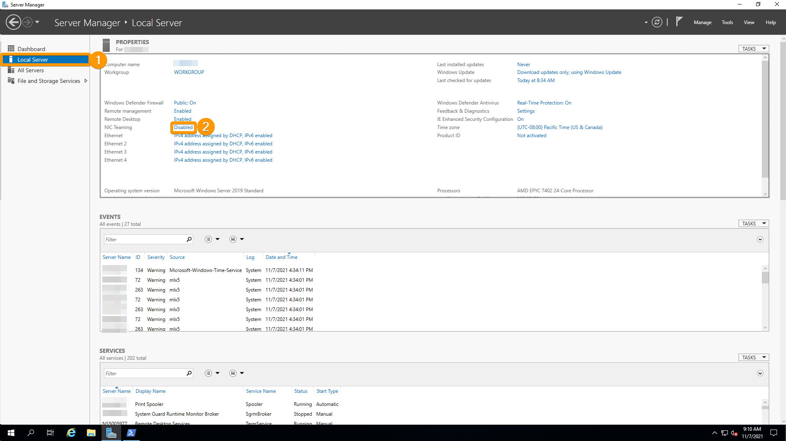{.thumbnail}

Haga clic derecho en una de las interfaces públicas anteriormente identificadas y seleccione `Add to New Team`{.action}.

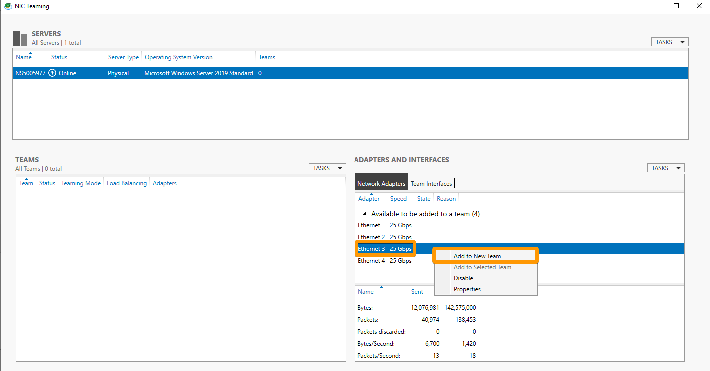{.thumbnail}

Asigne un nombre a su *teaming* y añada la segunda interfaz al *teaming*. Abra las propiedades adicionales, defina "Teaming Mode" en "LACP" y haga clic en `OK`{.action}.

#### Configurar una IP estática

Para evitar la pérdida de conexión durante el reinicio, es necesario configurar la IP de forma estática en el *teaming*.

Pulse `Windows Key` + `R` para abrir una ventana Run. Introduzca `ncpa.cpl` y haga clic en `OK`{.action}. Esto abrirá su ventana Conexiones de red.

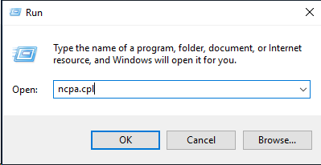{.thumbnail}

Haga clic derecho en el *teaming* que haya creado y haga clic en `Properties`{.action}.

{.thumbnail}

Haga doble clic en Protocolo de `Internet Protocol Version 4 (TCP/IPv4)`{.action}.

{.thumbnail}

Seleccione `Use the following IP address and insert your IP address`.

La máscara de subred y la puerta de enlace predeterminada serán: 255.255.255.255 y 100.64.0.1 (como se indica a continuación).

En los servidores DNS, puede elegir los suyos. En nuestro ejemplo, utilizamos 213.186.33.99 y 8.8.8.8.

Una vez que haya introducido las direcciones, haga clic en `OK`{.action} para cerrar la ventana y de nuevo en `OK`{.action} para cerrar la ventana de propiedades del adaptador.

{.thumbnail}

#### Añade los roles Hyper-V y RRAS

En el Server Manager, seleccione el `Dashboard`{.action} y haga clic en `Add roles and feature`{.action}.

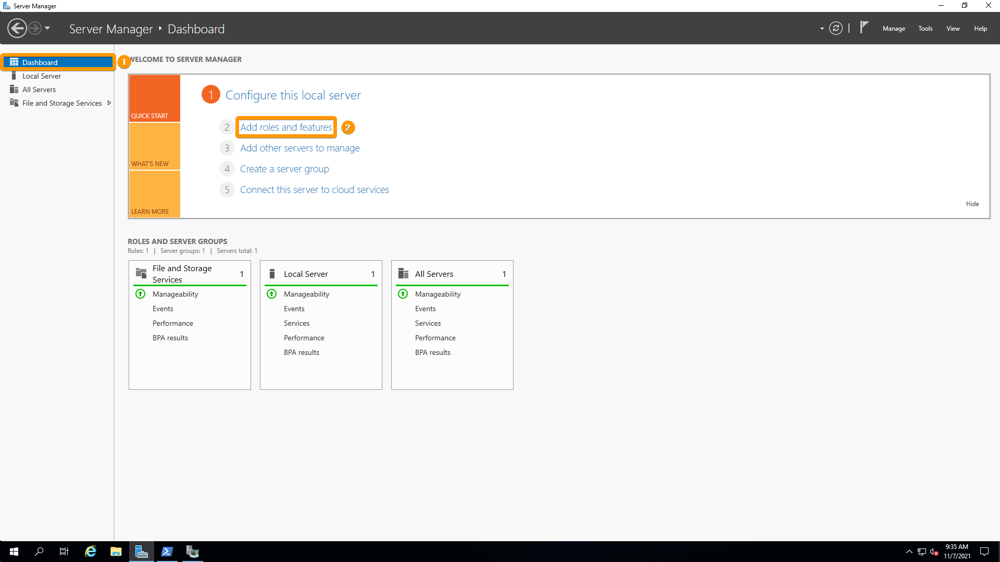{.thumbnail}

Siga el asistente hasta alcanzar la sección "Server Roles". Haga clic en `Hyper-v` y seleccione `Remote Access`.

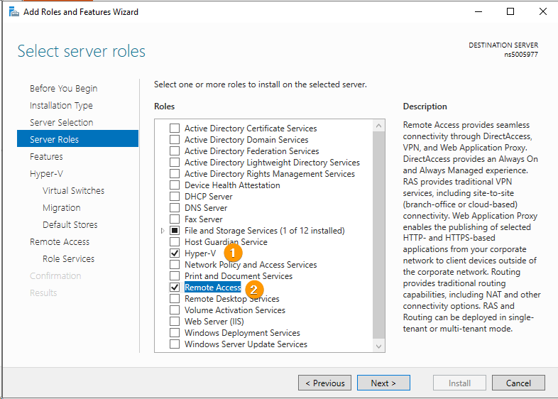{.thumbnail}

Continúe accediendo al apartado "Virtual Switches" de "Hyper-V" y seleccione su *NIC teaming* creado anteriormente.

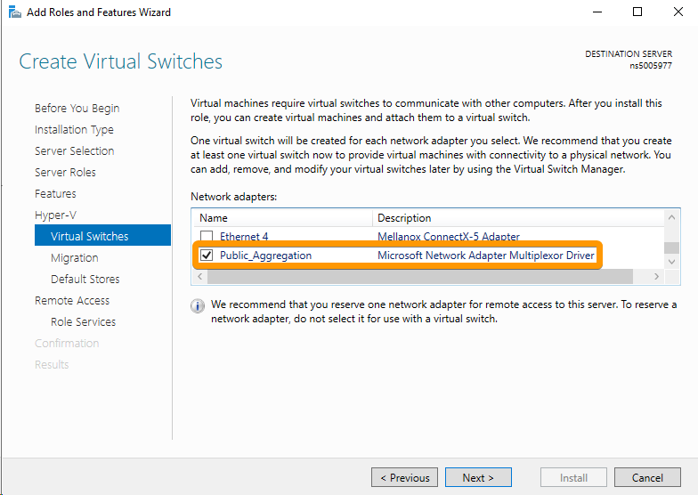{.thumbnail}

Continúe hasta el apartado "Role Services" de "Remote Access" y seleccione `Routing`.

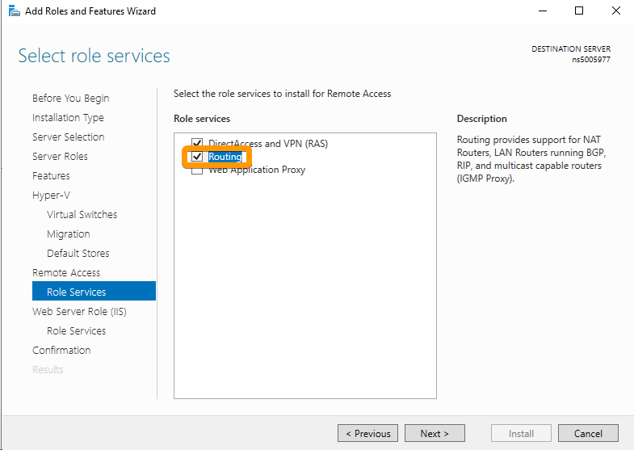{.thumbnail}

Por último, en la sección "Confirmation", seleccione `Restart the destination server automatically if required` y haga clic en `Install`{.action}.

#### Acceso al Routing y al Remote

Abra la nueva aplicación llamada "Routing and Remote Access", haga clic derecho en su servidor y haga clic en `Configure and Enable Routing and Remote Access`{.action}.

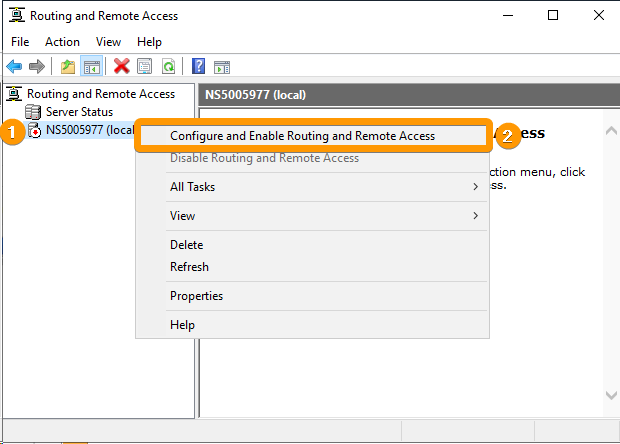{.thumbnail}

Seleccione `Custom configuration` Custom y haga clic en `Next`{.action}.

{.thumbnail}

A continuación, seleccione `LAN Routing` y haga clic en `Next`{.action}.

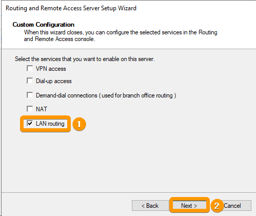{.thumbnail}

A continuación, haga clic en `Finish`{.action} y seleccione `Start Service`{.action} en la nueva ventana.

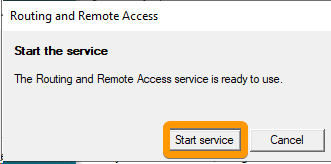{.thumbnail}

#### Establecer las direcciones IP estáticas principal y adicional en la interfaz Hyper-V

Ahora debemos mover la configuración IP a la interfaz Hyper-V.

Pulse `Windows Key` + `R` para abrir una ventana Run. Introduzca `ncpa.cpl` y haga clic en `OK`{.action}. Esto abrirá su ventana Conexiones de red.

{.thumbnail}

Haga clic derecho en su tarjeta vEthernet y seleccione `Properties`{.action}.

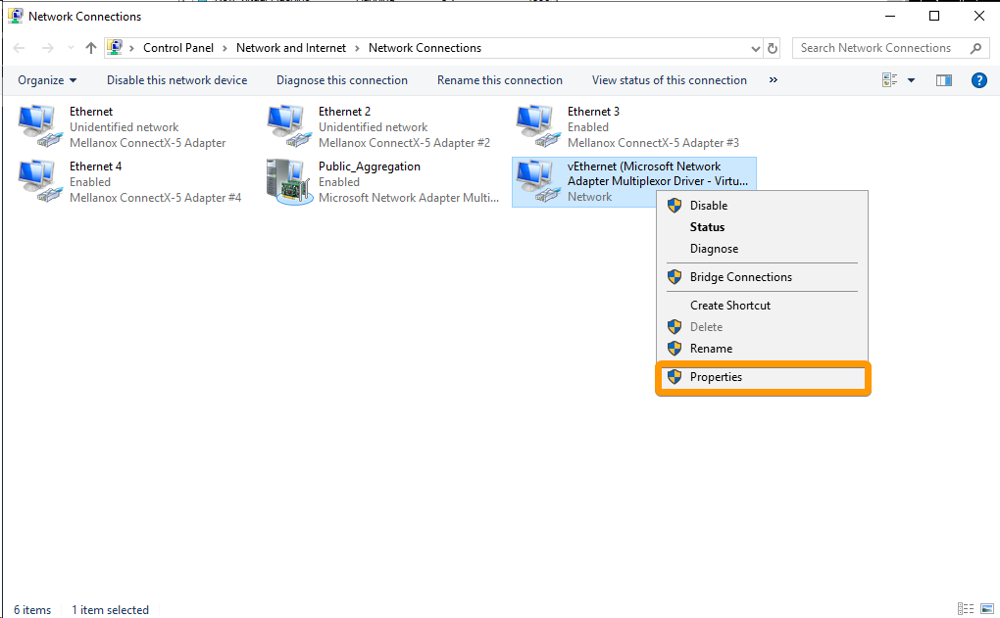{.thumbnail}

Haga doble clic en Protocolo de `Internet versión 4 (TCP/IPv4)`{.action}.

{.thumbnail}

Seleccione `Use the following IP address` e inserte su dirección IP.

La máscara de subred y la puerta de enlace predeterminada serán: 255.255.255.255 y 100.64.0.1 (como se indica a continuación).

En los servidores DNS, puede elegir los suyos. En nuestro ejemplo, utilizamos 213.186.33.99 y 8.8.8.8.

{.thumbnail}

Haga clic en el botón `Advanced...` y, en la nueva ventana, haga clic en `Add...`{.action} bajo las direcciones IP.

Añada la dirección IP y la máscara de subred correspondiente a su Additional IP y haga clic en `Add`{.action}

{.thumbnail}

Una vez que haya introducido todas las direcciones, haga clic en `Aceptar`{.action} para cerrar la ventana avanzada, pulse de nuevo `Aceptar`{.action} para cerrar la configuración TCP/IPv4 y, por último, haga clic en `Aceptar`{.action} para cerrar la ventana de propiedades del mapa.

> [!warning]
>
> Este paso puede provocar la pérdida de conexión. Si lo desea, conéctese utilizando el [IPMI](https://docs.ovh.com/es/dedicated/utilizar-ipmi-servidor-dedicado/) y vuelva a modificar la configuración. Comprobará que la puerta de enlace predeterminada ha vuelto al estado vacío. Añada la puerta de enlace 100.64.0.1.
>

#### Añadir una ruta estática

Abra una consola de comandos como administrador y ejecute el comando `route print interface` :

```console
C:\Users\admin>route print interface
===========================================================================
Interface List
 22...0c 42 a1 dd 37 b2 ......Hyper-V Virtual Ethernet Adapter
 10...04 3f 72 d5 c3 38 ......Mellanox ConnectX-5 Adapter
  7...04 3f 72 d5 c3 39 ......Mellanox ConnectX-5 Adapter #2
  1...........................Software Loopback Interface 1
===========================================================================
```

En nuestro ejemplo, puede ver que nuestra tarjeta Hyper-V tiene el ID 22.<br>
Tome nota de su tarjeta Hyper-V y ejecute el comando `route add -p 192.xxx.xxx.16 mask 255.255.255 0.0.0.0 si 22` (sustituya la IP y el ID de interfaz por el que haya recibido).<br>
Debería obtener el resultado "¡OK! ".

```console
PS C:\Users\admin> route add -p 192.xxx.xxx.16 mask 255.255.255.255 0.0.0.0 if 22
 OK!
```

Una vez creadas y configuradas, sus MV deben tener ahora acceso a internet.

#### Ejemplo de configuración de una MV en Ubuntu

Contenido del archivo `/etc/netplan/ip.yaml`:

```bash
network:
        version: 2
        ethernets:
                eth0:
                        dhcp4: no
                        addresses:
                                - 192.xxx.xxx.16
                        nameservers:
                                addresses:
                                        - 213.186.33.99
                                        - 8.8.8.8
                        routes:
                                - to: 0.0.0.0/0
                                  via: 100.64.0.1
                                  on-link: true
```

### Additional IP a través del vRack

#### Requisitos

- Tener un bloque público de direcciones IP reservado en su cuenta, con un mínimo de cuatro direcciones.
- Haber elegido un rango de direcciones IP privadas.
- Tener un [servidor compatible con el vRack](https://www.ovhcloud.com/es-es/bare-metal/){.external}.
- Haber activado un servicio [vRack](https://www.ovh.es/soluciones/vrack/){.external}.
- Haber iniciado sesión en el [área de cliente de OVHcloud](https://www.ovh.com/auth/?action=gotomanager&from=https://www.ovh.es/&ovhSubsidiary=es){.external}.

#### Explicaciones

Debe:

* crear un agregado;
* crear un puente con el agregado;

#### Identificación de las interfaces y configuración de NIC Teaming

Abra Windows Powershell y ejecute el comando `Get-NetAdapter`

```powershell
PS C:\Windows\system32> Get-NetAdapter

Name                      InterfaceDescription                    ifIndex Status       MacAddress             LinkSpeed
----                      --------------------                    ------- ------       ----------             ---------
Ethernet                  Mellanox ConnectX-5 Adapter                   9 Up           04-3F-72-D5-C3-38        25 Gbps
Ethernet 4                Mellanox ConnectX-5 Adapter #4                7 Up           0C-42-A1-DD-37-B3        25 Gbps
Ethernet 2                Mellanox ConnectX-5 Adapter #2                6 Up           04-3F-72-D5-C3-39        25 Gbps
Ethernet 3                Mellanox ConnectX-5 Adapter #3                4 Up           0C-42-A1-DD-37-B2        25 Gbps
```

En este ejemplo:

- las interfaces públicas son `Ethernet 3` and `Ethernet 4`;
- las interfaces privadas son `Ethernet` y `Ethernet 2`.

> [!primary]
>
> Compruebe que la configuración es similar. Si dispone de información relativa a las MAC e interfaces públicas o privadas, puede hacerlo desde el [área de cliente de OVHcloud](https://www.ovh.com/auth/?action=gotomanager&from=https://www.ovh.es/&ovhSubsidiary=es) o a través de la API de OVHcloud.
>

Vuelva al servidor, acceda a `Local Server`{.action} y haga clic en `Disabled`{.action} junto al NIC Teaming.

{.thumbnail}

Haga clic derecho en una de las interfaces privadas anteriormente identificadas y seleccione `Add to New Team`{.action}.

{.thumbnail}

Asigne un nombre a su *teaming* y añada la segunda interfaz al *teaming*. Abra las propiedades adicionales, defina "Teaming Mode" en "LACP" y haga clic en `Aceptar`{.action}.

#### Crear el conmutador virtual en Hyper-V

Vamos a necesitar crear un switch virtual que asocie nuestras MV al *teaming* que hemos creado.

En primer lugar, abra el Gestor de Hyper-V y haga clic en `Virtual Switch Manager`{.action}.

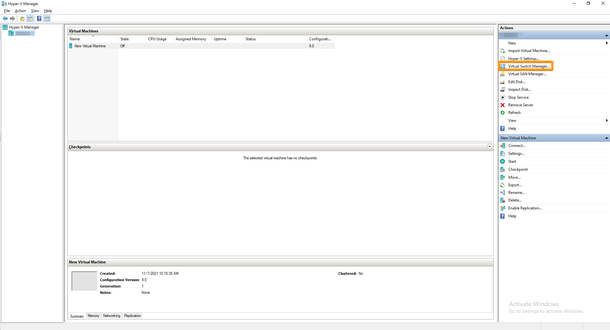{.thumbnail}

Asegúrese de que ha seleccionado "External" y haga clic en `Create Virtual Switch`{.action}.

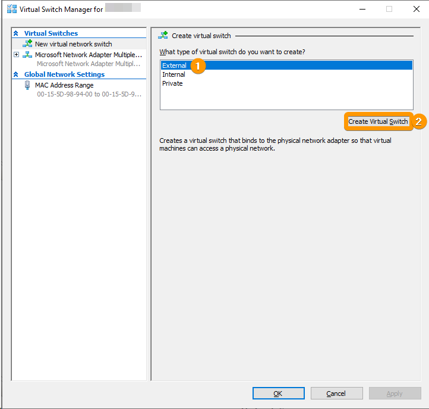{.thumbnail}

Asigne un nombre al conmutador, seleccione el nuevo adaptador de *teaming*, haga clic en `Apply`{.action} y seleccione `OK`{.action}.

{.thumbnail}

Una vez que haya creado su máquina virtual, ya puede configurar la red para ella.

#### Configurar una dirección IP útil

En el caso del vRack, la primera, la penúltima y la última direcciones de un bloque de IP siempre están reservadas a la dirección de red, la puerta de enlace y el *broadcast* de la red, respectivamente. Eso significa que la primera dirección útil es la segunda dirección del bloque, tal y como se muestra a continuación:

```sh
46.105.135.96   # Reservada: dirección de red 
46.105.135.97   # Primera IP útil
46.105.135.98
46.105.135.99
46.105.135.100
46.105.135.101
46.105.135.102
46.105.135.103
46.105.135.104
46.105.135.105
46.105.135.106
46.105.135.107
46.105.135.108
46.105.135.109   # Última IP útil
46.105.135.110   # Reservada: pasarela de red
46.105.135.111   # Reservada: broadcast
```

Para configurar la primera dirección IP útil, edite el archivo de configuración de red como se indica a continuación. En este ejemplo, se utiliza la máscara de subred **255.255.255.240**.

> [!primary]
>
> La mascara de subred utilizada en el ejemplo es apropiada para nuestro bloque de IP. Su máscara de subred puede ser diferente en función del tamaño del bloque. Al contratar su bloque de IP, recibirá un mensaje de correo electrónico con la máscara de subred que debe utilizar.
>

#### Ejemplo de configuración VM Cliente Ubuntu

Contenido del archivo `/etc/netplan/vrack.yaml`:

```bash
network:
        version: 2
        ethernets:
                eth0:
                        dhcp4: no
                        addresses:
                                - 46.105.135.97/28
                        nameservers:
                                addresses:
                                        - 213.186.33.99
                                        - 8.8.8.8
                        routes:
                                - to: 0.0.0.0/0
                                  via: 46.105.135.110
                                  on-link: true
```

## Más información
  
Interactúe con nuestra comunidad de usuarios en <https://community.ovh.com/en/>.
