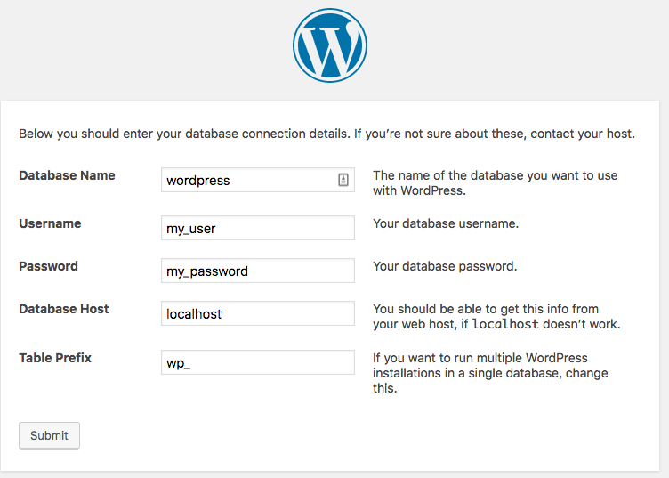

## Introduction 

The LAMP acronym refers to a group of four open-source technologies: a Linux operating system, an Apache web server, a MySQL database, and PHP programming language.

These technologies form a stack, which you can use to host dynamic websites and applications like WordPress and Drupal. LAMP stacks are now the most widely-used stacks for hosting web applications.

**This guide will show you how to set up a LAMP server in Debian 9 and Ubuntu 18.**


## Requirements

- knowledge of Linux administration
- SSH access 
- access to edit text files in the command line (e.g. Vim, nano, Emacs)
- ability to install a Linux distribution (here we are using Debian 9.4, but the guide steps are identical for Ubuntu 18.04)
- a server or a virtual machine with a Linux distribution (a [VPS](https://www.ovh.co.uk/vps/){.external}, a [Dedicated Server](https://www.ovh.co.uk/dedicated_servers/){.external} or [OVH Public Cloud instance](https://www.ovh.co.uk/public_cloud/){.external})
- admin (root) access to the server

> [!warning]
>
> OVH is providing you with services that you are responsible for. We cannot access these servers, as we are not administrators. For this reason, we cannot provide you with administrative assistance. You are responsible for your service’s software and security.
> 
> We have published this guide to assist you as much as we can with common tasks. However, we recommend contacting a specialist service provider if you experience any difficulties or have any doubts about managing, using and securing a server. You can find more information in the “Go further” section of this guide.
>

## Instructions

### Step 1: Update your system.

If you are using a recent Debian or Ubuntu distribution, we recommend reinstalling your server from scratch (if possible) on your machine. Please note that this action will **erase any data stored on it**.

Connect via SSH as a root user. If you are unsure about how to do this, please refer to our guide to [Getting started with SSH](https://docs.ovh.com/gb/en/dedicated/ssh-introduction/){.external}.

Once you have installed the operating system, we recommend updating it: 

```sh 
apt-get update && apt-get upgrade -y 
```

This way, you can be sure that you have all the very latest updates.

### Step 2: Create a new user with sudo privileges.

For security reasons and to follow best practices, it is best to set up and manage a LAMP server with a separate user who does not have root privileges. If you already have a user with sudo privileges but no root access, you can skip straight to the second step. This kind of feature is already in place for the latest Ubuntu versions.

If you only have a root user, you can create a new user:

```sh
adduser mynewuser 
```

Some information is mandatory, like a password. Other information can be provided as an option, e.g. a name or a telephone number.

You then need to add this user to the ‘sudo’ group: 

```sh
usermod -aG sudo mynewuser 
```

Next, log in to this new user account:

```sh
su - mynewuser 
```

### Step 3: Install an Apache 2 web server.

In the first two steps, you set up the first building block of the LAMP stack: the Linux distribution. 

We will now install the second building block — the Apache 2 web server — along with its documentation:

```sh 
sudo apt-get install apache2 apache2-doc 
```

If you have installed the web server correctly, you should be able to access the Apache default page by entering your server’s IP address (or service name) into your browser as follows: [http://server_IP](#). Don’t try to connect via HTTPS, as there is no SSL certificate added at this stage.

{.thumbnail}

This page is very informative, and provides you with an overview of the Apache 2 configuration file, as well as its specific features. We advise reading through this information.


You can check if the Apache service is working correctly using the following command:

```sh 
sudo service apache2 status 
``` 

The status `active (running)` should appear.

The Apache procedure can be managed as follows: 

```sh
service apache2 start => starts the service apache2 service stop => stops the service apache2 service restart => relaunches or reloads the service 
```

### Step 4: Install PHP.

Next, we will install the third building block: PHP programming language.

To install the PHP packet, enter the following command:

```sh 
sudo apt-get install php 
```

To test the installation, in the directory `/var/www/html`, create the file `info.php` with the following content:

```sh 
cd /var/www/html sudo nano index.php 
```

Enter the following into the file:

```php
<?php
phpinfo();
?>
```

Then access the file directly via your web browser: [http://server_IP/info.php](#).

You should see a page detailing all of your PHP environment specifications (version 7.0.30 in our case):

{.thumbnail}

Once you have viewed this page, we strongly advise **deleting the `index.php` file**. This is because we always recommend ensuring that your configuration details are not publicly available.

> [!primary]
>
> By default, the Apache web server does not prioritise PHP files over HTML files. Here, in the root directory, we have an `index.html` file and an `index.php` file. If we return to our web browser, on [http://server_IP](#), Apache will direct you to the `index.html` page rather than `index.php`. This prioritisation will not impact most content management systems, such as WordPress or Drupal. However, these rules can be modified if needed.
>

### Step 5: Install the MySQL/MariaDB database.

This is the fourth and final building block of our LAMP stack — the database system.

> [!primary]
>
> In 2009, after MySQL was acquired by Oracle, the founder of MySQL created a more community-led, open fork. It is named MariaDB, after the founder’s daughter. All MySQL commands are fully-compatible with MariaDB, as well as the most popular web applications. The Linux distribution Debian offers MariaDB by default. If you use Debian, you will see “MariaDB” in your terminal for this step.
>

Here is the command you need to use (your Linux account password will be requested):

```sh
sudo apt-get install mysql-server 
```

By default, the MySQL/MariaDB admin password will be the same as your system user password. To customise your database security, run the following command:

```sh
mysql_secure_installation 
```

Enter your root password, then change the password:

```sh
Change the root password? [Y/n] => y New password: 
```

Then remove anonymous users:

```sh
Remove anonymous users? [Y/n] => y 
```

Then disable remote root login:

```sh 
Disallow root login remotely? [Y/n] => y 
```

You now need to remove the test database created by default:

```sh
Remove test database and access to it? [Y/n] => y 
```

Now, you need to load the new settings:

```sh 
Reload privilege tables now? [Y/n] => y 
```

To test access to your database, use the following command in your terminal:

```sh 
mysql -u root -p

MariaDB \[(none)]> show databases; MariaDB \[(none)]> exit 
```

We recommend creating a specific user account, and dedicating it to your web application. If required, you can refer to the official guide documentation released by [MySQL](https://dev.mysql.com/doc/refman/8.0/en/user-account-management.html){.external} and [MariaDB](https://mariadb.com/kb/en/library/user-account-management/){.external}.

### Step 6: Install phpMyAdmin (optional).

Your LAMP server is now set up! This step is optional. With the open-source phpMyAdmin interface, you can manage your databases more easily via a web interface.

To install it, enter the following command:

```sh
sudo apt-get install phpmyadmin 
```

From the choices offered, select a web server to automatically configure to run `phpMyAdmin`:

- tick `()apache2`{.action}, then `Entry`{.action}
- accept help with configuration, then enter a MySQL admin password

To access the `phpMyAdmin` management interface, you need to finish configuring your Apache server. To do this, edit the Apache configuration file:

```sh
sudo nano /etc/apache2/apache2.conf 
```

At the end of the file, add:

```sh

# Include phpMyAdmin

Include /etc/phpmyadmin/apache.conf 
```

Then restart the Apache server, using the following command:

```sh 
sudo service apache2 restart 
```

To log in, you need to create a user with admin rights for `phpMyAdmin`:

```sh 
mysql -u root -p [password] MariaDB [(none)]> CREATE USER 'my_user'@'localhost' IDENTIFIED BY 'my_password'; MariaDB [(none)]> GRANT ALL PRIVILEGES ON * . * TO 'my_user'@'localhost'; MariaDB [(none)]> FLUSH PRIVILEGES; 
```

Then access the interface via [http://server_IP/phpmyadmin/](#):

{.thumbnail}

### Step 7: Install WordPress (optional).

This part is also optional. Here is a summary of the steps you need to take to install a CMS:

Download, decompress and copy the content into a new file named `mywebsite`:

```sh 
wget https://wordpress.org/latest.tar.gz tar xpf latest.tar.gz sudo cp -r wordpress /var/www/html/mywebsite 
```

This file containing WordPress is now accessible on [http://server_IP/mywebsite/](#).

Create a database named `wordpress` in the command line, or via `phpMyAdmin`.

Your configuration screen should look like this:

{.thumbnail}

If you receive a warning when you create the `wp-config.php` file, edit the rights in read, write and execute, depending on what you need (commonly called `chmod`).

## Conclusion

Your WordPress CMS has now been installed, and is powered by the LAMP stack you set up following this guide.

You have just set up a LAMP server from scratch, which you can now use to host your own websites and applications. By setting this server up yourself, you have full control over how you configure it. Read the official documentation published by Apache to find out more about what you can do with this technology.

If you are curious, or would like to go a step further, there are other alternatives to Apache. The most well-known alternative, with fast-growing success, is NGNIX. A stack that includes NGINX is called a LEMP stack, and is known for being lighter than LAMP stacks. Finally, we recommend securing your website with an SSL certificate.