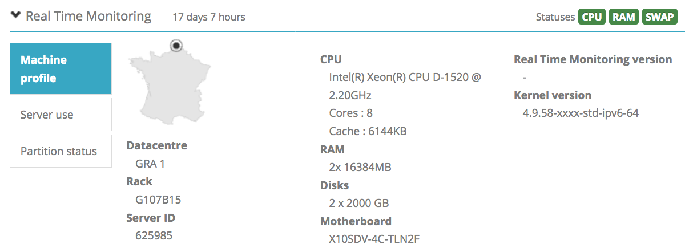

**Last updated 15th April 2019**

## Objective

With Real Time Monitoring (RTM), you can partially monitor your server and its activity. In the OVH Control Panel, you will find information on the CPU (Central Processing Unit), RAM (Random Access Memory), open ports, etc. To view this information, you need to install the RTM package.

**This guide will explain how to install RTM on Linux or Windows.**

## Requirements

- You need to be logged in via SSH (or your graphical user interface) on your Linux server (*root* access).
- You need to be logged in to the remote desktop on your Windows server (*administrator* access).
- You need to be logged in to the [OVH Control Panel](https://www.ovh.com/auth/?action=gotomanager){.external}.

## Instructions

Once you have installed the RTM via the Control Panel, you can monitor your server in the `Dedicated`{.action} section. On the main page for your server, you can find the monitoring information under `Real Time Monitoring`:

{.thumbnail}

> [!primary]
>
> Some firewall restrictions could prevent your infrastructure from being monitored, even though you have added the RTM. Don’t forget to give OVH monitoring IP addresses access to your server. You can find more details [here](https://docs.ovh.com/ie/en/dedicated/monitoring-ip-ovh/){.external}.
> 

### RTM in Linux
On dedicated servers, RTM collects disk, RAID information and hardware information.


#### Component

##### Beamium

Beamium collects metrics from HTTP endpoints like _http://127.0.0.1/metrics_, and supports Prometheus and Warp10/Sensision format. 

Once scraped, Beamium can filter and forward data to a Warp10 Time Series platform. While acquiring metrics, Beamium uses DFO (Disk Fail Over) to prevent metrics loss due to network issues or unavailable services.

Beamium is written in Rust to ensure efficiency, a very low footprint, and deterministic performance.

Configuration example:

```sh
# noderig endpoint to fetch
scrapers:
  noderig:
    url: http://127.0.0.1:9100/metrics
    format: sensision
    period: 60000

# Warp10 platform to send data
sinks:
  metrics:
    url: https://rtm.ovh.net/
    token: 57e05f1526873a6b912637ee4c44b525413f6764db700494ff6c4014
    size: 1000000
    selector: (os|rtm).*
    ttl: 60

labels:
  host: hostname
  host_type: you can add tag for server and retreive it in grafana host list

parameters:
  source-dir: /opt/beamium/sources
  sink-dir: /opt/beamium/sinks
  log-level: 1
  scan-period: 60000
  log-file: /var/log/beamium/beamium.log
```


##### Noderig

Noderig collects OS metrics and exposes them through a Sensision HTTP endpoint. Each collector is easily configurable, thanks to a simple level cursor.

Noderig metrics:

* CPU
* Memory
* Load
* Disk
* Net
* External collectors

Configuration example:

```sh
cpu: 1
mem: 1
load: 2
disk: 2
net: 2
net-opts:
  interfaces:
    - eth0
    - eth1
period: 60000
collectors: /opt/noderig
```

##### Rtm-binaries

**rtmHardware** :

-Collects hardware information like motherboard, pci devices, disk health etc., and also software information, like kernel version and bios version.

**rtmHourly** :

-Collects top memory process, listen ports, number of processes up, and actives.

**rtmRaidCheck** :

-Checks RAID health.

### Installing RTM on Linux

Once you have logged in to your server via SSH, simply run the following command:

```sh
wget -qO - https://last-public-ovh-infra-yak.snap.mirrors.ovh.net/yak/archives/apply.sh | OVH_PUPPET_MANIFEST=distribyak/catalog/master/puppet/manifests/common/rtmv2.pp bash
```

### Debian/Ubuntu manual installation

Add RTM and metrics repository for Debian:

```sh
vi /etc/apt/sources.list.d/rtm.list
#metrics repo
deb http://last.public.ovh.metrics.snap.mirrors.ovh.net/debian <distribution codename> main
# rtm repo
deb http://last.public.ovh.rtm.snap.mirrors.ovh.net/debian <distribution codename> main
```

Add RTM and metrics repository for Ubuntu:

```sh
vi /etc/apt/sources.list.d/rtm.list
# metrics repo
deb http://last.public.ovh.metrics.snap.mirrors.ovh.net/ubuntu <distribution codename> main
# rtm repo
deb http://last.public.ovh.rtm.snap.mirrors.ovh.net/ubuntu <distribution codename> main

```
Install repository key:

```sh
curl  https://last-public-ovh-rtm.snap.mirrors.ovh.net/ovh_rtm.pub | apt-key add -
curl  http://last.public.ovh.metrics.snap.mirrors.ovh.net/pub.key | apt-key add -
```

Install RTM packages:

```sh
apt-get update
apt-get install ovh-rtm-metrics-toolkit
```

#### CentOS

Add RTM and metrics repository for CentOS:

```sh
vi /etc/yum.repos.d/ovh-rtm.repo

[rtm]
name=OVH RTM RHEL/ CentOS $releasever - $basearch
baseurl=http://last.public.ovh.rtm.snap.mirrors.ovh.net/centos/$releasever/$basearch/Packages/
enabled=1
repo_gpgcheck=1
gpgkey=http://last.public.ovh.rtm.snap.mirrors.ovh.net/ovh_rtm.pub

[metrics]
name=OVH METRICS RHEL/ CentOS $releasever - $basearch
baseurl=http://last.public.ovh.metrics.snap.mirrors.ovh.net/centos/$releasever/$basearch/Packages/
enabled=1
repo_gpgcheck=1
gpgkey=http://last.public.ovh.metrics.snap.mirrors.ovh.net/pub.key
```

##### Install RTM client:


```sh
yum update
yum install ovh-rtm-metrics-toolkit
```

### Installing RTM on Windows

Once you are logged in to the remote desktop, take the following steps:

- Install ActivePerl if you have never installed RTM before. You can download it here: <http://www.activestate.com/activeperl/>.
- Download and install the latest version of RTM here: <ftp://ftp.ovh.net/made-in-ovh/rtm/windows/>.
- Right-click on the file and then click `Run as administrator`{.action}.

## Go further

[IP addresses for OVH monitoring](https://docs.ovh.com/ie/en/dedicated/monitoring-ip-ovh/){.external}.

Join our community of users on <https://community.ovh.com/en/>.