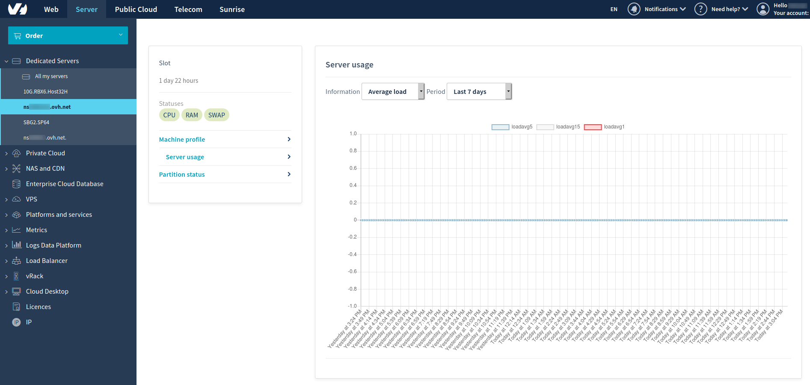

**Ostatnia aktualizacja: 24-03-2020**

## Wprowadzenie

Narzędzie RTM (Real Time Monitoring) umożliwia częściowe monitorowanie serwera i jego działania pod względem procesora, pamięci RAM, partycji dysków itd. Aby wyświetlić takie informacje bezpośrednio w Panelu klienta OVHcloud, najpierw należy zainstalować na serwerze pakiet RTM.

**Dowiedz się, jak zainstalować narzędzie RTM w systemie Linux.**

## Wymagania początkowe

- dostęp do [Panelu klienta OVHcloud](https://www.ovh.com/auth/?action=gotomanager)
- dostęp do serwera z uprawnieniami administratora (użytkownika root) za pośrednictwem protokołu SSH (lub przy użyciu graficznego interfejsu użytkownika)


## W praktyce

> [!primary]
>
> Niektóre ograniczenia zapory mogą uniemożliwiać monitorowanie infrastruktury nawet po dodaniu narzędzia RTM. Należy pamiętać o autoryzacji dostępu do serwera dla adresów IP służących do monitorowania OVHcloud. Więcej informacji zawiera [ten przewodnik](https://docs.ovh.com/gb/en/dedicated/monitoring-ip-ovh).
> 

### Narzędzie RTM w systemie Linux

#### Składniki

W ramach serwerów dedykowanych narzędzie RTM zbiera w czasie rzeczywistym informacje o procesorze, pamięci RAM, dyskach, macierzy RAID i sprzęcie. Poniżej znajdują się informacje o używanych składnikach.

##### Beamium

[https://github.com/ovh/beamium](https://github.com/ovh/beamium)

Narzędzie Beamium zbiera metryki z terminali HTTP, takie jak _http://127.0.0.1:9100/metrics_, i obsługuje formaty Prometheus Sensision. 

Po zainstalowaniu narzędzie Beamium może filtrować dane i przesyłać je do platformy Warp 10™ Time Series. Aby uniknąć ewentualnych strat związanych z problemami sieciowymi lub z niedostępnością usług, metryki są pobierane w trybie DFO (Disk Failover).

Narzędzie Beamium jest napisane w języku Rust, więc jest skuteczne, wydajne i zajmuje mało miejsca.

Przykład konfiguracji:

```sh
# noderig endpoint to fetch
scrapers:
  noderig:
    url: http://127.0.0.1:9100/metrics
    format: sensision
    period: 60000

# Warp10 platform to send data
sinks:
  metrics:
    url: https://rtm.ovh.net/
    token: 526873a6b912637ee4c44b525413
    Size : 1000000
    selector: (os|rtm).*
    ttl: 60

labels:
  host: hostname
  host_type: you can add tag for server and retrieve it in grafana host list

parameters:
  source-dir: /opt/beamium/sources
  sink-dir: /opt/beamium/sinks
  log-level: 1
  scan-period: 60000
  log-file: /var/log/beamium/beamium.log
```
Plik konfiguracji zostanie wypełniony automatycznie po zakończeniu instalacji.

##### Noderig

[https://github.com/ovh/noderig](https://github.com/ovh/noderig)

Narzędzie Noderig zbiera metryki systemu operacyjnego i udostępnia je za pośrednictwem adresu URL HTTP (http://127.0.0.1:9100/metrics). Kolektory można łatwo skonfigurować przy użyciu kursora

Metryki narzędzi Noderig:

* CPU (procesor)
* Memory (pamięć)
* Load (obciążenie)
* Disk (dysk)
* Net (sieć)
* External collectors (kolektory zewnętrzne)

Przykład konfiguracji:

```sh
cpu: 1
mem: 1
load: 2
disk: 2
net: 2
net-opts:
  interfaces:
    - eth0
    - eth1
period: 60000
collectors: /opt/noderig
```


##### Dane binarne RTM

**rtmHardware**:

- Zbiera informacje o sprzęcie, na przykład płycie głównej, urządzeniach PCI, stanie dysku itd. Ponadto zbiera informacje dotyczące oprogramowania, takie jak wersja jądra i systemu BIOS.

**rtmHourly**:

- Zbiera informacje o najważniejszych procesach, otwartych portach i liczbie trwających procesów.

**rtmRaidCheck**:

- Sprawdza stan macierzy RAID (jeśli jest dostępna).

### Instalacja automatyczna narzędzia RTM

Po połączeniu z serwerem przy użyciu protokołu SSH uruchom następujące polecenie:

```sh
wget -qO - https://last-public-ovh-infra-yak.snap.mirrors.ovh.net/yak/archives/apply.sh | OVH_PUPPET_MANIFEST=distribyak/catalog/master/puppet/manifests/common/rtmv2.pp bash
```
> [!primary]
> 
> Instalacja automatyczna może się nie udać w niektórych dystrybucjach (w przypadku niektórych zależności). Jeśli wystąpi błąd, należy przeprowadzić instalację ręczną zgodnie z instrukcją w poniższej sekcji.
>

### Instalacja ręczna narzędzia RTM

#### Instalacja ręczna w dystrybucji Debian/Ubuntu


##### Krok 1: dodanie repozytoriów OVHcloud

- przy użyciu polecenia **add-apt-repository**

```sh
#metrics repo
add-apt-repository "deb http://last.public.ovh.metrics.snap.mirrors.ovh.net/$(lsb_release --id --short | tr 'A-Z' 'a-z') $(lsb_release --codename --short) main"
# rtm repo
add-apt-repository "deb http://last.public.ovh.rtm.snap.mirrors.ovh.net/$(lsb_release --id --short | tr 'A-Z' 'a-z') $(lsb_release --codename --short) main"
```

- dodanie ręcznie

System **Debian**:

Zmienna `<distribution codename>` jest nazwą dystrybucji (na przykład: „buster”).
  
```sh
nano /etc/apt/sources.list.d/rtm.list
#metrics repo
deb http://last.public.ovh.metrics.snap.mirrors.ovh.net/debian <distribution codename> main
# rtm repo
deb http://last.public.ovh.rtm.snap.mirrors.ovh.net/debian <distribution codename> main
```

System **Ubuntu**:

Zmienna `<distribution codename>` jest nazwą dystrybucji (na przykład: „bionic”).
  
```sh
nano /etc/apt/sources.list.d/rtm.list

```
Dodaj następujące wiersze i zapisz plik:
  
```sh
# metrics repo
deb http://last.public.ovh.metrics.snap.mirrors.ovh.net/ubuntu <distribution codename> main
# rtm repo
deb http://last.public.ovh.rtm.snap.mirrors.ovh.net/ubuntu <distribution codename> main

```
> [!primary]
> 
> Jeśli chodzi o istniejące dystrybucje, repozytoria aktualnych wersji systemów Linux mogą jeszcze nie zawierać niezbędnych pakietów. W takim przypadku można w zamian użyć nazwy kodowej starszej wersji (Ubuntu).
>


##### Krok 2: instalacja narzędzia do zarządzania kluczami apt-key

```sh
curl https://last-public-ovh-rtm.snap.mirrors.ovh.net/ovh_rtm.pub | apt-key add -
curl http://last.public.ovh.metrics.snap.mirrors.ovh.net/pub.key | apt-key add -
```

##### Krok 3: instalacja pakietów RTM

```sh
apt-get update
apt-get install ovh-rtm-metrics-toolkit
```

#### Instalacja ręczna w dystrybucji CentOS

Dodaj narzędzie RTM i repozytorium metryk dla dystrybucji CentOS:

```sh
nano /etc/yum.repos.d/ovh-rtm.repo
```
Dodaj następujące wiersze i zapisz plik:

```sh
[rtm]
name=OVH RTM RHEL/ CentOS $releasever - $basearch
baseurl=http://last.public.ovh.rtm.snap.mirrors.ovh.net/centos/$releasever/$basearch/Packages/
enabled=1
repo_gpgcheck=1
gpgcheck=0
gpgkey=http://last.public.ovh.rtm.snap.mirrors.ovh.net/ovh_rtm.pub

[metrics]
name=OVH METRICS RHEL/ CentOS $releasever - $basearch
baseurl=http://last.public.ovh.metrics.snap.mirrors.ovh.net/centos/$releasever/$basearch/Packages/
enabled=1
repo_gpgcheck=1
gpgcheck=0
gpgkey=http://last.public.ovh.metrics.snap.mirrors.ovh.net/pub.key
```

Zainstaluj pakiety RTM:

```sh
yum update
yum install ovh-rtm-metrics-toolkit
```

#### Instalacja ręczna w dystrybucji FreeBSD

Dodaj narzędzie RTM i repozytorium metryk dla dystrybucji FreeBSD:

```sh
mkdir -p /usr/local/etc/pkg/repos
nano /usr/local/etc/pkg/repos/OVH.conf
```
Dodaj następujące wiersze i zapisz plik:

```sh
# OVH mirror
RTM: {
  url: "http://last.public.ovh.rtm.snap.mirrors.ovh.net/FreeBSD-pkg/${ABI}/latest",
  mirror_type: "none",
  enabled: yes
}
Metrics: {
  url: "http://last-public-ovh-metrics.snap.mirrors.ovh.net/FreeBSD-pkg/${ABI}/latest",
  mirror_type: "none",
  enabled: yes
}
```
Zainstaluj pakiety RTM:

```sh
pkg install -y noderig beamium ovh-rtm-binaries
pkg install -y ovh-rtm-metrics-toolkit
```
Uruchom usługi:

```sh
service noderig start
service beamium start
```

> [!primary]
>**Narzędzie RTM w systemie Windows**
>
Pakiet RTM obecnie nie jest kompatybilny z systemami Windows. Stale rozwijamy i ulepszamy usługi, więc w końcu narzędzie będzie dostępne również dla systemu Windows.
>


### Narzędzie RTM w Panelu klienta OVHcloud

Po zainstalowaniu pakietu RTM dane monitorowania serwera można wyświetlać w Panelu klienta OVHcloud. (Być może będzie konieczne odświeżenie przeglądarki lub wylogowanie się i ponowne zalogowanie). Przejdź do sekcji `Serwer`{.action} i wybierz serwer z menu po lewej stronie. Na karcie `Informacje ogólne`{.action} przewiń w dół, aby znaleźć informacje monitorowania.

{.thumbnail}


## Sprawdź również

[What are the IP addresses of the OVHcloud monitoring?](https://docs.ovh.com/gb/en/dedicated/monitoring-ip-ovh) (Adresy IP usługi monitoringu OVHcloud)

[Visualise your data](https://docs.ovh.com/gb/en/metrics/usecase-visualize) (Wizualizacja danych)

[Uruchamianie i korzystanie z trybu Rescue](../ovh-rescue/)

Dołącz do naszej społeczności użytkowników: <https://community.ovh.com/en/>.