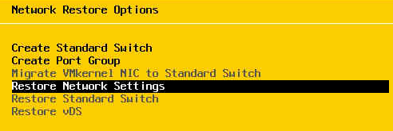
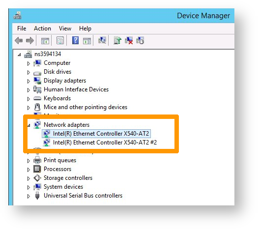
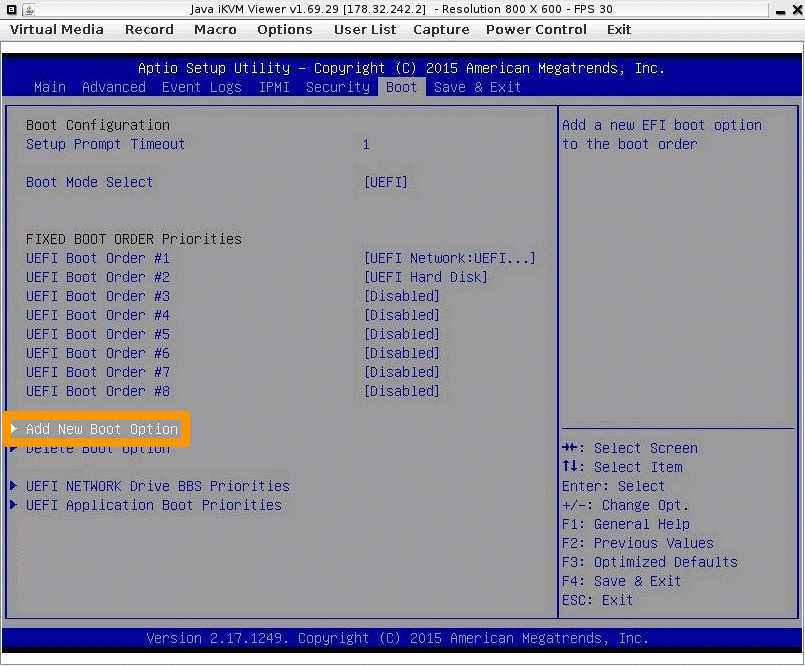
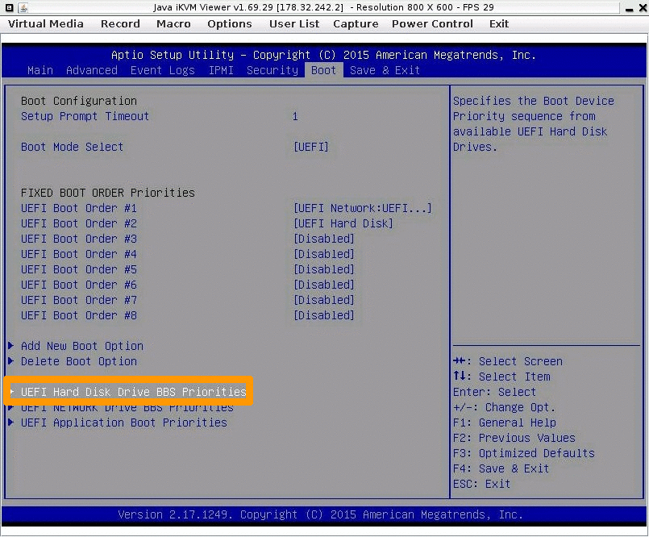

## Objectif

Cette documentation a pour objectif de vous accompagner dès lors qu'une intervention de maintenance a été effectuée par les équipes OVHcloud.

Nos interventions de maintenance se limitent uniquement à la partie matériel, et nous vous proposons si besoin ce support relatif à vos références en lien avec vos systèmes installés : Systèmes d'exploitation, Hyperviseur, etc...

Tout ceci dans le but de vous accompagner et faire en sorte qu'il y ait le moins d'impact possible dans le cycle de vie de vos environnements.
Vous retrouverez ici toutes les infos nécessaires, si vos systèmes sont listés, vous n'aurez plus qu'à suivre la procédure correspondante :

- Ubuntu
- CentOS/Alma Linux
- SmartOS
- FreeBSD
- Gentoo

Virtualisation  

- Proxmox
- XenServer
- ESXi
- Windows (hyper-V)

Divers  

- Repérer le nom de vos interfaces réseaux
- Problèmes liés à l'EFI

> [!warning]
>
> Il s'agit d'un recueil élaboré par nos équipes suite à de multiples retours sur expérience venant de différents cas rencontrés.
>


### Ubuntu

Si vous rencontrez un soucis de connectivité réseau.  
exemple : pas de ping après le remplacement de la carte mère.

- rédemarer le serveur en [mode rescue](https://docs.ovh.com/fr/dedicated/ovh-rescue/#en-pratique).
- monter la partition `/`

```bash
root@rescue:~# mount /dev/my_system_disk /mnt
```

Si le fichier `70-persistent-net.rules` n'existe pas (cf repérer le nom de vos interfaces réseaux),  
Vérifier dans l'arborescence `/etc/systemd/network/` les fichiers suivants :  
- `50-default.network`  
- `50-public-interface.link`  

```bash
root@rescue:~# cat /mnt/etc/systemd/network/50-default.network
# This file sets the IP configuration of the primary (public) network device.
# You can also see this as "OSI Layer 3" config.
# It was created by the OVH installer, please be careful with modifications.
# Documentation: man systemd.network or https://www.freedesktop.org/software/systemd/man/systemd.network.html
 
[Match]
MACAddress=xx:xx:xx:xx:xx:xx
 
[Network]
Description=network interface on public network, with default route
DHCP=no
Address=1.2.3.4/24
Gateway=1.2.3.254
IPv6AcceptRA=no
NTP=ntp.ovh.net
DNS=127.0.0.1
DNS=213.186.33.99
DNS=2001:41d0:3:163::1
Gateway=2001:41d0:0203:4bff:ff:ff:ff:ff
 
[Address]
Address=2001:41d0:0203:1234::/64
 
[Route]
Destination=2001:41d0:0203:4bff:ff:ff:ff:ff
Scope=link
root@rescue:~#
root@rescue:~# cat /mnt/etc/systemd/network/50-public-interface.link
# This file configures the relation between network device and device name.
# You can also see this as "OSI Layer 2" config.
# It was created by the OVH installer, please be careful with modifications.
# Documentation: man systemd.link or https://www.freedesktop.org/software/systemd/man/systemd.link.html
 
[Match]
MACAddress=xx:xx:xx:xx:xx:xx
 
[Link]
Description=network interface on public network, with default route
MACAddressPolicy=persistent
NamePolicy=kernel database onboard slot path mac
#Name=eth2    # name under which this interface is known under OVH rescue system
#Name=eno3    # name under which this interface is probably known by systemd
root@rescue:~#
```

- sauvegardez les fichiers et éditez-les afin de renseigner la nouvelle valeur de votre adresse MAC :
```bash
root@rescue:~# cp /mnt/etc/systemd/network/50-default.network /mnt/etc/systemd/network/50-default.network.link.bak-`date +%s`
root@rescue:~# cp /mnt/etc/systemd/network/50-public-interface.link /mnt/etc/systemd/network/50-public-interface.link.bak-`date +%s`
root@rescue:~# nano /mnt/etc/systemd/network/50-default.network
root@rescue:~# cat /mnt/etc/systemd/network/50-default.network | grep MACAddress
MACAddress=xx:xx:xx:xx:xx:xx
root@rescue:~#
root@rescue:~# nano /mnt/etc/systemd/network/50-public-interface.link
root@rescue:~#
root@rescue:~# cat /mnt/etc/systemd/network/50-public-interface.link | grep MACAddress
MACAddress=xx:xx:xx:xx:xx:xx
root@rescue:~#
```

- n'oubliez pas de démonter la partition `/` avant de redémarrer le serveur.


#### Retour sur cas pratiques

Dans certain cas, il faut propager la nouvelle adresse MAC dans les fichiers suivants :  
`/mnt/etc/netplan/01-netcfg.yaml`  
`/mnt/etc/netplan/50-cloud-init.yaml`  
`/mnt/etc/systemd/network/10-eno1.link`  
`/mnt/etc/systemd/network/10-eno1.network`  


### CentOS/Alma Linux

Si vous rencontrez un soucis de connectivité réseau.  
exemple : pas de ping après le remplacement de la carte mère.

- rédemarer le serveur en [mode rescue](https://docs.ovh.com/fr/dedicated/ovh-rescue/#en-pratique).
- monter la partition `/`
```bash
root@rescue:~# mount /dev/my_system_disk /mnt
```

- vérifiez le fichier de configuration `/mnt/etc/sysconfig/network-scripts/ifcfg-eth0`.  
- sauvegardez les fichiers et éditez-les afin de corriger l'adresse MAC :
```bash
root@rescue:~# cp /mnt/etc/sysconfig/network-scripts/ifcfg-eth0 /mnt/etc/sysconfig/network-scripts/ifcfg-eth0.`date +%s`
```

- renseignez la nouvelle adresse MAC à la ligne `HWADDR=xx.xx.xx.xx.xx.xx`.  
- n'oubliez pas de démonter la partition `/` avant de redémarrer le serveur.


### SmartOS

Si vous rencontrez un soucis de connectivité réseau.  
exemple : pas de ping après le remplacement de la carte mère.

- rédemarer le serveur en [mode rescue](https://docs.ovh.com/fr/dedicated/ovh-rescue/#en-pratique).
```bash 
modprobe zfs
root@rescue:~# zpool import -f zones (zpool import to list the pools)
root@rescue:~# zfs set mountpoint=/mnt zones/usbkey
root@rescue:~# zfs mount zones/usbkey
root@rescue:~# cp /mnt/config{,.bak-$(date +"%Y-%m-%d-%H_%M")}
```

- renseignez la nouvelle adresse MAC à la ligne `admin_nic` :
```bash
root@rescue:~#  vim /mnt/config
```

- n'oubliez pas de démonter les partitions avant de redémarrer le serveur en mode `netboot` :
```bash
root@rescue:~# zfs umount -a
root@rescue:~# zfs set mountpoint="/usbkey" zones/usbkey 
```


### FreeBSD

Si vous rencontrez un soucis de connectivité réseau.  
exemple : pas de ping après le remplacement de la carte mère.

- redémarer le serveur en mode rescue-bsd.
- éxécutez la commande `ifconfig` depuis l'invite du rescue-bsd.

De cette manière, vous pouvez repérer l'appellation de votre interface réseau :
```bash
root@rescue-bsd:~ # ifconfig
igb0: flags=8843<UP,BROADCAST,RUNNING,SIMPLEX,MULTICAST> metric 0 mtu 1500
options=403bb<RXCSUM,TXCSUM,VLAN_MTU,VLAN_HWTAGGING,JUMBO_MTU,VLAN_HWCSUM,TSO4,TSO6,VLAN_HWTSO>
ether xx:xx:xx:xx:xx:xx
```

- éxécutez la commmande `gpart show`, vous pouvez repérer et associer les partitions/noms :
```bash
root@rescue-bsd:~ # gpart show
=> 63 3907029105 ada0 MBR (1.8T)
 63 3907029105 1 freebsd [active] (1.8T)
 
=> 0 3907029105 ada0s1 BSD (1.8T)
 0 40960000 1 freebsd-ufs (20G)
 40960000 3865020416 2 freebsd-ufs (1.8T)
 3905980416 1048689 4 freebsd-swap (512M)
 
=> 63 3907029105 diskid/DISK-PN1134P6K14W5W MBR (1.8T)
 63 3907029105 1 freebsd [active] (1.8T)
 
=> 0 3907029105 diskid/DISK-PN1134P6K14W5Ws1 BSD (1.8T)
 0 40960000 1 freebsd-ufs (20G)
 40960000 3865020416 2 freebsd-ufs (1.8T)
 3905980416 1048689 4 freebsd-swap (512M)
```

- montez la partition qui vous intéresse, wous pourrez ainsi modifier l'interface via le fichier `/etc/rc.conf` :
```bash
root@rescue-bsd:~ # zpool import
   pool: zroot
     id: 16525429322000118320
  state: ONLINE
 status: The pool was last accessed by another system.
 action: The pool can be imported using its name or numeric identifier and
    the '-f' flag.
   see: http://illumos.org/msg/ZFS-8000-EY
 config:
 
    zroot       ONLINE
      ada0p4    ONLINE
root@rescue-bsd:~ #
root@rescue-bsd:~ #
root@rescue-bsd:~ # zpool import -f zroot
cannot mount '/home': failed to create mountpoint
cannot mount '/zroot': failed to create mountpoint
root@rescue-bsd:~ #
 
root@rescue-bsd:~ # zfs list -t all
NAME                 USED  AVAIL  REFER  MOUNTPOINT
zroot               1.01G   673G    88K  /zroot
zroot/ROOT          1.00G   673G    88K  none
zroot/ROOT/default  1.00G  18.5G  1.00G  /
zroot/home            88K   673G    88K  /home
root@rescue-bsd:~ # mkdir /tmp/rootClient
root@rescue-bsd:~ # zfs set mountpoint=/tmp/roo
mountpoint=/tmp/ not found
 
root@rescue-bsd:~ # zfs set mountpoint=/tmp/rootClient zroot/ROOT/default
root@rescue-bsd:~ # zfs list -t all
NAME                 USED  AVAIL  REFER  MOUNTPOINT
zroot               1.01G   673G    88K  /zroot
zroot/ROOT          1.00G   673G    88K  none
zroot/ROOT/default  1.00G  18.5G  1.00G  /tmp/rootClient
zroot/home            88K   673G    88K  /home
root@rescue-bsd:~ #
 
root@rescue-bsd:~ # zfs mount zroot/ROOT/default
root@rescue-bsd:~ # ls /tmp/rootClient/
.cshrc          .rnd            bin             boot.config     entropy         home            libexec         mnt             opt             rescue          sbin            tmp             var
.profile        COPYRIGHT       boot            dev             etc             lib             media           net             proc            root            sys             usr             zroot
root@rescue-bsd:~ #
```

- sauvegarder les fichiers et éditer-les afin de corriger l'adresse MAC.  

Dans le cas présenté, nous devons modifier les 3 instances de `em0` par `ibg0` à partir du fichier de configuration associé :

```bash
root@rescue-bsd:~ # mount /dev/ada0s1 /mnt/
root@rescue-bsd:~ #
root@rescue-bsd:~ # cat /mnt/etc/rc.conf
sshd_enable="YES"
# Set dumpdev to "AUTO" to enable crash dumps, "NO" to disable
dumpdev="AUTO"
local_unbound_enable=yes
ifconfig_em0="inet xx.xxx.xxx.xxx netmask 255.255.255.0 broadcast xx.xxx.xxx.255"
defaultrouter="xx.xxx.xxx.254"
  
# IPv6 configuration
ipv6_enable="YES"
ipv6_network_interfaces="em0"
ifconfig_em0_ipv6="inet6 2001:xxxx:xxxx:xxx::1 prefixlen 128 accept_rtadv no_radr"
ipv6_static_routes="ovhgw"
ipv6_route_ovhgw="2001:41d0:0001:c1ff:ff:ff:ff:ff -prefixlen 128 -interface em0"
ipv6_defaultrouter="2001:41d0:0001:c1ff:ff:ff:ff:ff"
mysql_enable="YES"
root@rescue-bsd:~ #
root@rescue-bsd:~ # cp /mnt/etc/rc.conf /mnt/etc/rc.conf.`date +%s`
root@rescue-bsd:~ #
root@rescue-bsd:~ # vim /mnt/etc/rc.conf
root@rescue-bsd:~ #
root@rescue-bsd:~ # cat /mnt/etc/rc.conf
sshd_enable="YES"
# Set dumpdev to "AUTO" to enable crash dumps, "NO" to disable
dumpdev="AUTO"
local_unbound_enable=yes
ifconfig_ibg0="inet xx.xxx.xxx.xxx netmask 255.255.255.0 broadcast xx.xxx.xxx.255"
defaultrouter="xx.xxx.xxx.254"
  
# IPv6 configuration
ipv6_enable="YES"
ipv6_network_interfaces="em0"
ifconfig_ibg0_ipv6="inet6 2001:xxxx:xxxx:xxxx::1 prefixlen 128 accept_rtadv no_radr"
ipv6_static_routes="ovhgw"
ipv6_route_ovhgw="2001:41d0:0001:c1ff:ff:ff:ff:ff -prefixlen 128 -interface ibg0"
ipv6_defaultrouter="2001:41d0:0001:c1ff:ff:ff:ff:ff"
mysql_enable="YES"
root@rescue-bsd:~ #
```

- démontez les partitions ZFS :

```bash
root@rescue-bsd:~ # zfs unmount /tmp/rootClient/
root@rescue-bsd:~ # zfs get mountpoint zroot/ROOT/default
NAME                PROPERTY    VALUE            SOURCE
zroot/ROOT/default  mountpoint  /tmp/rootClient  local
root@rescue-bsd:~ # zfs setuntpoint zroot/ROOT/default
root@rescue-bsd:~ # zfs set mountpoint=/ zroot/ROOT/default
root@rescue-bsd:~ # zfs get mountpoint zroot/ROOT/default
NAME                PROPERTY    VALUE       SOURCE
zroot/ROOT/default  mountpoint  /           local
root@rescue-bsd:~ # zfs list -t all
NAME                 USED  AVAIL  REFER  MOUNTPOINT
zroot               1.01G   673G    88K  /zroot
zroot/ROOT          1.00G   673G    88K  none
zroot/ROOT/default  1.00G  18.5G  1.00G  /
zroot/home            88K   673G    88K  /home
root@rescue-bsd:~ # zpool export zroot
root@rescue-bsd:~ # zfs list -t all
no datasets available
root@rescue-bsd:~ #
```


### Gentoo

Suite au remplacement de la carte mère, il est impossible de modifier les nouvelles adresses MAC à travers l'OS via le mode rescue.

- rédemarer le serveur en [mode rescue](https://docs.ovh.com/fr/dedicated/ovh-rescue/#en-pratique), et repérez la partition `/` :

```bash
root@rescue:~# blkid
/dev/sda1: UUID="15D6-5706" TYPE="vfat" PARTLABEL="grub" PARTUUID="bf514348-6259-41a4-a73f-ba0c38d45de5"
/dev/sda2: UUID="15D6-8A6F" TYPE="vfat" PARTLABEL="boot" PARTUUID="7c0cbc80-c09a-4226-b7f2-91689a04250c"
/dev/sda3: UUID="Q1r3UN-wfmY-QSPI-jIvA-9ybX-IWwk-YNNnUg" TYPE="LVM2_member" PARTLABEL="lvm" PARTUUID="79581bf9-3eb3-4947-9c51-856fb5d72ffa"
/dev/mapper/vg0-swap: UUID="337409d9-cdc5-4db8-a957-336631d3e7cb" TYPE="swap"
/dev/mapper/vg0-root: UUID="2b672f12-77be-40c2-a099-487565ffa933" TYPE="xfs"
root@rescue:~#
```

Dans notre exemple, le système utilise _LVM_ :

```bash
root@rescue:~# lvdisplay
  --- Logical volume ---
  LV Path                /dev/vg0/swap
  LV Name                swap
  VG Name                vg0
  LV UUID                X9ttby-08vi-iJVW-aJGP-qnep-PDI9-ohJF6J
  LV Write Access        read/write
  LV Creation host, time rescue.ovh.net, 2019-06-03 16:21:38 -0400
  LV Status              available
  # open                 0
  LV Size                128.00 GiB
  Current LE             32768
  Segments               1
  Allocation             inherit
  Read ahead sectors     auto
  - currently set to     256
  Block device           252:0
 
  --- Logical volume ---
  LV Path                /dev/vg0/root
  LV Name                root
  VG Name                vg0
  LV UUID                822GLw-DELk-Q1ze-3NJD-1B3W-LT9H-CG8RTO
  LV Write Access        read/write
  LV Creation host, time rescue.ovh.net, 2019-06-03 16:21:44 -0400
  LV Status              available
  # open                 0
  LV Size                17.34 TiB
  Current LE             4545078
  Segments               1
  Allocation             inherit
  Read ahead sectors     auto
  - currently set to     256
  Block device           252:1
```

- monter la partition `/` identifiée :

```bash
root@rescue:~# mount /dev/vg0/root /mnt
root@rescue:~# ls /mnt
backups  bin  boot  dev  etc  home  images  images-ear  images-ueba  lib  lib32
        media  mnt  opt  overlayimages  proc  root  run  sbin  srv  sys  tmp  uploads  usr  var
```

Sous Gentoo, les adresses MAC sont présentes dans les 4 fichiers suivants :

```bash
root@rescue:~# cat /mnt/etc/systemd/network/
10-external.link   11-internal.link   50-static.network  51-vrack.network
root@rescue:~#
```

- sauvegardez les fichiers avant de les modifier :
```bash
root@rescue:~# cp /mnt/etc/systemd/network/50-static.network /mnt/etc/systemd/network/50-static.network.`date +%s`
root@rescue:~# cp /mnt/etc/systemd/network/51-vrack.network /mnt/etc/systemd/network/51-vrack.network.`date +%s`
root@rescue:~# cp /mnt/etc/systemd/network/10-external.link /mnt/etc/systemd/network/10-external.link.`date +%s`
root@rescue:~# cp /mnt/etc/systemd/network/11-internal.link /mnt/etc/systemd/network/11-internal.link.`date +%s`
```

- mettez à jour les fchiers avec les nouvelles adresses MAC :

```bash
root@rescue:~# nano /mnt/etc/systemd/network/50-static.network
root@rescue:~# nano /mnt/etc/systemd/network/51-vrack.network
root@rescue:~# nano /mnt/etc/systemd/network/10-external.link
root@rescue:~# nano /mnt/etc/systemd/network/11-internal.lin
```

- démontez les partitions, puis faites un *reboot* :

```bash
root@rescue:~# umount /mnt
root@rescue:~# reboot
```

#### Retour sur cas pratiques

Dans certaines versions, seul le fichier ` /mnt/etc/udev/rules.d/10-f2c-network.rules` est à modifier :
```bash
root@rescue:~# cat /mnt/etc/gentoo-release
Gentoo Base System release 2.2
root@rescue:~#
root@rescue:~# ls /mnt/etc/udev/rules.d/
10-f2c-network.rules
root@rescue:~#
root@rescue:~# cat /mnt/etc/udev/rules.d/10-f2c-network.rules
SUBSYSTEM=="net", ACTION=="add", DRIVERS=="?*", ATTR{address}=="xx:xx:xx:xx:xx:xx", ATTR{type}=="1", KERNEL=="*", NAME="netpublic0"
SUBSYSTEM=="net", ACTION=="add", DRIVERS=="?*", ATTR{address}=="xx:xx:xx:xx:xx:xx", ATTR{type}=="1", KERNEL=="*", NAME="netprivate0"
root@rescue:~#
```


### Proxmox 

Si vous rencontrez un soucis de connectivité réseau.  
exemple : pas de ping après le remplacement de la carte mère.

Nous rencontrons une erreur lors du démarrage du système causé par l'ancienne valeur d'adresse MAC toujours présente :  
{.thumbnail}

- rédemarer le serveur en [mode rescue](https://docs.ovh.com/fr/dedicated/ovh-rescue/#en-pratique).

```bash
root@rescue:~# cat /mnt/etc/network/interfaces
# This file describes the network interfaces available on your system
# and how to activate them. For more information, see interfaces(5).
 
# The loopback network interface
auto lo
iface lo inet loopback
 
iface enp3s0f0 inet manual
 
auto vmbr0
iface vmbr0 inet dhcp
  bridge-ports enp3s0f0
  bridge-stp off
  bridge-fd 0
 
auto vmbr1
iface vmbr1 inet static
  address  192.168.22.254
  netmask  255.255.255.0
  bridge_ports none
  bridge_stp off
  bridge_fd 0
  post-up echo 1 > /proc/sys/net/ipv4/ip_forward
root@rescue:~#
root@rescue:~# cat /mnt/var/log/messages | grep renamed
Aug  8 14:27:20 s22 kernel: [    1.527563] igb 0000:04:00.0 eno1: renamed from eth0
Aug  8 14:27:20 s22 kernel: [    1.550622] igb 0000:04:00.1 eno2: renamed from eth1
Aug  8 14:27:34 s22 kernel: [   88.148303] eth0: renamed from vethGRELEP
Aug  8 14:27:36 s22 kernel: [   90.444727] eth0: renamed from vethVMV0MH
Aug  8 14:27:40 s22 kernel: [   94.116739] eth0: renamed from vethQWYCXT
Aug  8 14:27:43 s22 kernel: [   97.469199] eth0: renamed from vethAIWWWX
Aug  8 14:27:48 s22 kernel: [  102.101324] eth0: renamed from vethB2DGCS
Aug  8 14:27:48 s22 kernel: [  102.139437] eth1: renamed from vethRSNNKL
root@rescue:~#
```

- créer de nouveau le fichier `70-persistent-net.rules` avec la nouvelle adresse MAC et le nom de l'interface réseau repérée dans le fichier  `/mnt/etc/network/interfaces` :

```bash
root@rescue:~# cat /mnt/etc/udev/rules.d/70-persistent-net.rules
SUBSYSTEM=="net", ACTION=="add", DRIVERS=="?*", ATTR{address}=="xx:xx:xx:xx:xx:xx", NAME="enp3s0f0"
root@rescue:~#
```


### XenServer

Si vous rencontrez un soucis de connectivité réseau.  
exemple : pas de ping après le remplacement de la carte mère.

l'adresse MAC est configurée en statique et doit être réinitialisée.

- rédemarer le serveur en [mode rescue](https://docs.ovh.com/fr/dedicated/ovh-rescue/#en-pratique) et utiliser la commande `chroot` :

```bash
root@rescue:~# mount /dev/sda1 /mnt
root@rescue:~# mount -t proc /proc/ /mnt/proc/
root@rescue:~# mount -o bind /sys/ /mnt/sys/
root@rescue:~# mount -o bind /dev/ /mnt/dev/
root@rescue:~# mount -o bind /dev/pts/ /mnt/dev/pts/
root@rescue:~# chroot /mnt
```

- changez la configuration en place pour qu'elle corresponde aux nouveaux paramètres :

```bash
[root@rescue /]# xe-reset-networking --device=eth0 --mode=static --ip=xx.xx.xx.xx --netmask=255.255.255.0 --gateway=xx.xx.xx.xxx
```

- il vous sera demandé de répondre à la question par "yes", ensuite faites "Enter" :

```bash
----------------------------------------------------------------------
!! WARNING !!
  
This command will reboot the host and reset its network configuration.
Any running VMs will be forcefully shutdown.
  
Before completing this command:
- Where possible, cleanly shutdown all VMs running on this host.
- Disable HA if this host is part of a resource pool with HA enabled.
----------------------------------------------------------------------
  
Your network will be re-configured as follows:
  
Management interface:   eth0
IP configuration mode:  static
IP address:             xx.xx.xx.xx
Netmask:                255.255.255.0
Gateway:                xx.xx.xx.xx
Pool master's address:  xx.xx.xx.xx
  
If you want to change any of the above settings, type 'no' and re-run
the command with appropriate arguments (use --help for a list of options).
  
Type 'yes' to continue.
Type 'no' to cancel.
yes
Stopping xapi...
Reconfiguring eth0...
Updating inventory file...
Running in chroot, ignoring request.
```

- tapez "exit" pour sortir du mode `chroot` puis démonter toutes les partitions :

```bash
root@rescue:~# umount /mnt/sys
root@rescue:~# umount /mnt/proc
root@rescue:~# umount /mnt/dev/pts
root@rescue:~# umount /mnt/dev
root@rescue:~# umount /mnt
```


#### Retour sur cas pratiques

Il est nécessaire de vérifier et d'adapter les fichiers suivants :  

- `/mnt/etc/sysconfig/network-scripts/interface-rename-data/static-rules.conf`  
- `/mnt/etc/sysconfig/network-scripts/interface-rename-data/dynamic-rules.json`


### ESXi

Suite au remplacement de la carte mère, il est impossible de modifier les nouvelles adresses MAC à travers le fichier `esxi.conf` via les outils intégrés au mode rescue.
Il sera donc nécessaire d'intervenir manuellement.

#### version 7.0 ou supérieur
La procédure décrite ci-dessous ne concerne que les **versions 7.0 ou supérieurs**.  
A partir de cette version, le fichier state.tgz est crypté.  
Il vous faudra réaliser une réinitialisation du réseau depuis le menu Direct Console via votre KVM ou IPMI.  
cf screen ci-dessous :

 {.thumbnail}
 

#### version 6.7 ou inférieur
La procédure décrite ci-dessous ne concerne que les **versions 6.7 ou inférieurs**.

- rédemarer le serveur en [mode rescue](https://docs.ovh.com/fr/dedicated/ovh-rescue/#en-pratique) afin de monter la partition `/` :

```bash
root@rescue:~# mount /dev/sdaX /mnt/
```

- sauvegardez le fichier `state.tgz`

```bash
root@rescue:~# ls /mnt/state.tgz
root@rescue:~# cp /mnt/state.tgz /mnt/state.tgz.`date +%s`
```

- créez un environnement de travail :  

```bash
root@rescue:~# mkdir /home/ovh/esxi
root@rescue:~# WORKINGDIR=/home/ovh/esxi
root@rescue:~# cd $WORKINGDIR
```

- extraire le contenu de `state.tgz` vers `$WORKINGDIR`, pour ensuite extraire le contenu de `local.tgz`
- editez le fichier `esx.conf` obtenu :

```bash
root@rescue:/home/ovh/esxi# tar xf /mnt/state.tgz -C $WORKINGDIR
root@rescue:/home/ovh/esxi# tar xf /home/ovh/esxi/local.tgz -C $WORKINGDIR
root@rescue:/home/ovh/esxi# vim etc/vmware/esx.conf
```

- repérez et modifiez l'addresse MAC pour `vmkernelnic` :

```bash
/net/vmkernelnic/child[0000]/mac = "XX:XX:XX:XX:XX:XX"
```

- identifez sur quelle interface l'adresse IP principale est utilisée :

```bash
/net/vswitch/child[0000]/uplinks/child[0000]/pnic = "vmnicX"
```

- mettez à jour l'adresse MAC de l'interface principale :

> [!warning]
> ne changer pas l'adresse MAC virtuelle
>

```bash
/net/pnic/child[0001]/mac = "XX:XX:XX:XX:XX:XX"         <== Primary Interface Mac address
/net/pnic/child[0001]/virtualMac = "00:50:56:XX:XX:XX"  <== Virtual Mac
/net/pnic/child[0001]/name = "vmnic1"
```

> [!warning]
> S'il y a une interface vRACK, ne pas oublier de changer l'adresse MAC également.
>

- faites une sauvegarde puis démontez la partition `/` :

```bash
root@rescue:/home/ovh/esxi# tar -czf $WORKINGDIR/local.tgz etc/
root@rescue:/home/ovh/esxi# tar -czf /mnt/state.tgz local.tgz
root@rescue:/home/ovh/esxi# umount /mnt
```


#### Retour sur cas pratiques

Vérifiez l'ordre des déclarations de vos vmnicX :
exemple fonctionnel :

```bash
root@rescue:/home/ovh/esxi# cat etc/vmware/esx.conf | grep "/vmkdevmgr/pci"
/vmkdevmgr/pci/m00008901/alias = "vmhba0"
/vmkdevmgr/pci/m00008501/alias = "vmnic0"
/vmkdevmgr/pci/m00008502/alias = "vmnic1"
```


### Windows (Hyper-V)

- Suite au remplacement de la carte mère, le serveur ne peut pas être joignable tant que vous n'avez pas manuellement changé les adresses MAC à travers le **Gestionnaire de périphériques**.

Il existe 2 méthodes 

#### via IPMI/KVM

- connectez-vous en tant qu'administrateur à partir de l'interface [IPMI/KVM](https://docs.ovh.com/fr/dedicated/utilisation-ipmi-serveurs-dedies/).
- ouvrez l’utilitaire `Exécuter`{.action} (touche de logo Windows + `R`{.action}), puis à travers l'invite `run`, exécutez la commande `devmgmt.msc`:

{.thumbnail}

- ouvrir `Network adapters` et selectionner l'adaptateur correspondant à `eth0`
- faites un clic-droit sur `Properties` > `Advanced`
- repérez `Locally Administered Address`
- renseignez la nouvelle valeur de l'adresse MAC (chiffres uniquements, sans espaces).

{.thumbnail}


#### via WinPE

- rédemarrer le serveur en mode `WinPE`
- lancez la commande `regedit` via l'invite de command `run`
- chargez la base de registre local à travers celle disponible dans `WinPE` puis cliquez sur `HKEY_LOCAL_MACHINE` :  

{.thumbnail}

- ensuite cliquez sur `Load Hive...`  

{.thumbnail}

> [!primary]
> Par défaut, vous serez dans l'arboresence du WinPE
> N'oubliez pas de naviguer sur le lecteur C:\
>

- repérez le registre `SYSTEM`

{.thumbnail}

- il vous sera demandé d'entrer un nom, vous pouvez, par exemple, choisir `OVH_TEST`.

- repérez la valeur du registre suivant :

```bash
"HKEY_LOCAL_MACHINE\SYSTEM\CurrentControlSet\Control\Class\{4D36E972-E325-11CE-BFC1-08002BE10318}"
```

> [!warning]
> Tant que nous sommes sous WinPE, la valeur `CurrentControlSet` devrait être égale à `CurrentSet001`
>

Vous devriez voir plusieurs sous-clés nommées comme ceci : 0000,0001, etc...

- vous devez cliquer sur chaque sous-clés pour vérifier la valeur `DriverDesc` qui doit correspondre à votre interface réseau.
- vous pouvez vérifier le nom de votre interface à partir d'un terminal via la commande suivante :

```bash
ipconfig /all
```

- regardez dans les entrées de registre `NetworkAddress` sur le panneau de droite, et changez la valeur par celle de votre nouvelle adresse MAC. Si cette entrée n'existe pas, faites un clic-droit dans une zone vide pour créer une valeur de type `String` avec le nom `NetworkAddress`.

{.thumbnail}


- vous avez besoin de décharger le registre pour appliquer les changements récents.
- cliquez sur OVH_TEST (crée précédement), ensuite cliquez sur `File` (en haut à gauche) et selectionnez `Unload hive...`


### Repérer le nom de vos interfaces réseaux

Suite au remplacement de la Carte-Mère, le serveur ne peut pas être joignable car le controleur des interfaces réseaux a été renommé par le système d'exploiration.

- rédemarer votre serveur en [mode rescue](https://docs.ovh.com/fr/dedicated/ovh-rescue/#en-pratique), monter la partition `/`, ensuite utilisez la commande `chroot` :

```bash
root@rescue:~# mount /dev/my_disk /mnt
root@rescue:~# for i in /dev /dev/pts /proc /sys; do mount -B $i /mnt$i; done
root@rescue:~# chroot /mnt
```

- vérifiez si les interfaces ont été modifiées, regardez dans les logs `var/log/messages` ou `var/log/kern.log` si l'interface a été renommée :

```bash
Oct  9 22:25:49 node1 kernel: [    5.479916] ixgbe 0000:03:00.1 eno4: renamed from eth1
Oct  9 22:25:49 node1 kernel: [    5.504285] ixgbe 0000:03:00.0 eno3: renamed from eth0
```

- vérifiez votre fichier de configuration `/mnt/etc/udev/rules.d/70-persistent.-net.rules` et remplacez les nouvelles valeurs (adresses MAC) si nécessaire :

```bash
root@rescue:~# cat /mnt/etc/udev/rules.d/70-persistent-net.rules
SUBSYSTEM=="net", ACTION=="add", DRIVERS=="?*", ATTR{address}=="xx:xx:xx:xx:xx:xx", ATTR{dev_id}=="0x0", ATTR{type}=="1", KERNEL=="eth*", NAME="public"
SUBSYSTEM=="net", ACTION=="add", DRIVERS=="?*", ATTR{address}=="xx:xx:xx:xx:xx:xx", ATTR{dev_id}=="0x0", ATTR{type}=="1", KERNEL=="eth*", NAME="private"
```

- allez dans le repertoire `/boot/grub/` et créez une sauvegarde du fichier `grub.cfg`
- éditez le fichier `/etc/default/grub` et modifiez la ligne commençant par `GRUB_CMDLINE_LINUX` pour obtenir ceci :

```bash
GRUB_CMDLINE_LINUX="net.ifnames=0 biosdevname=0"
```

- exécutez la commande :

```bash
root@rescue:~# grub-mkconfig -o /boot/grub/grub.cfg
```

- sortir de l'envrionnement `chroot` en utilisant la commande `exit` et démontez toutes les partitions :

```bash
root@rescue:~# umount /mnt/sys
root@rescue:~# umount /mnt/proc
root@rescue:~# umount /mnt/dev/pts
root@rescue:~# umount /mnt/dev
root@rescue:~# umount /mnt
```

### Problèmes liés à l'EFI

Si vous rencontrez un soucis de démarrage (boot) lié aux partitions présentes sur vos disques.  
Il existe 2 méthodes :  

#### via le mode rescue
exemple :le système installé (proxmox ici) n'est plus bootable après le remplacement du disque (aucune entrée EFI n'est visible à travers le BIOS).  

- rédemarer le serveur en [mode rescue](https://docs.ovh.com/fr/dedicated/ovh-rescue/#en-pratique).
- repérer le disque possédant la partition EFI d'origine :
```bash
Disk /dev/nvme1n1: 894.3 GiB, 960197124096 bytes, 1875385008 sectors
Units: sectors of 1 * 512 = 512 bytes
Sector size (logical/physical): 512 bytes / 512 bytes
I/O size (minimum/optimal): 512 bytes / 512 bytes
Disk /dev/nvme0n1: 894.3 GiB, 960197124096 bytes, 1875385008 sectors
Units: sectors of 1 * 512 = 512 bytes
Sector size (logical/physical): 512 bytes / 512 bytes
I/O size (minimum/optimal): 512 bytes / 512 bytes
Disklabel type: gpt
Disk identifier: A28EAF07-248B-4CEB-86D4-92F75A36F1B0

Device              Start        End    Sectors   Size Type
/dev/nvme0n1p1         34    1048609    1048576   512M EFI System
/dev/nvme0n1p2    1050624 1875368589 1874317966 893.8G Solaris /usr & Apple ZFS
/dev/nvme0n1p9 1875368590 1875384974      16385     8M Solaris reserved 1
```

- monter la partition concernée.
```bash
root@rescue:~# ls /mnt/EFI/proxmox/grubx64.efi
/mnt/EFI/proxmox/grubx64.efi
root@rescue:~#
root@rescue:~# umount /mnt
```

- utilisez la commande suivante pour rendre celle-ci de nouveau fonctionnelle :
```bash
root@rescue:~# efibootmgr -v --create --disk /dev/nvme0n1 --part 1 --label "proxmox2" --loader '\EFI\proxmox\grubx64.efi'
BootCurrent: 0005
Timeout: 1 seconds
BootOrder: 0000,0005,0007,0006,0008,0001
Boot0001* proxmox    Vendor(99e275e7-75a0-4b37-a2e6-c5385e6c00cb,)
Boot0005* UEFI: PXE IP4 P0 Intel(R) Ethernet Controller X550    ACPI(a0341d0,0)PCI(1b,4)PCI(0,0)MAC(MAC(d05099d5e395,1)..BO
Boot0006  UEFI: PXE IP4 P1 Intel(R) Ethernet Controller X550    ACPI(a0341d0,0)PCI(1b,4)PCI(0,1)MAC(MAC(d05099d5e394,1)..BO
Boot0007  UEFI: Built-in EFI Shell    Vendor(5023b95c-db26-429b-a648-bd47664c8012,)..BO
Boot0008* UEFI: PXE IP4 P0 American Megatrends Inc.    ACPI(a0341d0,0)PCI(14,0)USB(7,0)USB(2,1)MAC(MAC(2ab925859a66,0)..BO
Boot0000* proxmox2    HD(1,22,100000,0df658ff-5461-470a-9d92-5d95208d5c0f)File(\EFI\proxmox\grubx64.efi)
```

#### via le BIOS
exemple :le système installé (centos6 ici) n'est plus bootable après le remplacement du disque (aucune entrée EFI n'est visible à travers le BIOS).

- rédemarer le serveur afin d'entrer dans le menu BIOS.

la *1ere séquence* consiste à générer de nouveau les fichiers nécessaires afin de rendre votre partition de nouveau opérationelle :
- rendez-vous dans le menu `boot` de votre BIOS :
	- choisissez `Add New Boot Option`{.action}
	- choisissez le chemin de votre partition 'Path for boot option'{.action}, selectionnez le système de fichier qui contient votre partition de démarrage.
	- selectionnez le fichier `EFI\centos6\bootx64.efi` puis choissiez `Create`{.action}.
ci-dessous, le résumé des actions :
{.thumbnail}

la *2eme séquence* consiste à rendre active la partition sélectionnée lors de la séquence précédente.
- toujours dans le menu `boot` de votre BIOS : 
	- choisissez `UEFI Hard Disk BBS Priorities`{.action}
	- choisissez `UEFI Boot Order #1`{.action} puis sélectionnez `CENTOS6`{.action} afin de le positionner en tant que 1er choix de démarrage dans la liste active.
ci-dessous, le résumé des actions :
{.thumbnail}


# Aller plus loin

Échangez avec notre communauté d'utilisateurs sur <https://community.ovh.com/>.
