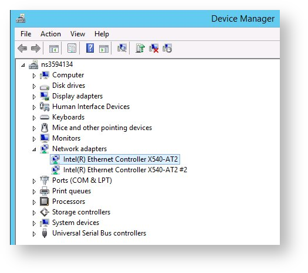
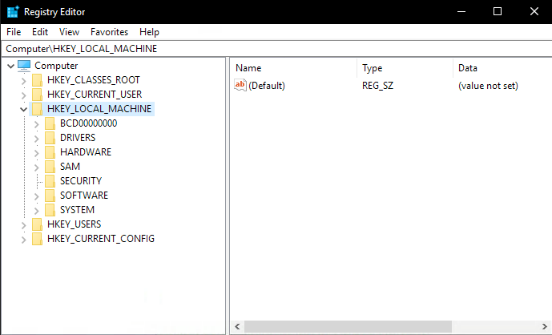
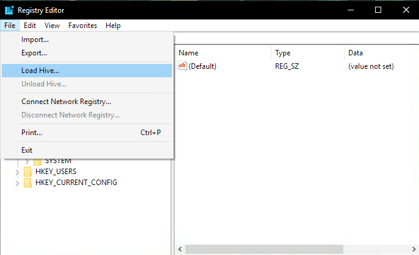
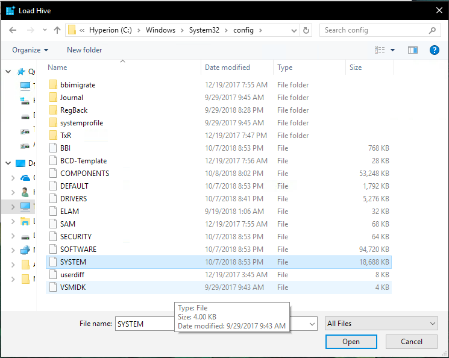
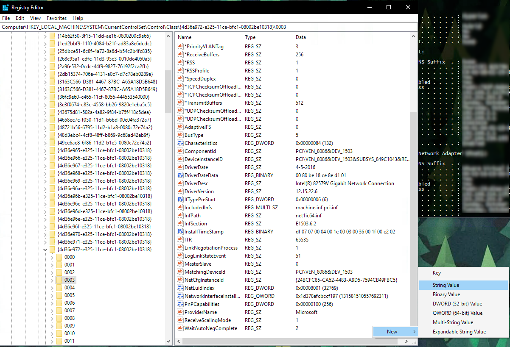

## Objectif

Cette documentation a pour objectif de vous accompagner lors d'une intervention de maintenance effectuée par les équipes OVhcloud.

Toute opération demandant un remplacement de matériel aura un impact direct sur vos systèmes d'exploitation installés.

Nos interventions et/ou maintenance se limitent uniquement à la partie hardware, et nous vous proposerons si besoin un support relatif à vos références matériels ou bien en lien avec votre systeme d'exploitation.

Tout ceci dans le but de vous accompagner et faire en sorte qu'il y ait le moins d'impact possible dans le cycle de vie de vos environnements.
vous retrouverez ici toutes les infos nécessaires pour les adapter/corriger en conséquence.

En particulier si vos OS sont listés, vous n'aurez plus qu'à suivre la procédure correspondante :

- Ubuntu
- CentOS/Alma Linux
- ESXi
- SmartOS
- FreeBSD
- Proxmox
- XenServer
- Gentoo

divers:
- repérez le nom de vos interfaces réseaux


> [!warning]
> Il s'agit d'un recueil élaboré suite à de multiples retour d'expérience et de cas figures que nous avons rencontrés.
>


### Ubuntu

Si vous rencontrez un soucis de connectivité réseau.
exemple : pas de ping après remplacement de la carte mère

- booter en mode rescue
- monter la partition `/`
```bash
root@rescue:~# mount /dev/my_system_disk /mnt
```

Si le fichier `70-persistent-net.rules` n'existe pas (cf repérer le nom de vos interfaces réseaux),
vérifier `50-default.network` et `50-public-interface.link` dans l'arbo `/etc/systemd/network/`:

```bash
root@rescue:~# cat /mnt/etc/systemd/network/50-default.network
# This file sets the IP configuration of the primary (public) network device.
# You can also see this as "OSI Layer 3" config.
# It was created by the OVH installer, please be careful with modifications.
# Documentation: man systemd.network or https://www.freedesktop.org/software/systemd/man/systemd.network.html
 
[Match]
MACAddress=xx:xx:xx:xx:xx:xx
 
[Network]
Description=network interface on public network, with default route
DHCP=no
Address=1.2.3.4/24
Gateway=1.2.3.254
IPv6AcceptRA=no
NTP=ntp.ovh.net
DNS=127.0.0.1
DNS=213.186.33.99
DNS=2001:41d0:3:163::1
Gateway=2001:41d0:0203:4bff:ff:ff:ff:ff
 
[Address]
Address=2001:41d0:0203:1234::/64
 
[Route]
Destination=2001:41d0:0203:4bff:ff:ff:ff:ff
Scope=link
root@rescue:~#
root@rescue:~# cat /mnt/etc/systemd/network/50-public-interface.link
# This file configures the relation between network device and device name.
# You can also see this as "OSI Layer 2" config.
# It was created by the OVH installer, please be careful with modifications.
# Documentation: man systemd.link or https://www.freedesktop.org/software/systemd/man/systemd.link.html
 
[Match]
MACAddress=xx:xx:xx:xx:xx:xx
 
[Link]
Description=network interface on public network, with default route
MACAddressPolicy=persistent
NamePolicy=kernel database onboard slot path mac
#Name=eth2    # name under which this interface is known under OVH rescue system
#Name=eno3    # name under which this interface is probably known by systemd
root@rescue:~#
```

Sauvegarder les fichiers et éditer les afin de corriger la mac-addresse :
```bash
root@rescue:~# cp /mnt/etc/systemd/network/50-default.network /mnt/etc/systemd/network/50-default.network.link.bak-`date +%s`
root@rescue:~# cp /mnt/etc/systemd/network/50-public-interface.link /mnt/etc/systemd/network/50-public-interface.link.bak-`date +%s`
root@rescue:~# nano /mnt/etc/systemd/network/50-default.network
root@rescue:~# cat /mnt/etc/systemd/network/50-default.network | grep MACAddress
MACAddress=xx:xx:xx:xx:xx:xx
root@rescue:~#
root@rescue:~# nano /mnt/etc/systemd/network/50-public-interface.link
root@rescue:~#
root@rescue:~# cat /mnt/etc/systemd/network/50-public-interface.link | grep MACAddress
MACAddress=xx:xx:xx:xx:xx:xx
root@rescue:~#
```

Ne pas oublier de démonter la partition `/` avant de redémarrer le serveur.

#### Retour sur cas pratiques

Dans certain cas, il faut propager la nouvelle mac-adresse dans les fichiers suivants :

` /mnt/etc/netplan/01-netcfg.yaml`
`/mnt/etc/netplan/50-cloud-init.yaml`
`/mnt/etc/systemd/network/10-eno1.link`
`/mnt/etc/systemd/network/10-eno1.network`


### CentOS/Alma Linux

exemple : pas de ping après remplacement de la carte mère

- booter en mode rescue
- monter la partition `/`
```bash
root@rescue:~# mount /dev/my_system_disk /mnt
```

Vérifier le fichier de configuration `/mnt/etc/sysconfig/network-scripts/ifcfg-eth0`
Sauvegarder les fichiers et éditer les afin de corriger la mac-addresse :
```bash
root@rescue:~# cp /mnt/etc/sysconfig/network-scripts/ifcfg-eth0 /mnt/etc/sysconfig/network-scripts/ifcfg-eth0.`date +%s`
```

Renseigner la nouvelle mac-addresse à la ligne `HWADDR=xx.xx.xx.xx.xx.xx`

Ne pas oublier de démonter la partition `/` avant de redémarrer le serveur.


### SmartOS

exemple : pas de ping après remplacement de la carte mère
- booter en mode rescue
```bash 
modprobe zfs
root@rescue:~# zpool import -f zones (zpool import to list the pools)
root@rescue:~# zfs set mountpoint=/mnt zones/usbkey
root@rescue:~# zfs mount zones/usbkey
root@rescue:~# cp /mnt/config{,.bak-$(date +"%Y-%m-%d-%H_%M")}
```

Renseigner la nouvelle mac-addresse à la ligne `admin_nic`
```bash
root@rescue:~#  vim /mnt/config
```

Ne pas oublier de démonter les partitions  avant de redémarrer le serveur en mode `netboot`:
```bash
root@rescue:~# zfs umount -a
root@rescue:~# zfs set mountpoint="/usbkey" zones/usbkey 
```


### FreeBSD

exemple : pas de ping après remplacement de la carte mère

- booter en mode rescue-bsd
- Faire un ifconfig depuis rescue-bsd on peut voir l'appellation de l'interface
```bash
root@rescue-bsd:~ # ifconfig
igb0: flags=8843<UP,BROADCAST,RUNNING,SIMPLEX,MULTICAST> metric 0 mtu 1500
options=403bb<RXCSUM,TXCSUM,VLAN_MTU,VLAN_HWTAGGING,JUMBO_MTU,VLAN_HWCSUM,TSO4,TSO6,VLAN_HWTSO>
ether xx:xx:xx:xx:xx:xx
```

lancer la commmande `gpart show`, on pouvons repérer les partitions/noms:
```bash
root@rescue-bsd:~ # gpart show
=> 63 3907029105 ada0 MBR (1.8T)
 63 3907029105 1 freebsd [active] (1.8T)
 
=> 0 3907029105 ada0s1 BSD (1.8T)
 0 40960000 1 freebsd-ufs (20G)
 40960000 3865020416 2 freebsd-ufs (1.8T)
 3905980416 1048689 4 freebsd-swap (512M)
 
=> 63 3907029105 diskid/DISK-PN1134P6K14W5W MBR (1.8T)
 63 3907029105 1 freebsd [active] (1.8T)
 
=> 0 3907029105 diskid/DISK-PN1134P6K14W5Ws1 BSD (1.8T)
 0 40960000 1 freebsd-ufs (20G)
 40960000 3865020416 2 freebsd-ufs (1.8T)
 3905980416 1048689 4 freebsd-swap (512M)
```

Monter la partition qui nous intéresse et nous pourrons modifier l'interface le fichier suivant `/etc/rc.conf` :
```bash
root@rescue-bsd:~ # zpool import
   pool: zroot
     id: 16525429322000118320
  state: ONLINE
 status: The pool was last accessed by another system.
 action: The pool can be imported using its name or numeric identifier and
    the '-f' flag.
   see: http://illumos.org/msg/ZFS-8000-EY
 config:
 
    zroot       ONLINE
      ada0p4    ONLINE
root@rescue-bsd:~ #
root@rescue-bsd:~ #
root@rescue-bsd:~ # zpool import -f zroot
cannot mount '/home': failed to create mountpoint
cannot mount '/zroot': failed to create mountpoint
root@rescue-bsd:~ #
 
root@rescue-bsd:~ # zfs list -t all
NAME                 USED  AVAIL  REFER  MOUNTPOINT
zroot               1.01G   673G    88K  /zroot
zroot/ROOT          1.00G   673G    88K  none
zroot/ROOT/default  1.00G  18.5G  1.00G  /
zroot/home            88K   673G    88K  /home
root@rescue-bsd:~ # mkdir /tmp/rootClient
root@rescue-bsd:~ # zfs set mountpoint=/tmp/roo
mountpoint=/tmp/ not found
 
root@rescue-bsd:~ # zfs set mountpoint=/tmp/rootClient zroot/ROOT/default
root@rescue-bsd:~ # zfs list -t all
NAME                 USED  AVAIL  REFER  MOUNTPOINT
zroot               1.01G   673G    88K  /zroot
zroot/ROOT          1.00G   673G    88K  none
zroot/ROOT/default  1.00G  18.5G  1.00G  /tmp/rootClient
zroot/home            88K   673G    88K  /home
root@rescue-bsd:~ #
 
root@rescue-bsd:~ # zfs mount zroot/ROOT/default
root@rescue-bsd:~ # ls /tmp/rootClient/
.cshrc          .rnd            bin             boot.config     entropy         home            libexec         mnt             opt             rescue          sbin            tmp             var
.profile        COPYRIGHT       boot            dev             etc             lib             media           net             proc            root            sys             usr             zroot
root@rescue-bsd:~ #
```

Sauvegarder les fichiers et éditer les afin de corriger la mac-addresse :
Dans le cas présenté, nous devons modifier les 3 instances de `em0` par `ibg0` dans le fichier de configuration associé.

```bash
root@rescue-bsd:~ # mount /dev/ada0s1 /mnt/
root@rescue-bsd:~ #
root@rescue-bsd:~ # cat /mnt/etc/rc.conf
sshd_enable="YES"
# Set dumpdev to "AUTO" to enable crash dumps, "NO" to disable
dumpdev="AUTO"
local_unbound_enable=yes
ifconfig_em0="inet xx.xxx.xxx.xxx netmask 255.255.255.0 broadcast xx.xxx.xxx.255"
defaultrouter="xx.xxx.xxx.254"
  
# IPv6 configuration
ipv6_enable="YES"
ipv6_network_interfaces="em0"
ifconfig_em0_ipv6="inet6 2001:xxxx:xxxx:xxx::1 prefixlen 128 accept_rtadv no_radr"
ipv6_static_routes="ovhgw"
ipv6_route_ovhgw="2001:41d0:0001:c1ff:ff:ff:ff:ff -prefixlen 128 -interface em0"
ipv6_defaultrouter="2001:41d0:0001:c1ff:ff:ff:ff:ff"
mysql_enable="YES"
root@rescue-bsd:~ #
root@rescue-bsd:~ # cp /mnt/etc/rc.conf /mnt/etc/rc.conf.`date +%s`
root@rescue-bsd:~ #
root@rescue-bsd:~ # vim /mnt/etc/rc.conf
root@rescue-bsd:~ #
root@rescue-bsd:~ # cat /mnt/etc/rc.conf
sshd_enable="YES"
# Set dumpdev to "AUTO" to enable crash dumps, "NO" to disable
dumpdev="AUTO"
local_unbound_enable=yes
ifconfig_ibg0="inet xx.xxx.xxx.xxx netmask 255.255.255.0 broadcast xx.xxx.xxx.255"
defaultrouter="xx.xxx.xxx.254"
  
# IPv6 configuration
ipv6_enable="YES"
ipv6_network_interfaces="em0"
ifconfig_ibg0_ipv6="inet6 2001:xxxx:xxxx:xxxx::1 prefixlen 128 accept_rtadv no_radr"
ipv6_static_routes="ovhgw"
ipv6_route_ovhgw="2001:41d0:0001:c1ff:ff:ff:ff:ff -prefixlen 128 -interface ibg0"
ipv6_defaultrouter="2001:41d0:0001:c1ff:ff:ff:ff:ff"
mysql_enable="YES"
root@rescue-bsd:~ #
```
Démonter les partitions ZFS :
```bash
root@rescue-bsd:~ # zfs unmount /tmp/rootClient/
root@rescue-bsd:~ # zfs get mountpoint zroot/ROOT/default
NAME                PROPERTY    VALUE            SOURCE
zroot/ROOT/default  mountpoint  /tmp/rootClient  local
root@rescue-bsd:~ # zfs setuntpoint zroot/ROOT/default
root@rescue-bsd:~ # zfs set mountpoint=/ zroot/ROOT/default
root@rescue-bsd:~ # zfs get mountpoint zroot/ROOT/default
NAME                PROPERTY    VALUE       SOURCE
zroot/ROOT/default  mountpoint  /           local
root@rescue-bsd:~ # zfs list -t all
NAME                 USED  AVAIL  REFER  MOUNTPOINT
zroot               1.01G   673G    88K  /zroot
zroot/ROOT          1.00G   673G    88K  none
zroot/ROOT/default  1.00G  18.5G  1.00G  /
zroot/home            88K   673G    88K  /home
root@rescue-bsd:~ # zpool export zroot
root@rescue-bsd:~ # zfs list -t all
no datasets available
root@rescue-bsd:~ #
```


### PROXMOX 6

exemple : pas de ping après remplacement de la carte mère

Nous voyons l'erreur lors du démarrage, avec l'ancienne mac-adresse :
{.thumbnail}


- booter en mode rescue

```bash
root@rescue:~# cat /mnt/etc/network/interfaces
# This file describes the network interfaces available on your system
# and how to activate them. For more information, see interfaces(5).
 
# The loopback network interface
auto lo
iface lo inet loopback
 
iface enp3s0f0 inet manual
 
auto vmbr0
iface vmbr0 inet dhcp
  bridge-ports enp3s0f0
  bridge-stp off
  bridge-fd 0
 
auto vmbr1
iface vmbr1 inet static
  address  192.168.22.254
  netmask  255.255.255.0
  bridge_ports none
  bridge_stp off
  bridge_fd 0
  post-up echo 1 > /proc/sys/net/ipv4/ip_forward
root@rescue:~#
root@rescue:~# cat /mnt/var/log/messages | grep renamed
Aug  8 14:27:20 s22 kernel: [    1.527563] igb 0000:04:00.0 eno1: renamed from eth0
Aug  8 14:27:20 s22 kernel: [    1.550622] igb 0000:04:00.1 eno2: renamed from eth1
Aug  8 14:27:34 s22 kernel: [   88.148303] eth0: renamed from vethGRELEP
Aug  8 14:27:36 s22 kernel: [   90.444727] eth0: renamed from vethVMV0MH
Aug  8 14:27:40 s22 kernel: [   94.116739] eth0: renamed from vethQWYCXT
Aug  8 14:27:43 s22 kernel: [   97.469199] eth0: renamed from vethAIWWWX
Aug  8 14:27:48 s22 kernel: [  102.101324] eth0: renamed from vethB2DGCS
Aug  8 14:27:48 s22 kernel: [  102.139437] eth1: renamed from vethRSNNKL
root@rescue:~#
```

Recréer le fichier `70-persistent-net.rules` avec la nouvelle mac-adresse et le nom de l'interface réseau trouvée dans le fichier précédent `/mnt/etc/network/interfaces` :
```bash
root@rescue:~# cat /mnt/etc/udev/rules.d/70-persistent-net.rules
SUBSYSTEM=="net", ACTION=="add", DRIVERS=="?*", ATTR{address}=="xx:xx:xx:xx:xx:xx", NAME="enp3s0f0"
root@rescue:~#
```

#### Retour sur cas pratiques


### XenServer

exemple : pas de ping après remplacement de la carte mère
la mac-adresse est configurée en statique et doit être réinitialisée.

- booter en mode rescue et connexion en `chroot` :
```bash
root@rescue:~# mount /dev/sda1 /mnt
root@rescue:~# mount -t proc /proc/ /mnt/proc/
root@rescue:~# mount -o bind /sys/ /mnt/sys/
root@rescue:~# mount -o bind /dev/ /mnt/dev/
root@rescue:~# mount -o bind /dev/pts/ /mnt/dev/pts/
root@rescue:~# chroot /mnt
```

- changer la configuration en place pour qu'elle corresponde aux nouveaux paramètres :
```bash
[root@rescue /]# xe-reset-networking --device=eth0 --mode=static --ip=xx.xx.xx.xx --netmask=255.255.255.0 --gateway=xx.xx.xx.xxx
```
- il vous sera demander de répondre à la question par "yes", ensuite faites "Enter" :
```bash
----------------------------------------------------------------------
!! WARNING !!
  
This command will reboot the host and reset its network configuration.
Any running VMs will be forcefully shutdown.
  
Before completing this command:
- Where possible, cleanly shutdown all VMs running on this host.
- Disable HA if this host is part of a resource pool with HA enabled.
----------------------------------------------------------------------
  
Your network will be re-configured as follows:
  
Management interface:   eth0
IP configuration mode:  static
IP address:             xx.xx.xx.xx
Netmask:                255.255.255.0
Gateway:                xx.xx.xx.xx
Pool master's address:  xx.xx.xx.xx
  
If you want to change any of the above settings, type 'no' and re-run
the command with appropriate arguments (use --help for a list of options).
  
Type 'yes' to continue.
Type 'no' to cancel.
yes
Stopping xapi...
Reconfiguring eth0...
Updating inventory file...
Running in chroot, ignoring request.
```

- Taper "exit" pour sortir du mode `chroot` puis demonter toutes les partitions précédements montées :
```bash
root@rescue:~# umount /mnt/sys
root@rescue:~# umount /mnt/proc
root@rescue:~# umount /mnt/dev/pts
root@rescue:~# umount /mnt/dev
root@rescue:~# umount /mnt
```

#### Retour sur cas pratiques

Il est nécessaire de vérifier et d'adapter les fichiers suivants :
`/mnt/etc/sysconfig/network-scripts/interface-rename-data/static-rules.conf`
`/mnt/etc/sysconfig/network-scripts/interface-rename-data/dynamic-rules.json`


### Gentoo

- Suite au remplacement de la Carte Mère, le tooling rescue n'arrive pas à modifier le nouvelles mac-adresses à travers l'OS.
- booter en mode rescue, et repérer la partition `/` :
```bash
root@rescue:~# blkid
/dev/sda1: UUID="15D6-5706" TYPE="vfat" PARTLABEL="grub" PARTUUID="bf514348-6259-41a4-a73f-ba0c38d45de5"
/dev/sda2: UUID="15D6-8A6F" TYPE="vfat" PARTLABEL="boot" PARTUUID="7c0cbc80-c09a-4226-b7f2-91689a04250c"
/dev/sda3: UUID="Q1r3UN-wfmY-QSPI-jIvA-9ybX-IWwk-YNNnUg" TYPE="LVM2_member" PARTLABEL="lvm" PARTUUID="79581bf9-3eb3-4947-9c51-856fb5d72ffa"
/dev/mapper/vg0-swap: UUID="337409d9-cdc5-4db8-a957-336631d3e7cb" TYPE="swap"
/dev/mapper/vg0-root: UUID="2b672f12-77be-40c2-a099-487565ffa933" TYPE="xfs"
root@rescue:~#
```
- dans notre exemple, nous voyons que le système utilise `LVM` :
```bash
root@rescue:~# lvdisplay
  --- Logical volume ---
  LV Path                /dev/vg0/swap
  LV Name                swap
  VG Name                vg0
  LV UUID                X9ttby-08vi-iJVW-aJGP-qnep-PDI9-ohJF6J
  LV Write Access        read/write
  LV Creation host, time rescue.ovh.net, 2019-06-03 16:21:38 -0400
  LV Status              available
  # open                 0
  LV Size                128.00 GiB
  Current LE             32768
  Segments               1
  Allocation             inherit
  Read ahead sectors     auto
  - currently set to     256
  Block device           252:0
 
  --- Logical volume ---
  LV Path                /dev/vg0/root
  LV Name                root
  VG Name                vg0
  LV UUID                822GLw-DELk-Q1ze-3NJD-1B3W-LT9H-CG8RTO
  LV Write Access        read/write
  LV Creation host, time rescue.ovh.net, 2019-06-03 16:21:44 -0400
  LV Status              available
  # open                 0
  LV Size                17.34 TiB
  Current LE             4545078
  Segments               1
  Allocation             inherit
  Read ahead sectors     auto
  - currently set to     256
  Block device           252:1
```

- monter la partition `/` identifiée :
```bash
root@rescue:~# mount /dev/vg0/root /mnt
root@rescue:~# ls /mnt
backups  bin  boot  dev  etc  home  images  images-ear  images-ueba  lib  lib32
        media  mnt  opt  overlayimages  proc  root  run  sbin  srv  sys  tmp  uploads  usr  var
```

- Sous Gentoo, les mac-adresses sont présentes dans les 4 fichiers suivants :
```bash
root@rescue:~# cat /mnt/etc/systemd/network/
10-external.link   11-internal.link   50-static.network  51-vrack.network
root@rescue:~#
```

- Sauvegarder les fichiers avant de les modifier :
```bash
root@rescue:~# cp /mnt/etc/systemd/network/50-static.network /mnt/etc/systemd/network/50-static.network.`date +%s`
root@rescue:~# cp /mnt/etc/systemd/network/51-vrack.network /mnt/etc/systemd/network/51-vrack.network.`date +%s`
root@rescue:~# cp /mnt/etc/systemd/network/10-external.link /mnt/etc/systemd/network/10-external.link.`date +%s`
root@rescue:~# cp /mnt/etc/systemd/network/11-internal.link /mnt/etc/systemd/network/11-internal.link.`date +%s`
```
- Mettre à jour les fchiers avec les nouvelles mac-adresses :
```bash
root@rescue:~# nano /mnt/etc/systemd/network/50-static.network
root@rescue:~# nano /mnt/etc/systemd/network/51-vrack.network
root@rescue:~# nano /mnt/etc/systemd/network/10-external.link
root@rescue:~# nano /mnt/etc/systemd/network/11-internal.lin
```

- Demonter les partitions puis reboot :
```bash
root@rescue:~# umount /mnt
root@rescue:~# reboot
```

#### Retour sur cas pratiques

Dans certaines versions, seul le fichier ` /mnt/etc/udev/rules.d/10-f2c-network.rules` est à modifier :
```bash
root@rescue:~# cat /mnt/etc/gentoo-release
Gentoo Base System release 2.2
root@rescue:~#
root@rescue:~# ls /mnt/etc/udev/rules.d/
10-f2c-network.rules
root@rescue:~#
root@rescue:~# cat /mnt/etc/udev/rules.d/10-f2c-network.rules
SUBSYSTEM=="net", ACTION=="add", DRIVERS=="?*", ATTR{address}=="xx:xx:xx:xx:xx:xx", ATTR{type}=="1", KERNEL=="*", NAME="netpublic0"
SUBSYSTEM=="net", ACTION=="add", DRIVERS=="?*", ATTR{address}=="xx:xx:xx:xx:xx:xx", ATTR{type}=="1", KERNEL=="*", NAME="netprivate0"
root@rescue:~#
```

### ESXi

- Suite au remplacement de la Carte Mère, le tooling rescue n'arrive pas à modifier le nouvelles mac-adresses à travers le fichier `esxi.conf`.
- booter en mode rescue afin de monter la partition `/` :
```bash
root@rescue:~# mount /dev/sdaX /mnt/
```
- sauvegarder le fichier `state.tgz
```bash
root@rescue:~# ls /mnt/state.tgz
root@rescue:~# cp /mnt/state.tgz /mnt/state.tgz.`date +%s`
```

- créer un environnement de travail :
```bash
root@rescue:~# mkdir /home/ovh/esxi
root@rescue:~# WORKINGDIR=/home/ovh/esxi
root@rescue:~# cd $WORKINGDIR
```

- extraire le contenu de `state.tgz` vers `$WORKINGDIR`, pour ensuite extraire le contenu de `local.tgz`
- editer le fichier `esx.conf` obtenu :
```bash
root@rescue:/home/ovh/esxi# tar xf /mnt/state.tgz -C $WORKINGDIR
root@rescue:/home/ovh/esxi# tar xf /home/ovh/esxi/local.tgz -C $WORKINGDIR
root@rescue:/home/ovh/esxi# vim etc/vmware/esx.conf
```
- repérer et modifer la mac-addresse pour `vmkernelnic` :
```bash
/net/vmkernelnic/child[0000]/mac = "XX:XX:XX:XX:XX:XX"
```

- identifer sur quelle interface l'adresse IP principale est utilisée :
```bash
/net/vswitch/child[0000]/uplinks/child[0000]/pnic = "vmnicX"
```

- Mettre à jour la mac-adresse de l'interface principale :
> [!warning]
> ne pas changer la mac-adresse virtuelle
>
```bash
/net/pnic/child[0001]/mac = "XX:XX:XX:XX:XX:XX"             <===== Primary Interface Mac address
/net/pnic/child[0001]/virtualMac = "00:50:56:XX:XX:XX"      <===== Virtual Mac
/net/pnic/child[0001]/name = "vmnic1"
```

> [!wariing]
> S'il y a une interface vRACK, ne pas oublier de changer la mac-adresse également.
>

- réaliser une sauvegarde puis démonter la partition `/` :
```bash
root@rescue:/home/ovh/esxi# tar -czf $WORKINGDIR/local.tgz etc/
root@rescue:/home/ovh/esxi# tar -czf /mnt/state.tgz local.tgz
root@rescue:/home/ovh/esxi# umount /mnt
```

#### Retour sur cas pratiques

Vérifier l'ordre des déclarations de vos vmnicX :
exemple fonctionnel :
```bash
root@rescue:/home/ovh/esxi# cat etc/vmware/esx.conf | grep "/vmkdevmgr/pci"
/vmkdevmgr/pci/m00008901/alias = "vmhba0"
/vmkdevmgr/pci/m00008501/alias = "vmnic0"
/vmkdevmgr/pci/m00008502/alias = "vmnic1"
```


### Windows (Hyper-V)

- Suite au remplacement de la Carte-Mère, le serveur ne peut pas être joignable tant que vous n'avez pas manuellement changé les mac-adresses à travers le Gestionnaire de périphériques.

2 méthodes 
#### via IPMI/KVM
- Connectez-vous en tant qu'administrateur à partir de l'interface IPMI/KVM.

- Presser la combinaison de touches WINDOWS+R, puis à travers l'invite `executer`,  Lancer la commande `devmgmt.msc`:
{.thumbnail}

- Ouvrir `Network adapters` et selectionner l'adaptateur correspondant à `eth0`
- Clic droit => Properties > Advanced
- Repérer `Locally Administered Adress`
- Renseigner la nouvelles valeur de la mac-adresse  (chiffres uniquements et sans espaces)


#### via WinPE

- boot en mode `WinPE`

- lancer la commande `regedit` via l'invite de command `run`

- charger la base de registre local à travers celle disponible dans `WinPE` puis cliquer sur `HKEY_LOCAL_MACHINE` :
{.thumbnail}

- Ensuite cliquer sur `Load Hive...`
{.thumbnail}

> [!primary]
> Par défaut, vous serez dans l'arboresence du WinPE
> N'oublier pas de naviguer sur le lecteur C:\
>

- Repérer le registre `SYSTEM`
{.thumbnail}

- Il vous sera demandé d'entre un nom, vous pouvez, par exemple, taper `OVH_TEST`.

- Repérer la valeur du registre suivant :
```bash
"HKEY_LOCAL_MACHINE\SYSTEM\CurrentControlSet\Control\Class\{4D36E972-E325-11CE-BFC1-08002BE10318}"
```

> [!warning]
> Tant que nous sommes sous WinPE, la valeur `CurrentControlSet` devrait être égale à `CurrentSet001`
>

Vous devriez voir plusieurs sous-clés nommée comme ceci : 0000,0001, etc...

Vous devez cliquer sur chaque sous-clés pour vérifier la valeur `DriverDesc` qui doit correspondre à votre interface réseau

Vous pouvez vérifier le nom de votre interface à partir d'un prompt via la commande suivante :
```bash
ipconfig /all
```

{.thumbnail}

- Regardez dans les entrées de registre `NetworkAddress` sur le panneau de droite, et changer la valeur par celle de votre nouvelle mac-adresse.
Si cette entrée n'existe pas, clic-droit dans une zone vide pour créer une valeur de type `String` avec le nom `NetworkAddress`.

- Vous avez besoin de décharger le registre por appliquer les changements récents.
- Cliquez sur OVH_TEST (crée précédement) ensuite cliquez sur `File` (en haut à gauche) et selectionnez `Unload hive...`


### Repérer le nom de vos interfaces réseaux

- Suite au remplacement de la Carte-Mère, le serveur ne peut pas être joignable car le controleur des interfaces réseaux a été renommé par le systeme d'exploiration.

- boot en rescue, monter la partition `/`, ensuite utiliser le systeme `chroot` :
```bash
root@rescue:~# mount /dev/my_disk /mnt
root@rescue:~# for i in /dev /dev/pts /proc /sys; do mount -B $i /mnt$i; done
root@rescue:~# chroot /mnt
```

- Vérifier si les interfaces ont été modifiées, regarder dans les logs `var/log/messages` ou `var/log/kern.log` si l'interface a été renommée :
```bash
Oct  9 22:25:49 node1 kernel: [    5.479916] ixgbe 0000:03:00.1 eno4: renamed from eth1
Oct  9 22:25:49 node1 kernel: [    5.504285] ixgbe 0000:03:00.0 eno3: renamed from eth0
```

- Vérifier votre fichier de configuration `/mnt/etc/udev/rules.d/70-persistent.-net.rules` et remplacer les nouvelles valeurs (mac-adresses) si nécessaire :
```bash
root@rescue:~# cat /mnt/etc/udev/rules.d/70-persistent-net.rules
SUBSYSTEM=="net", ACTION=="add", DRIVERS=="?*", ATTR{address}=="xx:xx:xx:xx:xx:xx", ATTR{dev_id}=="0x0", ATTR{type}=="1", KERNEL=="eth*", NAME="public"
SUBSYSTEM=="net", ACTION=="add", DRIVERS=="?*", ATTR{address}=="xx:xx:xx:xx:xx:xx", ATTR{dev_id}=="0x0", ATTR{type}=="1", KERNEL=="eth*", NAME="private"
```

- Aller dans le repertoire `/boot/grub/` et créer une sauvegarde du fichier `grub.cfg`

- Editer le fichier `/etc/default/grub` et modifer la ligne commençant par `GRUB_CMDLINE_LINUX` pour obtenir ceci :
```bash
GRUB_CMDLINE_LINUX="net.ifnames=0 biosdevname=0"
```

- Ensuite, lancer la commande :
```bash
root@rescue:~# grub-mkconfig -o /boot/grub/grub.cfg
```

- Sortir de l'envrionnement `chroot` en lançant la commande `exit` et démonter toutes les partitions :
```bash
root@rescue:~# umount /mnt/sys
root@rescue:~# umount /mnt/proc
root@rescue:~# umount /mnt/dev/pts
root@rescue:~# umount /mnt/dev
root@rescue:~# umount /mnt
```


## Aller plus loin


Échangez avec notre communauté d'utilisateurs sur <https://community.ovh.com/>.
