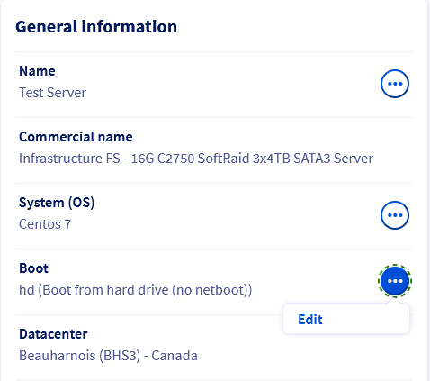
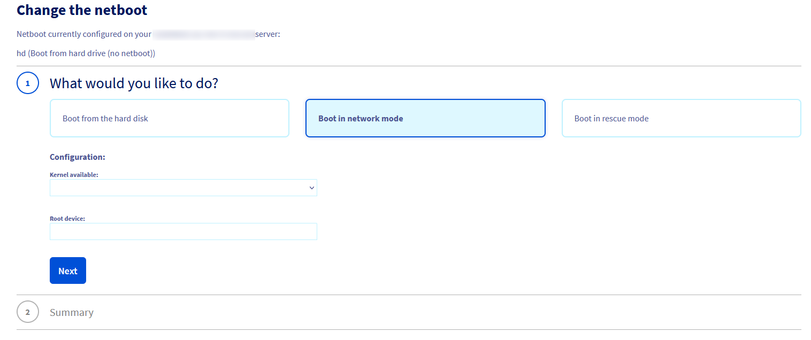
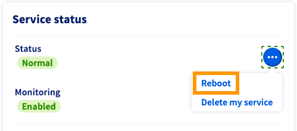

**Last updated 24th February 2022**

## Objective

The Netboot feature is a service offered for free by OVHcloud, it allows you to start your OVHcloud dedicated server on a precompiled kernel provided by OVHcloud. Once configured this way, your server automatically loads the kernel from the network, so you do not have to configure anything else. This method also allows you to update your kernel very simply because OVHcloud compiles the latest version of the kernel as soon as it is available and makes it available on Netboot.

**This guide will perform a network boot of your server using an OVHcloud kernel.**

## Requirements

- A [dedicated server](https://www.ovhcloud.com/asia/bare-metal/){.external}
- Access to the [OVHcloud Control Panel](https://ca.ovh.com/auth/?action=gotomanager&from=https://www.ovh.com/asia/&ovhSubsidiary=asia){.external}

## Instructions

The Netboot facility needs to be configured in the [OVHcloud Control Panel](https://ca.ovh.com/auth/?action=gotomanager&from=https://www.ovh.com/asia/&ovhSubsidiary=asia){.external}.


> [!primary]
>
> This part is intended for servers running Linux. For Windows, FreeBSD, and Virtualization distributions, only Hard Disk mode selection or Rescue modes are possible.
> 

### Boot your server from Network mode

To start your server on a network kernel, you must first connect to your [OVHcloud Control Panel](https://ca.ovh.com/auth/?action=gotomanager&from=https://www.ovh.com/asia/&ovhSubsidiary=asia){.external}.

Go to the `Bare Metal Cloud`{.action} section and select your server from `Dedicated Servers`{.action}.

Look for “Boot” in the **General information** box and click on `...`{.action}, then on `Edit`{.action}.

{.thumbnail}

Select `Boot in network mode`{.action}.

{.thumbnail}

Select the available kernel then enter the Root device (partition where the root partition of your server is located).

To determine the Root Device of your server, see the /etc/fstab file on your server.

In SSH:

```sh
cat /etc/fstab

/dev/sda1 / ext3 errors=remount-ro 0 1
/dev/sda2 /home ext3 defaults,grpquota,usrquota 1 2
/dev/sda3 swap swap defaults 0 0
  proc /proc proc defaults 0 0
sysfs /sys sysfs defaults 0 0
shm /dev/shm tmpfs nodev,nosuid,noexec 0 0
```

In our example, the Root Device will be /dev/sda1.

Click `Next`{.action}, and then finally `Confirm`{.action}

Once the change is completed, click on `...`{.action}  next to “Status” in the box labelled **Service status**. Select `Restart`{.action} so that the new netboot takes effect.

{.thumbnail}

## Go further

Join our community of users on <https://community.ovh.com/en/>.
