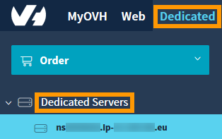
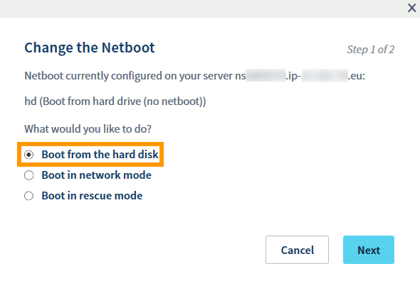
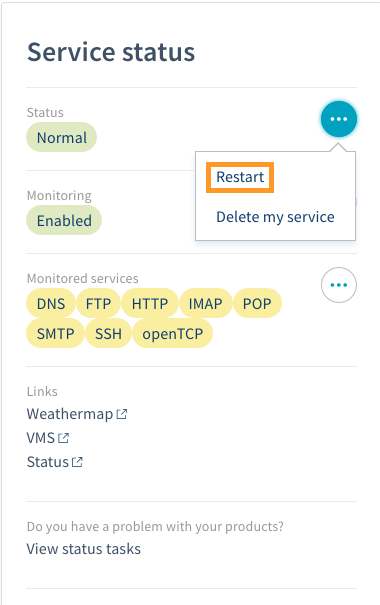
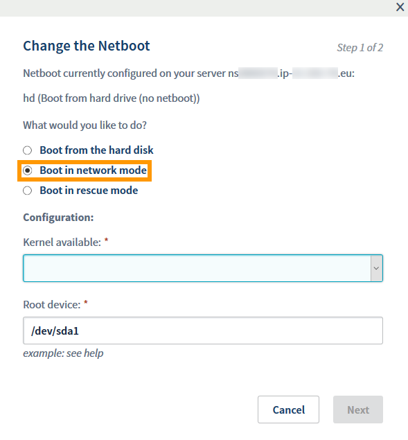
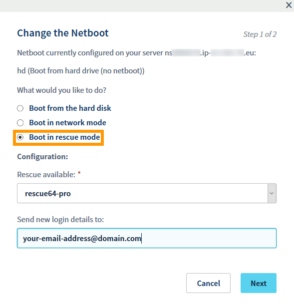

**Last updated 25th July 2018**

## Objective

The Netboot feature is a service offered for free by OVH, it allows you to start your OVH dedicated server on a precompiled kernel provided by OVH. Once configured this way, your server automatically loads the kernel from the network, so you do not have to configure anything else. This method also allows you to update your kernel very simply because OVH compiles the latest version of the kernel as soon as it is available and makes it available on Netboot.

**This guide will perform a network boot of your server using an OVH kernel.**

## Requirements

- a [dedicated server](https://www.ovh.co.uk/dedicated_servers/){.external}
- access to the [OVH Control Panel](https://www.ovh.com/auth/?action=gotomanager){.external}

## Instructions

The Netboot facility needs to be configured in the [OVH Control Panel](https://www.ovh.com/auth/?action=gotomanager){.external}

### Boot your server from the disk

To start your server on Disk, you must first connect to the [Control Panel](https://www.ovh.com/auth/?action=gotomanager){.external}

Go to the `Dedicated`{.action} section, `Dedicated Servers`{.action} on the left-hand column, then select your server in the list.

{.thumbnail}

In the tab `Server Status`{.action}, section `General Information`{.action}, click `Edit`{.action} on the Boot line.

{.thumbnail}

Then select `Boot from the hard disk`{.action}, click `Next`{.action}, and then finally `Confirm`{.action}

{.thumbnail}

You will now need to reboot the server so that the new netboot takes effect.

{.thumbnail}

### Boot your server from Network mode


> [!primary]
>
> This part is intended for servers running Linux. For Windows, FreeBSD, and Virtualization distributions, only Hard Disk mode selection or Rescue modes are possible.
> 

To start your server on a network kernel, you must first connect to your [Control Panel](https://www.ovh.com/auth/?action=gotomanager){.external}

Go to the `Dedicated`{.action} section, `Dedicated Servers`{.action} on the left-hand column, then select your server in the list.

In the tab `Server Status`{.action}, section `General Information`{.action}, click `Edit`{.action} on the Boot line.

Select `Boot in network mode`{.action}.

{.thumbnail}

You will then have to choose the desired kernel from the list below.

- **Stable Kernel, vanilla - 64bit.** (Support for CPUFAMILY, SMP, & IPv6)
- **Stable Kernel, hz1000 - 64bit.** (Support for CPUFAMILY, SMP, & IPv6)
- **Stable Kernel, with GRSec - 64bit.** (Support for GRSec, CPUFAMILY, SMP, & IPv6)
- **Latest Kernel, vanilla - 64bit.** (Support for CPUFAMILY, SMP, & IPv6)

Then enter the Root Device (partition where the root partition of your server is located).

To determine the Root Device of your server, see the /etc/fstab file on your server.

In SSH:

```sh
cat /etc/fstab

/dev/sda1 / ext3 errors=remount-ro 0 1
/dev/sda2 /home ext3 defaults,grpquota,usrquota 1 2
/dev/sda3 swap swap defaults 0 0
  proc /proc proc defaults 0 0
sysfs /sys sysfs defaults 0 0
shm /dev/shm tmpfs nodev,nosuid,noexec 0 0
```

In our example, the Root Device will be /dev/sda1.

Click `Next`{.action}, and then finally `Confirm`{.action}

You will now need to reboot the server so that the new netboot takes effect.


### Boot from Rescue mode
To start your server in rescue mode, you must first connect to your [Control Panel](https://www.ovh.com/auth/?action=gotomanager){.external}

Go to the `Dedicated`{.action} section, `Dedicated Servers`{.action} on the left-hand column, then select your server in the list.

In the tab `Server Status`{.action}, section `General Information`{.action}, click `Edit`{.action} on the Boot line.

Select `Boot in rescue mode`{.action}, then the desired rescue mode for the server. (By default, **rescue64-pro**)

You can enter your email address in to the "Get your updated username" field to receive the rescue mode password at this address.

{.thumbnail}

Click `Next`{.action}, and then finally `Confirm`{.action}

You will now need to reboot the server so that the new netboot takes effect.

## Go further

Join our community of users on <https://community.ovh.com/en/>.