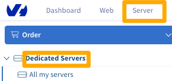

**Última actualización: 25/07/2018**

## Objectivo

La función Netboot es un servicio gratuito ofrecido por OVHcloud, le permite iniciar su servidor dedicado OVHcloud en un kernel precompilado proporcionado por OVHcloud. Una vez configurado de esta manera, su servidor automáticamente cargar el kernel desde la red, por lo que usted no tendrá que configurar nada más. Este método también le permite actualizar su kernel de manera muy sencilla porque OVHcloud compilada la última versión del kernel tan pronto como este disponible y lo hace disponible en Netboot.

**Esta guía realizará un arranque de red de su servidor usando un kernel OVHcloud.**

**This guide provides some basic information ...**

## Requisitos

- Un [servidor dedicado](https://www.ovh.com/world/es/servidores_dedicados/){.external}
- Acceso al [panel de control OVHcloud](https://ca.ovh.com/auth/?action=gotomanager){.external}

## Procedimiento

La instalación de Netboot debe configurarse en el [panel de control de OVHcloud](https://ca.ovh.com/auth/?action=gotomanager){.external}

### Arranca tu servidor desde el disco

Para iniciar su servidor en el disco, primero debe conectarse al [panel de control](https://ca.ovh.com/auth/?action=gotomanager){.external}

Haga clic en `Servidores`{.action}, sección `Servidores Dedicados`{.action} en la columna de la izquierda, seleccione su servidor de la lista.

{.thumbnail}

En la pestaña `estado del servicio`{.action}, sección `Información general`{.action}, haga clic en editar la opción Boot.

{.thumbnail}

Entonces seleccione `Arrancar en el disco duro`{.action}, clic en `siguiente`{.action}, y finalmente `Acepte`{.action}

{.thumbnail}

Necesitará reiniciar el servidor para que los cambios se hagan efectivos.

{.thumbnail}

### Inicie el servidor desde el modo de Red

> [!primary]
>
>Esta parte esta destinada a servidor Linux. Para las distribuciones Windows, FreeBSD y Virtualizaciones, solo es posible el modo Disco duro o rescate.
>

Para iniciar el servidor en el kernel de red, primero debe de conectarse al [panel de control de OVHcloud](https://ca.ovh.com/auth/?action=gotomanager/){.external}.

Haga clic en `Servidores`{.action}, sección `Servidores Dedicados`{.action} en la columna de la izquierda, seleccione su servidor de la lista.

En la pestaña `estado del servicio`{.action}, sección `Información general`{.action}, haga clic en editar la opción Boot.


Seleccione `Arrancar en modo network`{.action}.

{.thumbnail}

Deberá de elegir entre el kernel deseado de la siguiente lista:

- **Stable Kernel, vanilla - 64bit.** (Support for CPUFAMILY, SMP, & IPv6)
- **Stable Kernel, hz1000 - 64bit.** (Support for CPUFAMILY, SMP, & IPv6)
- **Stable Kernel, with GRSec - 64bit.** (Support for GRSec, CPUFAMILY, SMP, & IPv6)
- **Latest Kernel, vanilla - 64bit.** (Support for CPUFAMILY, SMP, & IPv6)

A continuación acceda al dispositivo root (partición donde se encuentra la partición root en su servidor)

Para determinar el dispositivo root en su servidor, vaya al fichero /etc/fstab en su servidor.

En SSH

```sh
cat /etc/fstab

/dev/sda1 / ext3 errors=remount-ro 0 1
/dev/sda2 /home ext3 defaults,grpquota,usrquota 1 2
/dev/sda3 swap swap defaults 0 0
  proc /proc proc defaults 0 0
sysfs /sys sysfs defaults 0 0
shm /dev/shm tmpfs nodev,nosuid,noexec 0 0
```

En nuestro ejemplo el dispositivo root sera  /dev/sda1.

Clic en `siguiente`{.action}, y finalmente `Acepte`{.action}

Necesitará reiniciar el servidor para que los cambios se hagan efectivos.

### Iniciar desde el modo de rescate

Para iniciar el servidor en modo rescate, primero debe de conectarse al panel de control de OVHcloud{.external}.

Haga clic en `Servidores`{.action}, sección `Servidores Dedicados`{.action} en la columna de la izquierda, seleccione su servidor de la lista.

En la pestaña `estado del servicio`{.action}, sección `Información general`{.action}, haga clic en editar la opción Boot.

Seleccione `Arrancar en modo rescue`{.action}, seleccione el modo rescate deseado para su servidor ( por defecto es **rescue64-pro**)

Introduzca su correo electrónico y recibirá la contraseña del modo rescate.

{.thumbnail}

Clic en `Siguiente`{.action}, y finalmente `Acepte`{.action}

Necesitará reiniciar el servidor para que los cambios se hagan efectivos.


## Más información

Interactúe con nuestra comunidad de usuarios en <https://community.ovh.com/en/>
