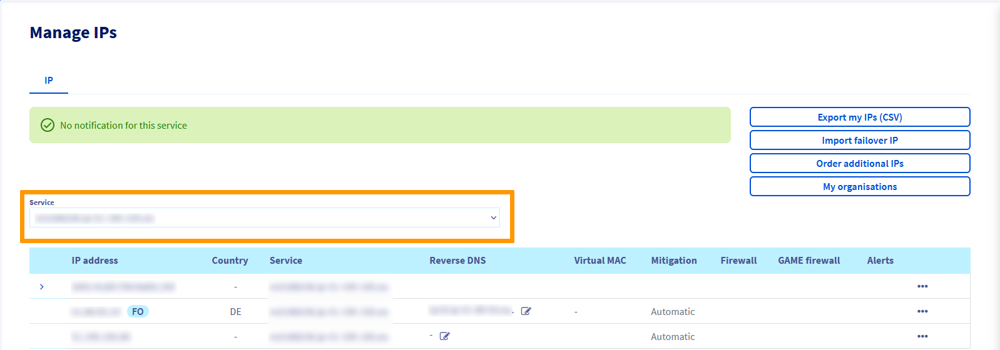
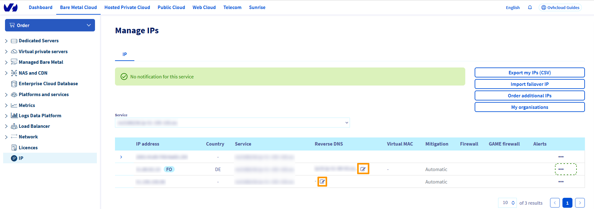

> [!primary]
> Diese Übersetzung wurde durch unseren Partner SYSTRAN automatisch erstellt. In manchen Fällen können ungenaue Formulierungen verwendet worden sein, z.B. bei der Beschriftung von Schaltflächen oder technischen Details. Bitte ziehen Sie beim geringsten Zweifel die englische oder französische Fassung der Anleitung zu Rate. Möchten Sie mithelfen, diese Übersetzung zu verbessern? Dann nutzen Sie dazu bitte den Button “Mitmachen” auf dieser Seite.
>

**Letzte Aktualisierung am 18.10.2022**

## Ziel

Antispam-Strategien werden immer strikter. Um Ihren Versand von E-Mails zu optimieren und Ihre Empfänger ohne Blockierung der Sicherheitswerkzeuge empfangen zu können, sind Einstellungen erforderlich, um Ihre Nachrichten zu authentifizieren und deren Inhalt zu validieren.

**In dieser Anleitung erfahren Sie, wie Sie den Versand Ihrer E-Mails optimieren.**

> [!warning]
>
> OVHcloud stellt Ihnen Dienstleistungen zur Verfügung, für deren Konfiguration und Verwaltung Sie die alleinige Verantwortung tragen. Es liegt somit bei Ihnen, sicherzustellen, dass diese ordnungsgemäß funktionieren.
> 
> Wir stellen Ihnen diese Anleitung zur Verfügung, um Ihnen bei der Bewältigung alltäglicher Verwaltungsaufgaben zu helfen. Dennoch empfehlen wir Ihnen, einen [spezialisierten Dienstleister](https://partner.ovhcloud.com/de/directory/) zu kontaktieren, wenn Sie Schwierigkeiten oder Zweifel hinsichtlich der Verwaltung, Nutzung oder Implementierung der Dienste auf einem Server haben.
> 

## Voraussetzungen

- Sie haben einen bereits konfigurierten E-Mail-Server

## In der praktischen Anwendung

### SPF-Eintrag konfigurieren 

Bei dedizierten Infrastrukturen (Dedicated Server, VPS, Public Cloud Instanz oder Hosted Private Cloud) ist der optimale SPF-Eintrag in folgender Form: `v=spf1 ip4:server_ipv4 ~all`. Bitte denken Sie daran, 'server_ipv4' durch die IPv4-Adresse Ihres Servers zu ersetzen.

> [!primary]
>
> Das Symbol vor dem *all* hat eine große Bedeutung:
>
> - `+`: akzeptieren
> - `-`: nicht akzeptieren
> - `~`: weiche Fehlfunktion (*soft fail*)
> - `?`: neutral
>

Für weitere Informationen zur Syntax des SPF-Eintrags lesen Sie folgenden Link: <http://www.open-spf.org/>.

Sie können natürlich noch weiter gehen, indem Sie den SPF-Eintrag einer bestimmten Domain konfigurieren oder eine IPv6 angeben. Wie Sie Ihren SPF-Eintrag konfigurieren, lesen Sie [einen SPF-Eintrag konfigurieren](https://docs.ovh.com/de/domains/webhosting_spf-eintrag/).

### DKIM-Eintrag konfigurieren

Die Konfiguration eines DKIM-Eintrags (DomainKeys Identified Mail) bietet zusätzlichen Schutz, um zu verhindern, dass Ihre E-Mails als Spam gekennzeichnet werden. DKIM ist eine einfache Signatur, mit der die Sender-Domain authentifiziert werden kann.

Diese Authentifizierung erfolgt mit einem DKIM-Schlüssel, der in Ihrer DNS-Zone hinzugefügt werden soll. Sie finden verschiedene DKIM-Schlüsselgeneratoren, darunter <http://dkimcore.org/tools/keys.html> auch. Bitte folgen Sie den Anweisungen auf der Seite des Generators Ihrer Wahl.

### *Reverse IP* konfigurieren 

Um den Versand zu optimieren und das Risiko einer Blockierung Ihrer E-Mails zu verringern, muss ein IP-Reverse mit Ihrer Domain konfiguriert werden.

Erstellen Sie zunächst einen A-Eintrag in der DNS-Zone Ihrer Domain mit der IP-Adresse Ihres Servers als Ziel.

Wenn Ihre DNS-Server von OVHcloud verwaltet werden, lesen Sie bitte folgende [Anleitung](https://docs.ovh.com/de/domains/webhosting_bearbeiten_der_dns_zone/#zugang-zur-verwaltung-einer-ovhcloud-dns-zone).

Nach der Änderung der DNS-Zone Ihrer Domain ist eine Propagationszeit von maximal 24 Stunden erforderlich, bis die Änderungen wirksam sind.

Wenn Sie fertig sind, fügen Sie den PTR-Eintrag (auch bekannt als Reverse):

Gehen Sie in Ihrem [OVHcloud Kundencenter](https://www.ovh.com/auth/?action=gotomanager&from=https://www.ovh.de/&ovhSubsidiary=de){.external} auf den Tab `Bare Metal Cloud`{.action} und öffnen Sie `IP`{.action}. 

Wählen Sie im Dropdown-Menü **Dienst** einen Server mit einer IPv4-Adresse aus:

Klicken Sie auf den Button `...`{.action} rechts neben der entsprechenden Zeile und dann auf `Reverse ändern`{.action}:

Geben Sie Ihre Domain in den Bereich `Reverse` ein und klicken Sie auf `Bestätigen`{.action}.

> [!primary]
> Wenn Sie Ihren Domänennamen im Reverse-Verfahren eingeben, wird sofort überprüft, ob der A-Record auf dieselbe IP zurückverweist. Dies wird bei Anti-Spam-Verfahren verwendet, daher muss Ihr A-Record gültig sein und weitergegeben werden. Bei der Eingabe des Reverse-Verfahrens sind bestimmte Regeln zu beachten:
>
>  - Der *reverse* kann nicht mit einem `-`
>  - Der *reverse* darf höchstens 80 Zeichen enthalten
>  - Der *reverse* darf keine Großbuchstaben enthalten
>  - Der *reverse* muss mit einem enden `.`
>
> Beispiel: "MyDomain.ca" im Reverse-Feld wäre **mydomain.ca.**
>

### Sonderfälle beim Versand von E-Mails

#### Auf einen Microsoft Server (Outlook...)
 
Microsoft verwendet eine Whitelist Policy. Dies bedeutet, dass sich jeder Server von Anfang an auf einer schwarzen Liste befindet und dass ein spezifischer Vorgang erforderlich ist, um Ihren E-Mail-Server validieren zu lassen.

Bevor Sie mit der Whitelist-Operation Ihrer IP beginnen, überprüfen Sie, ob Sie einen [Reverse](#reverseip) für Ihre IP eingerichtet haben (und nicht den standardmäßigen Reverse von OVHcloud).

Microsoft überprüft auch den SPF-Eintrag. Es wird daher empfohlen, einen [zu konfigurieren](#spfrecord).

Anschließend müssen Sie die Verträge SNDS (Smart Network Data Services) und JMRP (Junk Mail Reporting Partner Program) unterzeichnen.

Erstellen Sie einfach einen JMRP/SNDS Account unter folgender Adresse, um das Programm kostenlos zu bestellen:
<https://postmaster.live.com/snds/JMRP.aspx?wa=wsignin1.0>

Wenn der Account aktiviert ist, füllen Sie das folgende Formular aus:

- **Company name**: (Name Ihres Unternehmens)
- **Kontakt email address**:  (eine gültige E-Mail-Adresse, mit der Microsoft Sie kontaktieren kann)
- **Komplaint feedback email address**: (Eine gültige E-Mail-Adresse, an die Sie Beschwerden für Spam erhalten können, die **Best Practices** möchten, dass die E-Mail-Adresse folgende Form hat: **abuse@mydomain.com**)

Fügen Sie anschließend Ihre IP-Adressen im Bereich `IP address or range`.

Wenn Sie auf `Add new Network` klicken, werden Sie aufgefordert, eine gültige Kontakt-E-Mail-Adresse festzulegen. Geben Sie nun die Adresse vom Typ **abuse@mydomain.com** ein, an die Spam-Beschwerden eingehen sollen.

Wenn Sie die Angaben eingegeben haben, klicken Sie auf `Begin Setup`, um den Antrag zu übermitteln. Microsoft sendet dann eine E-Mail mit dem Titel `SNDS-JMRP Contract`, danach eine zweite E-Mail an **mydomain.com**.

Bestätigen Sie die Angaben und die Bestellung von JMRP/SNDS ist abgeschlossen.

Wenn Ihre IP-Adresse nach Abschluss der Aktionen als gesperrt erscheint, können Sie die Sperrung über das [Junkmail-Verfahren beantragen](https://support.microsoft.com/en-us/getsupport?oaspworkflow=start_1.0.0.0&wfname=capsub&productkey=edfsmsbl3&locale=en-us&ccsid=635857671692853062). Das Verfahren dauert in der Regel 48 Stunden.

Microsoft kann Sie manchmal nach dem Datum der ersten Abrechnung Ihrer IP/Server fragen. Senden Sie in diesem Fall Microsoft eine Kopie Ihrer Rechnung zu und geben Sie Ihre IP/Server an (z. B.: host nsXXX) in Ihrer Antwort.

Für mehr Informationen öffnen Sie bitte [eine Support-Anfrage](https://support.microsoft.com/en-us/getsupport?oaspworkflow=start_1.0.0.0&wfname=capsub&productkey=edfsmsbl3&ccsid=6364926882037750656) von Microsoft.

> [!warning]
>
> **Microsoft ablehnen**
>
> Es kann sein, dass Microsoft die Entsperrung Ihrer IP-Adresse(n) verweigert, in diesem Fall kann OVHcloud nicht eingreifen. Es ist wichtig, die Best Practices von Microsoft zu respektieren.
>

#### Auf einen Gmail Server

Das Hinzufügen spezifischer Einträge (z. B. DMARC-Einträge) kann den Empfang von E-Mails erleichtern, wenn Ihr Empfänger bei Gmail ist. Hier ein Artikel von Google, der Ihnen dabei helfen kann: [Add a DMARC record](https://support.google.com/a/answer/2466563?hl=fr){.external}.

### Ihre Angaben überprüfen

Es kann interessant sein, eine Seite wie [Mail Tester](http://www.mail-tester.com/) zu verwenden, um zu überprüfen, dass alle Ihre Einstellungen korrekt sind.

## Weiterführende Informationen

Kontaktieren Sie unser [netzwerk der OVHcloud Partner](https://partner.ovhcloud.com/de/directory/), um Sie bei der Umsetzung Ihrer OVHcloud Lösungen zu unterstützen.

Für den Austausch mit unserer User Community gehen Sie auf <https://community.ovh.com/en/>.
