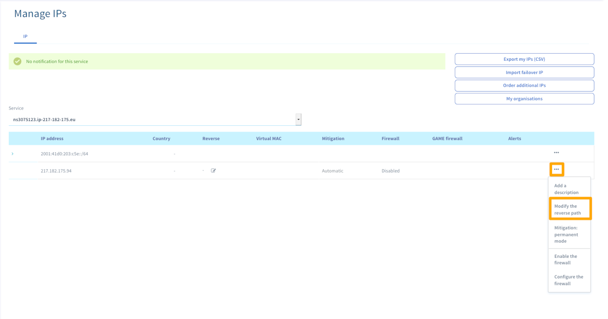

**Última actualización: 20/01/2017**

## Objectivo

Las políticas antispam cada vez son más estrictas. Para asegurarse que sus correos electrónicos llegan a los destinatarios sin ser bloqueados por las herramientas de seguridad, usted necesita configurar en su servicio para autenticar los correos y validar su contenido.

**En esta guía se le dan algunos consejos para optimizar como se envían sus correos electrónicos.**

> [!warning}
>
>OVHcloud ofrece servicios de los cuales usted es responsable. De hecho, como no tenemos acceso administrativo a estas máquinas, no somos administradores y no podemos ofrecerle soporte. Esto significa que depende de usted administrar el software y la seguridad diariamente. Le proporcionamos esta guía para ayudarlo con tareas comunes. Sin embargo, le recomendamos ponerse en contacto con un proveedor especializado si tiene dificultades o dudas sobre la administración, el uso o la seguridad del servidor.
>

## Requisitos

- Configurar un servidor de correo.

## Requisitos

### Configurar el registro SPF

Si usted está usando una infraestructura dedicada (ejem. Un servidor dedicado, VPS, instancia cloud publica o privada), el SPF optimo es: v=spf1 ip4:server_ipv4 ~all. Recuerde cambiar 'server_ipv4' con la dirección IPV4 de su servidor.

> [!primary]
>
> El símbolo que precede al **all** es muy importante:
> 
> - `+`: aceptar
> - `-`: no aceptar
> - `~`: fracaso leve
> - `?`: neutro
>

Para más información sobre el registro SPF, vaya a la siguiente página: <http://www.openspf.org/SPF_Record_Syntax.>

Usted puede encontrar más información sobre como configurar el registro SPF para un dominio, o especificando directamente la dirección IPV6. Puede encontrar como hacerlo en la siguiente guía: [Añadir un registro SPF a la configuración del dominio](../domains/web_hosting_el_registro_spf/)

### Configurar el regstro DKIM

Configurando el registro DKIM (DomainKeys Identified Mail), añade protección extra para evitar que sus correos se marquen como SPAM. En términos simples, DKIM es una firma que permite al autenticar el dominio remitente.

La autenticación se lleva a cabo médiente una clave DKIM que debe de añadir a su zona DNS. Existen diferente generadores para claves DKIM, incluyendo: <http://dkimcore.org/tools/keys.html>. Por favor, siga las instrucciones que figuran en el sitio web.

### Configure la IP inversa

ara optimizar el envío de correos electrónicos y evitar que sus correos sean bloqueado, usted puede configurar la IP inversa con su nombre de dominio.

Para modificar la IP inversa en su [panel de control de OVHcloud](https://ca.ovh.com/auth/?action=gotomanager) {.external}, vaya a `servidores` {.action}, `IP`{.action}. Entonces seleccione la dirección IPV4, haga click en la rueda dentada en la parte derecha, haga click en `Modificar la inversa`{.action}:

Aquí, puede añadir el nombre de su dominio como IP inversa.

### Revisa su información.

Usted puede utilizar un sitio web como [Mail Teste](http://www.mail-tester.com/){.external}  para verificar que todas sus configuración son correctas.

### Tipos especificos de envio de correos

#### Desde Servidor de Microsoft(outlook, etc)

Microsoft utiliza una política de whitelist. Esto significa que inicialmente, todo empieza en una blacklist, y se requiere un procedimiento específico para validar los correos en el servidor.

Para realizar esto, por favor debe de abrir un ticket de soporte con Microsoft <https://support.microsoft.com/en-us/getsupport?oaspworkflow=start_1.0.0.0&wfname=capsub&productkey=edfsmsbl3&ccsid=6364926882037750656>

#### Desde el servidor de Gmail

Si sus destinatarios son Gmail, debe de añadir los registros específicos (ejem. Registro DMARC) para garantizarse que los correos llegan. Aquí puede encontrar el artículo de Google donde puede encontrar más información:: [Add a DMARC record](https://support.google.com/a/answer/2466563?hl=en).

## Más información

Interactúe con nuestra comunidad de usuarios en <https://community.ovh.com/en/>
